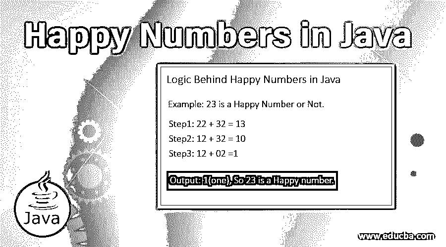

# Java 中的快乐数字

> 原文：<https://www.educba.com/happy-numbers-in-java/>




## Java 中快乐数字的介绍

快乐数字是正非零整数。如果我们找到它的每一个数字的平方和，并重复这一过程，直到该数字将等于 1(一)。否则就叫不开心号或者伤心号。因此，在本文中，我们将详细讨论 java 中的快乐数字。

快乐数字的例子有:1、7、10、13、19、23、28、31、32 等。

<small>网页开发、编程语言、软件测试&其他</small>

**Java 中快乐数字背后的逻辑:**

| **举例:** 23 是不是一个幸福的数字。 | **举例:** 11 是不是一个快乐的数字。 |
| 第一步: 2 <sup>2</sup> + 3 <sup>2</sup> = 13 | 第一步: 1 <sup>2</sup> + 1 <sup>2</sup> = 2 |
| 第二步: 1 <sup>2</sup> + 3 <sup>2</sup> = 10 | 第二步: 2 <sup>2</sup> = 4 |
| **步骤 3:** 1 <sup>2</sup> + 0 <sup>2</sup> =1 |  |
| **输出:** 1(一)，所以 23 是个喜庆的数字。 | **输出:** 4(四)，所以 11 是个不愉快的数字。 |

### Java 中寻找快乐数字的算法

以下是在 java 中寻找快乐数字的不同步骤。

****第一步:**** 从键盘上输入一个非零的正数，并将其赋给称为 number 的变量。

****第 2 步:**** 用给定的数除以(%)得到余数。

****第三步:**** 计算剩余值的平方，并加到一个变量 sum 中。

****第四步:**** 将(/)数除以 10。

****第五步:**** 重复第二步到第四步，直到得到给定数的所有位数的平方和。

****第六步:**** 然后，将最后的加法值存入变量 sum。

****第七步:**** 定义一个名为 result 的变量并用一个数字的值初始化它。

****第八步:**** 如果结果值不等于 1 或 4，我们就简单地调用已创建的方法重复一遍。

****第九步:**** 如果结果值设置为 1 那么，它打印“这是一个快乐的数字”；否则，它会打印“这不是一个快乐的数字”。

**注:**

*   在快乐数字中，数字不受在任何一边插入/删除零的影响。
*   如果一个数是快乐数，即一个数列是快乐的。例如，23 是一个快乐的数字；它表示像 13，10，1 这样的数字序列应该是快乐数字。
*   如果最后，它的数字的平方和等于 4(四)，即它是不快乐的。

### Java 中检查快乐数字的例子

下面是在 Java 中检查快乐数字的不同例子。

#### 示例#1

我们创建了一个 checkHappyNumber()方法来验证给定的数字是否是一个快乐的数字。

**代码:**

```
import java.util.*;
public class HappyNumber
{
public static int checkHappyNumber (int number)
{
int rem = 0, sum = 0;
// calculate the sum of squares of each digits
while(number > 0)
{
rem = number %10;
sum = sum+(rem*rem);
number = number/10;
}
return sum;
}
public static void main(String[] args)
{
// Take number from KeyBoard
Scanner sc = new Scanner (System.in);
System.out.print("Enter a non-zero Positive Number:");
int number = sc.nextInt( );
int result = number;
while (result != 1 && result != 4)
{
result = checkHappyNumber(result);
}
if (result ==1)
{
System.out.println ("It is a Happy Number");
}
else
{
System.out.println (" It is not a Happy Number");
}
}
}
```

**输出** **:**


#### 实施例 2

我们创建了一个 checkHappyNumber()方法来验证给定的数字是否是一个快乐的数字。

**代码:**

```
import java.util. *;
public class Main
{
public static Boolean checkHappyNumber(int number)
{
Set<Integer> digits=new HashSet<Integer>();
while(digits.add(number))
{
int result = 0;
while(number > 0)
{
result += Math.pow(number % 10, 2);
number = number/10;
}
number = result;
}
return number == 1;
}
public static void main(String[] args)
{
Scanner sc = new Scanner(System.in);
System.out.println ("Enter a non-zero integer number :");
int number = sc.nextInt();
System.out.println(checkHappyNumber(number)?"It is a Happy Number":"It is an Unhappy Number");
}
}
```

**输出****T3】:T5】**


#### 实施例 3

我们创建一个 checkHappyNumber()方法来验证一个数字范围内的所有数字是否都是快乐数字，并打印快乐数字的列表。

**代码:**

```
import java.util.*;
public class HappyNumber
{
public static int checkHappyNumber(int number)
{
int rem = 0,sum = 0;
// calculate the sum of squares of digits
while(number >0)
{
rem = number%10;
sum = sum + (rem*rem);
number = number/10;
}
return sum;
}
public static void main(String[] args)
{
// Take starting and ending number from keyboard
Scanner sc = new Scanner(System.in);
System.out.print("Enter the Starting Number:");
int i=sc.nextInt();
System.out.print("Enter the Ending Number:");
int j=sc.nextInt();
System.out.println("The happy numbers between "+i+" and "+j+" are: ");
for (int x=i ; x <= j; x++)
{
int result = x;
//Happy number always ends with 1 and unhappy number ends with 4
while(result != 1 && result != 4)
{
result = checkHappyNumber(result);
}
if(result == 1)
System.out.print(x + ",");
}
}
}
```

**输出******:****
<u>*T11】*</u>

 *


### 结论

在本文中，我们将专门讨论 Java 中的快乐数字。这是一个令人着迷的数字。数字的每个数字的平方和，重复同样的过程，最终得到 1。编译后的所有程序如果结果不等于 1 或等于 4，则称为不快乐数或悲伤数。就像快乐的数字一样，如果一个数字不快乐，那么它的所有序列成员也是不快乐的数字。我们通过在 java 中使用不同的方法，提供了与检查快乐数字相关的不同 java 程序。

### 推荐文章

这是 Java 中快乐数字的指南。在这里，我们讨论在 Java 中寻找快乐数字的基本概念和算法，以及例子和代码实现。您也可以阅读以下文章，了解更多信息——

1.  [Java 中的质数](https://www.educba.com/prime-numbers-in-java/)
2.  [Java LocalDateTime](https://www.educba.com/java-localdatetime/)
3.  [Java 流过滤器](https://www.educba.com/java-stream-filter/)
4.  [Java 瞬态](https://www.educba.com/java-transient/)


*