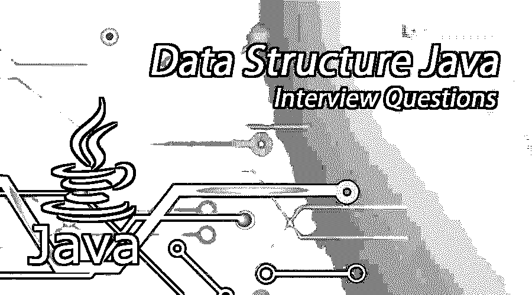

# 数据结构 Java 面试问题

> 原文：<https://www.educba.com/data-structure-java-interview-questions/>

## 数据结构介绍 Java 面试问答

数据结构是计算机编程的重要组成部分。这是每个程序员或开发人员在决定学习编程或选择编程作为一种希望或职业选择时开始的最基本的概念。

对于 Java 编程语言来说，数据结构的应用在任何项目、解决方案或产品中都是巨大的。产品的成功及其范围的可伸缩性和可扩展性高度依赖于在软件开发过程中为各种任务和组件选择的数据结构类型。

<small>网页开发、编程语言、软件测试&其他</small>

在这篇数据结构 Java 面试问题的文章中，我们将提供重要的数据结构问题来帮助候选人提高他/她的技能。

如果是找数据结构 Java 相关的工作，需要准备 2022 年数据结构 Java 面试题。根据不同的职位描述，每次面试都是不同的。在这里，我们准备了重要的数据结构 Java 面试问答，帮助你面试成功。

在这篇 2022 年数据结构 Java 面试问题的文章中，我们将介绍 10 个最重要和最常见的数据结构 Java 面试问题。这些面试问题分为以下两部分:

### 第 1 部分——数据结构 Java 面试问题(基础)

这第一部分包括基本的面试问题和答案。

#### Q1。如何一次找到链表的中间元素？

**回答** :
为了一次找到链表的中间元素，需要维护一个二指针。这些指针中的一个将在每个节点递增，而另一个将在两个节点之后同时递增；因此，通过具有这种类型的排列，当第一指针到达链表的末端时，第二指针将指向链表的中间元素。

#### Q2。如何知道一个链表有没有循环？

**回答** :
如果维护两个指针，其中一个在处理完两个节点后递增，另一个在处理完每一个节点后递增，很可能我们会发现两个指针都指向同一个节点的情况。
只有当链表由循环或循环组成时，才会发生这种情况。

让我们转到下一个数据结构 Java 面试问题。

#### Q3。如何一遍识别链表中倒数第三个元素？

**答** :
如果与上面相同的维护两个指针的技巧被应用在一个指针递增的地方，当第一个指针已经移动到第三个元素时，那么在这种情况下，当第一个指针到达给定链表的末尾时，第二个指针将指向倒数第三个元素。

#### Q4。如何在 1 到 100 个数字之间的整数数组中找到重复的数字？

**回答** :
以上是面试中常见的数据结构 Java 面试问题。要得到答案，可以简单地将存储在该特定数组中的所有数字相加，总和应该等于 n(n+1)/2。在此之后，应该将实际和减去期望和，这就是如何找到重复数的方法。

#### Q5。Java 语言中字符串如何反转？

**回答**:
Java 或者其他编程语言中有很多方法可以实现字符串的反转；可以通过使用 StringBuffer 类中的 reverse()等内置函数来实现。

### 第 2 部分——数据结构 Java 面试问题(高级)

现在让我们来看看高级面试的问题和答案。

#### Q6。描述一些在不同数据结构上执行的操作？

**回答** :
可以对数据结构进行的操作如下:

*   **插入:**用于在已有的数据项集合中添加新的数据项。
*   **删除:**用于从已有的数据项集合中删除已经可用的数据项。
*   **遍历:**这可以用来在数据项被处理之前只访问它一次。
*   **搜索:**如果特定数据项存在于给定的数据项集合中，这可用于找出数据项的位置。
*   **排序:**此选项用于按某种顺序排列数据项，如数字数据按升序或降序排列，字母数字数据按字典顺序排列。

#### Q7。你对链表的理解是什么，它有哪些不同的类型？

**回答** :
链表可以看作是一种线性数据结构，其中的每个元素都被认为是一个独立的对象或实体本身。列表中的每个元素都由两项组成——数据和对下一个节点的引用。

链接列表的类型:

*   **单链表:**在单链表中，每个节点存储两条信息。一个是下一个节点的地址，一个是数据。最后一个节点为空。
*   **双向链表:**在双向链表中，每个节点有两个引用，一个是对下一个节点的引用，一个是对上一个节点的引用。
*   **循环链表:**在循环链表中，所有的节点都是相互连接的，因此末尾没有 NULL。循环链表可以是单循环的，也可以是双循环的。

#### Q8。你所理解的数据结构是什么？

**回答** :
数据结构可以被认为是一种组织数据以便有效利用的方式。

例如，二叉树特别适合于数据库实现，而编译器实现通常使用散列表来查找标识符。

#### Q9。什么是线性和非线性类型的数据结构？还有，数组和链表有什么不同？

**回答**:

*   **线性:**如果一个数据结构的元素形成了一个序列或者一个线性列表，比如数组、链表、栈、队列，那么这个数据结构就叫做线性的。
*   **非线性:**如果节点的遍历本质上是非线性的，那么一个数据结构就是非线性的，比如图和树。

数组和链表的区别如下:-

*   数组的大小总是固定的；链表的大小是不固定的。
*   在数组中插入和删除是一个开销很大的过程，而在链表中同样的事情可以很容易地完成。
*   随机访问一个元素在链表中是不可能的，但在数组中是可能的。
*   链表的每个元素都需要额外的内存空间来存放指针；数组没有指针。
*   阵列具有更好的缓存局部性机制，这可以在性能上产生很大的差异。

#### Q10。你所理解的栈是什么，可以用在什么地方？

**回答** :
这是 Java 面试中问得最多的数据结构面试问题。堆栈可以理解为一种线性数据结构，它使用后进先出(LIFO)或先入后出(FILO)的顺序来访问其元素。栈上的基本操作有:Push、Pop 和 Peek。

堆栈的应用如下:

*   中缀到后缀的转换可以使用栈来完成。
*   后缀表达式的求值也是可能的。
*   可以使用堆栈来反转字符串。
*   在一个数组中实现两个堆栈也是一个不错用例。
*   使用堆栈来检查表达式中的平衡括号。

### 推荐文章

这是一个数据结构 Java 面试问题和答案的列表指南，以便考生可以轻松地解决这些数据结构 Java 面试问题。在本帖中，我们研究了面试中经常被问到的几个顶级面试问题。您也可以阅读以下文章，了解更多信息——

1.  [Java 8 面试问题](https://www.educba.com/java-8-interview-questions/)
2.  [Java 面试问题](https://www.educba.com/java-interview-questions/)
3.  [Java Servlet 面试问题](https://www.educba.com/java-servlet-interview-questions/)
4.  [Java Web 服务面试问题](https://www.educba.com/java-web-services-interview-questions-and-answers/)

