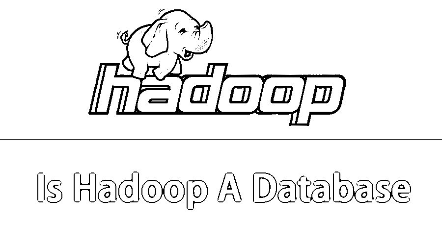

# Hadoop 数据库

> 原文：<https://www.educba.com/hadoop-database/>

## Hadoop 是数据库吗

Hadoop 不是数据存储或关系存储；它主要用于在分布式服务器上处理大量的数据仓库。它将文件存储在 HDFS (Hadoop 分布式文件系统)中，但是它不具备关系数据库的资格。关系数据库将数据存储在由精确模式描述的表中。Hadoop 将存储非结构化、半结构化和结构化数据，而古代数据库将只存储结构化数据。我们倾向于不更新/修改 HDFS 的数据，这可能会耗尽一个常规的声音单元。有像 Hive 这样的元素在 HDFS 的 prime 上工作，允许用户使用类似 SQL 的语法(称为 HiveQL)来查询保存在 HDFS 的数据。它在内部使用 MapReduce 来归纳结果。

### Hadoop 是什么？

随着世界变得比以往任何时候都更加由数据仓库驱动，处理数据仓库爆炸的方法成为了一个重大挑战。古老的数据仓库管理框架目前适用于当今的大量数据集。幸运的是，日新月异的现代技术正在重新定义。然而，我们倾向于处理超大规模的数据。Hadoop 数据库不是一种数据，而是一个允许大规模并行计算的软件系统。它是绑定品种 [NoSQL 分布式数据库](https://www.educba.com/what-is-nosql/)(如 HBase)的推动者，这可能允许数据在数千个服务器上展开，而性能的降低最小。

<small>Hadoop、数据科学、统计学&其他</small>

### 什么是关系数据库？

传统的 RDBMS(关系数据库管理系统)是整个网络时代管理的实际惯例。然而， [RDBMS 目前被认为是一种衰落的数据技术。虽然数据的精确组织使数据仓库非常“整洁”，但数据结构良好的必要性在数据量异常庞大时确实成为一个相当大的负担，导致随着数据量的增加性能下降。因此，RDBMS 通常不被认为是满足“大”数据需求的可靠答案。](https://www.educba.com/what-is-rdbms/)

### 相对于 Hadoop，RDBMS 的未来会是怎样的？

Hadoop 不是交换的 RDBMS，它只是补充了 RDBMS，并使 RDBMS 有可能接收正在生成的海量数据仓库，并管理它们的选择和真实性，此外还为 HDFS 提供了一个采用扁平设计的存储平台，该平台在扁平设计期间保留数据，并提供扫描和分析模式。庞大的数据是进化，不是革命；因此，Hadoop 不会取代 RDBMS，因为它们在管理相对数据和事务数据方面很明智。

### RDBMS 和 Hadoop 哪个方法最好？

那得看情况。虽然大数据分析在提供更深入的见解以获得竞争优势方面的优势是真实的，但这些优势将完全由公司完成，这些公司将进行尽职调查，以确保大数据分析的受害者 Hadoop 最符合他们的愿望。请允许我们理解我们是否会在您庞大的数据平台上进行比较。

### Hadoop 是数据库还是关系数据库

像 Hadoop 数据库一样，一旦涉及到方法并存储了大量数据或只是巨大的数据，古老的 RDBMS 就无法使用了。以下是 Hadoop 和古代 RDBMS 的一些变体。

#### 1.数据卷宗

数据量表明保留和处理的数据量。一旦数据量减少(以千兆字节为单位)，RDBMS 的工作效率就会提高。然而，一旦数据量很大，即以兆兆字节和千兆字节计，RDBMS 就不能放弃所需的结果。另一方面，一旦数据规模巨大，Hadoop 的工作效率会更高。与标准的 RDBMS 相比，它将简化方法并有效地存储大量数据。

#### 2.体系结构

如果我们倾向于指出设计，Hadoop 拥有后续的核心组件:HDFS(Hadoop 分布式文件系统)、Hadoop MapReduce(一种方法化海量数据集的编程模型)和 Hadoop YARN(用于管理 pc 集群中的计算资源)。传统的 RDBMS 拥有 ACID 属性，即原子性、一致性、隔离性和坚固性。

#### 3.吞吐量

吞吐量是指在一段明确的时间内处理的全部数据量，因此输出最多。与 Apache Hadoop 框架相比，RDBMS 无法获得更好的输出。

#### 4.数据多样性

数据选择通常表明要处理的数据类型。它将是结构化的、半结构化的和非结构化的。Hadoop 具有方法的灵活性，可以存储所有形式的数据，无论是结构化、半结构化还是非结构化数据。虽然，这在很大程度上是想方法大量的非结构化数据。

#### 5.潜伏期

Hadoop 具有更高的输出，你将比古代的 RDBMS 更快地访问大量的数据集；但是，您不能非常快速地从数据集中访问一个选定的记录。因此，Hadoop 据称拥有低延迟。但是 RDBMS 从数据集中检索数据相对更快。

#### 6.可量测性

RDBMS 提供垂直量化，也称为“纵向扩展”机器。它建议您向 pc 集群中的机器添加额外的资源或硬件，如内存、硬件。

#### 7.数据处理

Apache Hadoop 支持数据处理技术中使用的 [OLAP(在线分析处理)](https://www.educba.com/what-is-olap/)。OLAP 涉及非常高级的查询和聚合。数据处理速度取决于数据处理的次数，这可能需要几个小时。数据样式是非规范化的，有更少的表。OLAP [使用星型模式](https://www.educba.com/what-is-star-schema/)。

#### 8.费用

Hadoop 可能是一个免费和开放的软件系统框架，你不应该花钱购买软件系统的许可证。尽管 RDBMS 可能是一个授权的软件系统，但你必须付费才能购买整个软件系统的许可证。

### 结论–Hadoop 是数据库吗

选择一个平台而不是相反的平台可以归结为最适合它的使用案例和需求。Hadoop 在市场上立足是因为它提供了存储的可量化性，以及 RDBMS 管理的灵活性。同时，在很多用例中，相对模型的优势并不必要。例如，如果您不喜欢 ACID 事务或 OLAP 支持，您可能会使用 Hadoop，将总价格降低一点，并努力应对 Hadoop 数据库需要提供的强大(但通常不成熟)选项。随着海量数据继续增长，毫无疑问，这些创新方法——利用 NoSQL 数据设计和 Hadoop 软件系统——将是让企业充分发挥数据潜力的核心。

### 推荐文章

这是 Hadoop 作为数据库的指南。在这里，我们将讨论与 Hadoop 相关的 RDBMS 的未来，以及 Hadoop 数据库和 RDBMS 之间的差异。您也可以阅读以下文章了解更多信息:

1.  [大数据是数据库吗？](https://www.educba.com/is-big-data-a-database/)
2.  [云计算是虚拟化吗？](https://www.educba.com/cloud-computing-virtualization/)
3.  [MongoDB 开源了吗](https://www.educba.com/mongodb-open-source/)
4.  [是 MongoDB NoSQL](https://www.educba.com/mongodb-nosql/)
5.  [Hadoop 的应用和特点](https://www.educba.com/what-is-hadoop/)

