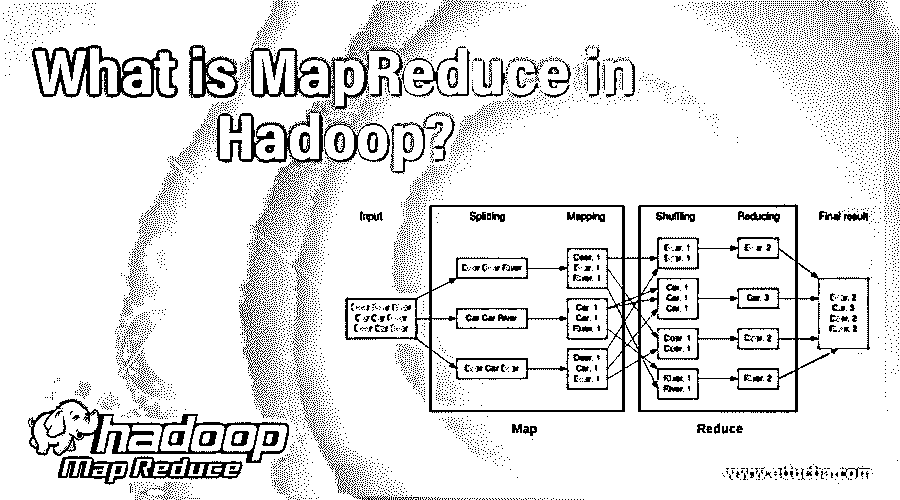

# Hadoop 中的 MapReduce 是什么？一

> 原文：<https://www.educba.com/what-is-mapreduce-in-hadoop/>

## Hadoop 中的 MapReduce 是什么？

MapReduce 被定义为 Hadoop 的框架，用于在大型商用硬件集群上以可靠的方式并行处理海量数据。它允许应用程序以分布式形式存储数据，并使用简单的编程模型处理跨计算机组的大型数据集，因此我们可以将 MapReduce 称为一种编程模型，用于处理分布在多个集群上的大量数据，使用不同的步骤，如输入拆分、映射、混洗和缩减。

Apache Hadoop 项目包含几个子项目:

<small>Hadoop、数据科学、统计学&其他</small>

*   **Hadoop Common:**Hadoop Common 拥有支持其他 Hadoop 子项目的实用程序。
*   **Hadoop 分布式文件系统(HDFS):** Hadoop 分布式文件系统提供对应用数据的分布式文件访问。
*   **Hadoop MapReduce:** 它是一个在计算集群上处理大型分布式数据集的软件框架。
*   **Hadoop YARN:** Hadoop YARN 是一个资源管理和调度作业的框架。

### Hadoop 中的 MapReduce 如何让工作变得如此简单？

MapReduce 使得在成百上千的集群机器上扩展数据处理变得容易。MapReduce 模型实际上分两步工作，分别称为 map 和 Reduce，以及称为 mapper 和 reducer 的处理。一旦我们为一个应用编写了 [MapReduce，扩展到运行多个甚至数千个集群仅仅是一个配置的改变。MapReduce 模型的这个特性吸引了很多程序员使用它。](https://www.educba.com/what-is-mapreduce/)

### Hadoop 中的 MapReduce 是如何工作的？

MapReduce 程序主要分四步执行:

1.  输入拆分
2.  地图
3.  洗牌
4.  减少

现在我们将看到每一步是如何工作的。

**1。映射步骤**

这个步骤是输入分割步骤和映射步骤的组合。在映射步骤中，源文件是逐行传递的。在输入传递到映射函数作业之前，输入被分成固定大小的小块，称为输入拆分。输入分割是单个地图可以使用的信息块。在映射步骤中，每个拆分的数据都被传递给映射器函数，然后映射器函数处理数据并输出值。通常，地图或制图者的作业输入数据以文件或目录的形式存储在 [Hadoop 文件系统](https://www.educba.com/what-is-hdfs/) (HDFS)中。

**2。减少步长**

这个步骤是洗牌步骤和减少步骤的组合。reduce 函数或 Reducer 的工作是获取数据，这些数据是由 map 函数产生的，经过 reduce 新效果集产生的角色处理后，再次存储回 HDFS。

一个 [Hadoop 框架](https://www.educba.com/hadoop-framework/)不确定每个集群执行哪项工作，要么是映射，要么是减少，要么是既映射又减少。因此，Map 和 Reduce 任务的请求应该发送到集群中适当的服务器。Hadoop 框架本身管理发布、验证工作完成、从 HDFS 获取数据、将数据复制到节点组等所有任务。在 Hadoop 中，大部分计算发生在节点上，数据发生在节点本身，这减少了网络流量。

所以 MapReduce 框架有利于 Hadoop 框架。

### MapReduce 的优势

优势领域如下。

1.  **可伸缩性:**MapReduce 使得 Hadoop 具有高度可伸缩性，因为它使得跨多个服务器以分布式形式存储大型数据集成为可能。因为它分布在多个上，所以可以并行操作。
2.  **经济高效的解决方案:** MapReduce 为需要存储不断增长的数据并以非常经济高效的方式处理数据的企业提供了非常经济高效的解决方案，这是当今的业务需求。
3.  **灵活性:**MapReduce 使得 Hadoop 对于不同的数据源非常灵活，甚至对于不同类型的数据，如结构化或非结构化数据。因此，访问结构化或非结构化数据并对其进行处理变得非常灵活。
4.  **快速:**作为分布式文件系统中的 Hadoop 存储数据，通过分布式文件系统将数据存储在集群的本地磁盘上，MapReduce 程序通常也位于相同的服务器上，这样可以更快地处理数据，而无需从其他服务器访问数据。
5.  **并行处理:**作为 Hadoop 在分布式文件系统中存储数据和 MapReduce 程序的工作方式，它划分任务 map 和 Reduce，使之能够并行执行。同样，由于并行执行，它减少了整个运行时间。

### 技能

Hadoop 中 MapReduce 的必备技能是具备良好的 Java 编程知识(必备)、操作系统 Linux 和 SQL 查询知识。

### 范围

随着大数据领域的发展，这是一个快速发展的领域。因此，随着结构化和非结构化数据的数量与日俱增，MapReduce 在 Hadoop 中的应用前景非常广阔。社交媒体平台产生大量非结构化数据，可以挖掘这些数据来获得对不同领域的真实见解。

### 结论

*   它是一个 Hadoop 框架，用于在大型商用硬件集群上可靠地处理并行海量数据。
*   Apache Hadoop 项目包含许多子项目，如 Hadoop Common、Hadoop 分布式文件系统(HDFS)、Hadoop MapReduce 和 Hadoop YARN。
*   在映射步骤中，每个拆分的数据都被传递给映射器函数，然后映射器函数处理数据并输出值。
*   reduce 函数或 Reducer 的工作是获取数据，这些数据是 map 函数的结果。
*   MapReduce 的优势包括可伸缩性、经济高效的解决方案、灵活性、快速、并行处理。

### 推荐文章

这是 Hadoop 中什么是 MapReduce 的指南？.在这里，我们讨论了 Hadoop 中 MapReduce 的基本概念、工作原理、技巧、范围和优势。你也可以通过我们其他的推荐文章来了解更多。

1.  [什么是算法？](https://www.educba.com/what-is-an-algorithm/)
2.  【MapReduce 的工作原理
3.  [什么是 Azure？](https://www.educba.com/what-is-azure/)
4.  [什么是大数据技术？](https://www.educba.com/what-is-big-data-technology/)
5.  MapReduce 是如何工作的？
6.  [Mapreduce 合并器|如何工作？](https://www.educba.com/mapreduce-combiner/)

