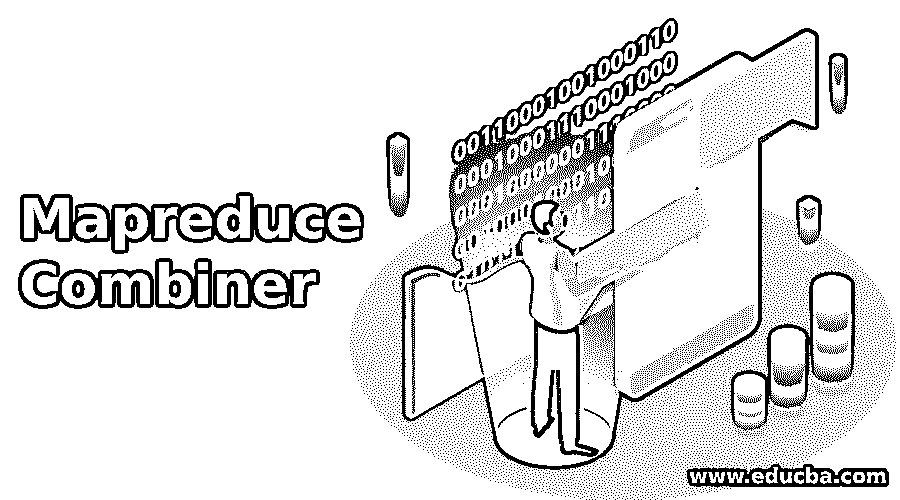
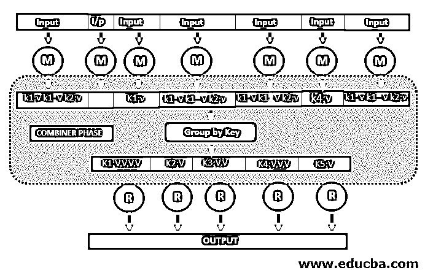
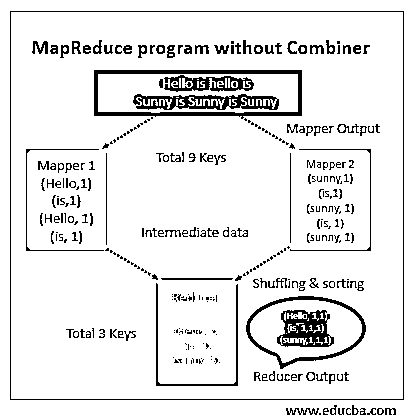
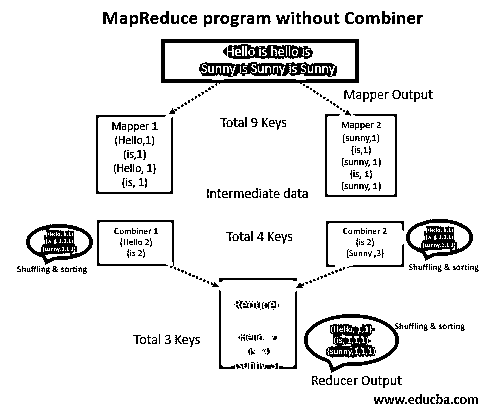
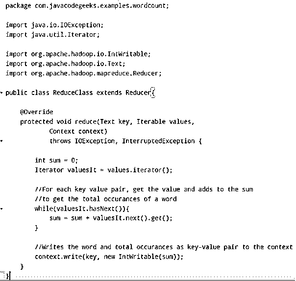

# Mapreduce 合并器

> 原文：<https://www.educba.com/mapreduce-combiner/>

## Mapreduce 合并器简介

Mapreduce 合并器也称为 semi-reducer，它是一个可选的类，通过接受来自 Mapper 或 Map 类的输入来运行。然后它将键值对输出传递给 Reduce 或 Reduce 类。组合器的主要功能是汇总具有相似关键字的地图记录的输出。组合器的键值组合输出将通过网络作为输入任务被分派到缩减器中。组合器类放置在映射类和归约类之间，以减少归约和映射之间传输的数据量。通常，地图输出任务数据很大，并且传送给任务以进行缩减的数据很高。

### MapReduce 合并器是如何工作的？

这是对 MapReduce 合并器工作的简要总结:

<small>Hadoop、数据科学、统计学&其他</small>

Mapreduce 组合器必须实现 reducer 接口方法，因为它没有预定义的接口。映射键的每个输出都由组合器操作，类似的键值输出应该作为 Reducer 类处理，使组合器对每个键映射输出进行操作。合并器将能够生成汇总信息，即使数据集很大，因为它取代了地图的原始输出数据。当在大型数据集上运行 MapReduce 作业时，map 类会创建大量中间数据，并将这些中间数据交给 reducer 进行后续处理，这将导致巨大的网络拥塞。

**没有合并器的 MapReduce 程序大纲不知何故是这样的:**

上图中没有使用合并器。输入被分成两个映射类或映射器，并且从映射器中生成 9 个键。现在，我们将中间数据作为 9 个键值对，然后映射器直接将此数据发送到 reduce 类，或者在将数据分派到 reducer 时，它会占用一些网络带宽(带宽是将数据从一台机器传输到另一台机器所花费的时间)。如果数据太大，数据传输的时间会显著增加。

在 reducer 和 mapper 之间，我们有一个组合器 hadoop，然后在将中间数据分派给 reducer 之前对其进行混洗，并生成 4 个键值对的输出。有了合并器，就只有两个了。要知道怎么做，请看下面。

**MapReduce 程序的大纲不知怎么的就像这个合并器:**

Reducer 现在只处理来自 2 个合并器的 4 个键值对。Reducer 只执行了 4 次就给出了最终的结果输出，这提升了整体性能。

让我们用例子来了解更多:

用来理解 MapReduce 编程范例优点的一个基本代码是通过字数统计。这个程序有 map、combine 和 reduce 方法，这些方法计算数据文件中每个单词出现的次数。

在 Eclipse 中设置一个新项目，并将上述 Hadoop 依赖项添加到 pom.xml 中。这将显示所需的对 Hadoop 库核心的访问是否存在。

–代码块首先检查是否提供了所需的参数数量。
–然后创建新的作业，并设置作业名称和主
的类别–输入和输出路径从参数
中设置–键值类型类别在输出格式类别之前设置。这些类必须与输出的 reduce 和 map 中使用的类型相同。
–在作业中设置贴图、合并器、缩小的类别。
–作业被执行并等待完成。

### MapReduce 组件和 MapReduce 合并器的实现

下面是 mapreduce 组件的实现

#### 1.地图阶段

映射阶段将输入数据分成两部分。它们是:键和值。可写和可比较是处理阶段的关键，只有在处理阶段，值才是可写的。假设客户端向 Hadoop 系统提供输入数据，任务跟踪器由作业跟踪器分配任务。Mini reducer 通常称为合并器，reducer 代码将输入作为合并器放置。当需要大量数据时，网络带宽很高。哈希是使用的默认分区。分区模块在 Hadoop 中起着关键作用。通过减少请求者对减压器的压力，可以获得更好的性能。

#### 2.中间处理

在中间阶段，映射输入进入排序和洗牌阶段。Hadoop 节点没有将所有中间数据存储在本地文件系统中的复制。Hadoop 使用循环数据写入本地磁盘，即中间数据。要达到将数据写入本地磁盘的条件，还需要考虑其他洗牌和排序因素。

#### 3.减速器阶段

Reducer 接收经过排序和重组的数据输入。所有的输入数据将被合并，相似的键值对将被写入 hdfs 系统。对于搜索和映射目的，缩减器并不总是必要的。设置一些属性，以便能够为每个任务设置减速器的数量。在作业处理过程中，推测执行起着重要的作用。

### 结论

上述示例详细说明了 Map-Reduce 和 MapReduce 合并器范例与 Hadoop 的工作原理，并借助字数统计示例理解了 Mapreduce 中的所有步骤。然后我们理解了 eclipse 在测试和执行 Hadoop 集群时对所有输入文件使用 HDFS 的目的。

### 推荐文章

这是一个 Mapreduce 合并器的指南。这里我们讨论 Mapreduce 合并器的介绍，它是如何工作的，组件和合并器的实现。您也可以浏览我们的其他相关文章，了解更多信息——

1.  【MapReduce 的工作原理
2.  [MapReduce 面试问题](https://www.educba.com/mapreduce-interview-questions/)
3.  [什么是 MapReduce？](https://www.educba.com/what-is-mapreduce/)
4.  [MapReduce 算法](https://www.educba.com/mapreduce-algorithms/)
5.  [MapReduce 字数统计指南](https://www.educba.com/mapreduce-word-count/)

