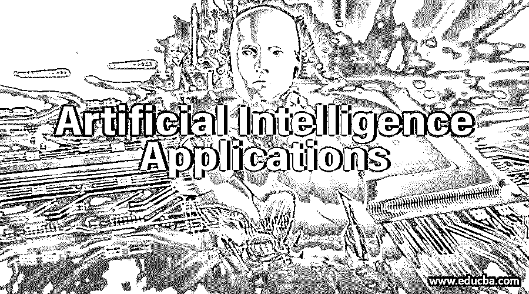

# 人工智能应用

> 原文：<https://www.educba.com/artificial-intelligence-applications/>

**

** 

## 人工智能应用简介

人工智能应用是一个在 IT 界广泛流行了 40 多年的主题，它一直在实验室中进行。

在当今的数字世界中，大量可用的

<small>Hadoop、数据科学、统计学&其他</small>

1.  从多个来源生成的数据(大数据)
2.  计算和存储资源(内部和云)
3.  互联网带宽
4.  从大数据中获得洞察力的复杂算法促进了使用各种新技术的人工智能应用程序的开发。人工智能平台正在为旧的商业案例而构建，但由于技术限制和随着人工智能技术发展的新用例而没有实现。

### 什么是人工智能应用？

人工智能是将智能构建到机器中，使其能够精确地执行已知操作的人类任务。它还为机器打包了大量数据点，供机器学习和处理未知情况。AI 模拟机器像人类一样工作、学习、思考和反应。

在本文中，让我们看看使用人工智能技术开发的应用程序。

### 大多数采用的人工智能技术。

#### 自然语言处理

NLP 是一种让机器理解人类所说的自然语言或与之交互的方法。它还使机器能够在处理人类的请求后，以人类理解的方式回应人类。语法和语义是自然语言处理中的关键参数。

#### 机器学习

ML 使机器能够通过使用它们可用的数据点来自动学习，而不依赖于外部指令。ML 算法帮助机器处理未知情况并管理它们。深度学习是 ML 的一个子集，它使用像人脑一样的结构化层方法处理非结构化大数据，以获得深度洞察。

#### 机器人过程自动化

它用软件机器人自动化了平凡的手工交易过程。这个机器人导航 ERP/CRM/FSM 软件步骤，并以人类的方式完成交易。它提高了业务运营的效率，并释放了用于增值工作的人工资源。

#### 面部识别

它有助于使用技术识别人脸。使用生物特征，从视频或照片中映射出人脸，并与数据库进行匹配以找到匹配。隐私问题是使用这项技术的一个主要挑战。

### 顶级人工智能应用列表

使用人工智能技术为工业、农业、教育和电子商务构建应用程序。基于语音识别技术开发的数字助理等应用广泛应用于公共领域。人工智能应用的成熟度各不相同。各个领域的顶级人工智能应用列表如下

#### 1.运输

1.  司机可以方便地使用人工智能功能，如自动泊车，先进的巡航控制来帮助他们。
2.  人工智能技术被用于改善交通管理系统，减少了 25%的等待时间、燃料消耗和排放
3.  自动传输系统
4.  无人驾驶汽车正处于试验阶段。

#### 2.制造业

1.  机器人在非人机工程条件下制造。
2.  预测性智能维护可避免生产损失
3.  由于机器行为或原材料质量等原因，对生产线上可能出现的质量问题发出早期警报。,

#### 3.卫生保健

1.  使用患者的健康数据和其他相关数据进行更快的诊断(IBM 的 Watson)
2.  用于疾病检测的医学图像扫描。
3.  使用数据挖掘的临床决策支持系统
4.  机器人在外科手术和病人护理中做重复性的工作

#### 4.金融和银行业

1.  使用社交媒体和其他来源的数据来衡量客户的信誉和无风险贷款发放。
2.  金融机构的投资决策由 AI 引擎辅助。
3.  算法交易，复杂的人工智能系统，用于自动化交易决策。

#### 5.人力资源

1.  人工智能辅助招聘
2.  预测员工流失

#### 6.农业

1.  提高农作物产量的人工智能技术和提高农业效率的建议方法。
2.  监控作物和土壤状况，跟踪作物的健康状况
3.  向农民输入有关天气状况、市场环境变化的数据，以种植他们的作物。

#### 7.教育

1.  人工智能导师:在学生需要额外投入的地方对他们进行个别照顾。
2.  AI 提供符合学生偏好的适应性学习计划。

#### 8.电子商务

1.  视觉搜索以识别要购买的商品
2.  聊天机器人提供信息内容
3.  基于浏览历史自动显示产品

#### 9.数字助理

语音识别应用在公共领域中很受欢迎，并且市场上有许多数字助理平台，这些平台与人们交互并根据他们在地球上任何地方的需要提供信息内容。Siri(苹果)、Alexa(亚马逊)、Google Now、Cortana(微软)、脸书信使、黑莓助手、Teneo、Speaktoit 助手、Hound 和 Braina 是最受欢迎的数字助手[软件平台](https://www.educba.com/software-platforms/)。这种软件要么内置在手机和平板电脑等终端用户设备中，要么作为亚马逊 Echo、谷歌 Home 等独立的小工具销售。

#### 10.嵌入设备的人工智能

人工智能应用被嵌入到机器、冰箱、空调设备、电气配件等互联设备中，并使它们变得更加智能。人们可以与这些设备进行交互，并远程激活和停用它们，这些设备可以与其他系统进行对话，并执行某些功能。

#### 11.企业资源计划（Enterprise Resource Planning）

人工智能功能是内置的标准 ERP。SAP、Oracle 和其他 ERP 供应商正在将附加的 AI 模块构建到他们的 ERP 中，并使其成为智能的 ERP。

### 人工智能应用功能的特征

它可以分为以下功能。

#### 狭义人工智能应用

在狭义人工智能中，系统被设计成以反应的方式执行指定的任务。许多成功的人工智能实现，如语音识别系统、RPA、面部识别和数据智能都属于这一类别，这些应用程序经历了持续的改进。

#### 强大的人工智能应用

在强人工智能中，系统被设计为匹配人类的认知能力，以便在面对陌生场景时像人类一样思考和决策。机器学习、深度学习、神经网络都属于这一类。历史数据和来自周围系统的数据对于在这些系统中构建智能是必不可少的。自动驾驶/无人驾驶车辆和决策系统就是这样设计的。

### 人工智能应用的其他特征

像知识、推理、解决问题、感知、学习、计划和操纵以及身体运动这样的技能将必须在人工智能编程中得到体现。来自几个来源的数据访问和程序中内置的直观算法有助于 AI 获得这些技能。

### 结论——人工智能应用

全球超过 50%的主要行业已经实施了至少一个人工智能技术用例，人工智能的采用正处于快车道。在自动化日常任务(RPA，Chatbot)，语音识别，服务呼叫管理，数据智能领域都有成功的人工智能实现。目前人工智能的一个趋势是从决策支持人工智能转移到决策制定人工智能。

### 推荐文章

这是一本人工智能应用指南。这里我们讨论人工智能应用的介绍，最常用的人工智能技术，人工智能应用等。您也可以浏览我们推荐的其他文章，了解更多信息——

1.  [人工智能问题](https://www.educba.com/artificial-intelligence-problems/)
2.  [人工智能软件](https://www.educba.com/artificial-intelligence-software/)
3.  [人工智能的好处](https://www.educba.com/benefits-of-artificial-intelligence/)
4.  [人工智能工具](https://www.educba.com/artificial-intelligence-tools/)
5.  [人工智能中的智能体](https://www.educba.com/agents-in-artificial-intelligence/)
6.  [人工智能技术](https://www.educba.com/artificial-intelligence-techniques/)
7.  [人工智能中爬山的类型](https://www.educba.com/hill-climbing-in-artificial-intelligence/)
8.  [了解人工智能的未来](https://www.educba.com/future-of-artificial-intelligence/)
9.  [人工智能使用完全指南](https://www.educba.com/uses-of-artificial-intelligence/)
10.  [什么是人工智能伦理？](https://www.educba.com/artificial-intelligence-ethics/)

