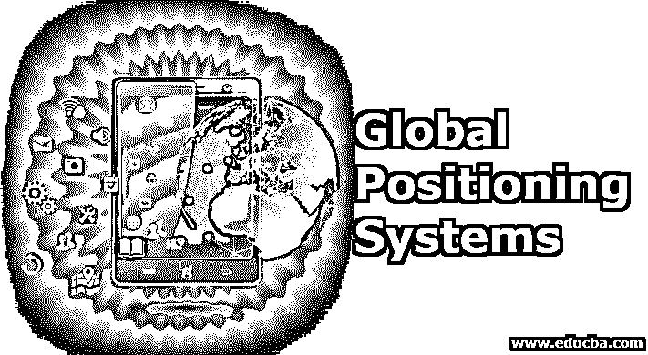

# 全球定位系统

> 原文：<https://www.educba.com/global-positioning-systems/>

## 全球定位系统简介

你曾经丢失过你的钱包并且找不到它或者你已经错过并且不能追踪的任何物品吗？这就是全球定位系统能帮助你逃脱并让你欢呼的地方。如今，GPS 已经是一个不需要过多介绍的名词。GPS 已经成为我们日常生活的一个重要部分，从搜索到旅行，从定位到到达，从寻找到跟踪和连接。自从美国国防部于 1973 年在美国推出 GPS 以来，GPS 已经在人类中占据了重要的位置，并且无疑证明了它对我们每个人的重要性。

顾名思义，GPS，全球定位系统，在卫星导航系统的帮助下，告诉全球任何物体的位置，即相对于整个地球的位置，在卫星导航系统中，围绕地球旋转的大量卫星用于定位物体。它可以让你知道一个特定的物体现在或过去的确切位置，它一次的速度，一整天，不管天气条件如何，在世界的任何地方。

<small>Hadoop、数据科学、统计学&其他</small>

最初是为美国的军事服务开发的，以非常低的成本公开提供。今天，GPS 接收器被安装在所有类型的商业产品上，如手机、智能手机、手表、汽车、自行车等。事实上，全球定位系统已经非常便宜，你可以用它来追踪任何微小的物体。

### 使用全球定位系统(GPS)

GPS 使用“三边测量”的数学原理来确定物体的位置，它是一个由 30 多颗绕地球运行的卫星组成的系统。

参与全球定位系统工作的实体有:

*   卫星(空间部分)
*   控制系统(由美国军方操作)
*   信号
*   信号接收器(用户群——带天线的 GPS 设备的民用和军用用户)

卫星的位置可以从它们广播给接收器的信号中得知。这些信号由连接在待定位物体中的接收器接收。这里重要的一点是，至少需要 4 颗卫星来获得接收器在地球上的准确位置。3 颗卫星被用来追踪位置。4 第颗卫星用于确定卫星的目标位置。GPS 接收器从卫星获取信息，并使用三角测量法来确定用户的准确位置。

### GPS 的优点和缺点

下面给出了提到的优点和缺点:

#### 优势:

*   一个伟大的工具，军事，民用和商业用户。
*   无人驾驶汽车、车辆跟踪系统、基于 GPS 的导航系统为我们提供了一个接一个的方向。
*   GPS 追踪物体的速度非常快。

#### 缺点:

*   城市地区的准确性问题。
*   信号弱(因此在水中、室内或密集区域用处不大)。

### 全球定位系统的误差

GPS 涉及卫星、接收机、卫星和接收机之间的信号传输。

因此，上述三个实体中的任何一个都可能出现错误。

#### 1.信号传播误差

众所周知，来自环绕地球运行的 GPS 卫星的信号必须到达接收器，为此，信号必须穿过地球的大气层。首先，信号通过电离层(大气层的最顶端)，然后通过对流层(大气层的最低部分)。因此，GPS 信号受到大气的两次影响，因此在信号中存在从零到 30 米的误差范围。

#### 2.卫星误差

第一个误差是卫星位置误差。由于卫星的位置是根据 GPS 控制站对卫星的先前观测计算的预测，所以预测不能绝对准确，并且预测是不准确的。因此,“卫星消息”中的卫星并不准确，因此计算出的物体位置有时是不正确的。

其次，还有卫星时钟误差。由于卫星中使用的原子钟不完美，信号到达接收器所用的传播时间的测量以及卫星和接收器之间的距离被破坏。

#### 3.接收器出现的错误

接收器端或其天线会出现四种主要误差:

**a.** 该时钟具有被称为“接收器时钟误差”的误差。

**b .测量噪声**:这取决于用于距离测量的“标尺”的类型。GPS 信号有 3 把尺子

*   粗捕获(C/A)码
*   p 代码
*   载波相位

这些标尺允许几米、几分米和几毫米的精度。

**c .多径误差:**这些是由于建筑物或其他物体对信号的反射干扰卫星的直达信号而产生的。

**d .天线移动误差:**这些误差是由于从不同方向接收信号时，天线的电气参考点或相位中心发生了移动。

### 全球定位系统的局限性

以下是 GPS 的一些局限性:

*   **信号接收:**由于 GPS 接收机需要连续接收来自至少 4 颗 GPS 卫星的信号，如果信号传播路径中有水、墙、土壤或其他障碍物，则信号无法穿透这些障碍物。在这种情况下，GPS 卫星的可见性非常有限。就像在摩天大楼林立的市区，信号会消失很长一段时间。
*   **准确性:**任何涉及测量的系统都有出错的可能。GPS 也没什么不同。由于 GPS 涉及大量的测量，因此在提供物体的准确位置时有许多不准确的可能性。
*   **完整性:**接收器向卫星请求信息，它们向接收器发送被称为“卫星消息”的信号，该信号包含卫星与接收器的距离、卫星位置等编码信息。当接收器从 4 颗卫星获得综合测量值时，它可以显示其位置。但是如果卫星位置计算错误或者范围错误，那么这会导致不正确的接收器位置。这些问题中涉及的信号被称为“故障信号”。这些信号影响提供给用户的位置的完整性。用户不知道位置是否正确。因此，它被广泛建议用于监控 GPS 数据的完整性。

### 结论

可以得出结论，依靠全球定位系统是好的，但应该经常检查全球定位系统结果的准确性。还可以观察到，精度可以提高，但这是有代价的。尽管有各种限制和误差，GPS 仍然是当今最好的定位系统。

### 推荐文章

这是全球定位系统的指南。在这里，我们讨论了全球定位系统的介绍，工作，局限性，优势和劣势。您也可以看看以下文章，了解更多信息–

1.  [什么是嵌入式系统？](https://www.educba.com/what-is-embedded-systems/)
2.  [什么是系统设计？](https://www.educba.com/what-is-system-design/)
3.  [人工智能应用](https://www.educba.com/artificial-intelligence-applications/)
4.  [什么是春云？](https://www.educba.com/what-is-spring-cloud/)

