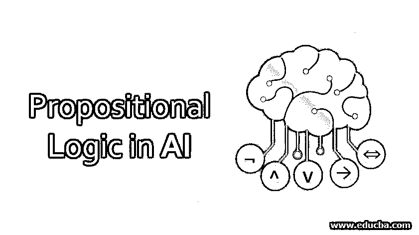

# 人工智能中的命题逻辑

> 原文：<https://www.educba.com/propositional-logic-in-ai/>

## 人工智能中的命题逻辑导论

在本文中，我们将学习人工智能中的命题逻辑。

*   一个命题的字面意思是表达一个人的观点、想法、建议、表达或判断。命题可以通过正式文件或口头交流(非正式)来完成。它可以表达积极或消极的含义。
*   逻辑中的一个命题包括一个句子中的布尔功能，使其为真或为假，还增加了推理技术和证明方法，使其更加全面。这是一个非常古老且被广泛采用的逻辑。
*   这种逻辑很容易被人工智能应用程序和计算机辅助工具中的现代搜索算法所接受。它在人工智能中的用例包括商业、医疗、教育领域的规划、决策、智能控制、诊断和解决问题。

### AI 中的命题逻辑是什么？

这种逻辑与句子逻辑同义，提供了组合或改变命题的方法和手段，以创建复杂的结构和建立新的逻辑关系和性质。它结合了所有组成语句的逻辑连接，并导出了复杂语句的真实值。在这样做的时候，它会考虑其他因素，如推理、关系和组成语句之间的相互联系。

<small>Hadoop、数据科学、统计学&其他</small>

这种逻辑通过对呈现给它的有限信息进行更深入的分析和推断，在不完整的环境中提供了更清晰的数据和信息。由于这种独特的功能和逻辑推理中部署的强大算法，它在解决复杂问题的人工智能高级搜索中被广泛采用。

### 句法

命题逻辑(PL)，为了有效，那么我们需要遵循一个应该被所有人认同的语言结构，它应该容易被所有人采纳。PL 语言结构由简单的不可分割的语句组成，这些语句用逻辑连接器连接在一起。

任何语言的句子都包含动词、名词、代词、介词等词的组合。，PL 语言的语法也遵循类似的规则，它由

| **Sr 号** | **主题** | **语法** |
| One | 简单不可分语句代表真或假(不是两者都是),它本质上是布尔型的 | 大写字母 A、B、C、P、Q、R 用于表示语句 |
| Two | Logical Connectors or operators used to连接两个语句 | ^, v, →, ↔, ¬ are used to represent AND, OR,

隐含，双条件和非条件。

 |
| Three | 复杂条件 | Complex conditions are handled by coding括号内的连接器。 |

#### 其他功能

*   一个简单的句子叫做原子命题，应该不是真就是假。**例** : 9+2 =11 就是这样一个命题，而且是真的。西方的日出是另一个例子，这是错误的。
*   由逻辑连接词连接的简单句的组合称为复合句。今天是星期五，人们今天去寺庙参观。下雨了，比赛取消了。
*   始终为真的命题称为重言式(有效句子的另一个名称)。
*   一个总是假的命题被称为矛盾。
*   性质上是疑问和命令的句子不属于这个命题范畴。

### 逻辑连接词

它将两个不可分割的简单句连接起来，或者在逻辑意义上表达一个句子。可以使用逻辑连接词来创建复杂的语句。有 5 种类型的连接器，即。

| **Sl。** | **类型** | **符号** | **描述** |
| One | 否认 | 英语字母表中第十六个字母 | 它代表一种消极的状态。P 是肯定陈述，P 表示非条件。**举例:**今天是星期一(P)，今天不是星期一(P) |
| Two | 结合 | ^问 | 它用 AND 子句连接两个语句 P，Q。**举例:**拉姆是板球运动员(P)。拉姆是一名曲棍球运动员(Q)。既打板球又打曲棍球的拉姆由(p·^·q)代表 |
| Three | 分离 | P v Q | 它用 OR 子句连接两个语句 P，Q。**举例:**公羊叶去孟买(P)，公羊叶去钦奈(Q)。前往钦奈或孟买的公羊用(P . v . Q)表示。在这个复杂的陈述中，在任何给定的时间点，如果 P 为真，Q 不为真，反之亦然。 |
| Four | 含义 | P → Q | 句子(Q)是依存于句子(P)的，叫做蕴涵。它遵循 If then 子句的规则。如果 P 句为真，那么 Q 句为真。条件是单向的。**例:**如果是星期天(P)那么我就去看电影(Q)，用 P → Q 表示 |
| Five | 双条件的 | p**q** | 句子(Q)依赖于句子(P ),反之亦然，在这个连接词中条件是双向的。如果一个条件语句及其逆为真，那么它被称为双条件连接词(在 P → Q 和 Q → P 两个方向上的蕴涵条件)。当且仅当所有条件都为真，则 end 语句为真。如果我有 1000 卢比，那么只有我会去酒吧。相反的条件是，当且仅当我有 1000 卢比时，我才会去酒吧。第一种说法涉及必要性，第二种说法涉及充分性。 |

### 真值表

它为所有可能的逻辑连接词组合映射了命题的真值。它遵循布尔逻辑和命题演算。具有相应真值的所有这样的场景被捕获在称为真值表的表中。

下表描述了所有逻辑连接词的语句 P 和 Q 的布尔条件的各种组合的真值。

| 英语字母表中第十六个字母 | 英语字母表中第十七个字母 | **否定** | **连词** | **析取** | **寓意** | **双条件** |
| 英语字母表中第十六个字母 | 英语字母表中第十七个字母 | ^问 | P v Q | P → Q | p**q** |
| 真实的 | 真实的 | 错误的 | 错误的 | 真实的 | 真实的 | 真实的 | 真实的 |
| 真实的 | 错误的 | 错误的 | 真实的 | 错误的 | 真实的 | 错误的 | 错误的 |
| 错误的 | 真实的 | 真实的 | 错误的 | 错误的 | 真实的 | 真实的 | 错误的 |
| 错误的 | 错误的 | 真实的 | 真实的 | 错误的 | 错误的 | 真实的 | 真实的 |

这可以扩展到具有任意逻辑连接词组合的三个语句(P，Q，R)。连接词可以与多个连接符结合，如圆括号或方括号。逻辑连接符在命题逻辑求值中的优先顺序是

1.  圆括号
2.  否认
3.  连词(与)
4.  析取
5.  暗示(如果…那么)
6.  双条件(当且仅当)

### 结论——人工智能中的命题逻辑

由于其解决复杂问题的能力，这种逻辑在商业、教育和医疗领域得到了广泛的应用。

但它有一些局限性，即。,

1.  它不能处理一些、所有，
2.  它既不能处理逻辑关系。
3.  它的表达能力有限。

### 推荐文章

这是一本人工智能中命题逻辑的指南。在这里，我们将详细讨论什么是人工智能中的命题逻辑，以及句法、逻辑连接词和真值表。您也可以浏览我们的其他相关文章，了解更多信息——

1.  [人工智能的种类](https://www.educba.com/types-of-artificial-intelligence/)
2.  [人工智能伦理](https://www.educba.com/artificial-intelligence-ethics/)
3.  [人工智能算法](https://www.educba.com/artificial-intelligence-algorithm/)
4.  [人工智能公司](https://www.educba.com/artificial-intelligence-companies/)

