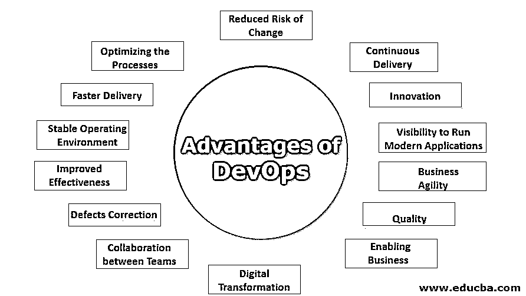

# DevOps 的优势

> 原文：<https://www.educba.com/advantages-of-devops/>

## DevOps 优势介绍

自动化[软件开发](https://www.educba.com/what-is-software-development/)和 IT 支持之间的过程，以便他们可以成功地开发、发布和测试软件的实践被称为 DevOps。因此 DevOps 基本上是团队之间的合作。结果，软件的质量得到了提高，并且它被持续地交付。DevOps 有不同的工具，比如代码开发、构建、测试、打包、发布、配置和监控代码。[持续集成](https://www.educba.com/what-is-continuous-integration/)和持续交付是 DevOps 的一部分，因此敏捷是对 DevOps 的补充，就像 CI/CD 起源于敏捷世界一样。DevOps 专注于开发软件的工作。在本文中，我们将了解 DevOps 的不同优势。

### DevOps 的 14 大优势

DevOps 的优势如下:

<small>Hadoop、数据科学、统计学&其他</small>

#### 1.更快的交货

整个团队负责交付新功能以及旧软件的稳定性。这有助于在开发的早期阶段暴露问题。解决时间更快，因为开发团队不需要等待其他团队进行故障排除和测试。通过首先关注业务需求，项目首先完成，这有助于进入生产环境。 [DevOps 方法](https://www.educba.com/devops-methodology/)有助于更快地响应市场需求。

#### 2.稳定的操作环境

为了维护稳定的环境，可以使用基础设施即代码(IaC)。服务器配置与应用程序源代码一起存储在源代码存储库中。自动化工具将接受配置，并将每个任务应用到所需的系统。这些工具几乎可以自动完成任何任务，并且易于学习。

#### 3.提高效率

自动化部署和标准化生产环境是 DevOps 模型的关键方面。这使得部署变得可预测，人们可以从日常重复性任务中解脱出来。人们可以更有效率，这反过来改善了工作环境。当人们花时间为组织增加价值时，组织就会受益。

#### 4.团队之间的协作

有效的决策提高了透明度，从而有助于团队协作。开发团队应该在团队之间协作，打破不同团队之间的障碍，并且应该在全天候的环境中进行沟通。这有助于提高业务灵活性，为全球 IT 环境中的相互协作、沟通和集成铺平道路。这使得所有团队成员都对产品的质量和按时交付负责。

#### 5.缺陷校正

当团队相互合作时，它有助于容易地检测缺陷，因为测试团队没有被分开，任务也没有为他们划分。当检测到缺陷时，很容易快速纠正并细致地进行操作。这有助于为客户提供最好的服务。

#### 6.数字化转型

每个行业都应该通过运营方式进行数字化转型。技术创新有助于提供数字服务和改善客户体验。DevOps 帮助交付高质量和高速度所需的软件。因此，DevOps 是数字化转型的基础元素。

#### 7.支持业务

DevOps 已经帮助一些大型基于云的公司重新定义了他们的供应链，以提高他们在速度方面的业务绩效。它通过不断改进和创新经营策略来帮助降低成本。它有助于更好的协作、自动化和流程改进，从而根据业务需求交付结果。这使它成为一个战略伙伴。

#### 8.业务敏捷性

在业务中采用 DevOps 允许数字业务走向市场，有助于向客户展示新功能。此外，它还缩短了企业应对故障的时间。随着业务的快速变化，公司无法预测业务的发展方向。敏捷性和模块化有助于通过 DevOps 预测业务。

#### 9.运行现代应用的可见性

更快的软件交付对开发团队提出了更多的要求。更快进入市场的一种方法是使用集中式日志管理和实时机器分析来实现实时应用和业务洞察。这有助于组织更快地获取价值并实现业务转型。

#### 10.创新ˌ革新

DevOps 帮助组织交付高质量的软件并满足客户的需求。组织需要消除开发者的障碍，使产品进入市场。DevOps 在所有这些方面帮助组织。在 DevOps 中，IT 的角色不是业务成本中心，而是引领业务创新。DevOps 允许 IT 团队协作，更快地向客户提供高质量的服务或产品，从用户那里获得反馈，并对产品进行必要的修改。这有助于产品更好地改进。因此我们可以说 DevOps 本身就是精益的。敏捷组织在不同的公司之间更有效地合作，更多的合作会带来更好的想法。

#### 11.连续交货

通过持续交付实践，DevOps 更经常得到认可。所有的过程都是自动化的，因此软件总是处于发布就绪状态。通过各种技术采用 DevOps 有助于企业专注于新技术。这有助于确保产品始终是市场上第一个无缺陷的产品，并随时可供客户使用。

#### 12.质量

当组织采用 DevOps 时，每个人都有责任按照客户的期望构建和运行应用程序。该团队拥有相同的目标，如性能、用户体验、稳定性和上市时间。DevOps 确保每个人都知道变更，所有事情都受到监控，每个团队成员都明白每个变更如何影响质量。

#### 13.降低变更风险

如今，为了提供当今业务所期望的速度和敏捷性，变革是不可避免的。开发运维与自动化应作为一个集成的端到端流程运行，以最大限度地降低新变化的风险。这有助于接受 IT 的变化。DevOps 经常被认为是速度，但就像在比赛中一样，更高的速度应该带来更大的安全性。

#### 14.优化流程

DevOps 通过取代传统流程，帮助增强团队的信心。DevOps 帮助组织领先一步，专注于竞争。

### 结论

本文无法总结 DevOps 的优势。团队授权和流程精简也是 DevOps 的重要优势。通过自动化，它有助于提高生产率和市场上的无缺陷产品。简单来说，在 IT 中应用精益可以称为 DevOps。

### 推荐文章

这是 DevOps 优势的指南。在这里，我们讨论 devops 的简介和 14 大优势，包括更快的交付、缺陷纠正、支持业务和业务敏捷性等。您也可以阅读以下文章，了解更多信息——

1.  [DevOps 自动化工具](https://www.educba.com/devops-automation-tool/)
2.  [DevOps 测试工具](https://www.educba.com/devops-testing-tools/)
3.  [DevOps 生命周期|阶段|优势](https://www.educba.com/devops-lifecycle/)
4.  [devo PS 自动化的优势](https://www.educba.com/devops-automation/)

