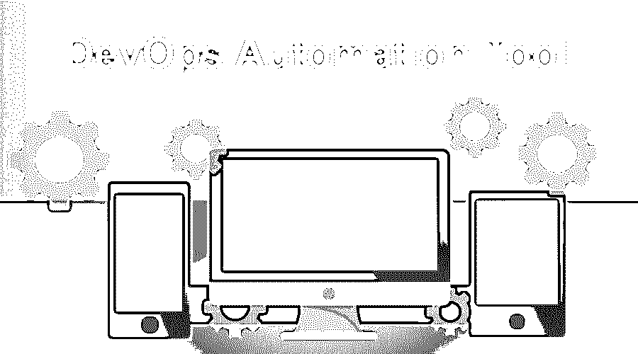
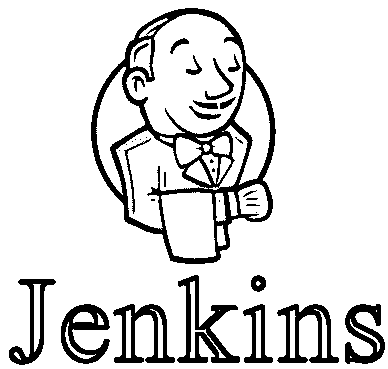
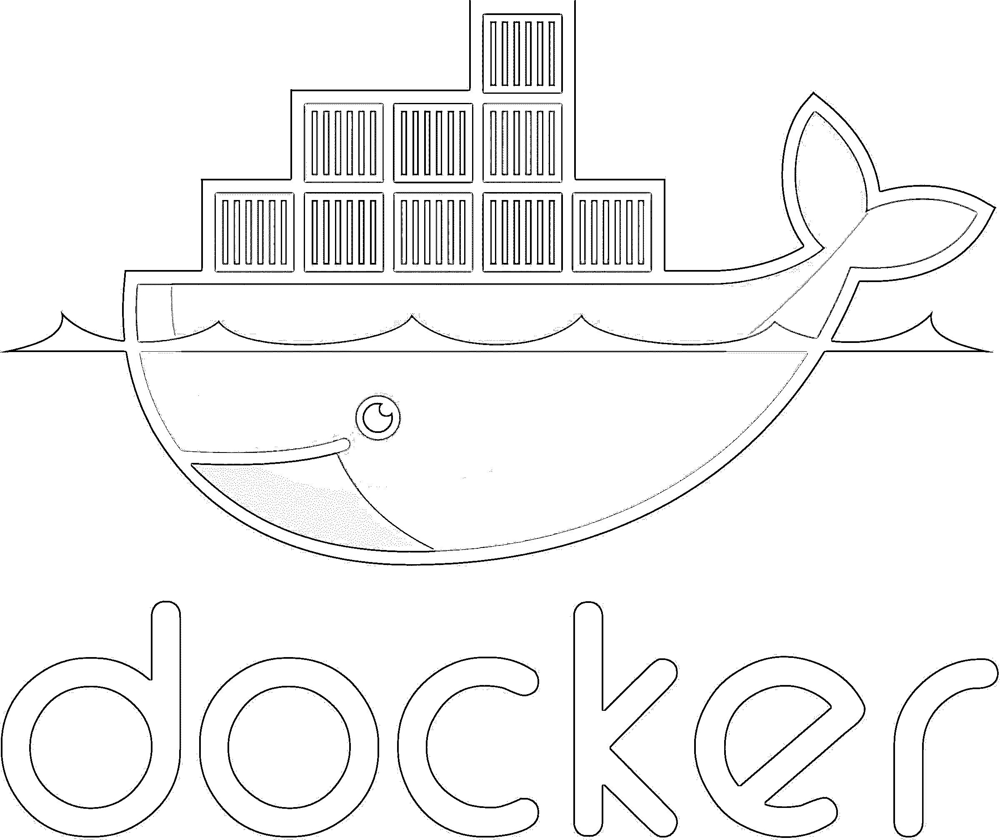
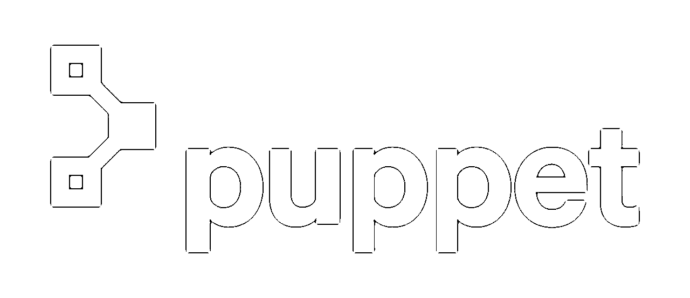
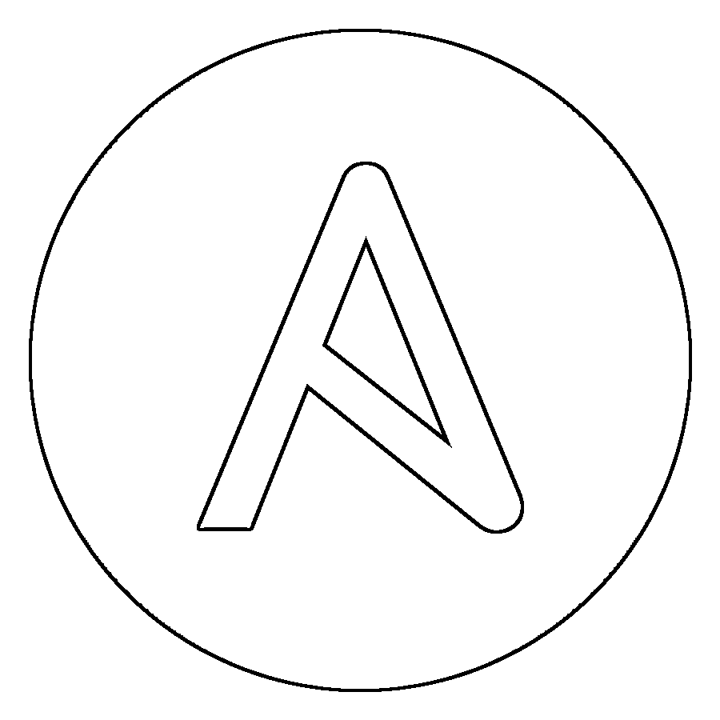

# DevOps 自动化工具

> 原文：<https://www.educba.com/devops-automation-tool/>

## DevOps 自动化工具简介

DevOps 自动化是开发和运营团队为更快的交付生命周期而进行自动化和协作的过程。DevOps 自动化涉及某些概念和最佳实践。它提高了开发和交付质量。DevOps 自动化依赖于根据业务需求选择的几种工具和技术。这个自动化过程与持续开发、持续测试、持续交付和持续监控相关联。DevOps automation 有助于企业更好地走向市场，并弥合与软件开发生命周期相关的多个团队之间的差距。DevOps 自动化在业界越来越受欢迎。

### DevOps 自动化的最佳工具

最佳 6 DevOps 自动化工具如下:

<small>Hadoop、数据科学、统计学&其他</small>

#### 1.詹金斯

类别–CICD(持续集成和持续交付)

[Jenkins 是一款开源的](https://www.educba.com/what-is-jenkins/)自动化 DevOps 工具，在 CICD(持续集成和持续交付)领域处于领先地位。它使用基于 java 的方法，用于监控重复任务的性能。

**特点和优势:**

*   Jenkins 是一个开源平台，受到其社区的支持
*   超过 1000 个插件可用，这减轻了工作
*   提供 CICD 解决方案，安装简单
*   我们可以即时检查错误
*   因为它是用 Java 编写的，所以可以移植到所有主流平台
*   提供良好的安全性

**缺点:**

*   缺少敏捷框架
*   没有提供适当的分析。

#### 2.码头工人

类别–devo PS 自动化工具中的容器化集群/编排工具

Docker 是一个软件容器化平台，我们可以在一台服务器上运行许多应用程序，而不会相互影响。容器彼此隔离，因此消除了冲击。当我们说容器时，我们可以假设它是一种为 docker 上运行的每个应用程序单独设置的硬件。

**特点和优势:**

*   快速开发 docker 大大缩短了部署时间，只需几秒钟。
*   更高的安全性——由于它的容器是相互分离的，所以它提供了很强的安全性。
*   组装应用程序很容易。
*   配置简单。
*   优化资源并提供高可用性。

**缺点:**

*   并非所有的应用程序都能在 Docker 上运行。

#### 3.DevOps 自动化工具中的傀儡

类别:配置管理工具

Puppet 是一个配置管理工具，用于配置服务器、部署对服务器的更改以及管理它们。Puppet 构建在 Ruby 上，架构基于代理/主方法。

**特点和优势:**

*   允许快速交付变更
*   在测试、生产和开发环境中保持一致性
*   它使配置过程自动化。
*   有一个很好的报告界面。
*   SDLC 时间缩短。

**缺点:**

*   无论在哪里涉及到部署的扩展，这个傀儡都不能证明有一个好的配置管理工具。
*   对于不太熟悉 Ruby 等语言的用户来说，puppet 可能很难理解。
*   如果有人想远程执行命令，通过傀儡是不可能的。

#### 4.Ansible

类别:DevOps 自动化工具中的配置管理工具

[Ansible 是一款开源的](https://www.educba.com/what-is-ansible/)配置管理工具，可用作 IT 自动化引擎，可用于自动化多种任务类别，如配置(就像在您的组织基础架构中设置多台服务器)、应用程序部署(它可以自动化应用程序部署流程)和配置管理(用于更改已部署应用程序的设置和配置)。它还可以用于启动服务器上的操作，如启动或停止服务器，推送更新，甚至对应用程序实施任何新的[安全策略](https://www.educba.com/security-policies/)。

**特点和优势:**

*   如果有人想远程执行命令，可以通过 Ansible 实现。
*   非常适合扩展环境。
*   有许多方法可用于推送模型。
*   对于新用户来说，学习 Ansible 很容易。
*   它可以支持推模式和拉模式。
*   高安全性得到了保证，并且还通过 SSH 来实现。
*   代理不需要安装在每台服务器上。

**缺点:**

*   就目前而言，它还没有完全成长，功能也很有限。
*   重点更多地放在编排上，而不是配置上。

#### 5.Apache ActiveMQ

Apache ActiveMQ 是由 Apache 软件基金会开发和维护的开源 web 服务器。它是用 Java 写的。

**特点和优势:**

*   由于它是用 Java 编写的，所以可以在所有主流平台上移植，如 Linux、Windows、macOS 等。
*   它支持多种编程语言，如 Python、Perl、C、PHP、C++。
*   可以安装许多第三方应用程序/附件，用于定制您的 web 服务器。
*   它还提供了一个管理控制面板。
*   该配置是可编辑的，可用于更好地标准化硬件的使用。
*   它允许定制错误消息。
*   更新定期到来。

**缺点:**

*   不太安全。

#### 6.DevOps 自动化工具中的吉拉软件

类别:规划工具

吉拉是一个非常受欢迎的软件，在遵循[敏捷过程](https://www.educba.com/what-is-agile/)的项目团队中广泛使用。它为项目的计划和跟踪模块提供了一个很好的界面。它是由 Atlassian(一家澳大利亚公司)开发的。简而言之，这个软件可以用于项目管理、问题跟踪和关闭，也可以用于 bug 跟踪。它还是一个独立于平台的工具，可以在 Windows、Linux、Mac 等各种平台上使用。

**特点和优势:**

*   任何敏捷团队都可以用它来制造问题、规划冲刺和分配任务。
*   它是平台无关的，因此可以在各种平台上使用。
*   团队的整体表现在一个屏幕下可视化。
*   除了视觉效果和报告，还可以获得实时数据。
*   工作可以分清主次。
*   可以将 JIRA 软件与许多工具集成，如 Team foundation 软件、GIT、并发版本系统等。
*   吉拉提供插件支持，您可以安装大量插件来管理您的产品。

### 推荐文章

这是一个 DevOps 自动化工具的指南。这里我们讨论 DevOps 的基本概念和最好的 6 个工具，以及它们的特点和优缺点。您也可以浏览我们推荐的其他文章，了解更多信息——

1.  [DevOps 生命周期](https://www.educba.com/devops-lifecycle/)
2.  什么是 Ansible？
3.  [什么是软件测试？](https://www.educba.com/what-is-software-testing/)
4.  [什么是敏捷开发运维？](https://www.educba.com/agile-devops/)
5.  [DevOps 架构|组件](https://www.educba.com/devops-architecture/)
6.  [开发运维的 16 大优势](https://www.educba.com/benefits-of-devops/)
7.  [DevOps 自动化|十大优势](https://www.educba.com/devops-automation/)
8.  [ActiveMQ 与 Kafka |十大差异](https://www.educba.com/activemq-vs-kafka/)
9.  [雷迪斯与卡夫卡的比较](https://www.educba.com/redis-vs-kafka/)

