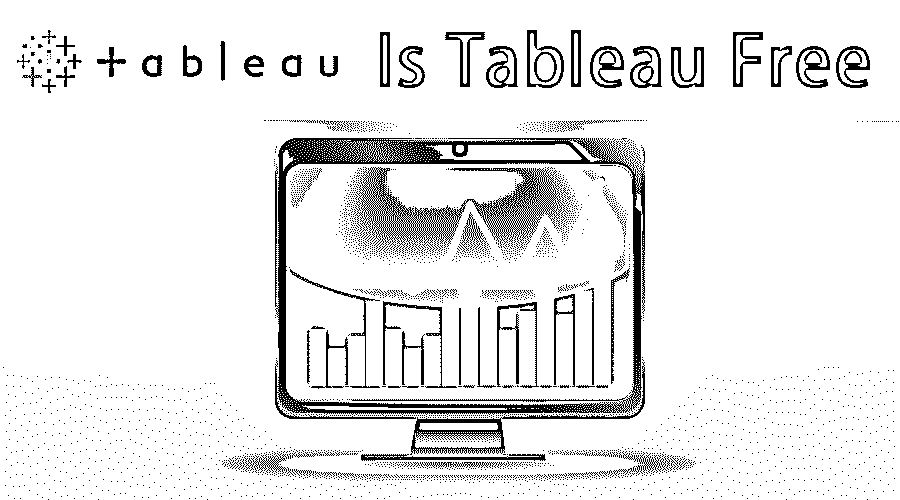
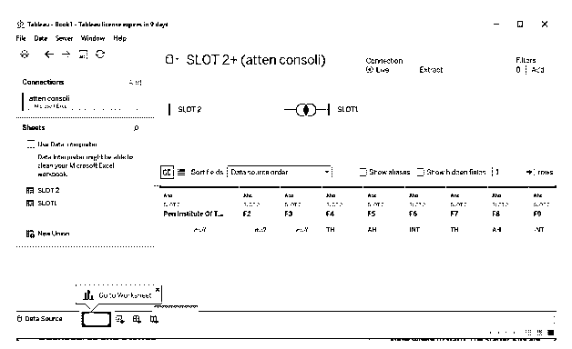
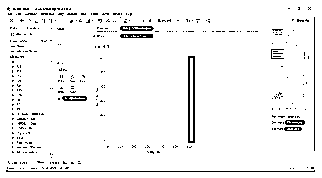

# Tableau 是免费的吗？

> 原文：<https://www.educba.com/tableau-free/>

## 什么是 Tableau？

Tableau 是一个数据可视化软件，带有交互式仪表盘，告诉我们数据的存储情况。我们可以用任何我们喜欢的方式分割我们的数据。分析可以通过脚本或点击来完成。tableau 免费版使用名为 VizQL 的可视化查询语言来探索大型数据库。它有两个版本；一个是个人版，另一个是专业版，因为个人版连接到 7 个数据源，包括 Excel 和 CSV 文件。它从另一个工作簿的数据源导入。使用专业版，可以连接数百个数据源。它兼容 Tableau 服务器和在线。

它兼容不同类型的数据库(电子表格、大数据、访问数据仓库、云应用、云数据库)。在 Tableau 免费版中，跨数据库连接非常强大。

<small>Hadoop、数据科学、统计学&其他</small>

Tableau 的实际流程是通过可视化对数据进行分析。人类已经使用可视化来描述不同见解中的数据。易于使用的拖放界面。许多不同行业的数据科学家和数据分析师都在使用它。它允许业务用户以简单的方式创建自己的报告，从而减少积压的报告。

### Tableau 是免费的吗？

随着用户要求良好的数据可视化和动态访问服务，它是一个不断增长的市场中的新兴 BI 工具。是的，tableau 免费版是使用 Tableau 桌面的试用版。Tableau 免费版对于创建数据可视化的小型组织来说并不划算。消费者可以免费获得 tableau 桌面的公共版本。它提供其专有解决方案的免费版本，让业务分析师感到满意。桌面解决方案的免费版本被命名为 tableau public。他们使用 web 连接器连接以 HTML 形式发布的数据库。它不需要复杂的数据源。

#### 赞成的意见

1.  **速度:**以高效的速度分析百万行，在几秒内给出响应；这就是为什么不断增长的市场将 Tableau 放在他们的排名中。
2.  **易用性:**客户不需要任何编程技能。
3.  **仪表盘互动:**他们用丰富的图形和图表给出动态结果。
4.  **轻松分享:**结果在网络上实时分享。

#### 骗局

1.  它不是为广泛的业务而设计的；Tableau 免费版是为小型组织设计的。
2.  它不支持像 SAAS 那样的统计分析
3.  它没有整合社交平台。它只支持微软平台。

### 为什么选择视觉分析？

可视化分析缩短了洞察时间。

他们改善决策，以查看简单的总结报告和异常值。

### 我们为什么关心画面？

*   商业智能重要性的增加。
*   导致更好的理解和决策
*   开发人员在 web 应用程序中实现交互式数据可视化。

### 这里有 5 个主要工具

1.  桌上型电脑表格
2.  在线的
3.  计算机网络服务器
4.  读者
5.  公共

桌面和在线用于创建不同类型的报告。后三种工具免费发布它们的报告。报告保存为工作簿。

*   **Tableau Reader** :这是一个消耗 Tableau 桌面报告的免费版本。
*   **Tableau 服务器:**在我们有大量人员吞噬工作的时候节省时间。它有两种许可方式:命名用户和核心许可。它创建一个订阅，在发布报告时提供通知。
*   **Tableau Public:** 受限于存储空间。任何人都可以查看工作簿。这有一个收费服务的高级版本。

### Tableau Online vs Tableau Server

Tableau online 不需要服务器设置。它有探索者许可证和观众许可证的价格。所有在线的数据都驻留在 Tableau 服务器上而不是自己的。

### 从画面开始

Tableau 免费版软件目前运行在 Windows 环境下。首先要做的是连接数据。

#### 用 tableau 连接数据库

可以通过本地文件建立连接，也可以连接到服务器。在此过程中，数据可以保持实时连接。

这里我们使用数据库概念，称为与表的连接。当我们建立初始数据连接时，我们使用连接。每个表都有一个唯一的标识符，将这些表链接在一起。这些标识符被称为键。

**举例:**

我们可以开始与电子表格的连接过程。

在连接菜单中->选择多个表并点击添加表按钮->返回标签

### Tableau 连接两个表:连接是健壮的和持久的

*   单击连接图标，显示连接详细信息，如内部、外部右侧、完全外部。
*   内部联接给出的结果同时匹配左表和右表。
*   要使用不同的字段连接两个字段:单击属性下拉箭头，如上图所示:

### 在单个工作表中混合数据源

混合能够改变每个工作页面的主要数据源。

创建混合有两种可能方法:

#### 自动方法

*   如果两个数据源有相同的字段名，它就可以工作。

#### 手动定义

*   它使用编辑关系的方式来混合。

**方阵**

*   它使用编辑关系的方式来混合。

螺纹类型表:

### 建筑可视化

完成人

*   交叉表
*   图表
*   地图

接下来是可视化分析中图表的创建。它是在交互界面中获取数据的过程。他们将数据分成维度和度量。尺寸给出文本列。度量给我们数值。聚合是为了聚合数据。

### 表格计算

*   计算值由 ex: SUM 的公式定义。它们被用来生成数字和日期。
*   所需的要素是:
*   函数、字段、运算符。
*   index 函数计算行或列在集合中的位置。

### 使用地图

它们提供了详细的地理信息。我们可以在一秒钟内创建可视化地图。地理单位包括区号、城市、国家。Tableau 使用详细的在线地图。Tableau 免费版提供了两种类型的地图来显示数据。

*   标志
*   装满

### 结论 Tableau 是免费的吗

与其他 BI 工具相比，tableau 免费版的数据可视化和自助分析质量非常独特。Tableau 免费版连接和提取数据集只需要一分钟。它在设计上不需要 It 干预，非常方便用户使用。使用拖放功能可以实现所有功能。Tableau 许可证很贵。如果许可证过期，用户将无法访问服务器。

### 推荐文章

这是一个没有画面的指南。这里我们讨论了 tableau 免费版的基本概念，主要工具和 Tableau 的例子。您也可以看看以下文章——

1.  [Tableau 你必须知道的面试问题](https://www.educba.com/tableau-interview-questions/)
2.  [Tableau 的用途](https://www.educba.com/uses-of-tableau/)
3.  [大数据是数据库吗？](https://www.educba.com/is-big-data-a-database/)
4.  [Tableau 替代|类型](https://www.educba.com/tableau-alternatives/)

