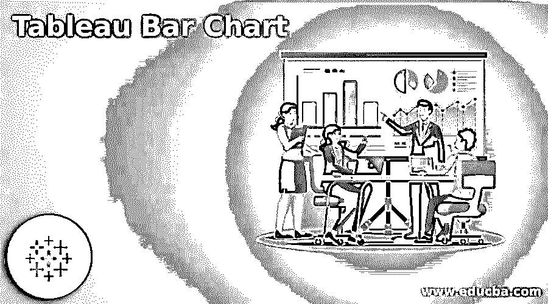
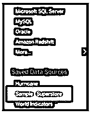
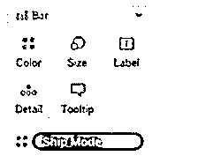
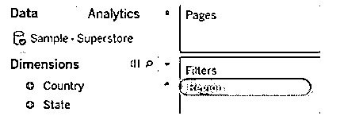
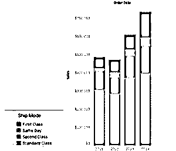
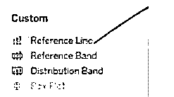
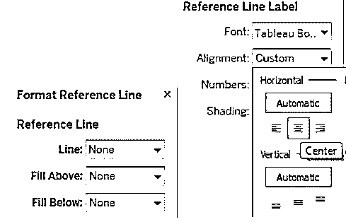
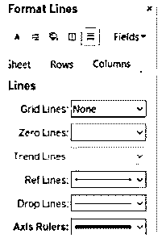
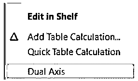
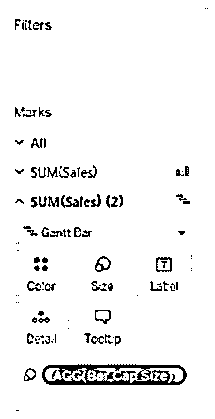

# 表格条形图

> 原文：<https://www.educba.com/tableau-bar-chart/>

## Tableau 条形图介绍

条形图以矩形条表示数据，其值变量与条的长度成比例。当用户将维度拖动到行和列区域时，tableau 标记度量并自动生成矩形条形图。用户可以使用“演示”窗格中的条形图选项。如果数据不足以生成条形图，此选项将显示为灰色。

### Tableau 条形图概述

简单地说，一旦用户选择并测量了他的行和列，tableau 就会自动创建一个矩形条形图。该条形图与变量值和条形长度成正比。如果数据不合适，该选项将灰显。在 tableau 中，借助 measure 和 dimension 可以创建不同类型的条形图。下面给出了简单条形图和堆叠条形图的创建。

<small>Hadoop、数据科学、统计学&其他</small>

### 如何创建 Tableau 条形图？

通过给出尺寸并测量行和列货架，简单的条形图可以从样品超市立即创建。

将维度连接到数据源的示例超级商店。

将值的维度拖放到列中，将其他值拖放到行中。确保行中的数据和列中的其他数据提供相关且有意义的见解。当日期作为维度添加时，Tableau 给出线条作为标记。

在“标记”选项中，从下拉区域中选择条形。如果数据是以时间和日期格式给出的，那么它会随着实际时间的变化而变化，并在更新时有所不同。

选择标记卡中颜色区域的 x 轴和 y 轴值。因此，检查两个值之间的一致性很有帮助。它生成多个轴，并给出所提供数据的清晰视图。

用户可以使用过滤器架过滤数据。提供的数据可以通过过滤器选项进行过滤，以获得首选数据。因此，它有助于用户清楚地了解单位数据，以及它是如何随着季节的变化而变化的。

要获得最终输出，选择 ok。

在堆积条形图中，要添加总计，请选择工具栏中的显示标记标签选项，它将被添加到图表中每个条形图的顶部。当根据大小和颜色对条形进行分段时，每个单独的条形都会得到一个标签，而不是条形总数。一旦条形像视图一样被分离，用户就可以添加总数。也可以通过选择参考线进行配置，然后根据用户偏好提供标签。

参考线从分析列中选择并放入单元格中。然后编辑行和对话框，设置聚合值，然后设置值标签。完成所有编辑后，选择确定。

用户可以在参考线标签区域下更改对齐方式。

用户可以根据范围使条形变得丰富多彩。值越大的棒线颜色越深，而最小值的棒线颜色越浅。要暗示这一点，请将盈利标记拖到标记窗格中的颜色选项上。它为负值的条形提供了不同的颜色。

用户可以向现有条形图添加另一个维度，并生成以不同颜色显示的堆叠条形图。这里也给出了尺寸值和颜色下降。

### 表格条形图格式

条形图已经按类别进行了分隔，因此在图表中再次使用对比色会使图表变得混乱，因此应避免对条形图进行不必要的着色。如果应用颜色在 GUI 上给出一个链接和不同的视觉效果是很好的。

图表的不透明度应该在 80%到 90%之间，以使图表看起来更美观。因此，饱和度的降低使眼睛不会暴露在太多的亮度下，给定的值也清晰可见。

表格中的条形图提供了一种展示数据可视化的简单方法，独特颜色的呈现使产品成为终端用户的一个显著品牌。在条形图中添加主要颜色和次要颜色可以很好地区分这些值。

投影条形图最好的方法是让它固定在一个坚实的基础上，背景很微妙，然后条形图要用大字体的主次色设计。因此它增强了视图，应该提供基线和标尺来查看准确的值。所有这些选项都可以通过使用标记窗格中的格式选项来修改。“线条格式”选项卡用于修改列和行的轴标尺。条形图的标尺线和边框应该是细灰色的，不应该干扰条形图的有意义的洞察力。

通过向现有条形图添加双轴，可以将 cap 添加到 tableau 中的条形图。这是通过双击行架上的度量和双击双轴来完成的。创建双轴后，修改第一个度量的标记类型，第二个度量应在甘特条形图中进行。确保轴与值正确同步，否则，选择同步轴，所有轴都指向正确的值。

### 结论

tableau 中的条形图有两个主要优点，一个是用户可以向它推送更多信息，它有助于给出有意义的表示。另一个是它立即增加了价值，这给了其他可能的比较点。

### 推荐文章

这是一个 Tableau 条形图指南。这里我们讨论一下介绍和如何创建 tableau 条形图？和格式化。您也可以看看以下文章，了解更多信息–

1.  [Tableau BI 工具](https://www.educba.com/tableau-bi-tool/)
2.  [Tableau 报道](https://www.educba.com/tableau-reporting/)
3.  [Tableau 仪表盘](https://www.educba.com/tableau-dashboard-with-examples/)
4.  [Tableau 量表图](https://www.educba.com/tableau-gauge-chart/)

