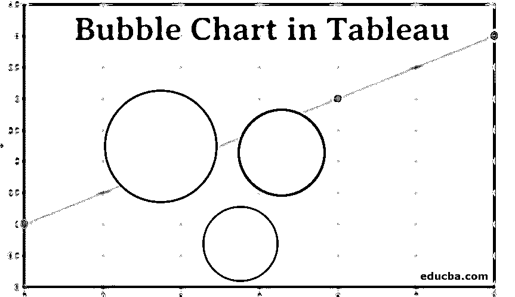
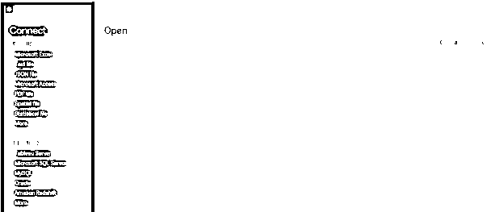
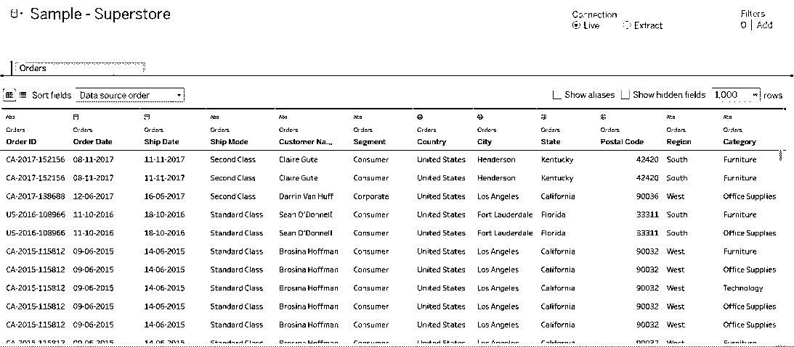
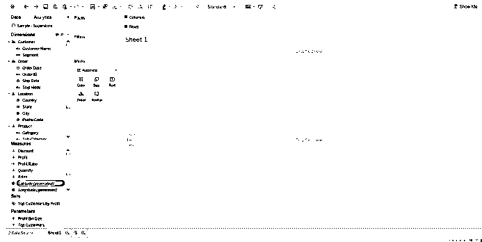
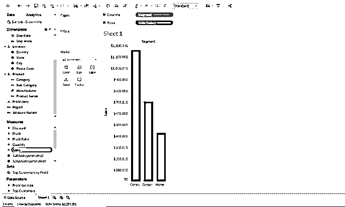
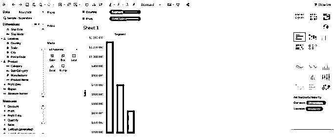
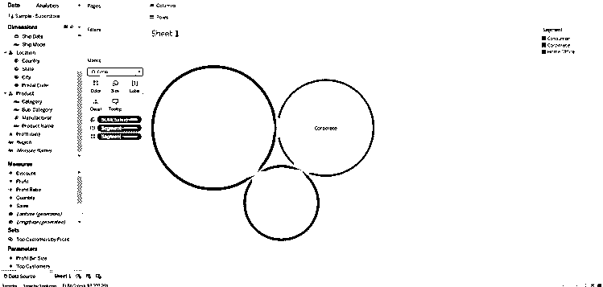
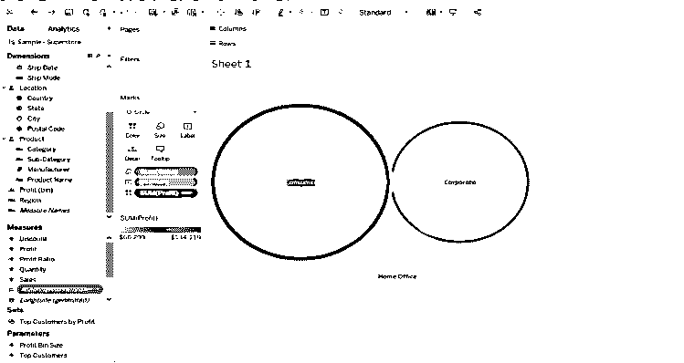

# Tableau 中的气泡图

> 原文：<https://www.educba.com/bubble-chart-in-tableau/>

## Tableau 中的气泡图介绍

在了解如何在 tableau 中绘制气泡图的详细信息之前，让我们先了解什么是气泡图，以及什么时候选择气泡图最合适。气泡图这个名称本身表明，当绘制时，它看起来像一个气泡的集合。气泡图可以显示三维或四维数据。图中的每个气泡代表维度字段中的任何成员，气泡的大小代表度量值。我们还可以补充一点，气泡图是 Microsoft Office 中散点图的增强版本。

散点图是一种通常可以显示两个变量的图，该图看起来像点的集合，如果数据集有三个需要显示的数据变量，并且图中气泡的大小将由第三个变量的值决定，则可以使用气泡图代替散点图。让我们看一个例子来更好地理解事情，假设一个州有大约 20 所大学，我们有过去 5 年申请这些大学的人数和被这些大学录取的人数的数据。

<small>Hadoop、数据科学、统计学&其他</small>

有了这些信息，我们可以计算接受率，并绘制一个气泡图

*   接受率决定了气泡的大小，
*   一个轴上是大学名称，
*   另一个是年份。

既然我们已经完成了气泡图的介绍，让我们来简单讨论一下 Tableau。Tableau 是一个[数据可视化工具](https://www.educba.com/best-data-visualization-tools/)，可以帮助生成交互式仪表盘，通过使用图形、图表帮助更好地理解数据，主要专注于帮助每个人做出数据驱动的决策。tableau 有趣的地方在于它允许实时数据分析。

### 在 Tableau 中创建气泡图

到目前为止，我们已经学习了什么是气泡图和什么是 tableau，现在让我们一步一步地来看如何在 Tableau 中创建气泡图。

1.打开 Tableau，您将能够看到下面的屏幕。使用 Tableau 登录页面左侧的连接选项连接到文件或服务器(基于您输入数据的位置)

2.在这里，在这种情况下，我使用的是表中的样本数据源“Sample–Superstore ”,这是我们的示例中样本数据的样子。

如果您看到所有的列，在 measures 部分中有五个属性(折扣、数量、利润、利润率、销售额),在维度的部分中有几个属性，如产品、位置、订单、客户，这些属性又被划分为更小的部分，为我们提供了更多的细节。

3.单击左下角的“第 1 页”选项，您将能够看到下图，这是您准备仪表板的地方

4.将该段拖到列中，因为在数据源(消费者、公司、家庭办公室)的该列中只有三种类型的值，它看起来像下面的屏幕截图。该步骤已完成

5.将 sales measure 拖动到行中，一旦它被拖动，tableau 将自动对它们进行分类求和，一旦这一步完成，它将看起来像这样。

6.当“行”架上有度量而“列”架上有维时，Tableau 中的默认图表类型是条形图。这就是我们能够在这里看到条形图的原因。因为我们需要一个气泡图，点击右上角的“演示”选项，并在最后选择气泡图选项。

7.此外，要创建一个气泡图，我们至少需要 1 个或更多的维度和 1 个或 2 个度量。在这里，在这种情况下，我们有一个维度(细分)和一个衡量标准(销售)。当我们单击气泡图选项时，它看起来与此类似。

8.为了使它更加紧凑和详细，我们可以将其他尺寸或度量拖入标记卡中的功能中。

9.这里，气泡的大小显示了不同细分市场的总销售额。将利润拖到措施卡中的颜色特征上，气泡的颜色将代表该特定部分的总利润。同样显示在下面的截图。

### 结论

这样，我们可以创建气泡图，并在理解国家之间的社会、经济、医疗和其他科学关系时发挥重要作用。然而，在绘制气泡图时，有几个重要的挫折需要考虑

1.  当气泡数据元素的幅度差异很大时，气泡图可能会成为解释的难点。
2.  具有大量三元组数据点的气泡图将倾向于具有重叠的气泡并遮蔽其他气泡，从而限制气泡图解释的优雅性、有用性、完整性和准确性。

### 推荐文章

这是一个引导气泡图的表格。在这里，我们讨论什么是气泡图，并以简单和容易的方式在 tableau 中逐步创建气泡图。您也可以阅读以下文章，了解更多信息——

1.  [Tableau 建筑](https://www.educba.com/tableau-architecture/)
2.  [Tableau 替代方案](https://www.educba.com/tableau-alternatives/)
3.  [Tableau 命令](https://www.educba.com/tableau-commands/)
4.  [表格中的折线图](https://www.educba.com/line-chart-in-tableau/)

