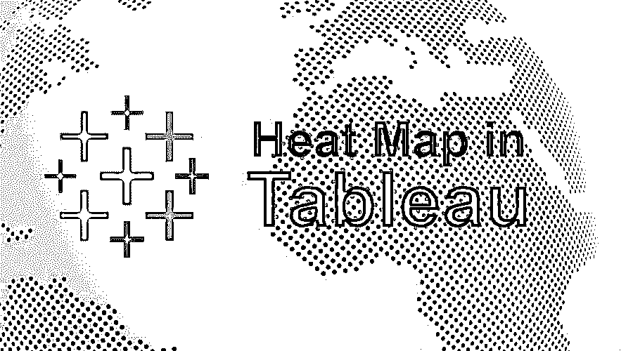
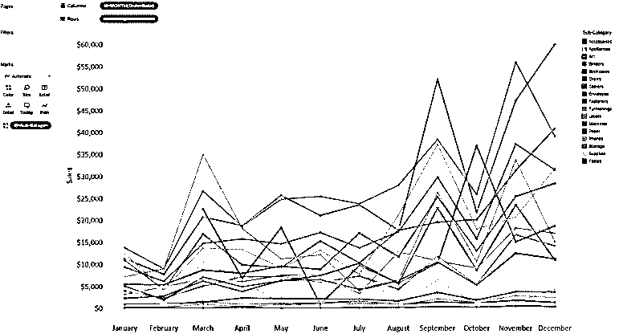
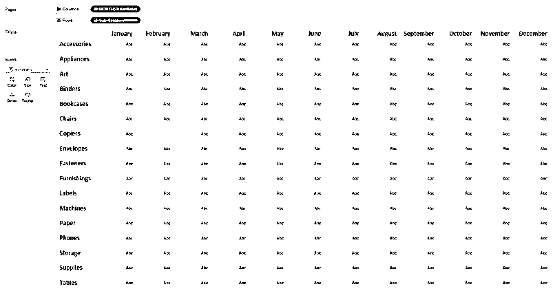
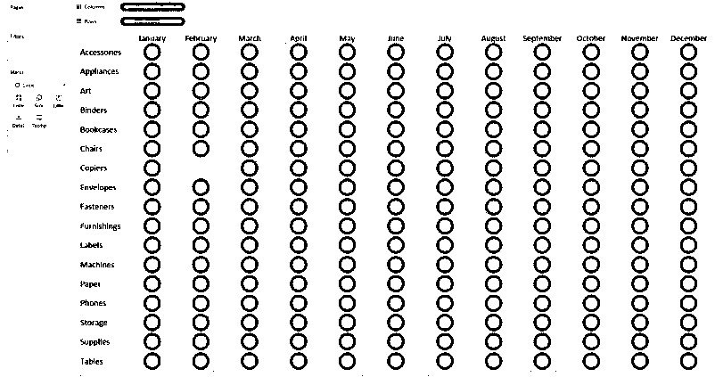
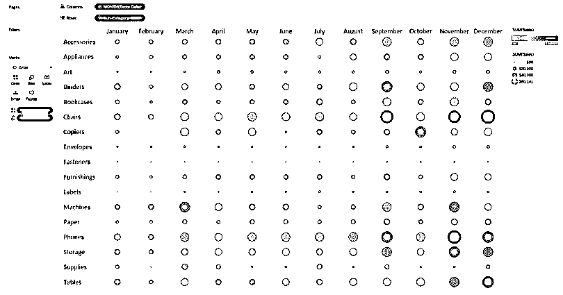
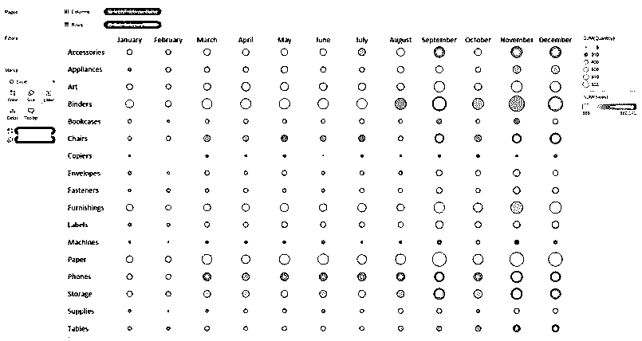

# Tableau 中的热图

> 原文：<https://www.educba.com/heat-map-in-tableau/>

## Tableau 中的热图介绍

Tableau 用于用不同的颜色表示显示数据。表格中的热图可以使用多个维度成员以及测量值来创建。业务流程中的不同场景可以使用 tableau 热图作为超出预期的产品数量或未达到预期的产品数量来解决。

简而言之，热图是 tableau 中可用的不同图表中的一组特定图表，借助颜色矩阵显示信息。通常，颜色密度矩阵表示用于表示信息的浓度或数值的大小。这有助于根据信息密度或集中程度发现模式。

<small>Hadoop、数据科学、统计学&其他</small>

### Tableau 中何时使用热图？

假设我们已经使用 Tableau 提供的超市数据集样本分析评估了每个产品子类别的销售额。此外，让我们假设我们正在分析订单日期的月份，以找出数据中的季节性趋势。当我们使用订单日期的月份作为时间进行评估时，人们可能会想到使用线形图进行分析。下面是用于分析的折线图示例。

从下面的截图我们可以看出，该图在表达数据方面不是很清晰。可以看出，有 17 条线造成了重叠，并且许多子类别与其他类别相比在规模上要小得多，这使得分析该图非常困难。在这种情况下，必须选择热图。

### 在 Tableau 中创建热图的步骤

以下是在 tableau 中创建热图的几个步骤:

**步骤 1**–选择将用作可视化网格的行和列的适当布局。对于相关的数据集，月份必须在俯视图中以列的形式列出。订购日期维度的月份将创建列，它必须放在列架上。接下来，应该将子类别放置在行架中。因此，数据集中的每个子类别都有独立的行。

下图显示了上述设置。

**第二步**–下一个任务是根据数据集设置标记。“标记”选项卡显示在 tableau 桌面窗口的左侧。默认标记始终设置为文本。通过从菜单中选择圆形选项，可以将其更改为圆形。用圆圈标记创建的 Tableau 热图是最合适的。除了圆形，形状或方形标记类型也可用。

下面是在可视化中使用的带有圆圈标记的数据集的图像。

**第三步**–现在已经在订单日期和子类别的每个月的交叉点上设置了标记。现在可以使用两种方法对这些进行编码——一种方法用于确定标记的强度，另一种方法表示标记的大小。为了实现编码，将需要进行尺寸编码的测量值放在左侧面板的尺寸标记卡上，并将我们想要用于颜色的测量值放在颜色标记卡上。对于初始分析，让颜色和大小相同的测量圆。

下图显示了上述设置。

**步骤 4**–为了观察不同之处，折线图使用了与上述完全相同的字段，可以看出，现在在垂直阅读图表时，分析和比较子类别与具体月份要容易得多。通过横向阅读图表，还可以对子类别的季节性进行比较。在图表大小中，颜色在相同的字段中定义，这有助于获得对图表中数据的更多了解。

也可以选择不同的度量，一个用于尺寸，一个用于颜色，这取决于将要执行的分析。下面是一个热图示例，其中圆圈根据数量度量来确定大小，并根据销售度量来着色。

现在，根据设置和使用的颜色和大小，大而亮的圆圈给人的印象是，该特定子类别的销售数量大，收入相对较低。它意味着每件商品的低销售额。尺寸小、颜色深的圆圈给人的印象是，子类别通过少量销售产生了高收入。它意味着每件商品的高销售额。

### 热图在 Tableau 中的重要性

创建热图需要一个或多个维度以及一个或两个度量。突出显示表需要一个或多个维度，并且只有一个度量。区分两者的关键特征是热图，热图要求通过与高亮表相比的额外措施对标记进行编码。

由于高亮显示表允许一次一个颜色标记，因此只能对一个度量进行编码。与高亮显示表不同，使用热图时，可以使用一种方法对标记进行着色，同时使用另一种方法来调整标记的大小。取决于业务逻辑的背景，这种类型的可视化可以在分析中添加有价值的信息。

### 结论

热图是 Tableau 提供的一个非常好的功能。它提供了出色的编码以及不同大小和颜色的数据表示。这种可视化有助于分析师一眼就能获得数据的现成表示。有了所有这些优秀的特性，如果没有明确说明大小和颜色代表什么，这种类型的编码会给最终用户造成一些混乱。

尽管存在局限性，但与折线图或高亮显示表相比，静态 tableau 热图是一个不错的选择。当需要在多个度量中比较不同尺度的维度成员时，这种方法非常有效。

### 推荐文章

这是 Tableau 中的热图指南。在这里，我们详细讨论了在 Tableau 中创建热图的概念、用途、重要性和步骤。您也可以浏览我们推荐的其他文章，了解更多信息——

1.  [什么是 Tableau 服务器？](https://www.educba.com/what-is-tableau-server/)
2.  [如何安装 Tableau](https://www.educba.com/install-tableau/)
3.  [使用 Tableau 实现数据可视化的重要性](https://www.educba.com/data-visualization-with-tableau/)
4.  [MATLAB 中的热图示例](https://www.educba.com/heatmap-in-matlab/)

