# Tableau 中的交叉表

> 原文：<https://www.educba.com/crosstab-in-tableau/>

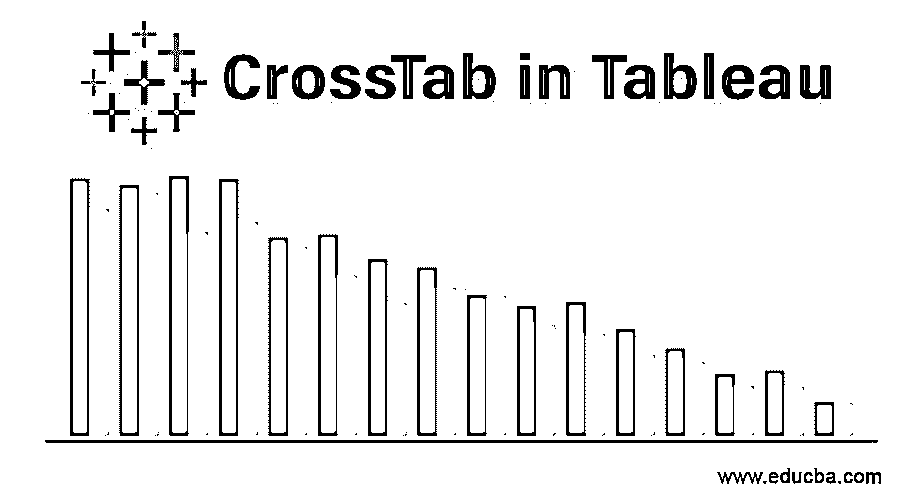

## Tableau 中交叉表的介绍

Tableau 中的交叉表是一种聊天类型，也称为文本表或数据透视表。交叉选项卡包括一个或多个度量以及可视化的维度。它还支持动态值表示的计算字段。Tableau 中的交叉表可用于各种类型的报告和图表，如特定时间段内一系列产品的销售额和利润。交叉表对于业务用户来说很有意义。Tableau 中交叉表的一些最佳实践是在开发报告和可视化时添加适当的命名约定和形成适当的数据层次结构。

默认情况下，Tableau 将整个数据分为两类

<small>Hadoop、数据科学、统计学&其他</small>

1.  ****维度:**** 包含名称、日期、地点等定性值。它们会影响数据的详细程度。
2.  ****度量:**** 包含数量值/数值。可以对测量执行计算。

****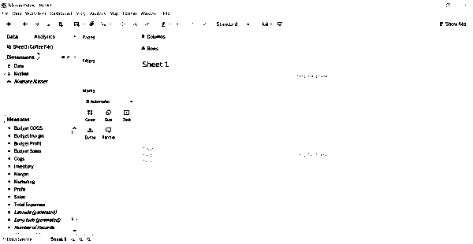

**** 

image–1 用黄色突出显示的部分显示了尺寸和尺寸。

### 问题陈述

假设你是一家餐馆的经理，想要准备一次与利益相关者的会议，利益相关者有兴趣了解餐馆在一段时间内的业绩。作为一名经理，你可以显示一段时间内产品的销售情况或餐馆在这段时间内的利润。

让我们使用 Tableau 的交叉表来构建一个强有力的有洞察力的报告。

### 在 Tableau 中形成交叉表

我们手头有关于这家餐馆的资料。我们将使用 Excel 文件作为我们的数据源。请查收附件。

让我们一起来更好地理解交叉表/文本表。

**第一步:**连接“微软 Excel”文件。

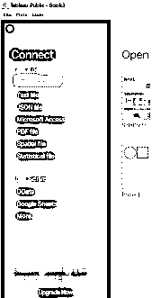

image–2 显示要连接的数据源。

**第二步:**从文件所在的位置选择文件在这种情况下，我们要选择文件‘Coffee file . xlsx****’。**** 从 excel 表格中检索数据后，出现以下屏幕。

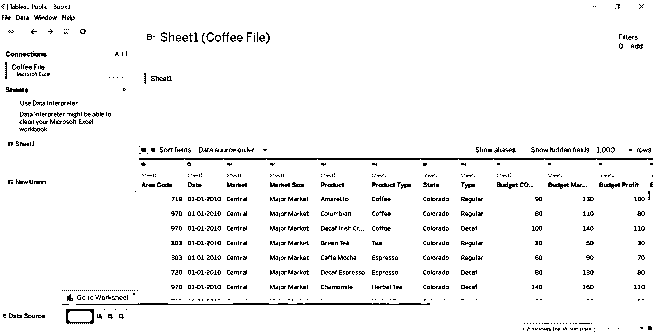

image–3 显示了 Coffee 文件数据。

**第三步:**打开一个新的工作表。右上角显示 Tableau 中可用的各种图表。其中之一是文本表，也称为交叉表。如框中突出显示的那样，它需要一个或多个维度以及一个或多个度量来形成一个文本表格。

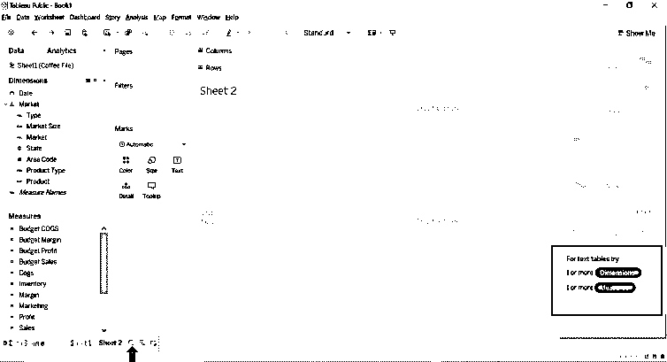

image–4 显示了特定图表类型所需的尺寸和度量。

****Note: ****Currently the available charts are greyed out. Once the required data is placed in the Rows and Column shelf the recommended charts will be available in the same tab.

**第四步:**将尺寸**产品类型**和**产品**拖放到排架中。********

 ********第五步:**在列架中拖拽尺寸**日期**。****

 ******第六步:**拖拽出措施**销售**下的标志货架。****

 ****以上动作的结果形成了一个**交叉表 ****。******

 **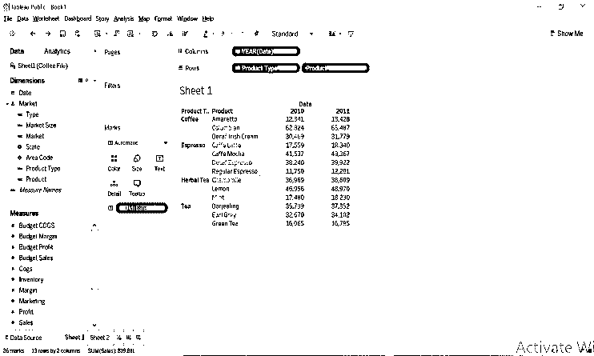

image–5 显示了步骤 4、5 和 6 后的结果。

****Note:**** The date which is in the format “DD-MM-YYYY” is displayed as “Year” with a + sign. It is because Tableau automatically forms the hierarchy of the dates in the following way.

**Step 7: **Color-Coded Text Table

通过给指标添加颜色，使图表更具吸引力和洞察力。只需在色标卡中拖放“销售”这一项，您的值就会用颜色进行编码。

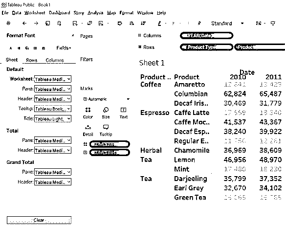

image–6 显示了颜色编码的交叉表

较深的阴影代表较高的销售额，而较浅的阴影代表较低的销售额。现在你的星盘开始讲述自己的故事，这可能是你的目标。

**第八步:**行计算**–**如前所述，我们还可以对度量执行计算。遵循以下步骤。

1.  单击标记卡上销售字段的向下箭头。
2.  选择了“添加表计算”选项。
3.  从计算类型中，选择“占总数的百分比”，并从“使用字段计算”中选择表(向下)选项。
4.  图表现在显示值的百分比。

**Note:** Refer Image – 7,8,9 for the 2,3,4 respectively.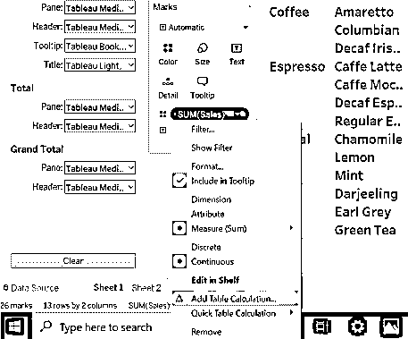

Image – 7

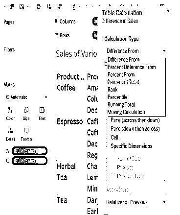

图片–8

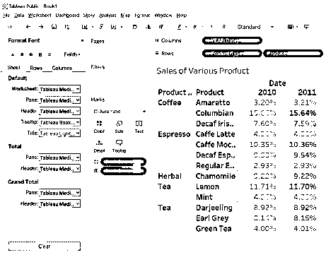

图片–9

**第 9 步:**我们还可以使用利润作为衡量和展示产品在给定时间段内具有最大利润的指标来形成更多的报告。

### Tableau 中交叉表的局限性

Tableau 中的交叉表有一些限制:

****1。固定行&列:**默认情况下，我们在 tableau 中有 6 行和 6 列。按照下面提到的步骤，您可以将行数和列数增加到最多 16。**

 **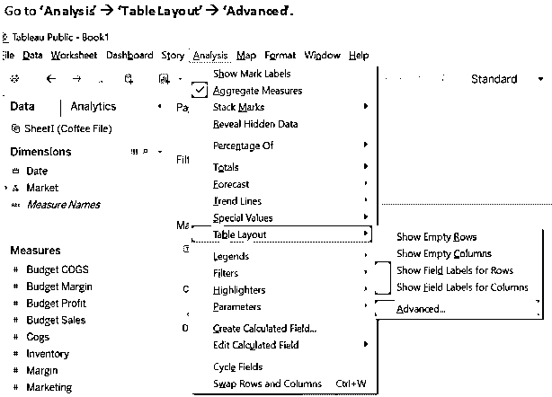

image–10 调整行数和列数。

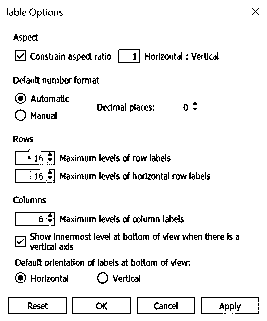

image–11 显示了行和列的大小。

**2。难以解释:**交叉表是以文本形式表示的数据，与其他图形表示形式相比，它的解释难度相对较小。你需要专注于阅读和比较数据，以得出任何模式或见解。

### Tableau 中交叉表用在哪里？

在您想要显示两个或多个维度之间的关系的区域中，它是最受欢迎的。

**使用 Tableau 时的良好实践**

*   ******命名约定:**** **为从数据源表或 SQL 查询到工作表、仪表板或 Story 的所有内容赋予有效名称。从一开始就遵循这一实践将有助于您构建一个拥有多个工作表和数据源的巨大仪表板。****
*****   ****形成层级:**花最初的几分钟看看数据，看看我们是否能形成任何类型的层级。在咖啡文件数据的情况下，产品类型和产品可以形成一个层次结构。此外，市场规模、市场、州和区号可以形成另一个层次结构******

 ******### 结论

交叉表/文本表由于与 excel 的数据透视表高度相似，也称为数据透视表。交叉表是 tableau 中最基本和最常用的图表形式之一。添加颜色和计算可以增强使用数据讲述故事的体验。

### 推荐文章

这是 Tableau 中交叉表的指南。这里我们讨论问题陈述，在哪里使用以及交叉表的形成及其局限性。你也可以看看下面的文章来了解更多-

1.  [在 Tableau 中排序](https://www.educba.com/sorting-in-tableau/)
2.  [表格中的预测](https://www.educba.com/forecast-in-tableau/)
3.  [Tableau 聚合函数](https://www.educba.com/tableau-aggregate-functions/)
4.  [Tableau 特性和属性介绍](https://www.educba.com/tableau-new-features/)
5.  [Tableau 中的分组指南](https://www.educba.com/group-in-tableau/)

************************