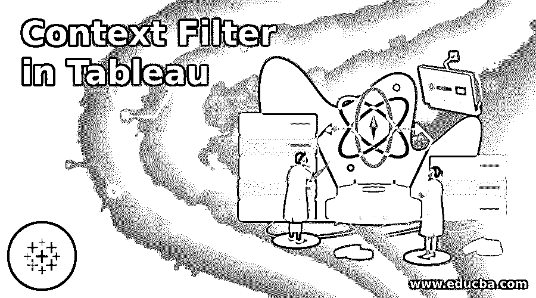
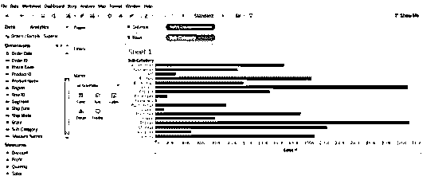
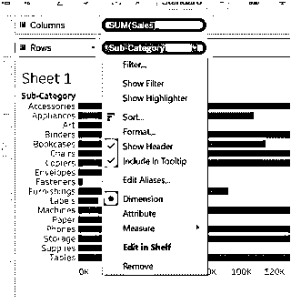
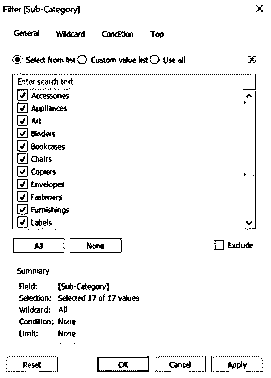
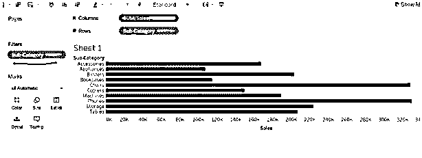
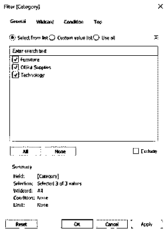
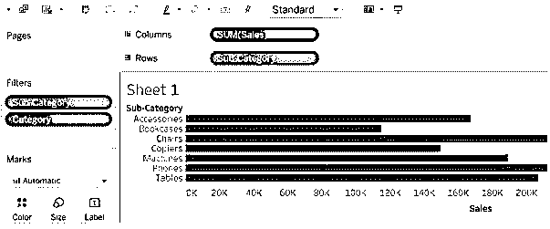
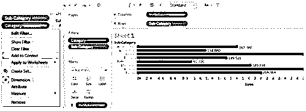
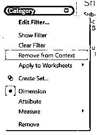

# Tableau 中的上下文过滤器

> 原文：<https://www.educba.com/context-filter-in-tableau/>

## Tableau 中的上下文过滤器介绍

过滤用于独立访问数据源中的所有数据。过滤将帮助用户洞察数据并独立提供搜索。例如，如果我们想根据员工筛选部门，那么我们可以筛选出属于不同部门的员工。这对小型数据库很有帮助。如果我们有一个跨国公司的数据，并且拥有超过 20，000 名员工，那么 tableau 中的上下文过滤器是在 Tableau 中使用的正确选择。我们需要向相应的维度添加一个上下文过滤器。我们可以从 tableau 中创建和删除上下文过滤器。

### 如何在 Tableau 中创建上下文过滤器？

我们将为订单表的类别创建一个上下文过滤器。

<small>Hadoop、数据科学、统计学&其他</small>

1.  我们将添加一个样本超市数据库。(我们可以从 tableau 网站添加不同的数据库)
2.  将样品超市开放到 tableau public 或
3.  将订单表拖到 tableau 数据表中。
4.  将销售度量值拖至列，并将子类别维度拖至

正如我们在下图中看到的，创建条形图是因为 tableau 默认创建条形图。

5.  我们将把过滤器添加到子类别中(将根据销售额过滤出前 10 名或前 20 名)。
6.  点击子类别的向下箭头，将出现过滤窗口
7.  点击

你可以在下图中看到，有更多的过滤器选项。Show filter 将显示 tableau 中可用的各种类型的筛选器，如 condition 或 TOP。如果我们单击“remove ”,子类别将从行中删除。

当我们单击过滤器时，过滤器窗口将会打开。看下图。

我们有四个选项可用于过滤器，如下所示。

*   **General**–我们可以选择所有的列表或者选择一两个我们自己选择的，这里附带了我们可以自定义的
*   **通配符**–我们可以匹配给定数据集中的值，如包含、开头为、结尾为和完全匹配。它包含在数据集中。例如，以 a、b 等开头。以例如结尾–以 a、b 等结尾。举个确切的例子——确切地说是权力或任何
*   **条件**–我们可以用最小值和最大值来定义条件意味着语句
*   **Top**–前 10 或 20 等值和后 10 或 20 等值。我们将和 Min，Max，

点击过滤器->转到顶部并选择顶部值。

1.前 10 名和销售额总和。

2.子类别将显示前 10 名的销售，它被添加到过滤器。

3.我们有一个拖动类别维度到过滤器架。

(当我们将类别拖到过滤器架时，一个新窗口将会打开，我们可以从给定的选项中选择所有类别或我们选择的类别)

4.我们选择了家具和技术类别。

您可以看到只显示了 7 条记录，因为家具和技术产品只有 7 个子类别。应用第一个子类别过滤器，按销售额前 10 名提取值，并按家具和技术类别显示子类别。

5.单击类别名称并选择添加到上下文。

类别过滤器名称被更改为上下文过滤器。您可以看到，现在首先应用了上下文过滤器，然后结果显示为每个子类别的前 10 个值。

### 如何从 tableau 中移除上下文过滤器？

移除上下文是一项简单的任务，但是请记住，一旦移除了上下文过滤器，数据将会像以前一样显示。数据将按前 10 个子类别显示。

1.  单击过滤器架中的上下文过滤器(您可以看到灰色维度是上下文过滤器)
2.  点击“删除自”

### **结论**

我们已经学习了过滤器和上下文过滤器。过滤器将帮助用户根据我们的选择过滤出数据集，当涉及到上下文过滤器时，它将向我们显示基于大型数据库的过滤，并将提供更准确的结果，这将避免重复工作。当我们应用上下文过滤器时，它会在 tableau 中执行，然后如果 tableau 中存在其他过滤器，它们也会被执行。数据源被同时访问。

### 推荐文章

这是 Tableau 中的上下文过滤指南。在这里，我们讨论 Tableau 中的上下文过滤器的介绍，如何创建它的解释。您也可以浏览我们的其他相关文章，了解更多信息——

1.  [Tableau 上下文过滤器](https://www.educba.com/tableau-context-filter/)
2.  [Tableau 计算字段](https://www.educba.com/tableau-calculated-field/)
3.  [Tableau 中的地图图层](https://www.educba.com/map-layers-in-tableau/)
4.  [如何窗口求和 Tableau？](https://www.educba.com/window-sum-tableau/)
5.  [Tableau 操作顺序|如何排序？](https://www.educba.com/tableau-order-of-operations/)
6.  [Tableau 用户组|如何创建？](https://www.educba.com/tableau-user-group/)

