# Zen Master 数组

> 原文：<https://www.educba.com/tableau-zen-master/>

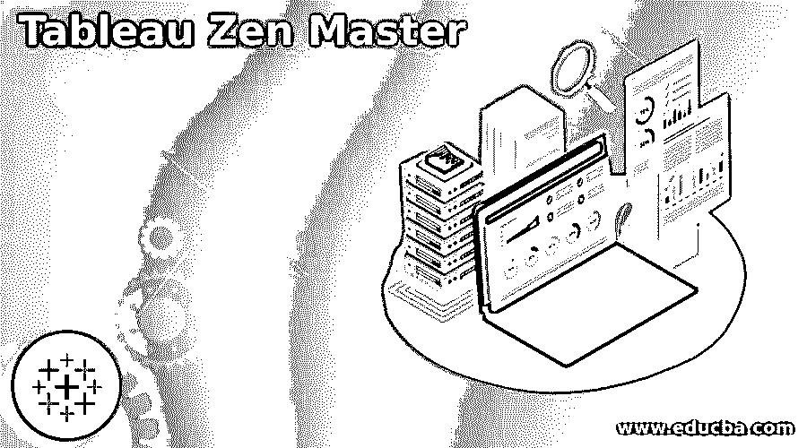

## Tableau 禅师简介

以下文章为 Tableau 禅师提供了一个大纲。Tableau 是一个突出的高级数据可视化工具，使所有类型的用户能够播放、标记和可视化他们的数据。tableau 是一组活跃的 BI 社区。他们认可提出创新想法的人，这些人被 tableau 社区提名为 tableau 禅宗大师。禅师们必须在规定时间内完成任务。每年社区都会根据前一年的作品宣布新的禅师。一旦你成为禅宗大师，你会被邀请参加不同的会议，获得一个独特的徽章，并在 tableau 的网站上获得荣誉。

### 什么是 Tableau 禅师？

Tableau 禅师是 tableau 社区每年提名的人。这是基于他们的创新思想，聪明的工作，以及上一年的成就而选出的。Tableau 禅宗大师的薪水很高，在网站上有很高的知名度，还可以访问一些特殊的网站。

<small>Hadoop、数据科学、统计学&其他</small>

### Tableau 禅师图怎么用？

Tableau 图表可以映射三种不同类型的空间数据，如多边形、线和点。为了进行投影，tableau 使用经度和纬度值等坐标，并使用 web Mercator(tableau 网站上的一个地图项目)将它们转换为适当的位置。

如果数据由城市、机场代码、国家名称、邮政编码或其他地理术语组成，tableau 会自动使用经度和纬度值触发相关的面，并从 tableau 的内置地理数据库中提取数据。

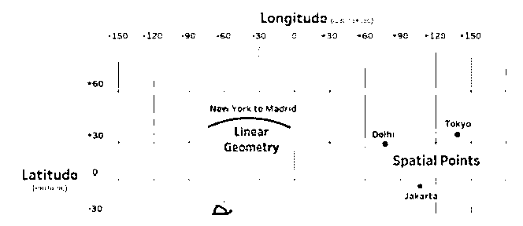

用户可以将空间文件(如 KML、GeoJSON 和 shape 文件)与可在地图上显示的空间对象连接起来。

要使用这些地理字段创建地图，双击数据窗格中的字段值，它会使用经度和纬度字段创建一个地图。对地理区域或地理点进行编码，以查看要在数据中绘制地图的位置。

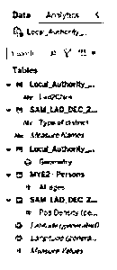

引入地图图层是为了使空间信息的多个图层源出现在地图上，以设计更具包容性的地理视图。交互式版本在 tableau 主窗格上打开。

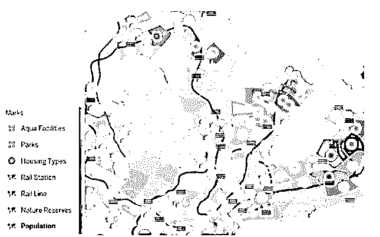

可以使用创建点、缓冲区、创建线、面积、距离和空间相交连接将空间函数集成到多种方法中。

在 SRID 的帮助下，创建点用于根据投影坐标、经度和纬度值创建空间点。Buffer 用于设计一个由用户值指定的空间缓冲对象，并在相关空间点周围创建一个半径。制作直线是设计连接两个空间点的直线的一个选项。这是一个关于地球曲率的椭圆艺术。在连接两个空间点的大椭圆艺术中，距离被用来给出距离的值。面积给出了空间多边形中总表面积的值。文件的连接是基于空间交叉连接的。因此，所有的措施结合起来，以多种创新的方法来探索空间数据。面积的计算使用连接的空间文件中的平方面积、英里、英尺、米和千米来完成。

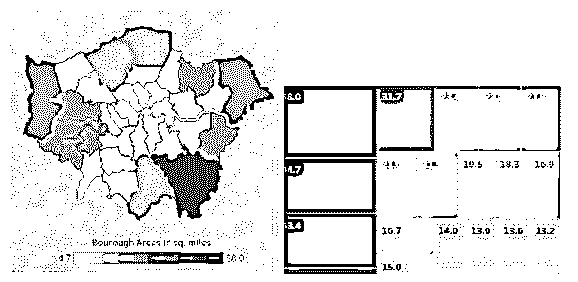

### Tableau 禅宗大师的提示和技巧

为了设计一个吸引人的仪表板，以清晰的格式确定和设计目标。这些目标应该基于最终用户，并使用消耗量、使用量和数据流来制定。铃铛和哨子只有在有积极意义的时候才会被修饰，而不是强制性的不使用它们。

用户必须找到一个合适的组合，以提高机会和生产力的措施。寻找广告的公司应该制作吸引人的海报和统计方法来吸引观众。Tableau 中提供了这样的格式和设计以及数据可视化工具 Qlik 和 Spotfire。

### 高级画面禅师

Tableau 具有大量不同可视化类型的特性，如地图、图表和图形。可以从高级堆积条形图构建仪表图。

以下是 tableau 中的高级图表，用于表示具有分类测量值的多个数据集:

#### 1.表格面积图

这种图表建立了不同数据变量之间的关系。它抑制每个分段的覆盖面积，并将其与总和及百分比进行比较。根据给定的值，该面积图可以是离散的，也可以是连续的。

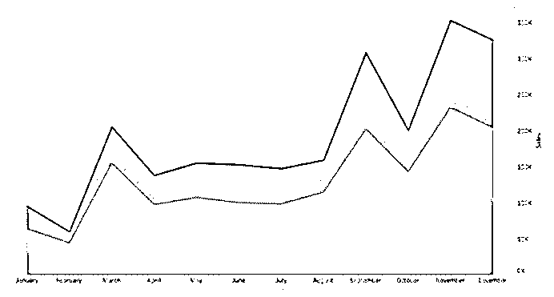

#### 2.表格项目符号图

这是 Tableau 中古代条形图的高级版本，有助于比较一个单位条形图上的多个数据字段。此项目符号图适用于用户可以将获得的输出与预期结果进行比较的数据集。

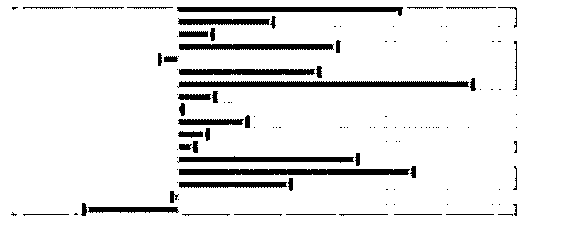

#### 3.表格迷你图

它们是用于显示不同指标趋势的压缩图。它隐含在不同的公司仪表板中，以显示 KPI 的即时趋势。

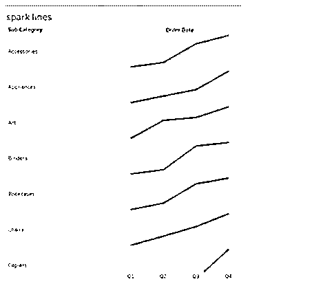

#### 4.条形图中的条形图

它是数据科学家用来在其他条形图上测量一个值的高级版本。它由两个条形图组成，这两个条形图根据行和列区域的值相互关联。

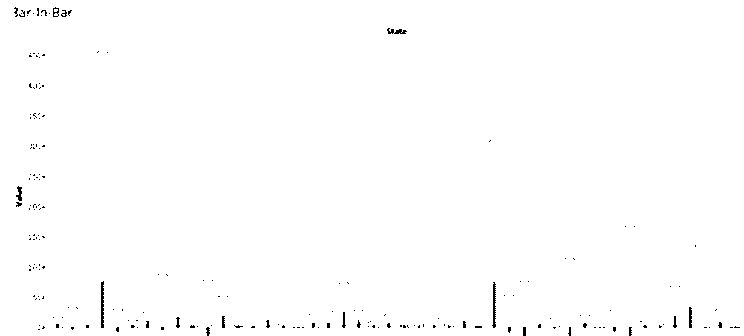

#### 5.表格盒图

它也被称为盒须图，沿轴显示不同数据度量的共享。这种分布由具有行架和列架维度值的粒度形式表示。

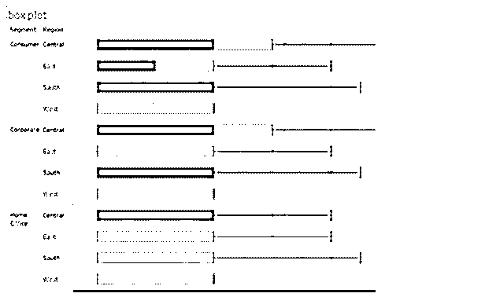

#### 6.帕累托图

这是一种既有条形图值又有折线图值的图表。累积值由其他数据值和折线图表示，条形图按降序排列。

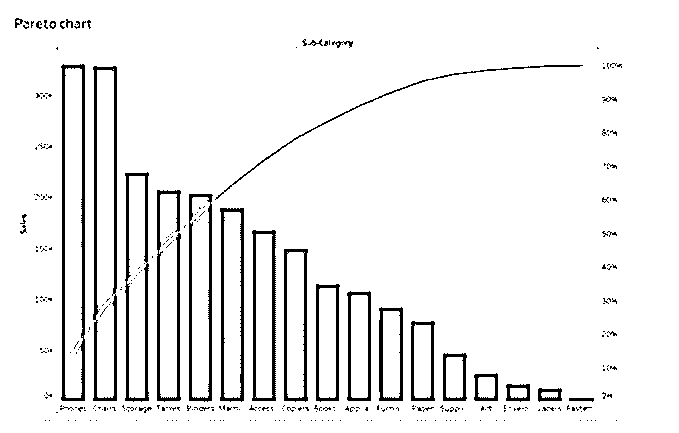

### 结论

对于一个公司来说，不仅质量和数量对于接触受众很重要，而且让受众听到和看到它也是强制性的。所以要精确，把数据做成条形图，给出一个清晰的视图，有助于比较。因此，对 tableau 图表的高级版本进行了简要讨论。

### 推荐文章

这是一个指导 Tableau 禅师。这里我们讨论一下入门，以及如何使用 tableau 禅师图？提示和技巧。您也可以看看以下文章，了解更多信息–

1.  [Tableau BI 工具](https://www.educba.com/tableau-bi-tool/)
2.  [Tableau 报道](https://www.educba.com/tableau-reporting/)
3.  [Tableau 仪表盘](https://www.educba.com/tableau-dashboard-with-examples/)
4.  [Tableau 量表图](https://www.educba.com/tableau-gauge-chart/)

