# 画面可视化

> 原文：<https://www.educba.com/tableau-visualization/>

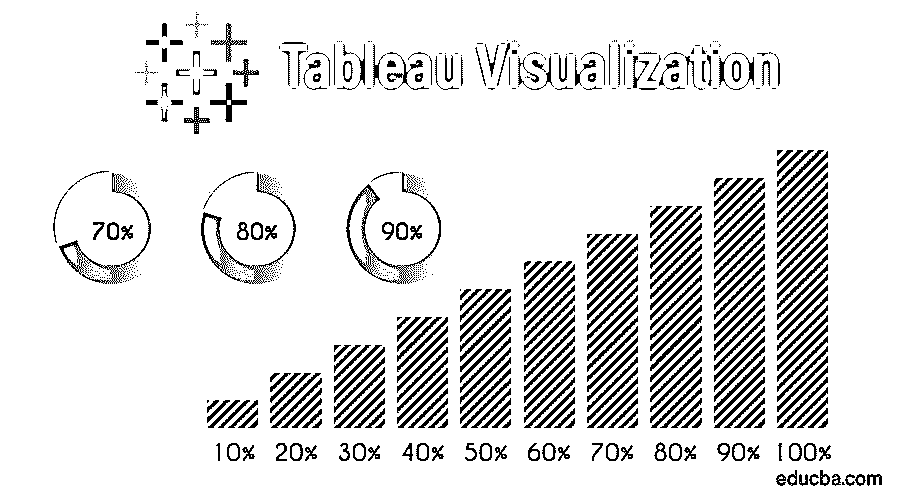

## Tableau 可视化介绍

商业智能是一个技术驱动的过程，用于分析数据和提供可操作的信息，以帮助公司高管、业务经理和其他最终用户做出更多的业务决策。这是对业务情况的了解，尤其是如果我们有大量数据可用于交互业务数据的决策，并找到特定问题的根本原因，这将有助于我们最终改进业务。Tableau Visualization 是一个商业智能工具，可以帮助我们弄清楚过去发生了什么以及为什么会发生。有时，使用 Tableau 可视化，我们还可以预测未来的术语。

### 表格分析

在数据科学中，工作流表用于数据浏览和报告。让我们来看几个 tableau 的工作流分析。

<small>Hadoop、数据科学、统计学&其他</small>

1.  收藏品
2.  探测
3.  合并
4.  造型
5.  确认
6.  报告

Tableau 是一个商业智能和数据可视化工具，允许用户通过图形、图表、图示等来理解数据。此外，tableau 提供了一些用于探索和建模的工具:Tableau 桌面、Tableau 在线、Tableau 服务器、Tableau 阅读器和 Tableau 公共。在这个 Tableau 中，桌面和 Tableau online 用于准备不同类型的报告，Tableau Server、Tableau Reader 和 Tableau Public 用于发布报告。

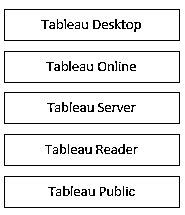

它与[不同类型的数据库](https://www.educba.com/types-of-database/)系统具有非常好的兼容性，如电子表格、数据库、大数据、访问数据仓库、云应用、云数据库等。此外，它支持不同类型的设备进行发布(例如，桌面、平板电脑、电话)。

#### 数据可视化的类型

数据可视化是以简单方式对应信息的图形表示。我们现在来看看它们的类型。

*   图表
*   图形
*   地图
*   桌子
*   制图法
*   仪表盘

这是用于数据可视化的一般类型；在这种情况下，有更多的具体示例用于以适当的方式可视化数据，如面积图、条形图、分布图、饼图、圆形视图、甘特图、子弹图、统计图、热图、高亮表、矩阵、树形图、时间轴、文字云、文本表、流图、网络、散点图、放射树、瀑布图、基本漏斗图、高级漏斗图、直方图等。

### 示例和模拟

*   Tableau 桌面版只是拖放操作，我们可以将任何我们想要的字段拖放到行和列的适当位置。
*   在左侧，有两个字段，维度和度量。基本上，Dimension 是一个分类变量值(例如，员工 id、加入日期、地区等。)，而 Measure 是一个数值(例如，记录数、年龄、工资等。);利用这些信息，我们可以在 tableau 中创建 24 种不同类型的图表。准备任何图表只需要 30 秒。

现在，我们将了解如何以图形化的方式可视化信息。

屏幕 1 显示了 Tableau 桌面的前端。一个选项是“连接”；我们可以使用这个选项卡将数据库连接到 tableau。我们可以连接 excel、文本文件、Access 等任何类型的数据。

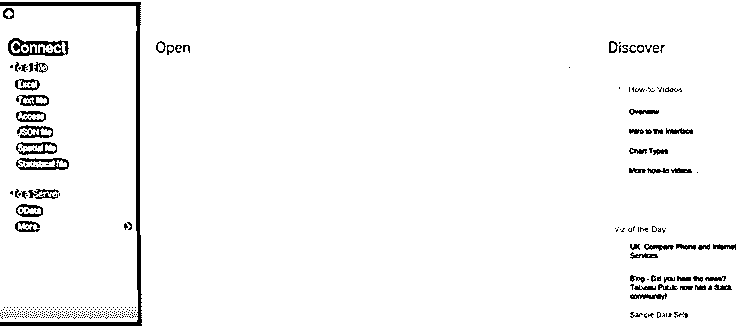

*   数据有三大类:名义数据、序数数据和比率数据。

名义数据无法与其他字段(姓名、性别等)进行比较。).有序数据是按顺序排列的数据。尽管如此，我们找不到比率或差异(例如，绩效评级)，比率数据是我们可以比较和区分的数据。我们可以找出比例(比如年龄，工资等。)

*   散点图有显示两组数据之间关系的点；让我们考虑一个例子，冰激凌销售商记录他们卖了多少冰激凌，以及当天中午的温度是多少(表 1)。

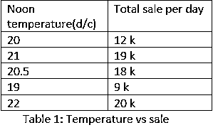

*   在上面的表 1 中，我们可以很容易地识别出随着温度的升高，销售额会增加，这是一个简单的线性增长的例子。在这个例子中，有完美的数字，或者我们可以在数据库中完美的值，所以在这种情况下，我们计算差，比率，我们可以比较值。在这些情况下，散点图给出了数据库的精确图形表示。

### tableau 仪表板

在本例中，图示如下:

在第一个屏幕中，我们可以看到数据库连接到 tableau。有两个选项实时和提取；由于我们按原样使用该数据集，因此我们选择了一个实时选项。

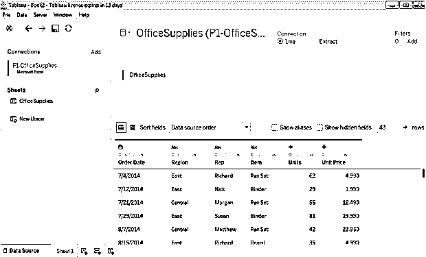

#### 1.水平条

它显示了项目和总单位之间的关系。

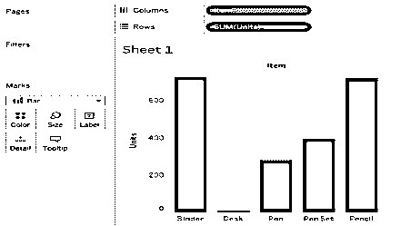

#### 2.热图

它显示了单位数、总单位数与项目名称之间的关系。

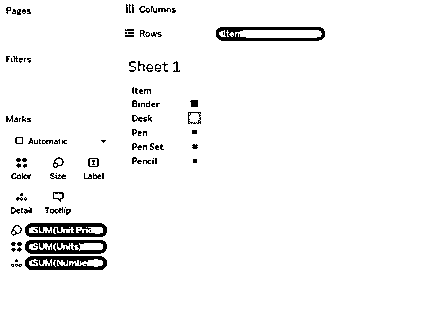

#### 3.树图

它在图表中显示了更多的细节；我们使用一个属性:日期、项目名称、单位和单价。

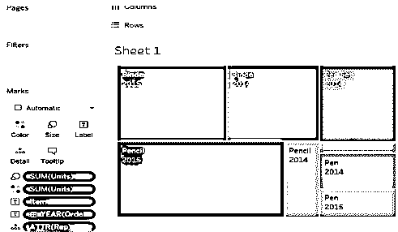

#### 4.圆形分格统计图表

这里是 360 度的图形视图；我们添加了一个属性区域，以及商品名称、单位和单价。

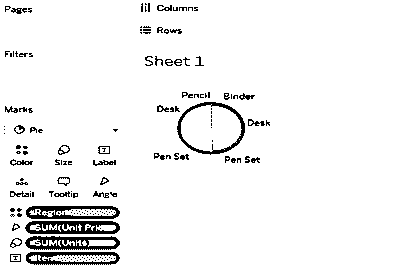

#### 5.散点图

它是数据库的离散表示；必须有两个或更多的测量字段。

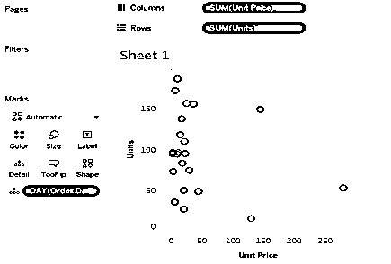

#### 6.圆形视图

在圆形视图中，我们可以添加更多带度量的维度字段。

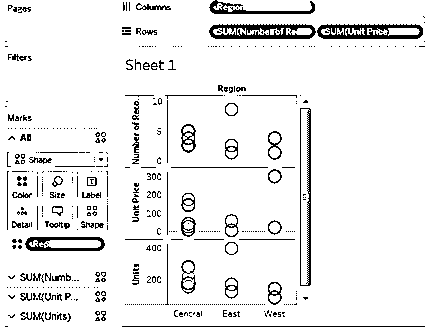

### Tableau 可视化的优势

1.  速度:Tableau 中的模拟是一个非常快速的过程。在 Tableau 中准备一份报告只需要 30 秒。
2.  用户友好:tableau 为特定操作提供了各种选项卡；因此，易于理解和使用。
3.  交互式仪表盘:我们可以对数据进行分割，轻松识别系统中的浪费，并改进决策过程。
4.  轻松发布和分享:在 Tableau 中通过直接标签与他人分享我们的作品是非常容易的。
5.  不断增长的市场:它处理大量的数据，因为速度和容量，它有一个不断增长的市场。

### 结论-表格可视化

*   Tableau 是一个非常有效的图形表示工具，它有超过 24 种不同的图形视图来显示数据。
*   尽管数据集很复杂或者很大，但在 tableau 中，我们可以非常容易地在更短的时间内创建仪表板。

### 推荐文章

这是一个 Tableau 可视化指南。在这里，我们讨论数据可视化的介绍和类型，包括图表、图形、地图、表格、图形和仪表板以及 Tableau 可视化的优势。您也可以阅读以下文章，了解更多信息——

1.  [Tableau 中的气泡图](https://www.educba.com/bubble-chart-in-tableau/)
2.  [Tableau 中的查找函数](https://www.educba.com/lookup-function-in-tableau/)
3.  [Tableau 中的漏斗图](https://www.educba.com/funnel-chart-in-tableau/)
4.  [Tableau IF 语句](https://www.educba.com/tableau-if-statement/)
5.  [如何在 Matlab 中使用条形图(示例)](https://www.educba.com/bar-graph-in-matlab/)
6.  [如何在 Power BI 中创建瀑布图？](https://www.educba.com/power-bi-waterfall-chart/)

