# 画面中的轴心

> 原文：<https://www.educba.com/pivot-in-tableau/>

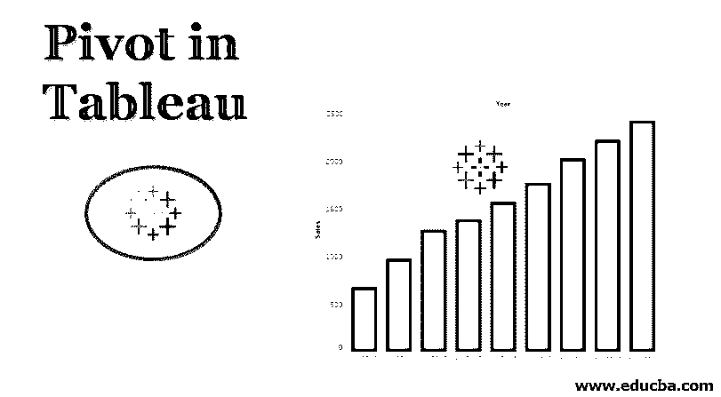

## Tableau 中的轴心介绍

支点通常是指一个支持向任何方向转动并保持平衡的点。关于基于数据的操作，这个概念来自 MS Excel，其中数据透视表帮助以用户想要的方式处理数据。Tableau 也提供了一种数据透视机制，支持基于用户需求的聚合和数据排列功能。透视后创建的新字段可以成功地用于创建有洞察力的可视化效果，否则是不可能生成的。此外，Tableau 在这里不限制用户，因为透视的数据也可以取消透视到其原始状态。

### 在 Tableau 中创建透视的步骤

现在，我们将看到在 Tableau 中透视数据的逐步过程。在这个演示中，我们将考虑印度 20 个主要城市的销售数据。销售数字是今年的。从 2010 年到 2018 年的年份显示为列，与之相对的是各个城市的销售数字。我们将这些数据导入 Tableau，并对其进行透视操作以进行分析。

<small>Hadoop、数据科学、统计学&其他</small>

1.要加载数据源，请单击“数据”菜单中的“新建数据源”。或者，单击“连接到数据”。

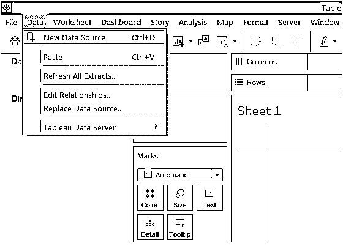

2.选择必需的数据源类型。在这种情况下，数据源以 Microsoft Excel 文件的形式出现，因此单击 Microsoft Excel 并选择该文件。

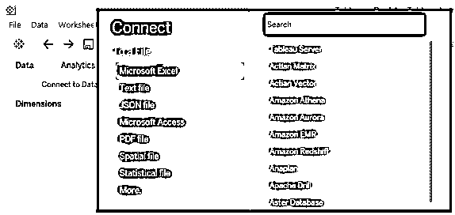

3.数据被加载到 Tableau，如下所示。

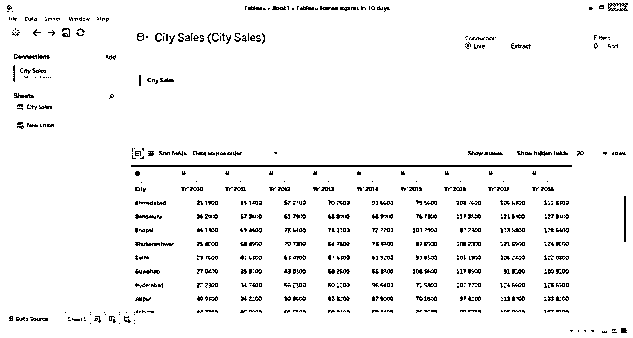

4.下面的屏幕截图让我们更仔细地看看数据集。从下面的屏幕截图中可以看出，每一年都作为一个单独的列出现。一行表示一个城市不同年份的销售额。

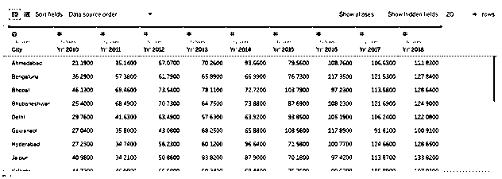

5.在现有的安排下，不可能查看一个城市的总销售额，因为不同年份的销售额是分开显示的。使用“Pivot”选项可以帮助我们克服这个问题。选择我们想要透视的所有列，例如，在本例中，我们将选择所有年份列。右键单击所选的列，然后单击 Pivot 选项，如下图所示。

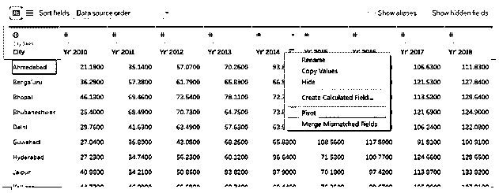

6.只要我们单击“Pivot”选项，数据就会被转换，如下所示。作为透视结果创建的新字段的默认名称分别是维度和度量的“透视字段名称”和“透视字段值”。然而，我们将用有意义的名字来重新命名它们。

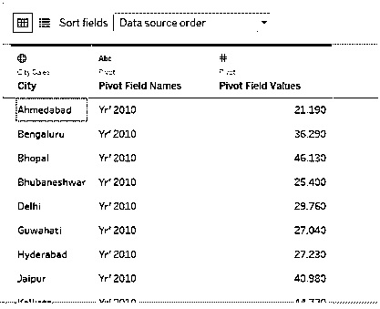

7.要重命名 pivot 字段，只需双击它并键入所需的名称。名称应该适合上下文，并有意义地传达该领域的关键。

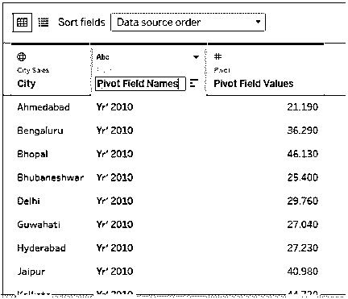

8.我们成功地将透视字段名称和透视字段值分别重命名为 Year 和 Sales，如下图所示。

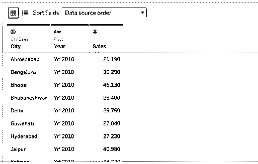

9.转到 sheet 选项卡，我们可以看到已经成功地将 pivot 字段引入其中，我们现在可以使用它进行分析。它们被突出显示，如下图所示。

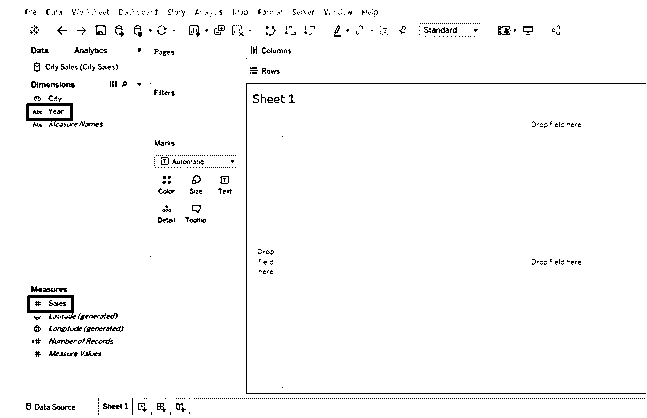

10.只需将新创建的维度“年”拖到“列”区域，并将“销售额”度量到“行”区域。我们得到了一个显示所有城市全年销售情况的可视化图，如下所示。请注意，默认的图表类型是条形图，可以通过标记卡进行更改。

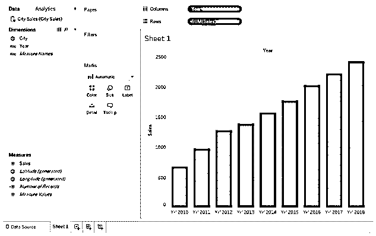

11.从 Marks 卡中，将图表类型更改为线形，我们会得到一条描绘所考虑期间销售趋势的线。为了更好地理解和分析，我们将稍微修改这个图表。在标记卡中，单击颜色。在“颜色”中的“标记”下，选择“全部”选项。执行这些步骤将为我们提供一个带有标记的折线图，如下图所示。

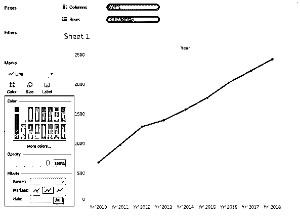

12.该折线图显示了从 2010 年到 2018 年的增长趋势。然而，作为一名分析师，我们可能希望更深入地了解销售数字。要使标签周围的销售数字可见，只需在“商标卡”中拖动“标签上的销售”即可。我们得到一个销售数据的折线图，如下图所示。

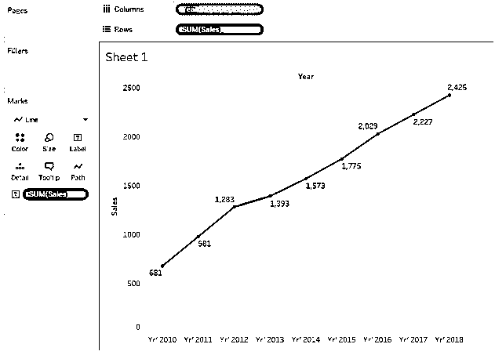

上面的图表更有见地，提供了一种简单快捷的方法来进行年度比较和百分比计算。

13.在上面的分析中，我们研究了总销售额。有时，分析平均销售额变得很重要。在我们的示例中，为了分析一段时间内的平均销售额，我们必须将聚合度量从 SUM(总和)更改为 AVG(平均值)。请注意，我们在“列”区域和“标记”卡中都有“销售”,因此我们必须在这两个地方修改聚合度量。要更改聚合度量，请单击维度 Sales 的下拉菜单，然后在“measure”部分选择“Average”。下面的屏幕截图显示了更改 Marks 卡中的聚合度量的过程，随后的屏幕截图显示了“列”区域中的“销售”维度的过程。

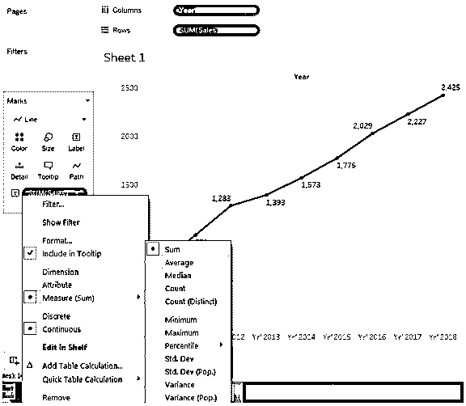

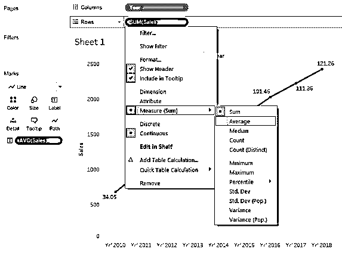

14.以下截图显示了 2010 年至 2018 年期间印度 20 个主要城市的平均销售趋势。

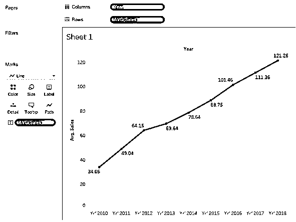

在上面的部分中，我们看到了透视数据如何帮助我们执行重要的分析，并使用不同的聚合度量和数据排列选项来处理数据。这是画面中枢的一个重要方面。

15.我们可以移除透视并将数据恢复到其原始状态。要删除透视，只需右键单击任何透视字段，然后单击“删除透视”选项。

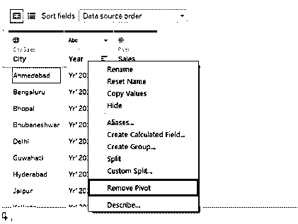

16.下面的截图显示了如何点击“删除透视”选项恢复数据到其原始状态。这一点非常重要，因为根据需求，我们可以透视数据、执行分析，一旦达到目的，就可以将数据恢复到原始状态。这有两个目的:执行分析和保持数据完整。

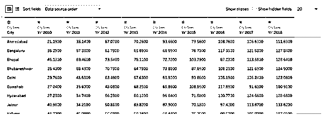

17.只要看看，如果我们不把数据转换成数据，直接用于分析，会发生什么。正如我们在下面的屏幕截图中所看到的，不同的年份显示为不同的指标，不可能将它们汇总起来以获得全年的销售趋势。请记住，我们已经使用 Pivot 解决了这个问题。

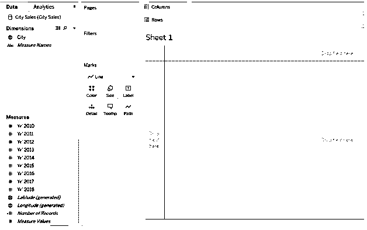

### 结论

其名称源自 mechanical pivot，数据库操作中的 pivot 功能是指根据需要处理和聚合数据的机制。Tableau 中的 Pivot 选项有助于处理数据，以获得合适的数据排列，可进一步用于基于上下文的分析。

### 推荐文章

这是一个在 Tableau 枢轴指南。在这里，我们讨论在 Tableau 中创建 pivot 的一步一步的过程，并对其进行 Pivot 操作以进行分析。您也可以阅读以下文章，了解更多信息——

1.  [表格中的参数](https://www.educba.com/parameters-in-tableau/)
2.  [Tableau 仪表盘设计](https://www.educba.com/tableau-dashboard-design/)
3.  [Tableau 图表类型](https://www.educba.com/tableau-chart-types/)
4.  [Tableau 中的枢轴](https://www.educba.com/pivot-in-tableau/)
5.  [Tableau 上下文过滤器](https://www.educba.com/tableau-context-filter/)

