# 表格中的预测

> 原文：<https://www.educba.com/forecast-in-tableau/>

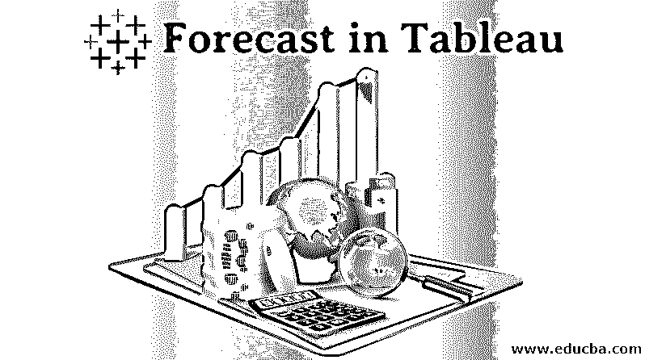

## Tableau 中的预测简介

一般来说，预测意味着预测未来一段时间内某项措施的价值。预测可以针对未来几天、几个月或几年。预测的过程是一个涉及多个因素的数学过程。对于预测，该度量表示为一段时间内的一系列值。不同的测量值出现在不同的时间点，当可视化时，它们表现为时间序列。Tableau 使用采用指数平滑技术的预测来提供正确的预测。除了预测，Tableau 还提供了对生成的预测进行详细分析的见解。

### 在 Tableau 中创建预测

现在，我们将看到在 Tableau 中创建预测的逐步过程。本演示的数据源是 2000 年到 2011 年的月度收入数据。有一个维度年和一个收益的度量。

<small>Hadoop、数据科学、统计学&其他</small>

1.将数据源加载到 Tableau。单击“数据”选项卡下的“新数据源”。

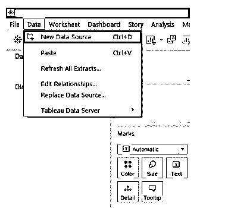

如下面的屏幕截图所示，单击适当的数据源类型，因为我们的数据源由 Microsoft Excel 文件组成，所以我们将单击“Microsoft Excel”。

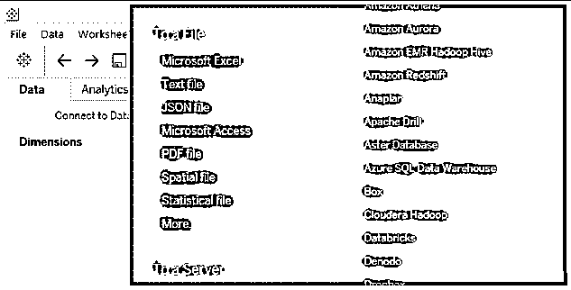

2.加载数据源后，将“年”维拖至“列”区域，将“收入”度量拖至“行”区域。折线图生成如下。

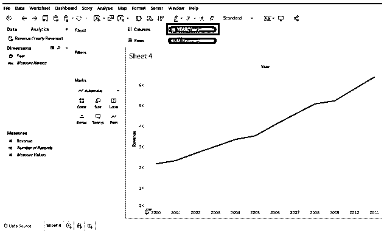

3.从上面可以看出，Year 函数已经应用于维度 Year。我们希望图表按月显示。因此，我们将从维度下拉菜单中选择月份函数，如下所示。

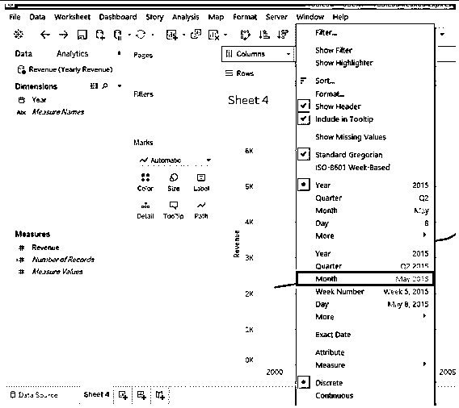

4.一旦我们选择了月份，我们就会得到一个正确显示时间序列的折线图。收入的时间序列显示，它有一个增长的趋势，季节性因素也在那里。

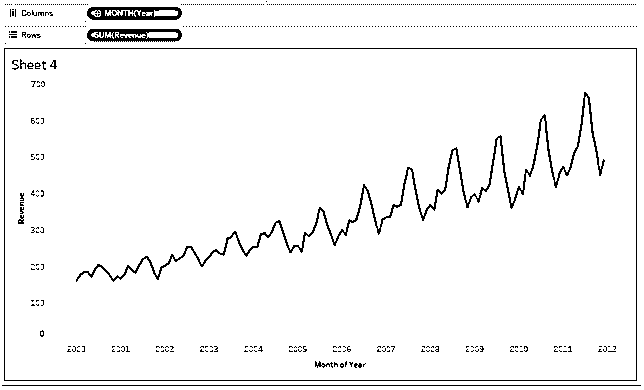

5.要生成预测，请转到“分析”菜单。在“预测”选项中，单击“显示预测”。下面的截图说明了这一点。

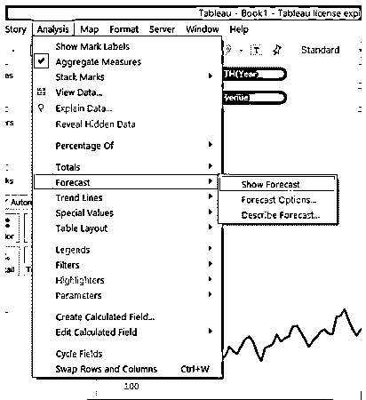

6.按照上述步骤将创建如下预测。预测衡量标准是通过标记卡中的颜色创建的。在右侧，可以看到预测指示器。有两个指标实际和估计。实际指标是点预测，而在估计的情况下，下限和上限由基于置信区间的算法计算，例如 95%、90%等。

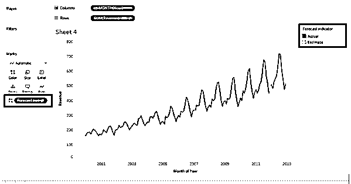

7.从上面的截图中可以看出，接下来几个月会有预报。实际值用黑线表示，而估计值在实际预测值周围用蓝色阴影表示。为了探究与预测相关的各个方面，我们将完成以下步骤:

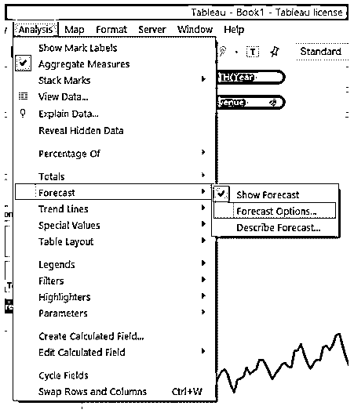

8.在预测选项中，单击“预测选项…”。将弹出如下预测选项对话框。对话框中这些部分下有各种部分和选项。我们将一个一个地见到他们。

在“预测长度”部分，默认选择“自动”。它生成未来 12 个月的预测。“精确”允许我们将预测扩展到指定数量的时间单位，而“直到”将预测扩展到未来的指定时间点。应该通过传递不同的值来试验这两个选项。每当生成预测时,“显示预测”间隔下的描述都会发生变化。

在“源数据”部分，有一个选项“聚合方式”,后跟一个下拉菜单。我们可以按年、季度、月、周、天、小时、分钟和秒进行聚合。

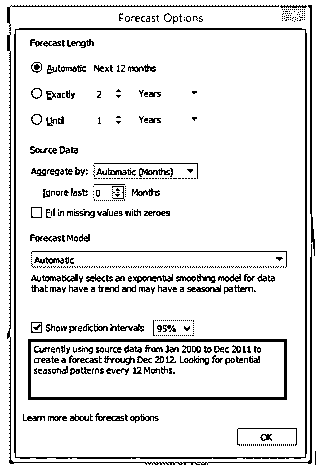

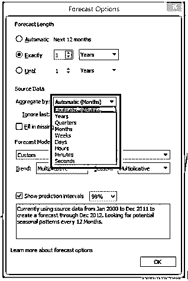

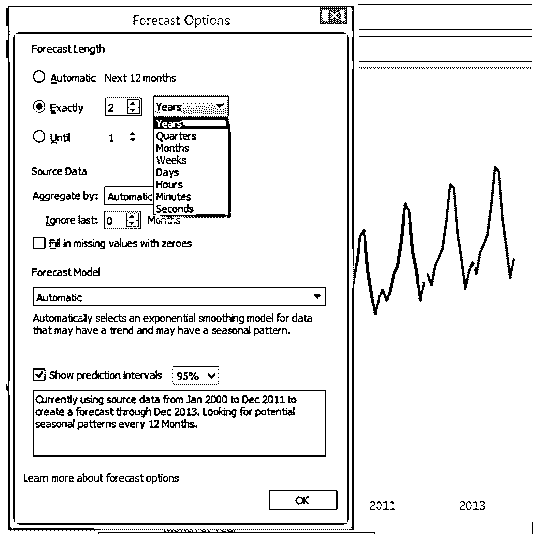

如上面的屏幕截图所示，在“精确”中选择 2 会生成未来两年的预测。还有，描述也变了。请准确地记住，直到我们可以选择从年到秒的任何时间单位的预测长度。

接下来是“预测模型”，在下面的截图中可以看到，它有三个选项，即。自动的，自动的带有季节性和定制性。

*   在自动选项中，Tableau 会根据趋势和季节性因素选择合适的模型
*   在“自动无季节性”选项中，季节性成分被忽略，尽管它可能出现在时间序列中。它可能会给出错误的结果。
*   自定义选项允许用户选择趋势和季节性成分。

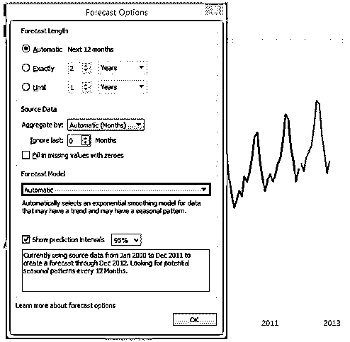

如上所述，当选择自动选项时，我们得到正确的预测

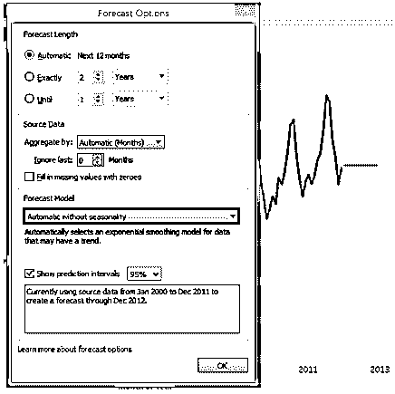

正如上面的截图所示，当我们选择“自动无季节性”选项时，预测出错了。因为季节性因素实际上存在于时间序列中，而我们故意忽略了它。这个选项不适合这种情况。

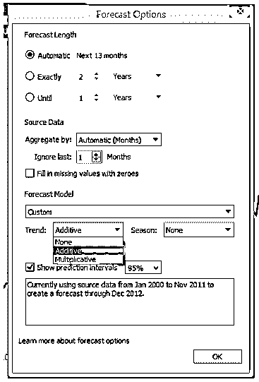

如上所示，自定义选项允许我们指定“趋势”和“季节”选项。在这两种情况下，还有三种选择，即。无、加法和乘法。如果我们看时间序列，我们可以看到它有增加的趋势。此外，随着时间的推移，峰值越来越大，表明季节性成分的幅度在增加。所以，这是一个乘法时间序列，其中各个部分相乘。因此，我们在趋势和季节部分都选择“倍增”。

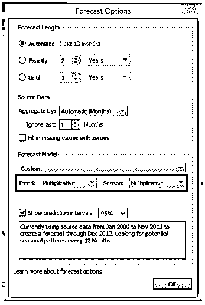

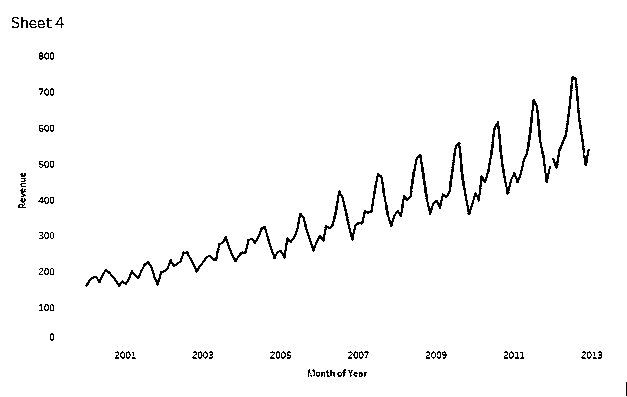

正如我们在上面看到的，这与“预测模型”中的“自动”选项给出的预测非常相似。

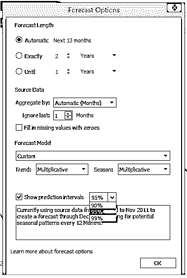

9.上面的截图揭示了预测区间。这意味着我们希望算法以多大的置信度来确定预测值。

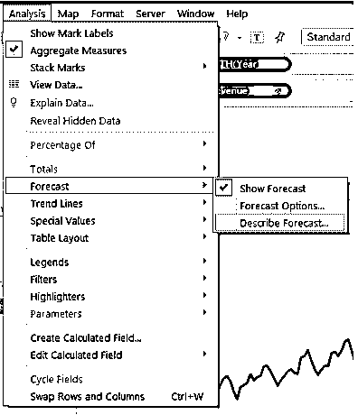

10.生成预测后非常重要的部分是理解结果。如上所示点击“描述预测”。

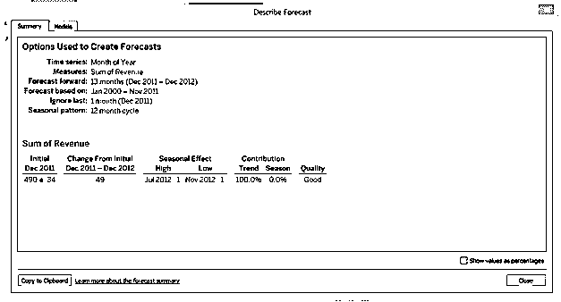

“描述预测”让我们详细了解预测。单击 Summary 选项卡，查看如上所示的预测摘要。总结显示模型质量为“良好”。我们还可以查看百分比形式的摘要，如下所示。

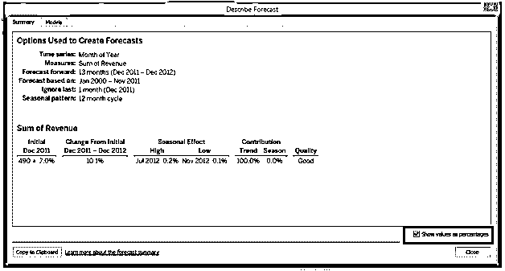

11.  单击“模型”选项卡，它将显示数学模型的各种技术组件。

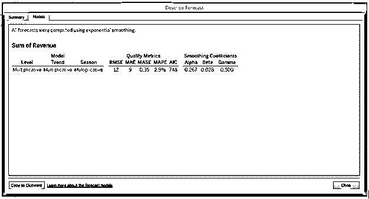

### 结论

时间序列建模预测技术广泛应用于预测分析。预测并不意味着得出精确的值，但它本质上意味着获得可能的精确值。Tableau 采用了一种强大的指数平滑技术，将更大的权重分配给最接近预测时段的值，并计算预测。Tableau 允许我们根据需要更改与预测相关的选项，还提供了结果摘要，如它给出了度量均方根误差、平均绝对误差、平均绝对平方误差、平均绝对百分比误差和 Akaike 信息标准的值，以及平滑系数α、β和γ。

### 推荐文章

这是一个 Tableau 预测指南。在这里，我们将通过一步一步的过程来讨论基本概念，以便使用给定的快照在 Tableau 中创建预测。您也可以阅读以下文章，了解更多信息——

1.  [Tableau 建筑](https://www.educba.com/tableau-architecture/)
2.  [Tableau 替代方案](https://www.educba.com/tableau-alternatives/)
3.  [表格中的过滤器](https://www.educba.com/filters-in-tableau/)
4.  [如何安装 Tableau](https://www.educba.com/install-tableau/)

