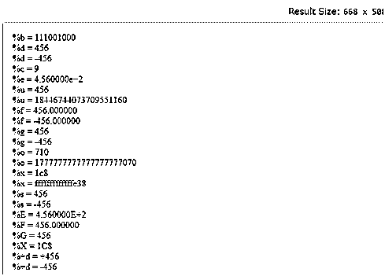

# PHP 中的 sprintf

> 原文：<https://www.educba.com/sprintf-in-php/>

## PHP 中的 sprintf 简介

php 中的 sprintf 是一个用于将格式化字符串写入变量并返回格式化字符串的函数。在 PHP 中，版本 4 及以上支持这个 sprintf 函数。sprintf()函数类似于 printf()函数，但是两者之间主要且唯一的区别是 sprintf()将输出保存为字符串，而不是像 printf()函数那样在浏览器上显示格式化的输出。sprintf()函数可以使用 echo，即 sprintf()返回的格式化字符串使用 echo 打印在浏览器上。让我们更深入地挖掘这个主题，看看它的语法、可访问的格式，并解决一些程序。

**语法:**

<small>网页开发、编程语言、软件测试&其他</small>

下面是 PHP 中 sprintf()函数的语法。

`sprintf(format, arg1, arg2, arg3, …….)`

这里是 arg1，arg2，arg3 等。，是 sprintf()的参数。arg1 是必需的参数，要在第一个。arg2、arg3、………是要插入的可选参数。

Format:它是必需的参数，指定如何格式化变量的字符串。

以下是可能的格式:

| **参数** | **描述** |
| %b | 以二进制数表示的参数 |
| %% | 返回%符号 |
| %d | 参数被视为正整数，表示为十进制数 |
| %c | 参数被视为整数，用 ASCII 字符表示 |
| %e | 指定小数点后位数的精度说明符。小写科学记数法 |
| %u | 参数被视为整数，表示为无符号整数 |
| %f | 浮点数(区域设置) |
| %g | 通用格式 |
| %o | 用八进制数表示 |
| %x | 用小写字母表示的十六进制数 |
| %s | 参数以字符串形式呈现和处理 |
| %E | 类似于%e 说明符，但大写。 |
| %F | 浮点数(非区域设置) |
| %G | 类似于%g 说明符，但使用%E 和%F |
| %X | 用十六进制数表示，但用大写字母表示 |

还有一些附加的格式值，它们位于%和字母之间。

*   +、+和–都强制放在数字前面。默认情况下，负数被标记。
*   指定要用作填充的内容。
*   –左对齐变量
*   [0-9]指定变量的最小宽度。
*   .[0-9]指定小数位数或最大字符串长度。

### PHP 中的 sprintf()函数是如何工作的？

让我们通过几个例子来看看 PHP 中的 sprintf()函数是如何工作的，

#### 示例 PHP 中的 sprintf()函数

`<!DOCTYPE html>
<html>
<body>
<?php
$num1 = 321234;
$num2 = 860;
$text = sprintf("%f,%f",$num1, $num2);
echo $text;
?>
</body>
</html>`

**输出:**

这里，我们取了两个浮点值，使用 sprintf()函数扫描了变量，并使用 echo 将浮点值打印在控制台上。

#### 例 PHP 中的 sprintf()函数，用于浮点小数

`<!DOCTYPE html>
<html>
<body>
<?php
$num1 = 4563;
$text = sprintf("With 3 decimals: %1\$.3f
 With no decimals: %1\$u  With single decimal: %1\$.1f",$num1);
echo $text;
?>
</body>
</html>`

**输出:**

因此，对于浮点值，我们指定了无小数、单个小数或 3 个小数。

#### 示例 PHP 中的 sprintf()函数，带有字符串说明符

`<!DOCTYPE html>
<html>
<body>
<?php
$string1 = 'PHPv4';
echo sprintf("[%s]",$string1)." ";
echo sprintf("[%08s]",$string1)." ";
echo sprintf("[%-8s]",$string1)." ";
echo sprintf("[%8s]",$string1)." ";
echo sprintf("[%8.8s]",$string1)." ";
echo sprintf("[%'*8s]",$string1)." ";
?>
</body>
</html>`

**输出:**

因此，根据输出，[%s]将按原样返回字符串

[%08s] will return string with zero padding [%-8s] will return string with left justification [%8s] will return string with the right justification [%8.8s] will return string with left justification, cuts of characters after a specific value [%’*8s] will return string with additional *

#### 示例 PHP 中的 sprintf()函数，带有参数交换

`<!DOCTYPE html>
<html>
<body>
<?php
$num = 7;
$fruits = 'Mangoes';
$arg1 = 'The %2$s are %1$d in number';
echo sprintf($arg1, $num, $fruits);
?>
</body>
</html>`

**输出:**

所以在这里，格式字符串支持参数交换/编号。
想象一下，如果格式字符串中的占位符与如上所示的参数顺序不匹配。因此，我们已经指出 arg1 哪个参数引用哪个占位符。

#### 例 PHP 中的 sprintf()函数，用于所有格式说明符

`<!DOCTYPE html>
<html>
<body>
<?php
$arg1 = 456;
$arg2 = -456;
$str = 57;
echo sprintf("%%b = %b",$arg1)." ";
echo sprintf("%%d = %d",$arg1)." ";
echo sprintf("%%d = %d",$arg2)." ";
echo sprintf("%%c = %c",$str)." ";
echo sprintf("%%e = %e",$arg1)." ";
echo sprintf("%%u = %u",$arg1)." ";
echo sprintf("%%u = %u",$arg2)." ";
echo sprintf("%%f = %f",$arg1)." ";
echo sprintf("%%f = %f",$arg2)." ";
echo sprintf("%%g = %g",$arg1)." ";
echo sprintf("%%g = %g",$arg2)." ";
echo sprintf("%%o = %o",$arg1)." ";
echo sprintf("%%o = %o",$arg2)." ";
echo sprintf("%%x = %x",$arg1)." ";
echo sprintf("%%x = %x",$arg2)." ";
echo sprintf("%%s = %s",$arg1)." ";
echo sprintf("%%s = %s",$arg2)." ";
echo sprintf("%%E = %E",$arg1)." ";
echo sprintf("%%F = %F",$arg1)." ";
echo sprintf("%%G = %G",$arg1)." ";
echo sprintf("%%X = %X",$arg1)." ";
echo sprintf("%%+d = %+d",$arg1)." ";
echo sprintf("%%+d = %+d",$arg2)." ";
?>
</body>
</html>`

**输出:**

这里我们展示了所有的格式说明符。

至此，我们将结束“php 中的 sprintf”这个主题。我们已经看到了 PHP 中 sprintf()函数的语法。我们已经了解了每个格式说明符的含义，并举例说明了如何在 PHP 中使用 sprintf。上面的例子将清楚地理解所有的格式说明符。

### 推荐文章

这是 PHP 中的 sprintf 指南。这里我们讨论一下 PHP 中的 sprintf()函数的简介、语法、工作原理？代码实现示例。您也可以看看以下文章，了解更多信息–

1.  [PHP 打开文件](https://www.educba.com/php-open-file/)
2.  [PHP 表单生成器](https://www.educba.com/php-form-builder/)
3.  [PHP 列表](https://www.educba.com/php-list/)
4.  [PHP 对象注入](https://www.educba.com/php-object-injection/)

