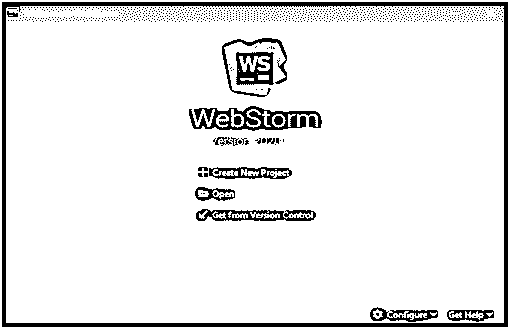
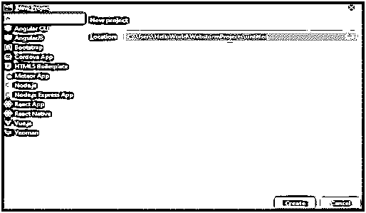
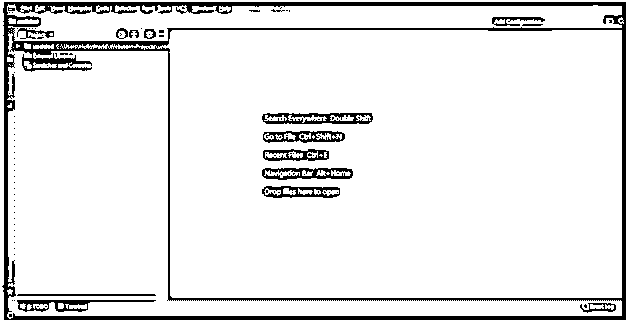
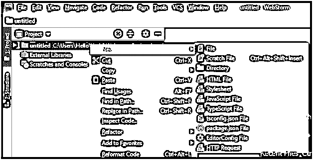
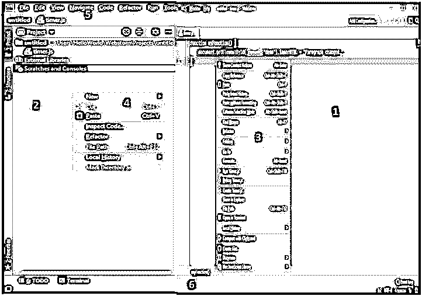

# 网络风暴集成开发环境

> 原文：<https://www.educba.com/webstorm-ide/>

## WebStorm IDE 简介

WebStorm IDE 顾名思义是 Jet Brains 为开发者开发的软件编辑器工具。它是 web、移动、服务器以及桌面应用程序开发的最智能的 JavaScript 编辑器。我们可以开发客户端应用程序，也可以开发服务器端应用程序。前端开发支持 Angular、React 或 Vue.js，服务器端或后端开发支持 Node.js、MeteorIonic、Cordova 和 React Native 用于移动开发，Electron 用于桌面应用程序开发。WebStorm IDE 的最新版本是 WebStorm 2020.1，具有全新的外观。它建立在名为 Intellij 的开源平台之上。

### WebStorm IDE 是如何工作的？

当我们在初始配置后第一次打开 WebStorm 时，我们会看到下面的屏幕:

<small>网页开发、编程语言、软件测试&其他</small>

从这里，我们可以创建一个新的项目，或者打开一个现有的项目，或者从版本控制中签出这个项目，比如 Github，SVN，或者任何其他的 VCS。

让我们创建一个空的新项目，然后它会询问项目位置，采用默认值并单击 create:-

我们得到下面的屏幕，并开始我们的项目工作:

让我们在项目中创建新文件。在项目工具窗口中选择要在其中创建新文件的文件夹，右键单击并选择如下所示的新建或按 alt+insert。

创建了一个名为 timer.js 的文件来理解更多的功能，比如代码完成。

**解释:**在上面的例子中，只需输入‘cla’就会弹出代码完成选项，或者我们可以按 Ctrl+Space 来获得代码完成选项。

让我们探索一下 WebStorm 的用户界面:

1.  编辑器:我们写代码的地方。我们可以使用无干扰模式来隐藏所有工具栏和工具窗口，这样我们就可以专注于编写代码，我们也可以使用 Ctrl+Shift+F12 快捷键。
2.  **项目工具窗口:**有项目、版本控制、调试等多个工具窗口。我们可以使用快捷方式隐藏或取消隐藏工具窗口。
3.  **弹出窗口:**用于快速搜索或导航至特定项目。
4.  **上下文菜单:**用于新建文件、重构代码、检查本地历史等。
5.  **导航栏:**它是项目工具窗口的替代选项，可以在文件夹之间移动并查看其内容。
6.  **状态栏:**显示我们项目的状态，代码等。与其他应用程序相同。

### WebStorm IDE 功能

以下是 WebStorm IDE 的功能:

#### 1.智能编码辅助

当我们键入时，它为所有支持的语言提供了最好的代码完成结果。在使用 CSS 时，我们获得了属性及其值的代码完成。它还有许多内置的检查，只要我们一输入就报告所有的错误和警告，并建议所有可用的快速修复选项。如果任何一行代码有问题，我们可以很容易地通过右边的编辑器栏识别日志文件中的错误和警告，因为它被标记在右边的编辑器栏中。

WebStorm IDE 支持所有现代框架，如 Node.js、React、Angular、Vue.js、Meteor 等，并为这些框架提供高级编码帮助。

我们可以在。editorconfig 项目文件和 WebStorm 会在我们键入代码时自动应用配置的代码样式，或者通过一次重新格式化整个文件来提供一致的代码样式。

Webstorm 具有强大的导航和搜索功能。我们可以使用编辑器的结构视图轻松浏览打开的文件，在处理大型项目时可以节省大量时间。我们可以使用 Search Everywhere 对话框在整个项目中搜索任何内容，如文件、类名或符号。我们可以使用 Ctrl+Click 来了解代码中任何方法、函数或变量的定义。

#### 2.调试、跟踪和测试

WebStorm 在 ide 本身中内置了一个高级调试器，用于与 Google Chrome 配合使用的客户端代码，这有助于在 IDE 中调试代码，而无需在编辑器和浏览器之间来回切换进行调试。这也节省了我们的时间。我们还可以使用 Node.js 的 box 全功能内置调试器来调试本地或远程机器上运行的应用程序。

我们可以使用 spy-js 内置工具来跟踪客户端 JavaScript 和 Node.js 代码，并识别任何可能的问题。它还提供了一个很好的项目结构的可视化或图表，允许我们可视化项目文件如何与函数调用相连接。

WebStorm 集成了 JavaScript 测试框架，有助于轻松执行单元测试。我们可以选择 Karma 或 Jest 来测试我们的客户端 JavaScript 代码，或者选择 Mocha 来测试 Node.js。

#### 3.无缝工具集成

WebStorm 可以与著名的任务运行器、测试框架和用于 web 开发的包管理器集成，所有这些都来自统一的 UI。我们可以使用首选项来访问已安装的本地 npm 和浏览器依赖项的完整列表，或者安装和更新 npm 模块和浏览器依赖项。我们可以将 WebStorm 与 PhoneGap、Cordova 和 Ionic 框架集成，并开始从 IDE 本身创建、模拟和部署移动应用程序。WebStorm 有一个内置的编译器，有助于快速轻松地将我们的类型脚本代码编译成 JavaScript。

#### 4.用户化

我们可以根据自己的选择定制 WebStorm IDE，或者以完全适合我们编码风格的方式进行调整。它有明暗模式，我们也可以改变颜色模式或搜索可用的主题来使用。我们可以自定义工具窗口、编辑器样式、快捷方式、视觉主题等。它跟踪对我们的源文件所做的更改，即使是由任何其他应用程序所做的更改，也可以保护我们免受任何意外的丢失或修改。

### WebStorm IDE 的优势

1.  我们不必浪费时间搜索和安装多个插件，因为它带有各种内置的开发工具和开箱即用的语言和框架支持。
2.  由于统一的用户界面，我们不必在终端和文本编辑器之间切换，这有助于我们提高工作效率。
3.  它可以集成几乎所有可用的 VCS，例如，Git、Github、Mercurial 等。我们可以使用 IDE 中提供的可视化 diff/merge 工具来提交文件、检查更改和解决冲突。
4.  我们可以简单地启用 JSCS，一个用于 JavaScript 的代码样式检查器，来检查是否符合项目代码，比如缩进、关键字后的空格等等。
5.  它还具有实时编辑功能，无论我们在 HTML 和 CSS 文件中做了什么更改，都可以立即更新浏览器内容，而无需重新加载。目前只有谷歌 Chrome 支持它。

### 结论

WebStorm IDE 有许多很酷的功能，用户体验非常好。它有一个统一的用户界面，所以我们可以从一个窗口完成几乎所有的编码、调试和运行任务。它提供快速导航。我们可以下载并享受 30 天的免费试用。你会成为它的粉丝。

### 推荐文章

这是一个 WebStorm IDE 的指南。在这里，我们讨论 WebStorm IDE 的介绍以及它的工作原理和优点。我们还学习了具有出色用户体验的顶级功能。您也可以浏览我们推荐的其他文章，了解更多信息——

1.  [Python](https://www.educba.com/python-features/)的 15 大特色
2.  [什么是 Linux？](https://www.educba.com/what-is-linux/)
3.  [Python 的优势](https://www.educba.com/advantages-of-python/)
4.  [t 帧间帧](https://www.educba.com/tkinter-frame/)

