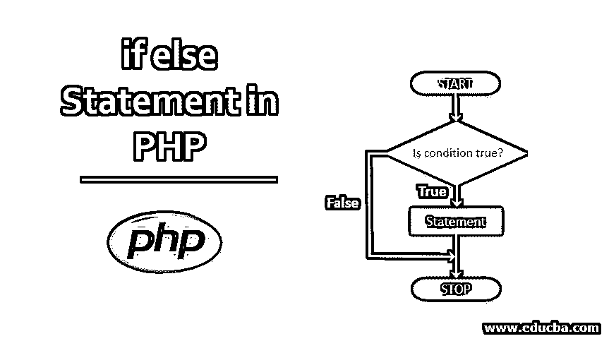
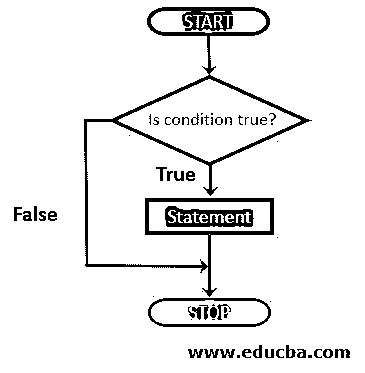
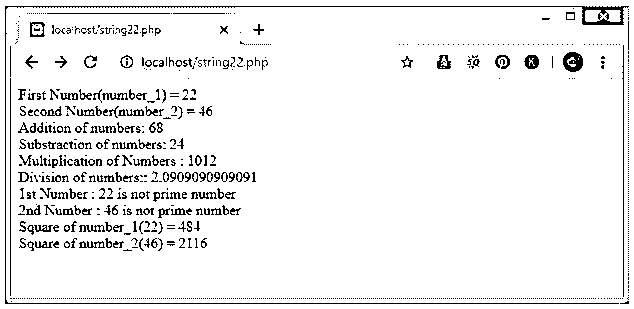

# PHP 中的 if else 语句

> 原文：<https://www.educba.com/if-else-statement-in-php/>




## PHP 中 if else 语句简介

以下文章概述了 PHP 中的 if else 语句。If else 是基本的条件语句，通常用于根据一些不同的条件执行不同类型的操作。当我们编写任何程序/代码时，我们必须做出决定(条件)来执行某些类型的任务。所以我们需要条件语句(if，else 等..，)使用代码完成我们的任务。“if”条件/语句将使代码仅在条件为真时运行，而“else”是仅在“If”条件为假时运行的条件。

**语法:**

<small>网页开发、编程语言、软件测试&其他</small>

```
if(condition statement){
Programming code statements to run only if the IF condition is TRUE
}
if(condition statement){
Another code to be executed with an extra IF condition. (Multiple iF statements can be ignored to if we don’t want)
}
else{
Code Here will run only if the IF condition becomes FALSE
}
```

**流程图**




### if else 语句在 PHP 中如何工作？

*   **if:** If 函数在函数内部的条件为真时工作，否则编译器会转到 else 条件 if extra，如果条件一开始不在那里。
*   **else:** Else 函数在 PHP/其他任何编程语言的程序/代码中 if、Extra if 条件失效的情况下大多起作用。

### PHP 中 if else 语句的例子

下面是 PHP 中 if else 语句的例子:

#### 示例#1

这是一个基本的 PHP 程序，它使用一个 if 和 else 条件，通过比较两个变量的值来判断存储在 number_one 和 number_two 变量中的数字哪个更大。

**语法:**

```
<?php
$number_one = 17;
$number_two = 51;
if ($number_one > $number_two){
echo "$number_one is greater than $number_two";
}else{
echo "$number_two is greater than $number_one";
}
?>
```

**输出:**


#### 实施例 2

这是下面列出的基本 PHP 代码，用来知道今天是星期六还是星期天。日期(“d”)将具有今天/当前日期的值。它将存储在 s 变量中。通过使用“s”变量值的条件，代码将提供输出。如果今天是星期六，代码将显示为“这是星期六..周末愉快，兄弟！!"像这样，如果今天是星期天，代码将打印为“周末愉快！现在我们是在星期天！!< 3”，否则它将打印“这不是周末。现在就去上班..”

**语法:**

```
<?php
$s = date("D");
if($s == "Sat"){
echo "This is Saturday..Have a nice weekend Bro!!";
}
if($s == "Sun"){
echo "Have a Happy Weekend! Now We are in Sunday!! <3 ";
}
else{
echo "This is not Weekend. Go to the work Now..";
}
?>
```

**输出:**


#### 示例 **#3**

这是一个 PHP 程序，如果年龄小于 18 岁，使用 If 条件语句打印“这个人现在是孩子”，或者打印“这个人现在是成年人”。

**语法:**

```
<?php
$age1 = 22;
if($age1 < 18){
echo 'The Person is now Child';
} else{
echo 'The Person is now Adult';
}
?>
```

**输出:**


#### 示例 **#4**

这是一个 PHP 程序，用于打印指定的两个数字的加法、减法(通过比较 number_1、number_2 变量的值，从大数字减去小数字)、乘法、除法(将大数字除以小数字——这是通过比较 number_2、number_1 变量的值获得的),并检查 number_1、number_2 变量的值是否是质数，然后还打印 number_1、number_2 变量的值的平方值。您可以随意更改这些数字，也可以根据需要使用 HTML 通过输入验证表单从用户/客户那里获得输入。

**语法:**

```
<?php
$number_1 = 22;
$number_2 = 46;
echo "First Number(number_1) = $number_1";
echo "<br/>";
echo "Second Number(number_2) = $number_2";
echo "<br/>";
echo "Addition of numbers: ";
echo $number_1 + $number_2;
echo "<br/>";
echo "Substraction of numbers: ";
if($number_1>$number_2){
echo $number_1 - $number_2 ;}
else{
echo $number_2 - $number_1;
}
echo "<br/>";
echo "Multiplication of Numbers : ";
echo $number_1*$number_2;
echo "<br/>";
echo "Division of numbers:: ";
if($number_1>$number_2){
echo $number_1/$number_2 ;}
else{
echo $number_2/$number_1;
}
echo "<br/>";
if($number_1%2==0){
if($number_1%3==0){
if($number_1%5==0){
if($number_1%7==0){
echo "1st Number : $number_1 is not prime number";
}
echo "1st Number : $number_1 is not prime number";
}
echo "1st Number : $number_1 is not prime number";
}
echo "1st Number : $number_1 is not prime number";
}
else{
echo "1st Number : $number_1 is a prime number";
}
echo "<br/>";
if($number_2%2==0){
if($number_2%3==0){
if($number_2%5==0){
if($number_2%7==0){
echo "2nd Number : $number_2 is not prime number";
}
echo "2nd Number : $number_2 is not prime number";
}
echo "2nd Number : $number_2 is not prime number";
}
echo "2nd Number : $number_2 is not prime number";
}
else{
echo "2nd Number : $number_2 is a prime number";
}
echo "<br/>";
echo "Square of number_1($number_1) = ";
echo pow($number_1,2);
echo "<br/>";
echo "Square of number_2($number_2) = ";
echo pow($number_2,2);
echo "<br/>";
?>
```

**输出:**




#### 示例 **#5**

这是一个 PHP 编程代码，它使用 3 个条件语句，对 speed1 变量使用不同的速度值，来检查一个人是否以哪种模式旅行。如果变量的数值小于 60，则将打印“您现在处于安全驾驶模式”,或者如果速度 1 变量在 60 和 100 之间，则将打印“您处于为车辆燃烧额外燃油的模式”,否则将打印“您处于危险模式:可能会发生事故，请小心”。这是一个 PHP 示例程序，使用 speed1 变量值来说明速度模式。人们可以通过连接 GPS 值来自动化这个简单的程序，并在 PHP/任何其他编程语言中检查模式的变化。

**语法:**

```
<?php
$speed1 = 110;
if($speed1 < 60)
{
echo "You are now in a safe driving mode";
}
if($speed1 > 60 && $speed1 < 100)
{
echo "You are in the mode of burning extra fuel for your vehicle";
}
else
{
echo "You are in the dangerous mode : Accidents may occur please be careful";
}
?>
```

**输出:**


### 推荐文章

这是 PHP 中 if else 语句的指南。这里我们讨论语法，if else 语句如何在 PHP 中工作？还有例子。您也可以看看以下文章，了解更多信息–

1.  [PHP 中的登录页面](https://www.educba.com/login-page-in-php/)
2.  [c++中的控制语句](https://www.educba.com/control-statement-in-c-plus-plus/)
3.  [PHP 文件处理](https://www.educba.com/php-file-handling/)
4.  [JavaScript 中的 Switch 语句](https://www.educba.com/switch-statement-in-javascript/)


