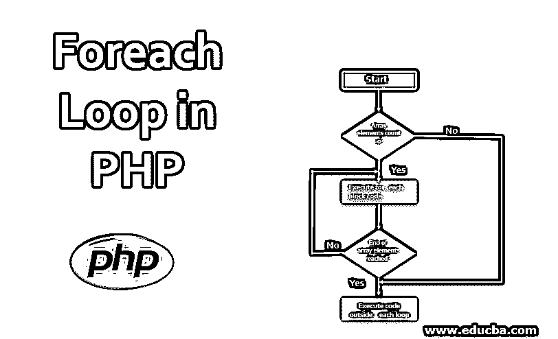
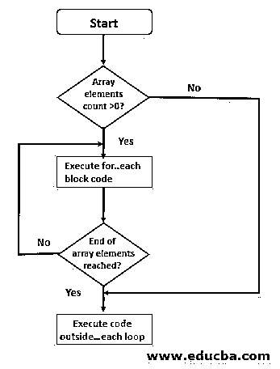
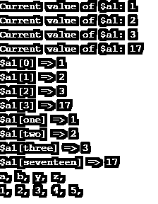
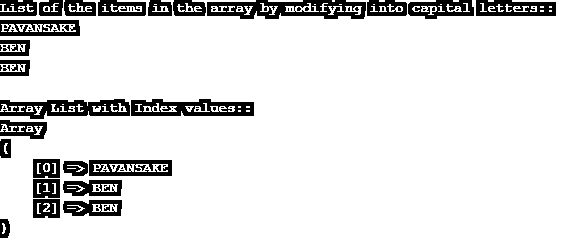

# PHP 中的 Foreach 循环

> 原文：<https://www.educba.com/foreach-loop-in-php/>




## PHP 中 Foreach 循环介绍

Foreach 循环是提供简单入口的最佳方式之一，以便迭代程序中列出的数组。只有当对象和数组存在时，它才起作用。当将 Foreach 循环/构造用于变量和不同的数据类型/未初始化的变量/变量时，它将发出错误。PHP 中有两种表达 foreach 循环的方式。下面是 PHP 中 foreach 循环的不同语法用法。Foreach 循环只适用于 PHP7，PHP5，PHP4 版本。

**语法:**

<small>网页开发、编程语言、软件测试&其他</small>

```
foreach(array as $value)
Statement/statements
foreach(array as $key => $value)
Statement/statements
```

循环中当前元素的上述语法值中的第一个 form 循环将被赋给$value 变量，并且内部指针也向前移动一位。上述语法中的第二个形式循环将把当前值分配给当前键，即，当前元素键被分配给$key 变量，并且关于该当前值，将在每次迭代中被分配给$value 变量。

**流程图**

以下是用 PHP 流程图表示的 foreach 循环:




### Foreach 循环在 PHP 中是如何工作的？

Foreach 通过遍历数组的值来工作。数组中的每个元素/项目都将根据需要存储在$ value/任何其他变量中。Foreach 还根据需要使用键和值元素进行调用。在 foreach 中，数组的指针前进 1，以便它将转到数组中的下一个元素。

### 在 PHP 中实现 Foreach 循环的示例

以下是在 PHP 中实现 foreach 循环的一些示例:

#### 示例#1

这是 foreach 的第一个示例，它使用 foreach 函数在程序中打印数组中的元素/项目列表。具有数组元素的 Array1 将被赋给 value1 变量，这样 value1 变量的当前值将通过与数字“2”相乘而成为 array1 的当前元素。

**代码:**

```
<?php
$array1 = array(1, 2, 3, 4, 6, 22, 32, 12, 11, 14, 16, 17, 18, 19, 28);
foreach ($array1 as $value1) {
$value1 = $value1 * 2;
echo $value1.", ";
}
?>
```

**输出:**


#### 实施例 2

这是通过使用 foreach 的迭代将 array1 值一次传递给 value1 来打印 array1 元素的程序。在第一个 foreach 中，当前元素乘以 2，但没有给出任何输出。在循环之后，新的 foreach 循环再次声明绕过$key1 的键值和$value1 的值，以及我们通过使用 foreach 的迭代过程赋予 key1，value1 变量的每个元素。然后，输出将显示数组的索引值和存储在数组特定索引中的实际值。

**代码:**

```
<?php
$array1 = array(11, 14, 16, 17);
foreach ($array1 as $value1) {
$value1 = $value1 * 2;
}
foreach ($array1 as $key1 => $value1) {
echo "{$key1} => {$value1} - ";
print_r($array1);
}
?>
```

**输出:**


#### 实施例 3

这是一个打印实际数组元素和数组元素的程序，数组元素是数组唯一值的 2 的倍数。这里，数组直接在 foreach()函数内部传递，然后数组值通过 foreach 的迭代直接传递给 value1 变量。

**代码:**

```
<?php
echo "Actual Array List Items :\n";
foreach (array(1, 2, 3, 4, 5, 6,7) as $value1) {
echo $value1.", ";
}
echo "\nModified Array List numbers/Items: \n";
foreach (array(1, 2, 3, 4, 5, 6,7) as $value1) {
$value2 = $value1 * 2;
echo $value2.", ";
}
?>
```

**输出:**


#### 实施例 4

这是 PHP 的 foreach 循环的小例子。这里我们可以看到不同类型的 foreach 循环，用不同类型的声明来说明数组的元素。第一个 foreach 是通过列出 v1 变量的数组元素/值来声明的，方法是从 a1 变量传递到 foreach 的迭代。第二个 foreach 将打印带有数组索引值的数组的元素/值。程序中的第三个 foreach 就像上面的键和值格式一样。第四个程序中的每一个都是用 PHP 的 foreach 函数来说明多维数组。程序中的第五个 foreach 是[打印动态数组值](https://www.educba.com/dynamic-array-in-java/)。所有这些程序的输出详细显示在下面的输出图像中。

**代码:**

```
<?php
/* foreach example with the value/values only */
$a1 = array(1, 2, 3, 17);
foreach ($a1 as $v1) {
echo "Current value of \$a1: $v1\n";
}
/* Small example of value (with the manual access notation which is printed for the illustration) */
$a1 = array(1, 2, 3, 17);
$i1 = 0;
foreach ($a1 as $v1) {
echo "\$a1[$i1] => $v1 \n";
$i1++;
}
/* key and value listing foreach example*/
$a1 = array(
"one" => 1,
"two" => 2,
"three" => 3,
"seventeen" => 17
);
foreach ($a1 as $k1 => $v1) {
echo "\$a1[$k1] => $v1 \n";
}
/* multi-dimensional arrays example with foreach function*/
$a1 = array();
$a1[0][0] = "a";
$a1[0][1] = "b";
$a1[1][0] = "y";
$a1[1][1] = "z";
foreach ($a1 as $v2) {
foreach ($v2 as $v3) {
echo "$v3, ";
}
}
echo "\n";
/* Small example of dynamic arrays with foreach function*/
foreach (array(1, 2, 3, 4, 5) as $v1) {
echo "$v1, ";
}
?>
```

**输出:**




#### 实施例 5

这是一个检查列表中的数字 3 的程序，如果发现数字 3，它将打印一些文本，如下所述，然后循环将被打破。

**代码:**

```
<?php
$array2 = array( 'one', 'three', 'two', 'four', 'five' );
foreach( $array2 as $value2 ){
if( $value2 == 'three' ){
echo "Number three found in the second item of array!";
break;
}
}
?>
```

**输出:**


#### 实施例 6

这是 foreach 利用数组中列出的字符/字符串，然后使用 foreach 循环迭代方法打印它们的示例。

**代码:**

```
<?php
$a = array('pavansake','ben','tony');
foreach ($a as $k=>&$n)
$n = strtoupper($n);
echo "List of the items in the array by modifying into capital letters:: \n";
foreach ($a as $k=>$n)
echo "$n\n";
echo "\n";
echo "Array List with Index values:: \n";
print_r($a);
?>
```

**输出:**




### 推荐文章

这是一个 PHP 中 Foreach 循环的指南。在这里，我们讨论语法，流程图，并与例子和代码实现一起工作。您也可以浏览我们推荐的文章，了解更多信息——

1.  [PHP 中的登录页面](https://www.educba.com/login-page-in-php/)
2.  [在 PHP 中继续](https://www.educba.com/continue-in-php/)
3.  [在 PHP 中验证](https://www.educba.com/validation-in-php/)
4.  PHP 中的多态性


