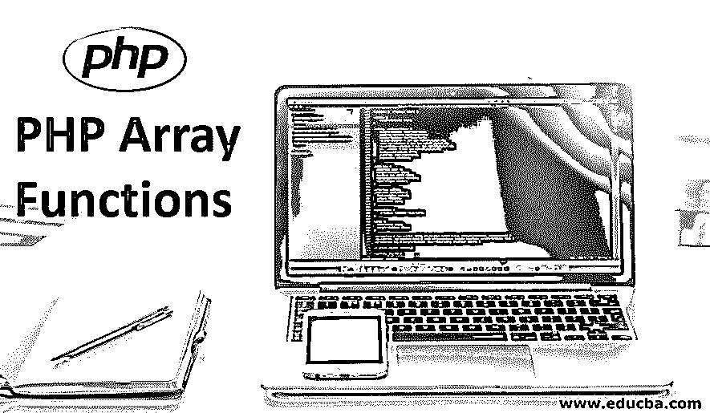

# PHP 数组函数

> 原文：<https://www.educba.com/php-array-functions/>




## PHP 数组函数介绍

PHP 数组函数(超文本预处理器的缩写)是一种广泛使用的通用脚本语言；它对 HTML 和 web 开发的兼容性使它的关键技术变得容易理解。PHP 中的数组是指一种可以在单个

它可以很容易地嵌入到 HTML 中，让我们用它来见证——

<small>网页开发、编程语言、软件测试&其他</small>

```
<!DOCTYPE html>
<html>
<head>
<title>……………</title>
</head>
<body>
<?php
echo  “Hello, I am a PHP !”;
?>
</body>
</html>
```

上面的脚本文件非常清楚地证明了 PHP 脚本与 HTML 的兼容性有多好。PHP 代码包含一个特殊的开始和结束括号。

### 如何在 PHP 中创建数组？

**阵列()**

下面我们列出了阵列的工作原理

```
$color = array(“red”, “green”, “blue”);
```

**输出**
$color[0] = "红色"
$color[1] = "绿色"
$color[2] = "蓝色"

这里的目的是将颜色名称存储在一个单独的颜色变量中。所以我们在数组函数中有一个颜色变量，在这个函数中，我们用字符串格式把所有的颜色都一一命名了。

### PHP 数组函数

有 3 种不同类型的阵列:

*   数字数组
*   [关联数组](https://www.educba.com/associative-array-in-java/)
*   多维数组

这三个解释如下:

#### 1.数字数组

数字数组是那些具有数字索引数组。让我们看看数字数组的语法——有两种类型的语法。

**第一种方式:**

```
$array_name[0] = value;
```

**第二种方式:**

```
$array_name[] = value;
```

**Note: **Here zero in square brackets [0] represents the index number.

值意味着用户希望在数组中存储什么。

第一个和第二个语法有些不同，一个在[]中有零，而另一个有空白[]。

默认情况下，所有数组都从索引 0 开始，这意味着对于第一个数组，如果我们在[]中输入 0 或将其留空[]，这两个意思是相同的。请再看一个例子，以便更好地理解不同之处

```
$array_name[] = value;  {either you put 0 or leave it blank – both means same}
$array_name [1] = value;
```

下面列出了具有不同值和不同索引的数组

```
$name[0] = “Alex”;
$name[1] = “Peter”;
$name[2] = “Lucy”
```

#### 2.关联数组

关联数组是以字符串作为索引的数组。存储的值与键值相关联地执行，而不是线性索引。

让我们看看关联数组的语法。

```
$array_name[“key”] = value;
```

**Note: **Call it as the key or call it as the index (both has the same meaning).

当你必须在你的值和键(或索引)之间创建一个关系时，使用[关联数组](https://www.educba.com/associative-array-in-javascript/)。

#### 3.多维数组

多维数组包含一个或多个数组以及数组中的值。这些数组通过多个索引来访问。

在单一定义中，我们可以把多维称为数组的数组。多维数组可以是 1D(一维)、2D(二维)……n 维。

| 亚历克斯 | 英格兰 | Twenty-three |
| 彼得（男子名） | 德国 | Twenty-six |
| 露西 | 荷兰 | Twenty-seven |

因此，如果我们在 2D 开店，分配如下

| 亚历克斯[0][0] | 英格兰[0][1] | 23[0][2] |
| 彼得，彼得 | 德国[1][1] | 26[1][2] |
| 露西 | 荷兰[2][1] | 27[2][2] |

这同样适用于“n”个维度和分配。

### 数组函数类型的例子

让我们借助一个示例来看看数组的类型:

#### 1.数字数组

**代码:**

```
<html>
<body>
<?php
$numbers[] = "eleven";
$numbers[] = "twelve";
$numbers[] = "thirteen";
$numbers[] = "fourteen";
$numbers[] = "fifteen";
foreach( $numbers as $value ) {
echo "Value is $value <br />";
}
?>
</body>
</html>
```

**输出:**

值十一
值十二
值十三
值十四
值十五

#### 2.关联数组

**代码:**

```
<html>
<body>
<?php
$salaries['Alex'] = "high";
$salaries['Peter'] = "medium";
$salaries['Lucy'] = "low";
echo "Salary of Alex is ". $salaries['Alex'] . "<br />";
echo "Salary of Peter is ". $salaries['Peter']. "<br />";
echo "Salary of Lucy is ". $salaries['Lucy']. "<br />";
?>
</body>
</html>
```

**输出:**

亚历克斯的工资高，彼得的工资中等，露西的工资低

#### 3.多维数组

**代码:**

```
<!DOCTYPE html>
<html lang="en">
<head>
<title>PHP Multidimensional Array</title>
</head>
<body>
<?php
// Define nested array
$contacts = array(
array(
"name" => "Petergomes",
"email" => "petergomes@mail.com",
),
array(
"name" => "Clark anthony",
"email" => "clarkanthony@mail.com",
),
array(
"name" => "lucy disilva",
"email" => "lucydisilva@mail.com",
)
);
// Access nested value
echo "Peter gomes's Email-id is: " . $contacts[0]["email"];
?>
</body>
</html>
```

**输出:**

彼得·帕克的电子邮件 id 是:[peterparker@mail.com](mailto:peterparker@mail.com)

### 优势

以下是所描述的一些优点。

*   当您打算仅使用单个索引命名来表示属于同一类型的多个数据时。
*   它具有广泛的适用性，因为它可以用来实现其他数据结构，如堆栈、树、队列、图形和链表。
*   2D/3D 阵列用于有效地表示矩阵
*   随着复杂性的消除，它具有更少的编码
*   分类很容易

### 结论

PHP 数组在 PHP 编程中至关重要，它是 PHP 的终极变量。它充当收集元素的存储容器。数组也可以存储其他变量，比如字符串、整数，甚至其他数组。如果你必须处理未知数量的变量，你必须更喜欢使用数组。循环可以用来输出数组中的值，也可以通过简单地调用带有索引或键值的特定元素来实现。

### 推荐文章

这是一个 PHP 数组函数的指南。在这里，我们讨论了 PHP 数组函数的介绍、详细解释、优点以及数组代码和输出。您也可以浏览我们推荐的其他文章，了解更多信息——

1.  [Java 中的 3D 数组](https://www.educba.com/3d-arrays-in-java/)
2.  [Python 中的字符串数组](https://www.educba.com/string-array-in-python/)
3.  [Python 中的 2D 数组](https://www.educba.com/2d-arrays-in-python/)
4.  [PHP 中的变量](https://www.educba.com/variables-in-php/)


