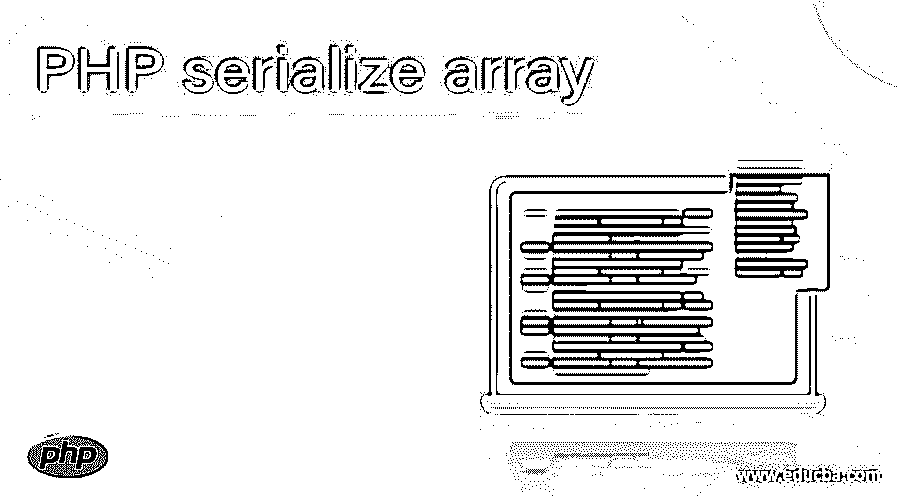

# PHP 序列化数组

> 原文：<https://www.educba.com/php-serialize-array/>

## PHP 序列化数组介绍

PHP serialize array 函数用于序列化给定的数组并转换值的可存储表示。serialize array 函数是 PHP 中的内置函数。数据的串行化意味着将一个值转换成要存储在内存缓冲区、文件中或通过网络传输的位序列。数组是复杂的数据类型；我们不能直接看到它的内容。serialize()函数将一个数组转换成一个简单的字符串，我们可以将它保存在文件中，并通过 URL 等方式在网络上传输。

序列化数组函数的语法–

<small>网页开发、编程语言、软件测试&其他</small>

序列化(数组)；

**参数—**

*   **array–**这不是一个可选参数，它指定要序列化或转换为可存储表示形式的数组或值。
*   **返回值–**这个方法的返回值是一个字符串，它是数组的字节流表示，可以是存储或发送。

### PHP 序列化数组函数的使用

PHP serialize()数组函数接受一个参数作为(array/value)，这是必需的参数。假设我们有一个数组(1，2，3，4)想要存储在文件中，那么首先我们需要通过调用函数 serialize(array)来序列化它，该函数序列化数组并返回数组的字符串转换为“a:4:{ I:0；I:1；I:1；I:2；I:2；I:3；I:3；I:4；} "，我们可以将其存储在文件中或通过网络发送。

### PHP serialize()数组函数的例子

下面举几个例子

#### 示例#1

serialize()数组函数序列化复杂数组的示例

接下来，我们编写 PHP 代码，通过下面的示例更清楚地理解 serialize()数组函数，其中 serialize()函数用于序列化给定的数组，如下所示

**代码:**

`<?php
// create complex array
$array = array( 'text', 200, 400, 'apple', array( 2, 'two', 3, 'three' ) );
// printing complex array
print("The complex array is : ");
print_r( $array );
print( " ");
// serialize the complex array
$array_string = serialize( $array );
// printing the serialize array
print( "The serialize array is : " );
print( $array_string );
print( " ");
// unserializing the serialized array
$unser_array = unserialize( $array_string );
// printing the unserialized array
print_r( $unser_array );
?>`

**输出:**

与上面的代码一样，使用 serialize()函数创建并序列化复杂数组，该函数返回数组的字节流或字符串转换。此外，通过使用 unserialize()函数将序列化的数组转换回数组，这与原始数组相同，正如我们在上面的输出中所看到的。

#### 实施例 2

serialize() array 函数序列化数组并将其存储到文件中的示例

接下来，我们编写 PHP 代码，通过下面的示例更清楚地理解 serialize()数组函数，其中 serialize()函数用于序列化给定的数组，并将其永久存储到文本文件中，如下所示

**代码:**

`<?php
// create an array
$array = array( 'apple', 'banana', 'mango', 'orange', 'cherry' );
// printing complex array
print("The array is : ");
print_r( $array );
print( " ");
// serialize the complex array
$array_string = serialize( $array );
// printing the serialize array
print( "The serialize array is : " );
print( $array_string );
print( " ");
// save the array string to a Ex text file
file_put_contents('Ex.txt', $array_string);
// access back the data from the save text file.
$file_array = file_get_contents('Ex.txt');
// printing the file array
print( "The serialize file array is : " );
print( $file_array );
print( " ");
// unserializing the serialized array
$unser_array = unserialize( $file_array );
// printing the unserialized array
print( "The unserialize file array is : " );
print_r( $unser_array );
print( " ");
?>`

**输出:**

如果我们检查 Ex.txt 文件，内容是

如上面的代码所示，复杂数组被创建并序列化；序列化数组永久存储在文本文件中。此外，通过使用 unserialize()函数，存储的序列化数组被读回并转换为数组，这与原始数组相同，正如我们在上面的输出中所看到的。

#### 实施例 3

serialize()数组函数序列化数组和编码的示例

接下来，我们编写 PHP 代码来理解 serialize()数组函数，其中 serialize()函数用于序列化给定的数组，并将其编码到要跨多个页面发送的 URL 中，如下所示

**代码:**

`<?php
// create an array
$array = array (
1 => "one",
2 => "two",
3 => "three"
);
// printing an array
print("The array is : ");
print_r( $array );
print( " ");
// serialize the complex array
$array_string = serialize( $array );
// printing the serialize array
print( "The serialize array is : " );
print( $array_string );
print( " ");
// encode the array string
$enc_array = urlencode( $array_string );
print( "The encode serialize array is : " );
print( $enc_array );
print( " ");
// deencode the encoded array string
$dec_array = urldecode( $enc_array );
// printing the file array
print( "The deencode serialized array is : " );
print( $dec_array );
print( " ");
?>`

**输出:**

如上面的代码所示，复杂数组被创建并序列化；使用 urlencode()函数对序列化数组进行编码。进一步，通过使用 urldecode()函数将编码的序列化数组解码为数组，这与原始数组相同，正如我们在上面的输出中所看到的。

### 结论

PHP Zip 文件用于以压缩形式存储一堆文件或目录，以后还可以解压缩。

### 推荐文章

这是一个 PHP 序列化数组的指南。这里我们讨论 PHP 序列化数组函数的工作原理和例子，以及代码和输出。您也可以看看以下文章，了解更多信息–

1.  [PHP 堆栈跟踪](https://www.educba.com/php-stack-trace/)
2.  [PHP 通过引用传递](https://www.educba.com/php-pass-by-reference/)
3.  [PHP 梁()](https://www.educba.com/php-strlen/)
4.  [PHP 表单验证](https://www.educba.com/php-form-validation/)

