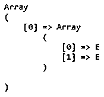
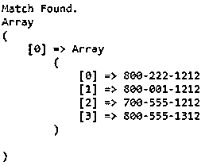
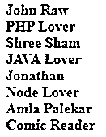

# PHP 孕 _ 匹配 _ 全部

> 原文：<https://www.educba.com/php-preg_match_all/>

## PHP preg_match_all 简介

PHP preg_match_all 是 PHP 编程语言中一个基于搜索的函数。它返回在字符串中找到的匹配项的总数。我们还可以看到，它使用正则表达式模式作为参数来完成搜索过程。这个函数非常有用，因为我们必须从一个给定的字符串中提取电话号码，该字符串还包含一些文本信息。我们可以使用这个内置的 PHP 函数执行各种其他匹配。它将所有匹配作为一个数组输出，因为 preg_match_all 在其名称(后缀)中包含 all。preg_match()是这个函数的单一版本，它只给出一个结果作为输出。

### PHP preg_match_all 语法和参数

PHP preg_match_all 的语法如下所示:

<small>网页开发、编程语言、软件测试&其他</small>

`preg_match_all(regexPattern, inputString, matches, flags, offset)`

**参数:**

*   **regexpartern:**必选参数。这是我们希望在搜索过程中使用的正则表达式本身。
*   **inputString:** 整个操作所依赖的字符串。这是一个必需的参数。
*   **匹配:**可选参数。这将给我们一个包含所有匹配的数组。这意味着输出将存储在该参数变量中。
*   **标志:**再次可选一个。这是所有关于如何搜索结构将被框定。它可以是 PREG_PATTERN_ORDER、PREG_SET_ORDER、PREG_OFFSET_CAPTURE、PREG_UNMATCHED_AS_NULL 等。
*   **偏移:**再次可选。默认值为 0。

**返回类型**

这个函数的返回类型将是匹配发现与否。但同时，我们也可以在函数参数中看到结果的输出数组，以备不时之需。

### preg_match_all 在 PHP 中是如何工作的？

在使用 preg_match_all 之前，我们必须有一个强有力的第一个函数和一个正则表达式模式。初学者通常认为使用正则表达式有点复杂，但事实并非如此。我们还可以得到模式在给定的字符串中是否匹配，以及结果的输出数组。

**preg _ match _ all()**的用户

`$string = "WELCOME TO INDIA"; // string
$patternRex = "/E/i"; // regular expression or the pattern
if(preg_match_all($patternRex, $string, $matches)) {
echo "<pre>";
print_r($matches);
}`

在上面的代码行中，我们正在搜索“E”字符。不区分大小写的正则表达式中使用了“I”。我们将在本文的示例部分探索和查看各种其他示例。

### PHP preg_match_all()的例子

下面是 php preg_match_all 的例子，如下所示:

#### 示例#1

在给定字符串中搜索“E”字符，不考虑该字符串的大小写。

**代码:**

`<?php
$string = "WELCOME TO INDIA."; // string
$patternRex = "/E/i"; // regular expression or the pattern
$matchFound = preg_match_all($patternRex, $string, $matches);
if($matchFound){
echo "<pre>";
print_r($matches);
}
?>`

**输出:**

#### 实施例 2

检查给定字符串中是否存在“E”字符(E 的大写字母)。

**代码:**

`<?php
$string = "Lorem Ipsum is simply dummy text of the printing and typesetting industry."; // string
$patternRex = "/E/"; // regular expression or the pattern
$matchFound = preg_match_all($patternRex, $string, $matches);
if($matchFound){
echo "<pre>";
echo "Match Found.";
print_r($matches);
}else{
echo "No match found.";
}
?>`

**输出:**

“e”字符是存在的，正如我们在上面的示例代码的字符串中看到的，但是大小写与模式中所写的不匹配。没有找到匹配将输出，但如果我们改变模式，以搜索区分大小写，它会给出一些输出。

#### 实施例 3

从给定字符串中提取所有电话号码。

**代码:**

`<?php
$string = "Hi, please call us at  800-222-1212 or 800-001-1212 or 700-555-1212 or 800-555-1312"; // string
$patternRex = "/\b\d{3}\s*-\s*\d{3}\s*-\s*\d{4}\b/"; // regular expression or the pattern
$matchFound = preg_match_all($patternRex, $string, $matches);
if($matchFound){
echo "<pre>";
echo "Match Found. ";
print_r($matches);
}else{
echo "No match found.";
}
?>`

**输出:**

#### 实施例 4

列出各种标签的给定字符串的 HTML **标签元素。**

**代码:**

`<?php
$userinfo = "Name: <b>John Raw</b> Title: <b>PHP Lover</b>
Name: <b>Shree Sham</b> Title: <b>JAVA Lover</b>
Name: <b>Jonathan</b> Title: <b>Node Lover</b>
Name: <b>Amla Palekar </b> Title: <b>Comic Reader</b>";
preg_match_all ("/<b>(.*)<\/b>/U", $userinfo, $matches);
for ($i=0; $i< count($matches[0]); $i++) {
echo  $matches[0][$i]." ";
}
?>`

**输出:**

正如我们在上面的示例代码中看到的，代码提取了所有标签及其值**标签。**通常用于在 HTML 中使字符串加粗。同样，我们可以尝试元素组合的其他元素，以根据我们的业务需求获得期望的结果。****

#### 实施例 5

一个使用 preg_match_all()函数计算给定字符串的空格数的程序。

**代码:**

`<?php
$userinfo = "The code below count the number of spaces of the given string.";
$search = preg_match_all ("/\\s/", $userinfo, $matches);
if($search){
echo "Number of spaces: ".count($matches[0]);
}
?>`

正如我们在上面的代码行中看到的，我们有一个包含空格的字符串。我们有一个正则表达式来匹配空间的模式。如果找到匹配，我们可以看到$matches 数组中的所有空格。然后，我们使用 count()函数来获取$matches 数组的计数。我们可以通过各种其他方式来使用这个基于 PHP 模式的 PHP 搜索功能。

**输出:**

### 结论

内置函数 preg_match_all()可用于使用正则表达式搜索字符串中的任何内容。这个函数不仅给出搜索是否找到，而且给出作为数组的搜索。开发人员或编码人员可以根据他们的业务需求，使用这个正则表达式函数来满足他们的各种需求。开发人员在使用它时应该足够小心，因为有时它会给出多维数组作为匹配数组的输出。

### 推荐文章

这是一个 PHP preg_match_all 的指南。在这里，我们还讨论了 preg_match_all 在 php 中是如何工作的，以及不同的例子和代码实现。您也可以看看以下文章，了解更多信息–

1.  [phpMyAdmin 是什么？](https://www.educba.com/what-is-phpmyadmin/)
2.  [PHP sscanf()](https://www.educba.com/php-sscanf/)
3.  [phpMyAdmin 是什么？](https://www.educba.com/what-is-phpmyadmin/)
4.  [PHP 获取方法](https://www.educba.com/php-get-method/)

