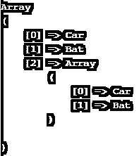

# PHP strip_tags()

> 原文：<https://www.educba.com/php-strip_tags/>

")

## PHP strip_tags()函数介绍

PHP 中的 strip_tags()函数是一个内置函数，它从 HTML 和 PHP 标签中剥离/移除一个字符串。这将返回一个以字节为单位的空值字符串，并从给定的输入字符串中删除 HTML、PHP 标签。当我们显示用户对我们站点的输入时，这个函数基本上是有用的。例如，当我们在站点上创建我们的消息论坛时，用户能够发布如下标题:

# 这个站点是坏的！

。如果网站要显示每篇文章的所有标题，那么这条不想要的消息也会以标题的形式显示在网站上，供页面的所有访问者查看。因此，通过使用 strip_tag()函数，将有助于根除此类问题。

**语法:**

<small>网页开发、编程语言、软件测试&其他</small>

`string strip_tags( $str, $allowed_tags )`

**所需参数:**该函数接受 2 个参数；

*   $str 是强制参数，是需要检查的主字符串。
*   $allowed_tags 是非强制参数，它描述了哪些标签是允许的，哪些是不允许删除的。因此，这些标签将被保留。

**返回值**:这个 strip_tags 函数给出了从输入字符串中剥离出来的结果字符串。

**异常:**

*   这个函数不提供 HTML 的验证。
*   默认情况下被剥离的一些东西是 HTML 注释和 PHP 标签，这些东西是不能更改的，因为它们是硬编码的。
*   在 PHP 5.3.4 之后的版本中，自结束 XHTML 标记被忽略，因此在$allowed_tags 中只允许使用非自结束标记。

### PHP strip_tags()函数示例

现在让我们举一些例子来理解 PHP strip_tags 函数的工作原理。

#### 示例#1

**代码:**

`<?php
// PHP programme to demostrate
// strip_tags function without $allowed_tags parameter
echo strip_tags("Hello <b>Sample Program!</b>");
?>`

**输出:**

 Example 1")

在上面的例子中，我们展示了一个简单的 PHP 代码来说明 strip_tags 函数可以在不指定第二个参数来指定允许哪些字符的情况下使用。这意味着字符串中的所有字符都被允许并按原样打印。

#### 实施例 2

**代码:**

`<?php
$str = '
To test a paragraph.
<!-- Starting comments --> <a href="#fragment">Another paragraph goes here</a>';
echo strip_tags($str);
echo "\n";
// Here we allow HTML tag 

echo strip_tags($str, '
');
// In the version till PHP 7.4.0 the above code can be written as:
// echo strip_tags($str, ['p', 'a']);
?>`

**输出:**

 Example 2")

在上面的例子中，我们首先指定所需的 HTML 代码，并将其分配给输入字符串$str。然后，我们通过仅使用单个参数对该字符串使用 strip 标签函数。接下来，我们展示第二个参数$allow_tags 的使用，其中我们只指定标签

，这意味着只允许使用

标签，其余所有标签都应该被删除。因此，在输出中，我们可以看到只显示了

标签信息，而没有显示

**警告**:

*   此功能不能用于阻止某些攻击，如 XSS。还有其他合适的方法或函数，如 htmlspecialchars()，可用于此目的，具体取决于所需的输出类型。
*   函数 strip_tags()只是删除了 HTML 标签，而没有真正验证它们。因此，这可能会导致标签损坏或删除比预期更多/更少的数据。因此，在指定函数的第二个参数时应该小心。
*   此函数也不支持对我们在$allowed_tags 函数中指定的参数进行任何修改，这些参数还包括 onmouseover 和 style 属性，一些用户可能会使用这些属性来发布文本以显示给其他用户。
*   在使用这个函数时，还有一点需要注意的是，在 HTML 中字符长度超过指定长度(1023 字节)的标记名将被视为无效，不管我们在$allowed_tags 中给出什么参数。

#### 实施例 3

**代码:**

`<?php
$str = '<a title="" href="/index.html"><b>Some Text</b></a>
Just a sample text to showcase a paragraph coming in HTML body';
echo strip_tags_content($str);
function strip_tags_content($str) {
return preg_replace('@<(\w+)\b.*?>.*?</\1>@si', '', $str);
}
?>`

**输出:**

 Example 3")

在上面的例子中，我们使用 strip_tags 函数来删除输入字符串中的锚标记及其内容。PHP strip_tags 将自动删除开始和结束的 HTML 标签。

#### 实施例 4

**代码:**

`<?php
$str = '<?= \'<?= 1 ?>\' ?>2';
var_dump(strip_tags($str));
?>`

**输出:**

 Example 4")

这个例子展示了如何从一个嵌套的 PHP 标签中剥离内容。

#### 实施例 5

**代码:**

`<?php // Test.php
$str = ' Trial on NewLine';
$d = strip_tags($str, ' ');
var_dump($d); // Displays string(11) "TraialonNewLine" on output
?>`

**输出:**

在这个例子中，我们可以看到我们只允许
字符串中的内容，当我们在不同版本的 PHP 中运行时，这里的输出会改变。

#### 实施例 6

**代码:**

`<?php
function strip_tags_d($a)
{
return is_array($a) ?
array_map('strip_tags_d', $a) :
strip_tags($a);
}
// Example
$arr1 = array('<b>Car</b>', '<i>Bat</i>', array('<b>Car</b>', '<i>Bat</i>'));
$arr1 = strip_tags_d($arr1);
// Output
print_r($arr1);
?>`

**输出:**

在上面的例子中，我们展示了 strip_tags 函数的递归函数的使用。因此，在输出中，我们可以看到数组是以 2 个循环的形式打印的。

### 结论

如上所示，我们看到了如何使用 strip_tags()函数从代码中去除一些不需要的 HTML 和 PHP 标签。这个函数可以解析输入字符串并提取其结构。它通常修剪或替换给定的 HTML 或 PHP 标签，我们将这些标签作为要从 HTML 文档中删除的输入参数列表进行传递。当我们只需要修改 PHP 标签而不需要修改 HTML 时，也可以使用这种方法，反之亦然。

### 推荐文章

这是 PHP strip_tags()的指南。在这里，我们讨论 PHP strip_tags()函数的介绍及其示例和代码实现。你也可以浏览我们推荐的其他文章来了解更多信息-

1.  [PHP 框架](https://www.educba.com/php-frameworks/)
2.  [PHP chop()](https://www.educba.com/php-chop/)
3.  [PHP setlocale()](https://www.educba.com/php-setlocale/)
4.  [PHP strtotime](https://www.educba.com/php-strtotime/)

