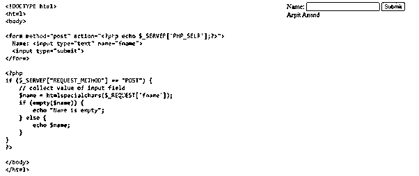

# PHP $ _ 请求

> 原文：<https://www.educba.com/php-_request/>

## PHP $_REQUEST 简介

PHP 出了一个函数$_Request，基本上是收集提交的数据，生成一些数据，$_Request 是用来收集数据的。它默认包含$GET、$POST、$COOKIE 的内容。

每当创建一个 HTML 表单时，每当提交一个请求时，就会传输数据，所以$_Request 用于在 PHP 中收集数据。它是一个超级全局变量，在整个 PHP 脚本的所有作用域中都可用。PHP 版本 4 及以上才可用。在 PHP 7.0 版本中，我们有默认设置，其中 _REQUEST 数组不包含 cookies。的。PHP 的 ini 默认文件也可以从$_Request 中排除 cookies。

<small>网页开发、编程语言、软件测试&其他</small>

**语法**

使用$ Request 函数获取详细信息的语法是:-

`<?php
($_REQUEST[‘Form name’] ?>`

截图:-

### $_ 请求变量工作

$_Request 变量的内容是$GET、$POST 和$COOKIES，它在提交时从 HTML 表单中收集数据。它接受 HTML 形式的输入，这使得它必须有一个包含 GET 和 POST 方法的 HTML 形式的表单。在此之后，我们可以使用请求变量来收集所需的数据。

$_REQUEST 将使用请求的方法获取数据；如果编写了$GET，它将使用 GET 方法，如果编写了$POST，它将使用 POST。一旦这个请求被发出，变量被调用，它就收集需要的数据或者我们想要的数据。

### 例子

让我们用一些例子来看看$_Request 的一些功能

让我们首先创建一个 HTML 表单，看看请求是如何生成的。

张贴时使用的方法:-

**HTML 格式** :-

`<form method="post" action="<?php echo $_SERVER['PHP_SELF'];?>">
Name: <input type="text" name="sname">
<input type="submit">
</form>`

这是一个 HTML 表单。

**PHP POST 请求方法** :-

`<?php
if ($_SERVER["REQUEST_METHOD"] == "POST") {
$name = htmlspecialchars($_REQUEST['sname']);
if (empty($name)) {
echo "Empty Name";
} else {
echo $name;
}
}
?>`

我们试图创建一个表单，它以 Input 为名称，从方法 POST 提交一个带有特定细节的请求，数据由请求方法收集。

在这里，htmlspecialchars($ Request[' fname '])接受输入字段的值，并检查那里是否给出了任何条件。如果存在任何条件，则进行检查，否则收集数据。因此，其输出将类似于:-

名称:

截图:-

我们将姓名作为输入，将姓名的数据作为收集的输出。

也可以使用 GET 方法收集相同的请求；get 和 POST 之间的唯一区别是 GET 请求可以被缓存。并且仍然存在于浏览器历史中；此外，请求可以加入书签，并且可以有长度限制。

让我们用一个简单的代码示例来验证这一点

使用 Get 方法:–

**HTML 格式** :-

`<form method="GET" action="<?php echo “Hello Get”;?>">
Name: <input type="text" name="gname">
<input type="submit">
</form>`

PHP 获取请求方法:-

`<?php
if ($_SERVER["REQUEST_METHOD"] == "GET") {
$name_listed = htmlspecialchars($_REQUEST['gname']);
if (empty($name_listed)) {
echo "Empty Name";
} else {
echo $name_listed;
}
}
?>`

我们试图创建一个表单，它以 Input 为名称，从 GET 方法提交一个带有特定细节的请求，数据由 request 方法收集。

它与我们在上面的 POST 示例中看到的一样。

对于$_Request，存储在这些数组上的数据是发送到 PHP 头的编码数据。$Request 使得很难控制所处理的信息。比如，假设用户请求一个键值对数据，比如:-

REQUEST['key'] = value 它会对 URL 中的数据进行编码并保存到数组中，当我们需要该值时，只需调用 REQUEST['key']获取某个值即可。这是来自超级变量的一个键。

我们还可以在 if-else 循环中使用$Request PHP 函数，并根据需要编写 PHP 代码。

让我们用一个简单的例子来验证一下

`<?php
if ($_REQUEST['city'])
{
$city = $_REQUEST['city'];
setcookie('city', $_REQUEST['city'], 0, 'city.php');
}
else
{
$city = 'NY';
}
echo 'All CITY names are shown in ', $city;
echo '<a href="city.php?city=NY">Switch to NY</a>';
echo '<a href="city.php?city=US">Switch to US</a>';
?>`

这是根据用户请求进行检查和更改的示例代码。使用 request 方法，我们根据需要收集和存储数据，然后通过检查城市是否需要改变来检查一个循环。如果是，则执行该请求；如果没有，就没有变化。所以通过这个方法，我们也可以在 PHP 中使用 Request 函数。

### 结论 PHP $ _ REQUEST

从上面的文章中，我们看到了函数$REQUEST 在 PHP 中的使用。我们试图从各种例子和分类中理解$REQUEST 函数在 PHP 中是如何工作的，以及在编程级别使用了什么。

我们还看到了内部工作原理以及拥有我们为各种编程目的定义的数据类型的优势。此外，语法和例子帮助我们更准确地理解函数。

### 推荐文章

这是一个 PHP $_REQUEST 的指南。这里我们用各种例子和分类来讨论函数$REQUEST 在 PHP 中的使用。您也可以看看以下文章，了解更多信息–

1.  [PHP require_once](https://www.educba.com/php-require_once/)
2.  [PHP 将 XML 放入数组](https://www.educba.com/php-xml-into-array/)
3.  [PHP 通过引用传递](https://www.educba.com/php-pass-by-reference/)
4.  [PHP mail()](https://www.educba.com/php-mail/)

