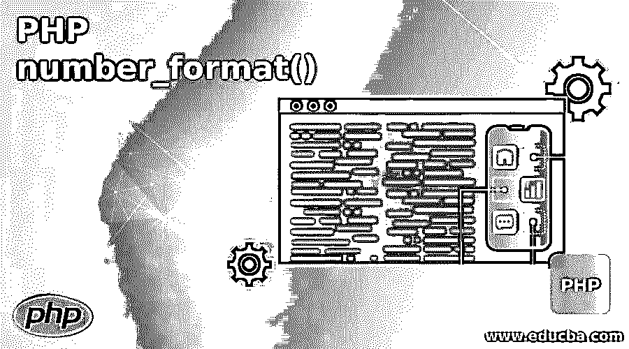
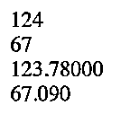

# PHP number_format()

> 原文：<https://www.educba.com/php-number_format/>

## Php number_format()的定义

Php number_format 是 Php 中的一个函数，用于格式化一组千位数字中的一个给定数字。它是 Php 中的一个内置函数，根据程序员在参数中给出的特定要求返回格式化的数字，否则它会在失败时向用户发出 E_WARNING。人们可以用逗号或其他分隔符来分隔千位。它接受浮点数，并返回带有千位分隔的格式化数字的字符串，该数字带有舍入值或十进制值直到特定位数。默认情况下，number_format()函数在传递数字时用(，)运算符分隔一千个组。这是一种简单且用户友好的表示浮点数的方式，用户很容易理解。

**语法:**

<small>网页开发、编程语言、软件测试&其他</small>

下面给出了在 Php 中使用 number_format()函数的基本语法:

`string number_format( float $num, int $decimal =0, string $dec_pt = ‘ . ’ , string $thousand_sep = ‘ , ‘  )`

在哪里，

*   **$num =** 该参数是必需的。这是需要格式化的浮点数。如果没有设置其他参数，要格式化的数字将被转换为十进制数，千位用分隔符分隔。
*   **$decimal =** 该参数是可选的。此参数指定格式化数字后显示的小数位数。如果设置了该参数。)打印在千组之间的数字和(，)之后。
*   **$dec_pt =** 这个参数也是可选的。它用于设置十进制值的分隔符。
*   **$sep =** 这个参数也是可选的。它用于指定用来分隔数千个值的字符串。当该值带有多个字符时，只使用第一个字符。需要记住的一个重要条件是，当提到这个参数时，需要使用所有其他参数。
*   **返回值:**如果成功，该函数将根据所述参数的说明返回字符串类型的格式化数字，否则返回 E_WARNING。

### number_format()函数是如何工作的？

下面给出了描述 Php 中 number_format()函数工作的一些要点:

*   用户可以指定浮点数应该显示到的小数点，以及千位组和小数点的不同分隔符。
*   Php 函数 number_format()接受一个、两个或四个参数。它不能接受三个参数。
*   默认情况下，number_format()函数使用(。)运算符表示小数点，而(，)表示千组。
*   中的函数 number_format()返回字符串值，这意味着我们不能将其输出用于数学计算。因此需要记住，只有在显示输出时才需要使用它。
*   当只传递一个参数时，它将浮点数舍入到最接近的整数，不加小数点，用逗号分隔千位。

### PHP number_format()示例

下面是一些描述 Php number_format()函数在程序中工作的例子:

#### 示例#1

**代码:**

`<!DOCTYPE html>
<html>
<body>
<?php
$f_num = "Number";
//Using only 1 parameter, i.e. number to be formatted
echo " The formatted number is ". number_format($f_num)."\n\n";
//Using the decimal point and printing the decimal upto the specific digits (2 parameters)
echo number_format($f_num, 5);
?>
</body>
</html>`

**输出:**

**说明:**在上面的代码中，变量‘f _ num’中的数字应该是浮点数但却是字符串。所以基本上，字符串是作为 number_format()函数中的参数传递的，这在技术上是不正确的。因此在控制台上向用户显示语法错误的错误消息。

#### 实施例 2

**代号:**
`<!DOCTYPE html>
<html>
<body>
<?php
$f_num = "123.78";
$f_num1 = "67.09";
// With only 1 parameter , i.e. number to be formatted
echo number_format($f_num).' ';
echo number_format($f_num1).' ';
// Using the decimal point (2 parameters)
echo number_format($f_num, 5).' ';
echo number_format($f_num1, 3);
?>
</body>
</html>`

**输出:**

**解释:**在上面的代码中，使用变量‘f _ num’和‘f _ num 1’给出了两个浮点数。仅使用数字变量作为 number_format()函数中的参数，将会分离出一千个组。因为在两个给定的数字中不会有一千个组，所以不存在分离。为了打印精确到小数点的数值，需要传递第二个参数，其值为 5 和 3。因此，在输出中，在控制台上打印出小数点位数达到给定位数的浮点数。

#### 实施例 3

**代号:**
`<!DOCTYPE html>
<html>
<body>
<?php
$f_num = "178923.78";
$f_num1 = "665467.09";
// Using only 1 parameter, i.e. number to be formatted
echo number_format($f_num).' ';
echo number_format($f_num1).' ';
// Using the separators for decimal point and thousand groups(4 parameters)
echo number_format($f_num, 5, '.', ',').' ';
echo number_format($f_num1, 3, ':', '.');
?>
</body>
</html>`

**输出:**

**T2】**

 ****说明:**在上面的代码中，函数 number_format()中传递一个单参数(要格式化的数字)，默认情况下给定数字中的一千组用(，)运算符分隔。为了打印带有千位组和小数点的特定分隔符的数字，在函数中使用这些分隔符传递第三和第四个参数，并打印在控制台上。

#### 实施例 4

**代码:**

`<!DOCTYPE html>
<html>
<body>
<?php
$f_num = "178923.78";
$f_num1 = "665467.09";
//Using the separators for decimal point only(3 parameters)
echo number_format($f_num, 5, ",").' ';
echo number_format($f_num1, 3, ".");
?>
</body>
</html>`

**输出:**

**说明:**在上面的代码中，number_format()函数中给出了 2 个浮点数，只传递了 3 个参数，这在技术上是不允许的。因为 number_format()函数接受 1、2 或 4 个参数。因此向用户显示警告消息，指示错误的参数。

### 结论

上面的描述清楚地解释了 Php 中的 number_format()函数是什么，以及它是如何格式化浮点数的。该函数为用户提供了灵活性，通过传递不同的参数，用户可以根据特定的要求显示输出。它还显示警告并导致意外输出。因此，在程序中使用它之前，需要正确理解它，并且非常小心。

### 推荐文章

这是 PHP number_format()的指南。这里我们还讨论了 number_format()函数的定义和工作原理。以及不同的示例及其代码实现。您也可以看看以下文章，了解更多信息–

1.  [PHP 删除文件](https://www.educba.com/php-delete-file/)
2.  [PHP 梁()](https://www.educba.com/php-strlen/)
3.  [PHP usort()](https://www.educba.com/php-usort/)
4.  [PHP preg_match_all](https://www.educba.com/php-preg_match_all/)

**