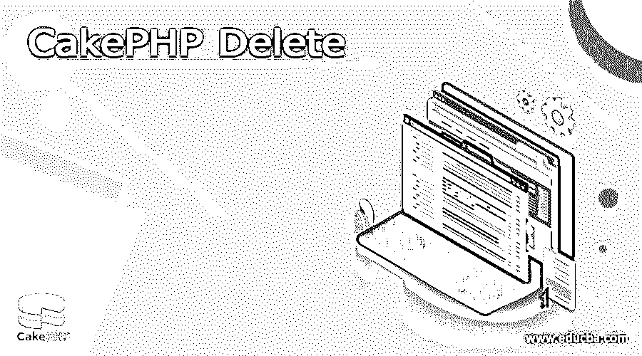

# CakePHP 删除

> 原文：<https://www.educba.com/cakephp-delete/>

## CakePHP 删除的定义

基本上，CakePHP 是一个用来执行删除的框架，用来从数据库中删除由$id 标识的记录。通常，删除命令依赖于记录，这意味着我们可以说用户的关系是一对多的，或者我们可以有所属关系。我们知道 PHP 是一种脚本服务器端语言，可以在不同的网页之间进行动态交互。换句话说，我们可以说，在 CakePHP 框架的帮助下，我们可以根据自己的要求从 MySQL 数据库中删除记录，并且很容易实现。

### CakePHP 删除概述

要删除数据集中的记录，我们首先需要利用 Table Registry 类获得一个表。我们可以利用 get()技术将这种情况带出库。get()技术将数据集表的名称作为争用。目前，这个新示例用于获取我们需要删除的特定记录。

<small>网页开发、编程语言、软件测试&其他</small>

使用这个新事件调用 get()策略，并传递基本键来观察将在另一个案例中保存的记录。利用 Table Registry 类的例子调用删除技术从信息库中删除记录。

将应用删除规则。假设标准失败，擦除将被阻止。

Model.before 删除场合被触发。假设这种情况被停止，删除将被中断，这种情况的结果将被返回。

该元素将被删除。

所有依赖关系都将被删除。如果从属关系作为实体被删除，额外的机会将被调度。

属于多个隶属关系的任何交集表记录都将被删除。

模型。删除后场合会被引爆。

### 如何在 CakePHP 中删除数据？

现在让我们看看如何在 CakePHP 框架中执行删除，如下所示。

要删除信息库中的记录，我们首先需要利用 TableRegistry superbness 保留一个工作区。我们可以通过使用 get()方法从库中获取时机。get()方法将接受信息库工作区的调用作为一个问题。目前，这个新的场合被用来获取一个我们需要删除的有趣文档。

使用这个新模型调用 get()过程，并绕过主键来查看报告，以便保存在每个其他示例中。利用 TableRegistry 品味指南调用 delete 方法来处理从数据集中删除记录。

在擦除元素时，相关信息同样可以被擦除。如果你的 HasOne 和 has 许多从属关系被设计为依赖，那么擦除任务也将“转向”那些物质。当然，相关表中的元素是利用 Cake\ORM\Table::deleteAll()消除的。通过将 cascadeCallbacks 选项设置为 valid，可以选择让 ORM 加载相关的元素，并独立地删除它们。一个与这两种选择都有很多关系例子是:

现在让我们看看语法如下。

`delete(integer $specified id of table= null, required boolean value$cascade = true);`

**解释**

通过使用上面的语法，我们可以在 CakePHP 中实现 delete，这里我们使用带有不同参数的 delete 命令，如下所示。

表的指定 Id 是该表的唯一标识符，它是一个整数，最初，它是空的，根据我们的要求，我们可以更改 Id 的值。

在这个语法中，我们还使用布尔值来设置删除操作的级联实现，如上面的语法所示。
CakePHP 删除批量

现在让我们看看如何在 CakePHP 中执行批量删除，如下所示。

有时单独擦除行可能没有效果或帮助。在这些情况下，更有效的方法是利用批量擦除来消除许多行，而没有片刻的延迟。如果至少擦除了一行，则认为批量擦除是有效的。容量以整数形式返回已擦除记录的数量。

现在我们来看看批量删除的语法，如下所示。

`function deletespam()
{
return $this->deleteAll(['Specified statement that is spam' => true]);
}`

**解释**

在上面的语法中，我们声明了一个函数，并在函数内部调用了 deleteAll 方法，如下所示。在这种语法中，我们需要设置我们想要的指定语句的布尔值，这取决于用户的要求。

### 例子

现在让我们来看看删除操作的不同例子，以便更好地理解。

首先，我们需要创建一个新表，并将一些记录放入表中，如下所示。

`CREATE TABLE IF NOT EXISTS `sampledemo` (
`id` char(30) NOT NULL,
`EmpName` varchar(250) DEFAULT NULL,
`EmpPass` varchar(40) DEFAULT NULL,
PRIMARY KEY (`id`)
) ENGINE=MyISAM DEFAULT CHARSET=latin1;`

现在，在新创建的表中插入记录，如下所示。

`INSERT INTO `sampledemo` (`id`, `EmpName`, `EmpPass`) VALUES
('3', 'Siya','$2y$10$HKLH3YiZE'),
('4', 'Rohan','$2y$10$bZcoCTW'),
('5', 'Tanya','$2y$10$SnGQV8O');`

**解释**

执行上述查询后，我们将获得如下结果，如下面的屏幕截图所示。

现在我们需要在 route.php 进行如下所示的更改。

`<?php
use Cake\Http\Middleware\CsrfProtectionMiddleware;
use Cake\Routing\Route\DashedRoute;
use Cake\Routing\RouteBuilder;
$routes->setRouteClass(DashedRoute::class);
$routes->scope('/', function (RouteBuilder $builder) {
$builder->registerMiddleware('csrf', new CsrfProtectionMiddleware([
'httpOnly' => true,
]));
$builder->applyMiddleware('csrf');
$builder->connect('/users/delete', ['controller' => 'sam, 'action' => 'delete']);
$builder->fallbacks();
});
Now we need to create a usercontroller.php file and write the following code as follows.
?php
namespace App\Controller;
use App\Controller\AppController;
use Cake\ORM\TableRegistry;
use Cake\Datasource\ConnectionManager;
class UsersController extends AppController{
public function sequence (){
$users = TableRegistry::get('users');
$query = $users->find();
$this->set('output',$query);
}
public function delete($id){
$users_table = TableRegistry::get('users');
$users = $users_table->get($id);
$users_table->delete($users);
echo "deleted successfully.";
$this->setAction('sequence');
}
}
?>`

现在，我们需要为用户创建一个目录，这个文件我们称之为 ctp 文件(序列或索引)。根据我们的要求，我们可以更改文件名，并编写如下代码。

`<a href="add"> User</a>
<table>
<tr>
<td>Id</td>
<td>EmpNamee</td>
<td>EmpPass</td>
<td>Edit</td>
<td>Delete</td>
</tr>
<?php
foreach ($Output as $row):
echo "<tr><td>".$row->id."</td>";
echo "<td>".$row->Empname."</td>";
echo "<td>".$rows->EmpPass."</td>";
echo "<td><a href='".$this->Url->build(["controller" => "Users","action" => "edit",$row->id])."'>Edit</a></td>";
echo "<td><a href='".$this->Url->build(["controller" => "Users","action" => "delete",$row->id])."'>Delete</a></td></tr>";
endforeach;
?>
</table>`

现在，在 localhost 中运行脚本并查看输出，这是我们通过如下截图展示的上述实现的最终结果。

现在假设我们需要删除 3 个数字记录，因此我们需要提供该行的 id 和删除后的操作结果，如下图所示。

同样，我们可以删除第四个数字行，我们可以在下面的屏幕截图中看到结果，如下所示。

### 结论

我们希望从这篇文章中你能学到更多关于 CakePHP 删除的知识。从上面的文章中，我们已经理解了 CakePHP delete 的基本思想，我们也看到了 CakePHP delete 的表示和例子。从这篇文章中，我们了解了如何以及何时使用 CakePHP delete。

### 推荐文章

这是一个 CakePHP 删除指南。这里我们讨论定义，概述，如何在 CakePHP 中删除数据？代码实现示例。你也可以看看下面的文章来了解更多-

1.  [CakePHP](https://www.educba.com/cakephp/)
2.  [如何安装 CakePHP？](https://www.educba.com/install-cakephp/)
3.  [Laravel vs CakePHP](https://www.educba.com/laravel-vs-cakephp/)
4.  [CakePHP 面试问题](https://www.educba.com/cakephp-interview-questions/)

