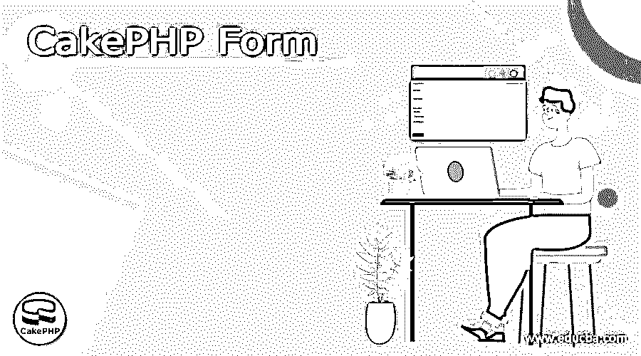
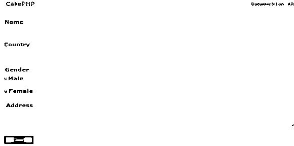
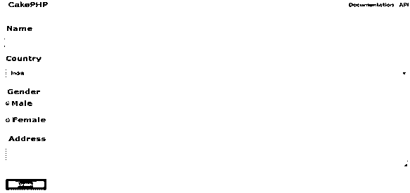
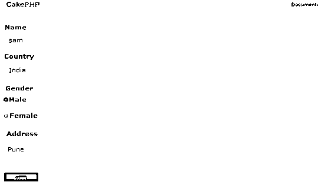

# CakePHP 表单

> 原文：<https://www.educba.com/cakephp-form/>

## CakePHP 表单的定义

CakePHP 是用来处理动态编程的开源工具；它为开发人员提供了不同类型的内置标签来处理 HTML 表单。表单是 CakePHP 提供的标签之一，用于可靠地处理 HTML 表单，或者我们可以说它与其他 PHP 框架一样简单安全。一个好处是我们可以通过使用 CakePHP 生成不同的 HTML 元素。在 CakePHP 中，我们可以很容易地按照我们的要求创建表单，通过使用内置的标签和方法来验证不同的布局。

### CakePHP 表单是什么？

该结构包含强大的库记录结构，用于执行 CakePHP 中的各种活动。表单的中心是以这种方式有效地创建结构，以便可以简化批准、重新大众化和配置。在表单中，有不同的结构标签，我们将使用它们在格式管理器中创建一个结构。此外，这种形式是灵活的，这意味着它将做几乎所有你需要通过利用正确的标点符号和策略来表现特定结果的结构。一行代码比 HTML 代码足够了，因为我们需要编写一个庞大的代码来构建结构，然而，在形式上，我们需要为结构编写一个简单的语法。

<small>网页开发、编程语言、软件测试&其他</small>

### 如何创建 CakePHP 表单？

现在让我们看看如何用 CakePHP 创建一个表单，示例如下。首先，我们需要创建一个窗体:通常我们知道当我们使用窗体类时，我们还需要定义子类。

**例如:**

`namespace App\Form;
use Cake\Form\Form;
use Cake\Form\Schema;
use Cake\Validation\Validator;
class sampleForm extends Form
{
protected function buildSchema(Schema $schema): Schema
{
return $schema->addField('Emp Name', 'string')
->addField('Emp Email', ['type' => 'string'])
->addField('Emp Address', ['type' => 'text']);
}
public function validationDefault(Validator $valid): Validator
{
$valid->minLength('Emp Name', 20)
->Emp Email('email');
return $valid;
}
protected function _run(array $data): bool
{
// Send an email.
return true;
}
}`

**解释**

在上面的例子中，我们使用了三种不同的方法作为 buildSchema、defaultvalidation 和 run，如下所示。

之后，我们需要编写代码来处理控制器内部的请求数据，如下所示。

`namespace App\Controller;
use App\Controller\AppController;
use App\Form\ sampleForm;
class SampleController extends AppController
{
public function index()
{
$sample= new sampleForm ();
if ($this->request->is('post')) {
if ($sample->execute($this->request->getData())) {
$this->Flash->success( ‘Welcome Done’);
} else {
$this->Flash->error('There is Problem');
}
}
$this->set('sample', $sample);
}
}`

之后，我们需要设置表单值，最后，我们需要按照我们的要求创建带有表单的 HTML。

现在让我们来看一个例子，以便更好地理解。

首先，我们需要如下配置 routes.php。

`<?php
use Cake\Http\Middleware\CsrfProtectionMiddleware;
use Cake\Routing\Route\DashedRoute;
use Cake\Routing\RouteBuilder;
$routes->setRouteClass(DashedRoute::class);
$routes->scope('/', function (RouteBuilder $builder) {
$builder->registerMiddleware('csrf', new CsrfProtectionMiddleware([
'httpOnly' => true,
]));
$builder->applyMiddleware('csrf');
//$builder->connect('/pages',['controller'=>'Pages','action'=>'display', 'home']);
$builder->connect('register',['controller'=>'ContactForm','action'=>'index']);
$builder->fallbacks();
});`

现在我们需要创建一个类似于上面代码的控制器文件，所以创建一个控制器文件并编写下面的代码。

`<?php
namespace App\Controller;
use App\Controller\AppController;
class ContactFormController extends AppController{
public function index(){
$country = array('India',England',Canada');
$this->set('country',$country);
$gender = array('Male','Female');
$this->set('gender',$gender);
}
}
?>`

**解释**

在上面的代码中，我们为国家和性别等联系信息编写了代码。现在创建一个索引文件，并编写以下代码。

`<?php
echo $this->Form->create(NULL,array('url'=>'/sampleForm'));
echo '<label for="name">Name</label>';
echo '<label for="country">Country</label>';
echo $this->Form->select('country',$country);
echo '<label for="gender">Gender</label>';
echo $this->Form->radio('gender ',$gender);
echo '<label for="address">Address</label>';
echo $this->Form->text ('address');
echo $this->Form->button('Submit');
echo $this->Form->end();
?>`

在执行上述代码后，我们将得到如下屏幕截图所示的屏幕。

假设我们选择了一个像印度这样的国家，如下图所示。

现在输入一些细节，如下面的截图所示的姓名和地址。

现在，单击提交按钮，我们会收到一条欢迎消息。

### CakePHP 表单函数

现在让我们看看 CakePHP 中的表单函数，如下所示。

选择

它用于返回数组元素。

**语法**

`selectOptions( array $specifiedarrayelement(), array $parentsarrayelement(),
boolean $showParentsnull, array $attributesarray() )`

**解释**

在上面的语法中，我们使用带有不同参数的 selectOption 函数，例如元素的格式、父元素组和不同的 HTML 属性。基本上，它返回数组。

**选择**

它用于选择格式化的元素。

**语法**

`select( string $Specified Name field, array $required options of array(), array $specified attributes array() )`

**解释**

在上面的语法中，我们使用带有不同参数的 select to 函数，指定的 name 字段用于选择 name 属性，数组也用于选择元素，它返回所选的元素。

**按钮**

它用于创建类型为的按钮。

**语法**

`Button(string $specified name, array $optionsarray() )`

**解释**

按钮的铭文。不是自然的 HTML 编码。一组选择和 HTML 属性，它返回按钮标签。

**复选框**

通过使用这个函数，我们可以根据需要在表单中创建一个复选框。

**语法**

`Checkbox(string $Specifed name field, array $optionsarray() )`

**解释**

在上面的语法中，我们使用了带有不同参数(如名称和数组属性)的 checkbox 函数。它返回文本输入元素。

**创建**

它用于返回返回的表单元素。

**语法**

`create( mixed $nullmodel value , array $array() )`

**解释**

这里我们需要指定模型的名称和指定 HTML 属性的数组。

**文件**

通过使用这个函数，我们可以创建文件并返回生成的文件。

**隐藏**

它用于创建隐藏文件并返回生成的隐藏输入。

**输入**

它用于创建输入元素并返回表单小部件。

**收音机**

它用于创建一组单选按钮并返回单选小部件。

**提交**

它用于创建一个提交按钮元素，并返回 HTML 提交。

### 价值观念

在这里，我们可以根据需要使用 setData()方法设置表单的默认值，如下面的代码所示。

`namespace App\Controller;
use App\Controller\AppController;
use App\Form\ContactForm;
class SampleController extends AppController
public function index()
{
$sample = new SampleForm();
if ($this->request->is('post')) {
if ($contact->execute($this->request->getData())) {
$this->Flash->success(' Welcome Done ');
} else {
$this->Flash->error('There is Problem');
}
}
if ($this->request->is('get')) {
$contact->setData([
'Emp of name' => 'sam',
Emp'email' => sam123@example.com'
]);
}
$this->set('sample', $sample);
}
}`

### 结论

我们希望从这篇文章中你能学到更多关于 CakePHP 表单的知识。从上面的文章中，我们已经理解了 CakePHP 表单的基本思想，我们还看到了 CakePHP 表单的表示和示例。从本文中，我们了解了如何以及何时使用 CakePHP 表单。

### 推荐文章

这是 CakePHP 表单指南。这里我们讨论定义，什么是 CakePHP 表单，如何创建 CakePHP 表单，以及实现的例子。你也可以看看下面的文章来了解更多-

1.  [CakePHP](https://www.educba.com/cakephp/)
2.  [如何安装 CakePHP？](https://www.educba.com/install-cakephp/)
3.  [Laravel vs CakePHP](https://www.educba.com/laravel-vs-cakephp/)
4.  [CakePHP 面试问题](https://www.educba.com/cakephp-interview-questions/)

