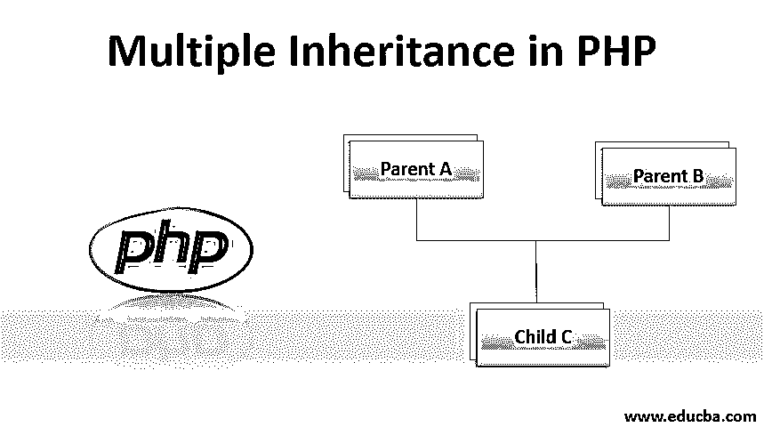

# PHP 中的多重继承

> 原文：<https://www.educba.com/multiple-inheritance-in-php/>




## **PHP 中多重继承介绍**

 **多重继承是 PHP 等面向对象编程语言的最佳特性之一，其中子类或类可以继承多个超类或多个父类的特性。PHP 编程语言甚至不支持多重继承。PHP 只通过使用 PHP 中的接口或特征而不是类来支持多继承，这样我们就可以实现它。

**特质:**

<small>网页开发、编程语言、软件测试&其他</small>

Traits 是一种支持多个 case 类、对象、类和 traits 的类。特征只能同时扩展多个特征，但不能扩展一个以上的类。

**语法:**

```
class child_class extends parent_class{
use trait name;
..
..
Child_class function/functions
}
```

**多重继承在 PHP 中是如何工作的？**

[多重继承](https://www.educba.com/multiple-inheritance-in-c-plus-plus/)通过将多个超类或父类的属性继承到一个子类或子类等来工作。多重继承不能直接工作，但是可以通过使用特征概念来工作。

### PHP 中多重继承的例子

下面是 PHP 中多重继承的例子:

#### 示例#1

在下面的程序示例中,“traits”与父类一起使用。这里有一个名为“Pavan”的类，它有一个函数 sayhihello()，还有一个名为“forPavan”的“trait”，它包含一个名为 pavanforNaruto()的函数，还有一个名为“Sample”的子类，我们现在在这里创建名为“test”的类的对象，并使用它来调用 trait 和类的所有函数。

**代码:**

```
<?php
// Class Pavan
class Pavan {
public function sayhihello() {
echo "Hey Hi Hello";
}
}
// Trait for pavan
trait forPavan {
public function sayforp() {
echo " Pavan";
}
}
class Sample extends Pavan {
use forPavan;
public function pavanforNaruto() {
echo "\npavanforNaruto";
}
}
$test = new Sample();
$test->sayhihello();
$test->sayforp();
$test->pavanforNaruto();
?>
```

**输出:**


#### 实施例 2

通过将特征插入到 use 语句的类中来列出特征，并且也用逗号分隔。在下面陈述的程序的例子中，使用了“特征”。只有两个名为“Pavan”的 traits，它有一个名为 sayhihello()的函数，还有一个名为“Sample”的子类，现在我们创建名为“test”的类对象，并调用所有 traits 函数。

**代码:**

```
<?php
// trait Pavan
trait Pavan {
public function sayhihello() {
echo "Hey Hi Hello";
}
}
// trait forpavan
trait forPavan {
public function sayforp() {
echo " Pavan";
}
}
class Sample {
use Pavan;
use forPavan;
public function pavanforNaruto() {
echo "\nPavanforNaruto";
}
}
$test = new Sample();
$test->sayhihello();
$test->sayforp();
$test->pavanforNaruto();
?>
```

**输出:**


#### 实施例 3

这是接口程序。下面的示例是通过使用类和接口完成的。在下面的程序中，接口“B1”与类“A1”一起使用，以实现多重继承。为了记住，最重要的一点是，它不能由接口内部的函数来定义。它将/应该在子类“Multiple1”中定义。没有人可以使用子类调用所有其他的函数，这个子类有多个对象名“pavan”。

**代码:**

```
<?php
class A1 {
public function insideA1() {
echo "Hi buddy you are in class A1";
}
}
interface B1 {
public function insideB1();
}
class Multiple1 extends A1 implements B1 {
function insideB1() {
echo "\nHi buddy you are in the interface";
}
public function insidemultiplepavan() {
echo "\nHey now you are in the inherited class";
}
}
$Naruto = new multiple1();
$Naruto->insideA1();
$Naruto->insideB1();
$Naruto->insidemultiplepavan();
?>
```

**输出:**


#### 实施例 4

在下面的示例程序中，有多个接口对实现多重继承非常有帮助。在下面列出的 PHP 程序的例子中，有两个名为“B1”和“C1”的接口，它们实际上扮演着基类的角色，并且总有一个名为“Multiple1”的子类，我们现在通过使用“pavan”对象来调用所有其他函数。

**代码:**

```
<?php
interface C1 {
public function insideC1();
}
interface B1 {
public function insideB1();
}
class Multiple1 implements B1, C1 {
// Function of the interface B1
function insideB1() {
echo "\n Hey now you are in the interface B1";
}
// Function of the interface C1
function insideC1() {
echo "\nHi buddy !! Now you are in the interface C1";
}
public function insidemultiple1()
{
echo "\nHeyaa You are in the inherited class";
}
}
$Naruto = new multiple1();
$Naruto->insideC1();
$Naruto->insideB1();
$Naruto->insidemultiple1();
?>
```

**输出:**


#### 实施例 5

在下面 PHP 多重继承程序的例子中，我们实际上使用了“trait”来启用多重继承特性。“使用”一词是指使用“特征”功能。类 CompName1 展示了如何开始使用“trait”。

**代码:**

```
<?php
class BaseClass1
{
public function Hello1()
{
echo 'Hello MCN ';
}
}
trait OtherCls1
{
public function Hello1()
{
parent::Hello1();
echo ' Now i have the Solution!';
}
}
class CompName1 extends BaseClass1
{
use OtherCls1;
}
$obj = new CompName1();
$obj->Hello1();
?>
```

**输出:**


#### 实施例 6

这是一个简单的 PHP 程序，演示了如何使用 traits 类。Trait 基本上是一种帮助实现多重继承概念的类。类、特征和对象不扩展超过一个类，但是在这里它可以同时扩展到许多特征。在这个例子中，traits 实际上与父类一起使用。它还有 Inheritance1 类，该类有一个名为 example1()的函数，formultiple1 trait 有一个名为 example 1()的函数和一个名为“sample1”的子类，它还创建了类“check1”的对象，并在这里调用 trait 和类的所有函数。

**代码:**

```
<?php
// Class Inheritance
class Inheritance1
{
public function example1()
{
echo "Hey";
}
}
// Trait formultiple1
trait formultiple1
{
public function examplem1()
{
echo "\t My Traits";
}
}
class Sample1 extends Inheritance1
{
use formultiple1;
public function MultipleInheritance1()
{
echo "\n I am in the Multiple-Inheritance1";
}
}
$check = new Sample1();
$check->example1();
$check->examplem1();
$check->MultipleInheritance1();
?>
```

**输出:**


### 推荐文章

这是一个 PHP 多重继承的指南。在这里，我们讨论了多重继承在 PHP 中是如何工作的，以及它的例子和代码实现。你也可以浏览我们推荐的其他文章来了解更多信息-

1.  [PHP 中的套接字编程](https://www.educba.com/socket-programming-in-php/)
2.  [PHP 框架](https://www.educba.com/php-frameworks/)
3.  [PHP 数组搜索](https://www.educba.com/php-array-search/)
4.  [PHP 写文件](https://www.educba.com/php-write-file/)


**