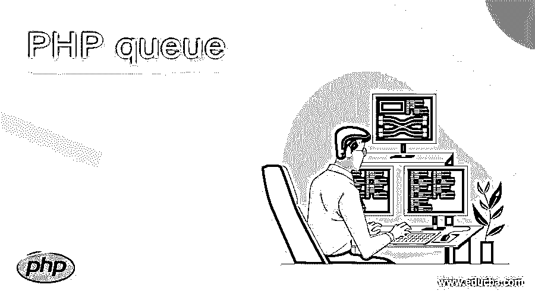
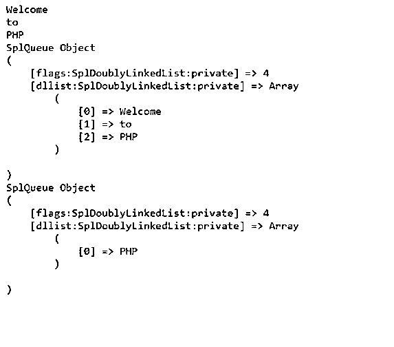
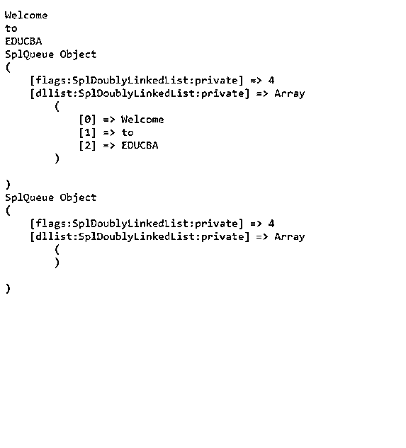

# PHP 队列

> 原文：<https://www.educba.com/php-queue/>

## PHP 队列介绍

PHP 中的队列是一种基于先进先出(也称为 FIFO)操作的数据结构，四种基本操作定义了一个队列，即 init、enqueue、dequeue 和 isEmpty，其中 init 操作用于创建队列，enqueue 操作用于在队列末尾添加一项， 或者队列的尾部和出列操作用于从队列的前部或头部移除项目，isEmpty 操作用于检查队列是否为空，也就是说，如果队列不再包含项目，则返回。

**PHP 中声明队列的语法如下:**

<small>网页开发、编程语言、软件测试&其他</small>

`enqueue(item_to_added_to_the_queue);
dequeue();`

其中，item_to_be_added_to_the_queue 是将要添加到队列末尾或尾部的项目。

### PHP 中队列的工作

*   PHP 中的队列是一种基于先进先出操作的数据结构，也叫 FIFO。
*   四个基本操作定义了一个队列，即 init、enqueue、dequeue 和 isEmpty。
*   init 操作用于创建队列。
*   入队操作用于在队列末尾或队列尾部添加一个项目。
*   出列操作用于从队列的前面或头部移除项目。
*   isEmpty 操作用于检查队列是否为空；也就是说，无论队列中是否包含更多的项目，它都会返回。

### PHP 队列的例子

下面举几个例子

#### 示例#1

PHP 程序，使用 enqueue()函数从队列末尾向队列添加项目，使用 dequeue()函数从队列前面移除项目，并显示队列的内容:

**代码:**

`<?php
//creating an instance of SplQueue class
$newqueue = new SplQueue();
//using enqueue() function to the add items to the queue from the tail of the queue
$newqueue->enqueue('Welcome');
$newqueue->enqueue('to');
$newqueue->enqueue('PHP');
//using rewind() function to bring the file pointer to the beginning of the queue
$newqueue->rewind();
//using valid() function to check if the queue is valid or not after using rewind() function and then displaying the elements of the queue
while($newqueue->valid()){
echo $newqueue->current(),"\n";
$newqueue->next();
}
//printing the contents of the queue in a human readable format by using print_r function
print_r ($newqueue);
//Removing the first two items from the head of the queue using dequeue() function and then displaying the contents of the queue in human readable form using print_r function
$newqueue->dequeue();
$newqueue->dequeue();
print_r ($newqueue);
?>`

**输出:**

在上面的程序中，我们创建了 SplQueue()类的一个实例。然后，我们从队列的尾部或末端向队列添加项目。然后，我们使用 rewind()函数将文件指针指向队列的开头。然后，在使用 rewind()函数并显示队列元素之后，我们使用 valid()函数来检查队列是否有效。然后，我们使用 print_r 函数以人类可读的格式打印队列的内容。然后，我们使用 dequeue()函数从队列头删除前两项，然后使用 print_r 函数以人类可读的形式显示使用 dequeue()函数后的队列内容。输出显示在上面的快照中。

#### 实施例 2

PHP 程序，使用 enqueue()函数从队列末尾向队列添加项目，使用 dequeue()函数从队列前面移除项目，并显示队列的内容:

**代码:**

`<?php
//creating an instance of SplQueue class
$newqueue = new SplQueue();
//using enqueue() function to the add items to the queue from the tail of the queue
$newqueue->enqueue('Welcome');
$newqueue->enqueue('to');
$newqueue->enqueue('EDUCBA');
//using rewind() function to bring the file pointer to the beginning of the queue
$newqueue->rewind();
//using valid() function to check if the queue is valid or not after using rewind() function and then displaying the elements of the queue
while($newqueue->valid()){
echo $newqueue->current(),"\n";
$newqueue->next();
}
//printing the contents of the queue in a human readable format by using print_r function
print_r ($newqueue);
//Removing the first two items from the head of the queue using dequeue() function and then displaying the contents of the queue in human readable form using print_r function
$newqueue->dequeue();
$newqueue->dequeue();
$newqueue->dequeue();
print_r ($newqueue);
?>`

**输出:**

在上面的程序中，我们创建了 SplQueue()类的一个实例。然后，我们从队列的尾部或末端向队列添加项目。然后，我们使用 rewind()函数将文件指针指向队列的开头。

然后，在使用 rewind()函数并显示队列元素之后，我们使用 valid()函数来检查队列是否有效。然后，我们使用 print_r 函数以人类可读的格式打印队列的内容。然后，我们使用 dequeue()函数从队列头部删除所有三个项目，然后使用 print_r 函数以人类可读的形式显示使用 dequeue()函数后的队列内容，print _ r 函数是一个空队列。输出显示在上面的快照中。

### 推荐文章

这是一个 PHP 队列指南。这里我们通过定义、语法和定义队列的基本操作来讨论 PHP 中队列的概念，即 PHP 中的 enqueue()函数和 dequeue()函数，通过编程实例和它们的输出。您也可以看看以下文章，了解更多信息–

1.  [PHP mail()](https://www.educba.com/php-mail/)
2.  [PHP 反射](https://www.educba.com/php-reflection/)
3.  [PHP ob_start()](https://www.educba.com/php-ob_start/)
4.  [PHP 表单验证](https://www.educba.com/php-form-validation/)

