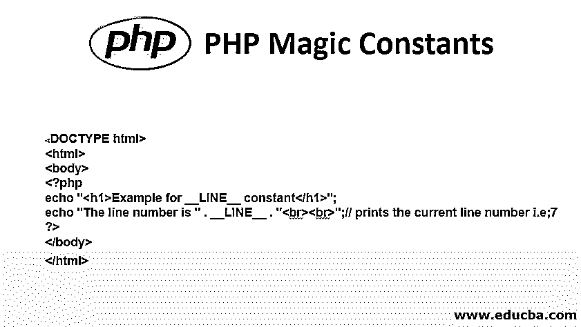

# PHP 魔法常数

> 原文：<https://www.educba.com/php-magic-constants/>




## PHP 神奇常数介绍

在 PHP 魔法常量中，总共有八个常量根据它们的使用位置改变它们的依赖关系。所有这些神奇的常数都是在编译时解析的，不像我们通常在运行时解析的常规常数。这些神奇的常数不区分大小写。这些常量是预定义的常量，以双下划线(__)开头，也以双下划线结尾。这些常量是 PHP 中最实用、最有用的常量。它们是简单的变量，但有预先定义的含义。这些常量用于打印用户定义的输入，并处理输出以显示在屏幕上。

### PHP 中神奇常数的类型

PHP 中总共有八个神奇的常数，如下所述:

<small>网页开发、编程语言、软件测试&其他</small>

*   **__LINE__:** 该常量用于打印输出屏幕上使用的代码的行号。它表示当前的行号。
*   **__FILE__:** 该常量用于在输出屏幕上打印文件的完整文件路径和文件名。
*   **__DIR__:** 该常量用于在输出屏幕上打印特定文件的完整目录路径。它还有一个等效的方法来打印文件的目录路径是 dirname (__FILE__)。
*   **__FUNCTION__:** 该常量将打印输出屏幕上当前正在使用的函数名。如果在函数内部使用，它将打印函数名，如果在函数外部使用，它将返回一个空白。
*   **__CLASS__:** 该常量用于打印输出屏幕上使用的类名。如果在类内部使用，它将打印类名，如果在函数外部使用，它将返回一个空白。
*   **__TRAIT__:** 该常量用于使用特性名称的地方。如果在函数内部使用，它将打印名称，如果在函数外部使用，它将返回一个空白。trait 用于在输出屏幕上打印名称空间。
*   **__METHOD__:** 该常量用于打印在输出屏幕上使用的类中定义的方法的名称。它返回代码中声明的方法的名称。如果在方法或类内部使用，它将返回方法的名称，如果在函数外部使用，它将返回空白。
*   **__NAMESPACE__:** 该常量用于在输出屏幕上打印当前名称空间的名称。

### 神奇常数在 PHP 中是如何工作的？

下面是魔术常量在 PHP 中如何工作的例子:

在 PHP 中，我们可以在非常简单的代码中使用神奇的常量，但在日常生活中却很难使用。让我们举个例子来看看它是如何工作的:

#### 示例#1

**代码:**

```
<!DOCTYPE html>
<html>
<body>
<?php
echo "<h1>Example for __LINE__ constant</h1>";
echo "The line number is " . __LINE__ . "<br><br>";// prints the current line number i.e;7
?>
</body>
</html>
```

**输出:**


#### 实施例 2

**代码:**

```
<!DOCTYPE html>
<html>
<body>
<?php
echo "<h2>Example for __FILE__ constant</h2>";
echo __FILE__ . "<br><br>";//prints the full path of the file with extension
?>
</body>
</html>
```

**输出:**


#### 实施例 3

**代码:**

```
<!DOCTYPE html>
<html>
<body>
echo "<h3>Example for __DIR__ constant</h3>";
echo __DIR__ . "<br><br>";//prints the full path of the directory where the script is placed.
?>
</body>
</html>
```

**输出:**


#### 实施例 4

**代码:**

```
<!DOCTYPE html>
<html>
<body>
<?php
function amount()
{
echo 'the function name is '. __FUNCTION__ . "<br><br>";//the function name is amount.
}
amount();
?>
</body>
</html>
```

**输出:**


#### 实施例 5

**代码:**

```
<!DOCTYPE html>
<html>
<body>
<?php
//Using magic constant inside function.
function amount()
{
echo 'the function name is '. __FUNCTION__ . "<br><br>";//the function name is amount.
}
amount();
echo 'the function name is '. __FUNCTION__ ."<br><br>";
?>
</body>
</html>
```

**输出:**


#### 实施例 6

**代码:**

```
<!DOCTYPE html>
<html>
<body>
<?php
echo "<h2>Example for __CLASS__</h2>";
class xyz
{
public function __construct() {
;
}
function xyz_method()
{
echo __CLASS__ . "<br>";//prints the name of the class xyz mentioned above.
}
}
$a = new xyz;
$a->xyz_method();
?>
</body>
</html>
```

**输出:**


#### 实施例 7

**代码:**

```
<!DOCTYPE html>
<html>
<body>
<?php
class abc
{
function test_abc()
{
echo __CLASS__;//will always print parent class which is abc mentioned above.
}
}
class xyz extends abc
{
public function __vowels()
{
;
}
}
$b = new xyz;
$b->test_abc();
?>
</body>
</html>
```

**输出:**


#### 实施例 8

**代码:**

```
<!DOCTYPE html>
<html>
<body>
<?php
echo "<h4>Example for __TRAIT__</h4>";
trait create_trait
{
function trait()
{
echo __TRAIT__;//will print name of the trait create_trait mentioned above.
}
}
class new_class
{
use create_trait;
}
$c = new new_class;
$c-> trait ();
?>
</body>
</html>
```

**输出:**


#### 实施例 9

**代码:**

```
<!DOCTYPE html>
<html>
<body>
<?php
echo "<h2>Example for __METHOD__</h2>";
class method
{
public function __parameter() {
echo __METHOD__ . "<br><br>";//print method::__parameter
}
public function method_fun(){
echo __METHOD__;//print meth::method_fun
}
}
$z = new method;
$z->method_fun();
?>
</body>
</html>
```

**输出:**


各个函数的输出如上所述。line 常量将打印本地主机中存储的文件 leela.php 的当前行。file 常量将打印文件名和路径，如输出所示。dir 常量或 dirname 将打印当前目录路径或提到的目录路径:method 和 class 常量打印代码中提到的方法名和类名。如果常量是在方法和类之外提到的，那么它不会在屏幕上打印任何东西，因为它超出了范围，同样，其他常量的输出也在上面提到过。

### 结论

在本文中，我们学习了 PHP 的所有神奇常数及其用法。它可以用于小型和微型程序，也可以用于大型或大型程序。开发人员可以使用这些常量回溯任何问题，确定错误可能发生在哪里。这些常量将帮助开发人员或用户检查代码，看它们当前在哪里。

### 推荐文章

这是一个 PHP 神奇常数的指南。在这里，我们讨论了 php 中魔术常数的类型，以及它们在 php 中魔术常数的作用，并给出了正确的代码和输出。您也可以浏览我们的其他相关文章，了解更多信息-

1.  [PHP 中的回文](https://www.educba.com/palindrome-in-php/)
2.  [PHP 数据库连接](https://www.educba.com/php-database-connection/)
3.  [PHP 中的 Cookie](https://www.educba.com/cookie-in-php/)
4.  [PHP 中的抽象类](https://www.educba.com/abstract-class-in-php/)


