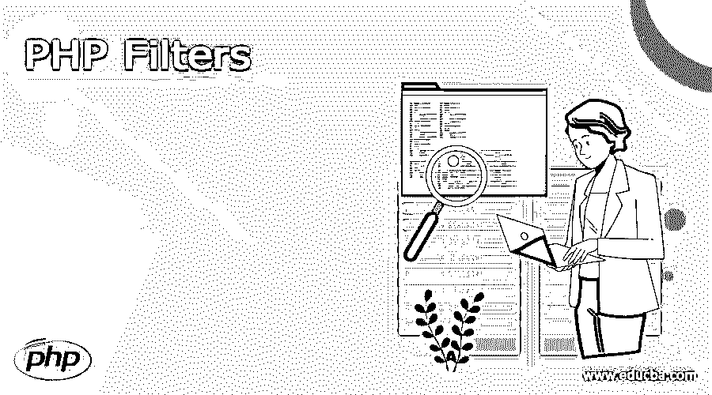

# PHP 过滤器

> 原文：<https://www.educba.com/php-filters/>




## **PHP 过滤器简介**

很少有语言具有过滤功能。过滤器是编程语言的增值特性之一。这有助于我们在处理之前过滤数据或字符串。这是使用它来防止系统中的一些漏洞问题的时候了。PHP 过滤器可用于验证或净化外部输入。基本上，PHP 过滤器是一个扩展，它提供了我们在编码时可以使用的各种功能和特性。例如，我们将表单中的客户端输入作为电子邮件 id，我们应该在数据库相关操作之前进行验证或清理。作为一名编码人员或开发人员，我们应该根据我们的业务需求和要求在 PHP 中使用这些过滤器。

**语法**

<small>网页开发、编程语言、软件测试&其他</small>

净化和过滤器是 web 应用程序环境中最常见的操作。下面是基本语法:

```
filter_var(variable, filter, options)
```

这个函数 filter_var 有 3 个参数。最后两个参数 filter 和 options 是可选的。第一个是变量或标识符本身。这是一个，我们想要过滤，第二个是我们想要做的(基本上我们在 PHP 中传递可用选项的 ID)，最后一个是过滤器相关的选项。让我们通过一个测验示例来理解这一点:

```
<?php
$int_val = 200;
if(filter_var($int_val, FILTER_VALIDATE_INT)){
echo "The <b>$int_val</b> is a valid one."; // valid
} else{
echo "The <b>$int_val</b> not a valid input as an integer"; // invalid
}
?>
```

在上面的例子中，我们使用了一个过滤器，检查变量$int_val 中是否有一个整数值。这是相同的输出。

**输出:**


### 为什么我们在 PHP 中使用过滤器？

许多 PHP web 应用程序从客户端接收外部输入。使用它的想法是在处理之前清理用户输入，因为我们不能期望用户正确地输入所有数据。任何外部用户或系统输入或数据都可能导致严重的安全问题。

我们可以在这里进行过滤，以过滤从各种外部来源输入的数据，例如:

*   从表单直接客户端用户输入
*   Cookies 的数据
*   来自 Web 服务的数据
*   服务器变量的数据
*   数据库查询结果

PHP 过滤器和杀毒程序一起使我们能够判断输入是否有效。如果不是一个有效的输入，在这种情况下，我们可以净化它，使之成为一个有效的输入。在接下来的示例部分，我们将介绍与此相关的各种示例。

### PHP 中的过滤器示例

PHP 中有各种类型的过滤器。我们可以使用 filter_list()函数来检查这个列表。基本上，这些过滤功能可以用来过滤网址，字符串，数字，IP 地址等。

#### 示例#1

在本节中，我们将一个接一个地看到各种过滤器示例程序。

消毒绳子

检查字符串是否有效

```
<?php
$comment = "Hello word";
if(filter_var($comment, FILTER_SANITIZE_STRING)){
echo "The <b>$comment</b> is a valid one."; // valid
} else{
echo "The <b>$comment</b> not a valid input"; // invalid
}
?>
```

在上面的例子中，我们可以看到一个有效的字符串，这就是它给出有效字符串的原因。

**输出:**


获取净化后的字符串作为输出

```
<?php
$comment = "<i>Hello word</i>";
echo "Before sanitizing: ". $comment;
$comment = filter_var($comment, FILTER_SANITIZE_STRING);
echo "<br>"; // for new line
echo "After sanitizing: ". $comment;
?>
```

我们可以看到有两个不同的输出。我们可以看到消毒前和消毒后的输出是不同的。消毒后，HTML 标签已经被 PHP 过滤器函数删除。

**输出:**


#### 实施例 2

验证 IP 地址

PHP 过滤函数可以为我们做这项工作。让我们看看这个例子。

```
<?php
$ip_address = "172.16.254.1:40";
if(filter_var($ip_address, FILTER_VALIDATE_IP)){
echo "The <b>$ip_address</b> is a valid one."; // valid
} else{
echo "The <b>$ip_address</b> is not a valid input"; // invalid
}
?>
```

**输出:**


#### 实施例 3

净化和验证电子邮件地址

```
<?php
$email_address = "someone@@testmail.com";
code>
echo "Before Sanitizing: " . $email_address ."<br>";
if(filter_var($email_address, FILTER_VALIDATE_EMAIL)){
echo "The <b>$email_address</b> is a valid one."; // valid
} else{
echo "The <b>$email_address</b> not a valid input"; // invalid
}
echo "<br>";
echo "After Sanitizing: " .  filter_var($email_address, FILTER_SANITIZE_EMAIL);
?>
```

在上面的例子中，我们有一个无效的电子邮件 id 值，因为我们是通过使用 filter 函数得到这个输出的。但是当我们对其进行消毒时，会给出正确的电子邮件。

**输出:**


```
<?php
$email_address = "someone@testmail.com";
if(filter_var($email_address, FILTER_VALIDATE_EMAIL)){
echo "The <b>$email_address</b> is a valid one."; // valid
} else{
echo "The <b>$email_address</b> not a valid input"; // invalid
}
?>
```

在上面的 PHP 代码示例中，我们检查电子邮件是否有效。

**输出:**


#### 实施例 4

净化和验证 URL

在这个例子中，我们将看到一个输入 URL 是否有效？如果不是一个有效的网址，然后它会清理，使其正确。

```
<?php
$URL = "https://www.educba.com/��courses�";
echo "Before Sanitizing: " . $URL ."<br>";
if(filter_var($URL, FILTER_VALIDATE_URL)){
echo "The <b>$URL</b> is a valid one."; // valid
} else{
echo "The <b>$URL</b> is not a valid input"; // invalid
}
echo "<br>";
echo "After Sanitizing: " . filter_var($URL, FILTER_SANITIZE_URL);
?>
```

**输出:**


### 结论

我们应该使用 PHP 过滤器来验证或净化用户输入。这样，我们可以限制易受攻击的用户输入。我们可以使用各种 PHP 过滤函数来验证用户输入和值。我们也可以进行清理，以清除值(用户输入或直接分配)。在使用任何 cookies 数据进行数据处理之前，我们应该始终使用 PHP 杀毒程序。

### 推荐文章

这是 PHP 过滤器指南。这里我们也讨论语法，为什么我们在 PHP 中使用过滤器和例子。您也可以看看以下文章，了解更多信息–

1.  [PHP 框架](https://www.educba.com/php-frameworks/)
2.  [PHP 加密](https://www.educba.com/php-encryption/)
3.  [PHP 数组搜索](https://www.educba.com/php-array-search/)
4.  [PHP 拆分数组](https://www.educba.com/php-split-array/)


