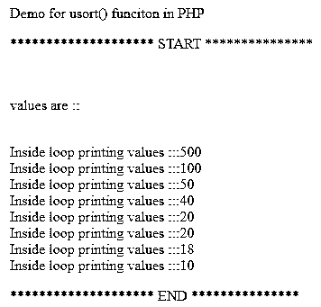
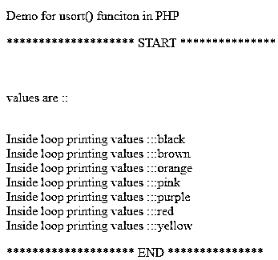

# PHP usort()

> 原文：<https://www.educba.com/php-usort/>

## PHP usort()函数的定义

这个函数用于在 PHP 中对数组进行排序。我们可以根据我们的逻辑和要求对数组进行排序，这意味着它使用用户定义的函数对定义的数组进行排序。此外，它从数组中删除所有旧的键，并为数组的每个元素分配新的键。这些新键将是一个整数，从 0 开始，一直到数组中的元素数。

**语法:**

<small>网页开发、编程语言、软件测试&其他</small>

这个函数接受两个参数作为输入。不管怎样，PHP 有如此多的内置函数可以用来排序数组元素，但是这里我们可以传递一个用户定义的函数来排序数组元素，这是这个函数的一个优点。让我们详细讨论一下语法，见下文；

例如:`boolean usort( array, function)`

正如我们看到的，这个函数有两个参数作为输入。一个是我们想要排序的数组，另一个是用户定义的函数。这将决定数组元素的排序，简而言之，它将如何表现。现在，我们将看到一个练习示例，以便尽可能更好地理解语法。

例如:`usort( $myArr, "demo_sort_function");`

在上面的语法中，我们将数组和用户定义的函数传递给 usort()函数。我们将在下一节详细讨论这个函数。

### usort()函数在 PHP 中是如何工作的？

现在我们知道 usort()函数用于以用户定义的方式对数组进行排序。我们可以为数组元素的排序定义自己的逻辑。PHP 提供了如此多的内置函数来对数组进行排序，但这里的一个好处是我们可以在这里编写排序算法来进行排序。此外，该函数将删除数组元素的所有旧键，并为每个元素分配一个新键。这个键的顺序将从 0 开始，以此类推，直到函数的长度。现在我们将详细讨论这个函数作为输入的参数以及函数的返回类型。见下文

该函数有两个参数，如下所示:

**1)****$ array(first param):**这是该函数作为输入的第一个参数。我们可以定义一个数组并将它传递到这里。这将是我们希望以某种新的方式排序的数组。

**2)** 我们可以定义一个函数，然后从这个 usort()函数调用用户定义的函数。我们需要像这样在“function_name”中传递名称。下面我们调用一个函数，在这个函数中我们根据名字对数组进行排序。

**例如**。:`usort($arr, "sortByName")`

3) Boolean(返回类型):此函数的返回类型是 Boolean，Boolean 根据函数的结果表示值 TRUE 或 FALSE。该函数在失败的情况下将返回 FALSE，在成功的情况下将返回 TRUE。现在，我们将看到一个实践示例，展示这一功能的实际工作方式以及我们可以在何处使用该功能。这里有一个练习例子，让初学者理解它的流程和工作方式。见下文；

**例如**:

`function my_function_to_sort($a1,$b1)
{
if ($a1==$b1) return 0;
if ($a1 < $b1)
return 1;
else
return -1;
}
$myarr=array(40, 50, 20, 10, 100, 500, 20, 18);
usort($myarr,"my_function_to_sort");`

在上面的例子中，我们已经创建了一个名为“myarr”的数组，它将包含我们想要排序的所有元素。这里我们给这个数组赋值为 40，50，20，10，100，500，20，18，并且使用了 PHP 中已经有的数组函数。此外，我们还创建了一个名为“my_function_to_sort”的函数，该函数负责根据我们返回的条件对数组元素进行排序。在这里面，我们主要写了如果两个传递的值大于或小于或等于对方的逻辑。在此基础上，wit 将元素放入数组。

现在我们将详细了解这些条件，1，-1 和 0 的意义是什么，我们来详细讨论一下。见下文；

1) 0:如果两个元素相等，那么它将在这里返回 0。

2) 1:从上面的条件我们可以看出，如果 a1 小于 b1，那么它将返回 1。

3) -1:从上面的条件我们可以看出，如果 a1 大于 b1 那么它将返回-1。

整个逻辑将负责把一个整数数组按升序或降序排序。在上面的程序中，它将为我们对数组元素进行降序排序。

在这之后，我们调用 usort()函数，并且在这里传递我们自己的参数，命名为' $myarr '，' my_function_to_sort '。这可以说是我们通过使用 usort ()
函数实现的自定义排序。

### PHP usort()的例子

让我们讨论 PHP usort()的例子。

#### 示例 1

1)在这个例子中，我们使用 PHP 中的 usort()函数对一个整数数组进行排序。这是一个自定义排序，这里我们按降序排序。

`<!DOCTYPE html>
<html>
<body>

Demo for usort() funciton in PHP

******************** START ***************

<?php
function my_function_to_sort($a1,$b1)
{
if ($a1==$b1) return 0;
if ($a1 < $b1)
return 1;
else
return -1;
}
$myarr=array(40, 50, 20, 10, 100, 500, 20, 18);
usort($myarr,"my_function_to_sort");
echo " ";
echo "
values are ::
";
echo " ";
$lenarr=count($myarr);
for($i=0;$i<$lenarr;$i++)
{
echo "Inside loop printing values :::";
echo $myarr[$i];
echo " ";
}
?>

******************** END ***************

</body>
</html>`

**输出:**

#### 示例 2

在这个例子中，我们试图使用 PHP 中的 usort()函数对字符串数组进行排序。这里我们按升序或自然顺序排序。

`<!DOCTYPE html>
<html>
<body>

Demo for usort() funciton in PHP

******************** START ***************

<?php
function my_function_to_sort($a1,$b1)
{
if ($a1==$b1) return 0;
if ($a1 < $b1)
return -1;
else
return 1;
}
$myarr=array("red","yellow", "orange", "black","pink","purple","brown");
usort($myarr,"my_function_to_sort");
echo " ";
echo "
values are ::
";
echo " ";
$lenarr=count($myarr);
for($i=0;$i<$lenarr;$i++)
{
echo "Inside loop printing values :::";
echo $myarr[$i];
echo " ";
}
?>

******************** END ***************

</body>
</html>`

**输出:**

### 结论

通过使用这个函数，我们可以按照自定义的顺序或者用户定义的方式对数组进行排序。这可以称为新的排序方式。通过使用它，我们可以对数组中任意数量的元素进行排序，并应用我们自己的逻辑以升序、降序或自然顺序对数据进行排序。

### 推荐文章

这是一个 PHP usort()的指南。在这里，我们讨论了 PHP usort()的定义、语法、参数及其工作原理，以及要实现的示例，您也可以浏览我们的其他相关文章以了解更多信息

1.  [PHP 内爆](https://www.educba.com/php-implode/)
2.  [PHP array_pop()](https://www.educba.com/php-array_pop/)
3.  [PHP 拆分字符串](https://www.educba.com/php-split-string/)
4.  [PHP preg_match_all](https://www.educba.com/php-preg_match_all/)

