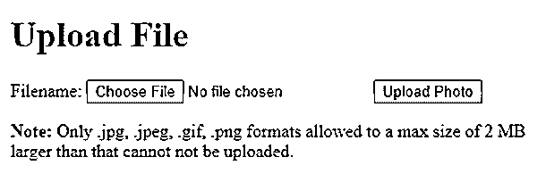

# 用 PHP 上传文件

> 原文：<https://www.educba.com/upload-a-file-in-php/>


## PHP 上传文件简介

在 PHP 中，用户可以使用文件上传功能上传文件，并且文件必须通过表单提交，很容易附加和上传。用户可以上传许多类型的文件，可以是文档形式、图像形式、pdf 形式等。这类文件带有扩展名，即。docx，。jpeg，。pdf 等。这种类型的文件由表单验证，并且文件的大小被设置为不允许上传超过该大小的文件。对于以前手动输入数据的用户来说，这是一个高级功能，现在他们选择了这个选项。

### 如何用 PHP 创建上传文件？

使用 PHP，使用一个表单将文件上传到服务器是非常容易的，而且数据相对于其他文件也是安全的。配置文件“php.ini”文件有一个变量，必须为要上传的文件设置该变量，该变量称为“file_uploads ”,应设置该变量以启用上传功能。上传文件到服务器需要几个步骤。

<small>网页开发、编程语言、软件测试&其他</small>

在使用表单将文件上传到服务器之前，有一些检查。这些检查被称为对上传文件的验证。

下面是开发人员为验证表单而编写的一些要点:


#### 1.文件 _ 上传

对于要上传的文件，此变量的值应该为 ON。如果未打开，则文件无法上传到服务器。所以，应该一直开着。

#### 2.上传最大大小

该指令用于配置可以使用表单上传到服务器的文件的最大大小。这是一种查看用户上传的文件大小的检查。文件的默认大小设置为 2M(2mb)，我们可以使用。开发人员可以在其中增加文件大小的 htaccess 文件。以今天的标准来看，2mb 并不算多，所以我们可能不得不增加它。如果您在尝试上载文件时收到文件大小超过 upload_max_filesize 的错误，则需要增加该值。如果这样做，一定要增加 post_max_size。

#### 3.上传 _ 临时目录

它设置一个临时目录，用于存储用户上传的文件。在大多数情况下，但我们不必担心这个设置。如果不设置，系统默认会自动设置可以使用的 temp 目录。

#### 4.Post_max_size

post_max_size 指令允许我们设置 post 方法上传的数据的最大大小。因为文件是通过 POST 请求上传的，所以该值必须大于我们为 upload_max_filesize 设置的值。例如，如果 upload_max_filesize 是 20M (20 兆字节)，我们可能需要将 post_max_size 设置为 24M。

#### 5.最大文件上传量

它允许您设置用户一次可以上传的最大文件数量。用户的默认计数是一次 20 个。

#### 6.最大输入时间

它是用户允许脚本解析输入数据的秒数。如果我们要处理大容量的文件上传，我们应该将它设置为一个合理的值。60 (60 秒)，对于大多数应用程序来说，这是一个不错的值。

#### 7.内存 _ 限制

memory limit 指令指示脚本在服务器中可以消耗的最大内存量。如果我们在上传大文件的过程中遇到任何问题，我们需要将该指令的值设置为大于我们为 post_max_size 指令设置的值。默认情况下，该值设置为 128M (128 兆)，所以除非我们有一个非常大的 post_max_size 和 upload_max_filesize，否则我们不必担心这个问题。

#### 8.最大执行时间

该指令用于限制脚本在服务器上运行的最大秒数。如果我们在上传大文件的过程中遇到任何问题，我们可以考虑将该值增加到更多秒，如 60 秒(1 分钟)，这对大多数应用程序来说应该很好。

### PHP 中上传文件的例子

下面是一些例子:

#### 示例#1

**代码:**

```
<!DOCTYPE html>
<html>
<body>
<form action="uploadimage.php" method="POST" enctype="multipart/form-data">
Select any image to upload:
<input type="File" name="FileUpload" id="FileUpload">
<input type="submit" value="Upload" name="SUBMIT">
</form>
</body>
</html>
```

**输出:**


#### 实施例 2

**代码:**

```
<!DOCTYPE html>
<html lang="en">
<head>
<title>Photo Upload Form</title>
</head>
<body>
<form action="upload.php" method="POST" enctype="multipart/form-data">
<h1>Upload File</h1>
<label for="fileSelect">Filename:</label>
<input type="file" name="photo" id="FileSelect">
<input type="submit" name="SUBMIT" value="Upload Photo">
<p><strong>Note:</strong> Only .jpg, .jpeg, .gif, .png formats allowed to a max size of 2 MB larger than that cannot not be uploaded.</p>
</form>
</body>
</html>
```

**输出:**




#### 实施例 3

**代码:**

```
<!DOCTYPE html>
<html>
<body>
<form action="upload.php" method="POST" enctype="multipart/form-data">
Select a file to upload:
<input type="file" name="FileToUpload"/>
<input type="submit" value="Upload" name="submit"/>
</form>
</body>
</html>
```

**输出:**


#### 实施例 4

**代码:**

```
<?php
$target_path = "c:/";
$target_path = $target_path.basename( $_FILES['fileToUpload']['name']);
if(move_uploaded_file($_FILES['fileToUpload']['tmp_name'], $target_path)) {
echo "File has been uploaded successfully!";
}
else
{
echo "Sorry, file not uploaded, please check and try again!";
}
?>
```

**输出:**


在上述示例中，用户可以看到快照中显示的屏幕。用户将通过单击“选择文件”选项来附加文档。一旦用户从他的本地机器上选择文件并点击上传按钮向服务器提交文档，该文件将被附加。然后，系统会提示用户一条消息，说明文件已成功上传。

### 结论

在本文中，我们讨论了用户如何使用表单将文件上传到服务器，如何在各种表单中验证上传的文件，以及上传文件的服务器限制。用户可能不理解后端的过程，但开发人员必须以这样的方式编码，用户上传的文档应该是正确的，数据是安全的。

### 推荐文章

这是一个用 PHP 上传文件的指南。这里我们讨论基本概念，如何在 PHP 中创建上传文件，PHP 中上传文件的例子。您也可以浏览我们推荐的其他文章，了解更多信息——

1.  [PHP 表单](https://www.educba.com/php-form/)
2.  [PHP 中的基本名称](https://www.educba.com/basename-in-php/)
3.  [PHP 拆分数组](https://www.educba.com/php-split-array/)
4.  [PHP 中的 error_reporting()](https://www.educba.com/error_reporting-in-php/)


