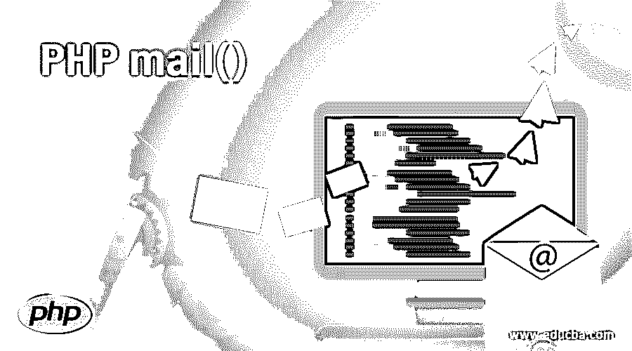
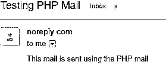
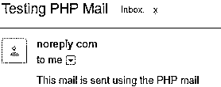
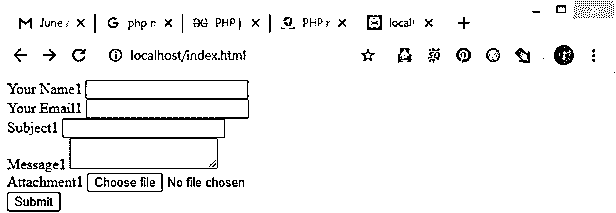
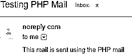

# PHP 邮件()

> 原文：<https://www.educba.com/php-mail/>

## PHP 邮件介绍()

mail()函数有助于让邮件轻松地直接从脚本中发送。它通常接受五个参数，但只有前三个参数是强制的，另外两个参数是可选的，如果所有参数都在 mail()函数的括号内，那么这两个参数就不是强制的。它有助于在需要时使用某种形式直接从网站或博客发送邮件。它是 PHP 编程语言的一个内置函数，可以帮助从 PHP 脚本发送一些电子邮件。在通知用户重要任务或事件时，这种方式非常经济。

### 语法和参数

下面是语法

<small>网页开发、编程语言、软件测试&其他</small>

`mail(to1, subject1, message1, headers1, parameters1);`

mail()函数的参数说明:

*   **mail()函数的 to1 参数:**PHP 编程语言的 mail()函数的“to1”参数是必填字段。它有助于指定邮件的接收者。
*   **mail()函数的 subject1 参数:**PHP 编程语言的 mail()函数的“subject1”参数也是必填字段。它有助于指定电子邮件的主题。该参数可能包含也可能不包含任何类型的换行符。
*   **mail()函数的 message1 参数:**PHP 编程语言的 mail()函数的“message1”参数和上面 2 个参数一样，也是必填字段。它有助于定义将要发送的消息。它的每一行都应该用一些 LF (\n)隔开。每行不应超过 70 个字符。在 windows 中，如果在消息中特定行的开头发现 FULLSTOP，则可能会将其删除。为了解决这类问题，我们必须借助双点字符“..”来替换句号字符.
*   mail()函数的 headers1 参数:PHP 语言的 headers1 参数是一个可选字段，但它有助于指定一些附加的头，如 Cc、From、Bcc 函数。一些附加头将用 CRLF 分隔开-(\ r \ n)。当我们在发送电子邮件的过程中，它可能会包含一些来自标题。这可以用这个 headers1 参数或者用 PHP 来设置。INI 格式文件。
*   **mail()函数的 parameters1 参数:**mail 函数的 parameters1 参数是可选的。此参数指定附加参数。它有助于为电子邮件发送程序指定附加参数。当我们使用–f 发送邮件选项时，此设置将被设置为信封发件人地址。

### PHP 中 mail()函数是如何工作的？

PHP 编程语言的 mail()函数通过帮助直接从 PHP 脚本本身发送邮件来工作。它适用于 PHP 4+版本。在 PHP 4 版本之前，这个 mail()不起作用，所以如果你的 PHP 版本在 PHP 4 版本之前，就不要尝试 mail()函数。它通过返回地址参数的哈希值来工作。但是，我们必须记住，即使邮件被接受交付，但这并不意味着电子邮件实际上收到或发送。

PHP 4.0.5 版本添加了 parameter1 参数。在 PHP 4.2.3 PHP 版本中，parameter1 参数在安全模式下被禁用。在 Windows 操作系统下的 PHP 4.3.0 版本中，接受一些自定义标题，如 Cc、Bcc、From、Date，它们不区分大小写。在 PHP 5.4 版本中，添加头部注入保护只是为了头部参数的目的。在 PHP 7.2 版本中，headers1 参数也将接受一个数组。

### 例子

下面是提到的例子:

#### 示例#1

在这个例子中，我们将实现 PHP 编程语言的 mail()函数。这里首先创建了 PHP 标签，在标签中创建了一些变量，其中包含一些值。首先，用某个字符串值创建“to_email1 ”,该字符串值是发送邮件所需的特定电子邮件/gmail 地址。然后用一些字符串内容创建“subject1”变量以显示主题，然后创建 message 变量，然后给它分配一些重要的消息文本 info/other。它将信息指定给 to_email1 地址的人。然后创建 header1 变量。然后使用主 PHP 函数 mail()。这里，mail()函数包含了 4 个参数。这个函数将有助于用 PHP 脚本发送邮件。

**代码:**

`<?php
$to_email1 = 'name1 @ company .com';
$subject1 = 'Testing the PHP Mail';
$message1 = 'This mail is sent using the PHP mail function';
$headers1 = 'From: noreply @ company .com';
mail($to_email1,$subject1,$message1,$headers1);
?>`

**输出:**

#### 实施例 2

这是一个实现自定义函数的例子，仅借助 PHP 脚本中的 mail()函数，就可以将安全邮件发送给特定的人。这里首先创建了一个带有一些字段的函数以及条件语句。然后用某个电子邮件地址创建“to_email1”变量。然后创建 subject1、messages 和 headers1 变量。基于 IF ELSE 条件和 mail()函数以及 HTML 显示元素，程序将运行，邮件将发送到指定的电子邮件人或除 PHP 之外的其他人。INI 文件设置应该是完美的，或者如果可能的话使用任何在线编译器。

**代码:**

`<?php
functionsanitize_my_email($field1) {
$field1 = filter_var($field1, FILTER_SANITIZE_EMAIL);
if (filter_var($field1, FILTER_VALIDATE_EMAIL)) {
return true;
} else {
return false;
}
}
$to_email1 = 'name @ company .com';
$subject1 = 'Testing PHP Mail';
$message1 = 'This mail is sent using the PHP mail ';
$headers1 = 'From: noreply @ company. com';
//check whether the email address is invalid or not $secure_check
$secure_check1 = sanitize_my_email($to_email1);
if ($secure_check1 == false) {
echo "Invalid input";
} else { //send email
mail($to_email1, $subject1, $message1, $headers1);
echo "This email is now sent using the PHP Mail";
}
?>`

**输出:**

#### 实施例 3

这是在不使用 PHP 编程语言的 mail()函数中的 header1 参数的情况下实现 PHP mail()函数的示例。这是一封简单的邮件，但是没有使用 header1 参数。

**代码:**

`<?php
$to1 = 'pavankumarsake1@email.com';
$subject1 = 'The Marriage Proposal';
$message1 = 'Hi Radha, will you marry me? Say Yes or No';
$from1 = 'radhikaboga@email.com';
// Sending email
if(mail($to1, $subject1, $message1)){
echo 'Now Your mail will be sent automatically and successfully.';
} else{
echo 'Now it is Unable to send the email/gmail. Please try again.';
}
?>`

**输出:**

#### 实施例 4

这是实现 PHP mail()函数的示例，目的是随邮件一起发送附件文件。这里首先为一些变量值创建 HTML 表单并获取附件文件。点击提交按钮后，PHP mail()函数在 PHP mail 函数代码的帮助下工作。然后将显示输出文本，如下面的输出部分所示。

**HTML 文件编码:**

`<html>
<body>
<form enctype="multipart/form-data" method="POST" action="string22.php">
<label>Your Name1 <input type="text" name="sender_name1" /></label> 
<label>Your Email1 <input type="email" name="sender_email1" /></label> 
<label>Subject1 <input type="text" name="subject1" /></label> 
<label>Message1 <textarea name="message1"></textarea></label> 
<label>Attachment1 <input type="file" name="attachment1" /></label> 
<label><input type="submit" name="button" value="Submit" /></label> 
</form>
</body>
</html>`

**PHP 文件编码:**

`<?php
if($_POST['button'] &&isset($_FILES['attachment1']))
{
$from_email         = 'pskills1473@gmail.com'; //from mail, sender email addrress
$recipient_email    = 'pskills1473@gmail.com'; //recipient email addrress
//Load POST data from HTML form
$sender_name1    = $_POST["sender_name1"] //sender name1
$reply_to_email = $_POST["sender_email1"] //sender email1, it will be used in "reply-to" header
$subject1        = $_POST["subject1"] //subject1 for the email
$message1        = $_POST["message1"] //message1 body1 of the email
//Get uploaded file data using $_FILES array
$tmp_name    = $_FILES['my_file']['tmp_name']; // Now get the temporary file name1 of the file on the server
$name        = $_FILES['my_file']['name'];  // Now get the name of the file1
$size        = $_FILES['my_file']['size'];  // Now get size of the file1 for size validation
$type        = $_FILES['my_file']['type'];  // Now get type of the file1
$error       = $_FILES['my_file']['error']; // Now get the error (if any)
//It is a validating form field which helps in attaching the file
if($file_error> 0)
{
die('Upload error or No files uploaded');
}
//It is like reading from a specific uploaded file and also the base64_encode content1
$handle1 = fopen($tmp_name, "r");  // Now setting the file handle1 only for reading the file
$content1 = fread($handle1, $size); // Now reading the file
fclose($handle1);                  // Now close upon completion
$encoded_content11 = chunk_split(base64_encode($content1));
$boundary1 = md5("random"); // Now defining the boundary1 with a md5 hashed value
//Now header
$headers1 = "MIME-Version: 1.0\r\n"; // Now Defining the MIME version
$headers1 .= "From:".$from_email."\r\n"; // Now the Sender Email
$headers1 .= "Reply-To: ".$reply_to_email."\r\n"; // Now Email addrress to reach back
$headers1 .= "content1-Type: multipart/mixed;\r\n"; // Now Defining content1-Type
$headers1 .= "boundary1 = $boundary1\r\n"; // Now Defining the boundary1
//Now this is about plain text
$body1 = "--$boundary1\r\n";
$body1 .= "content1-Type: text/plain; charset=ISO-8859-1\r\n";
$body1 .= "content1-Transfer-Encoding: base64\r\n\r\n";
$body1 .=chunk_split(base64_encode($message1));
//NOw attachment1
$body1 .= "--$boundary1\r\n";
$body1 .="content1-Type: $file_type; name=".$file_name."\r\n";
$body1 .="content1-Disposition: attachment1; filename=".$file_name."\r\n";
$body1 .="content1-Transfer-Encoding: base64\r\n";
$body1 .="X-attachment1-Id: ".rand(1000, 99999)."\r\n\r\n";
$body1 .= $encoded_content11; // NOw Attaching the encoded file with email
$sentMailResult1 = mail($recipient_email, $subject1, $body1, $headers1);
if($sentMailResult1 )
{
echo "This mail is sent using the PHP mail function"; // Now it will be printed only if the file is going to be sent successfully
unlink($name); // Now deleting the file just after the attachment1 is sent.
}
else
{
die("Sorry attachment mail not sent");
}
}
?>`

**HTML 代码输出:**

**PHP 代码输出:**

### 结论

我们希望您已经了解了 PHP mail()函数的定义及其语法和对 mail()函数参数的解释，mail()函数在 PHP 中是如何工作的，以及如何更好、更容易地理解 mail()概念的各种示例。

### 推荐文章

这是 PHP 邮件()指南。在这里，我们讨论了 PHP mail()的介绍，语法，参数，它是如何工作的，并举例实施，你也可以通过我们的其他相关文章来了解更多

1.  [PHP substr_count()](https://www.educba.com/php-substr_count/)
2.  [PHP 注释](https://www.educba.com/php-annotations/)
3.  [PHP strtotime](https://www.educba.com/php-strtotime/)
4.  [PHP MD5()](https://www.educba.com/php-md5/)

