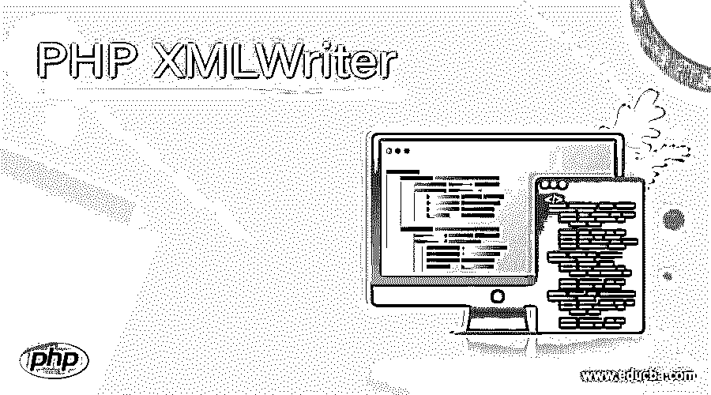
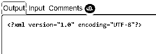

# PHP XMLWriter

> 原文：<https://www.educba.com/php-xmlwriter/>

## PHP XMLWriter 的定义

XML writer 用于在 PHP 中创建文件或数据流。如果你想存储 XML 容器或者想生成任何可以包含 XML 数据文件，那么我们应该使用 PHP 的 XML writer。XML writer 包含了几种在 PHP 中处理 XML 内容的方法，我们也可以在其中添加 HTML 数据。XML writer 提供了多种方法，可用于创建文档、属性开头、属性结尾等。在下一节中，我们将更多地讨论 XML 编写器及其可用于处理 XML 内容的方法。

**语法:**

<small>网页开发、编程语言、软件测试&其他</small>

因为 XML 编写器有很多方法可以用来创建文档、属性等等。但是我们必须创建 XML 编写器的对象，然后我们可以调用它的方法来创建 XML 内容。让我们详细看看它的语法，以便更好地理解它。

`$mywriter = new XMLWriter();
$mywriter->anymethod('output');`

在上面的语法行中，我们可以看到我们正在创建 XML Writer 对象，之后我们可以调用任何方法来处理 XML。在下一节中，我们将看到一个实践示例来更好地理解它。

### XML writer 在 PHP 中是如何工作的？

正如我们现在所知道的，XML writer 是一个类，它提供了许多可以用来处理 XML 的方法。通过使用它，我们可以生成包含 XML 内容的数据流或文件。在里面，我们也可以有我们的 HTML 属性和标签。在本节中，我们将讨论更多可用的方法，如何在编程时使用它们，并详细讨论它们的用法以及它们的方法签名，见下文；

### 方法

下面描述了一些可用的方法；

*   XMLWriter::writeElementNs —此方法用于创建写完整命名空间元素。
*   XMLWriter::writeElement —此方法用于创建写满元素。
*   xmiwriter::writepi —此方法用于创建写 pi
*   XMLWriter::writeRaw —此方法用于创建写原始 XML 文本
*   XMLWriter::startCdata —此方法用于创建 Cdata 标记
*   XMLWriter::startComment —此方法用于创建注释
*   XMLWriter::startDocument —此方法用于创建文档标记
*   XMLWriter::startDtdAttlist —此方法用于创建 DTD 属性列表
*   XMLWriter::startDtdElement —此方法用于创建 DTD 元素
*   XMLWriter::startDtdEntity —此方法用于创建 DTD 实体
*   XMLWriter::writeAttribute —此方法用于创建写满属性
*   XMLWriter::writeCdata —此方法用于在 XMLWriter 中创建 write full CDATA 标记。
*   XMLWriter::writeComment —此方法用于在 XMLWriter 中创建写完整注释标记。
*   XMLWriter::writeDtdAttlist —此方法用于在 XMLWriter 中创建 write full DTD AttList 标记。
*   XMLWriter::writeDtdElement —此方法用于在 XMLWriter 中创建 write full DTD 元素标记。
*   XMLWriter::writeddentity—此方法用于创建写完整 DTD 实体。
*   XMLWriter::endAttribute —此方法用于在开始后结束属性。
*   XMLWriter::endCdata —通过使用它，我们可以在 XMLWriter 中结束当前的 Cdata。
*   XMLWriter::endComment —此方法用于创建注释，但不创建结束注释。
*   XMLWriter::endDocument —此方法用于结束文档，但此文档将是当前文档。
*   XMLWriter::endDtdAttlist —此方法用于结束当前 DTD 属性列表(可能是属性列表)
*   XMLWriter::endDtdElement —此方法用于结束当前 DTD 元素
*   XMLWriter::endDtdEntity —此方法用于结束当前的 DTD 实体
*   xmiwriter::enddtd —此方法用于结束当前的 dtd
*   XMLWriter::endElement —此方法结束 XMLWriter 的当前元素。
*   xmiwriter::endpi —此方法用于结束当前 pi
*   xmiwriter::flush —此方法用于刷新缓冲区。
*   XMLWriter::fullEndElement —此方法也用于结束当前元素。
*   xmiwriter::openmemory —这个方法用于创建 xmlwriter。
*   XMLWriter::startDtd —此方法用于在 XMLWriter 中创建 Dtd。
*   XMLWriter::startElementNs —此方法用于在 XMLWriter 中创建命名空间元素标记。
*   XMLWriter::startElement —此方法用于创建元素标记
*   XMLWriter::startPi —此方法用于在 XMLWriter 中创建 Pi 标记。
*   xmiwriter::text —此方法用于创建书写文本。
*   XMLWriter::writeAttributeNs —此方法用于创建写完整命名空间属性
*   XMLWriter::openUri —此方法用于使用指定的源 Uri 创建 XMLWriter。
*   XMLWriter::outputMemory —此方法用于返回当前缓冲区
*   XMLWriter::setIndentString —此方法用于设置缩进的字符串
*   XMLWriter::setIndent —该方法用于切换缩进(开/关)
*   XMLWriter::startAttributeNs —此方法用于创建起始名称空格属性。
*   XMLWriter::startAttribute —此方法用于创建开始属性。
*   XMLWriter::writeDtd —此方法用于创建写完整 Dtd。

让我们举一个例子来更好地理解它。

*   首先，创建 XML 编写器对象。
*   2)之后，我们可以调用给定对象上的任何方法。我们已经详细讨论了这些方法及其工作。
*   要创建 XML 文档，我们可以调用 start document 方法，在这个方法中，我们可以指定 XML 版本号和编码类型，这将是输出中可用的第一行。
*   下面的例子是用 PHP 编写的 XML writer。

例如:

`$mywriter->startDocument('1.0', 'UTF-8');`

这些是处理 XML writer 时需要传递的必需参数。

### PHP XMLWriter 示例

在本例中，我们正在创建一个文档。我们有两个来自 XMLWriter 的方法来创建文档。首先，我们开始文档，最后，我们关闭它。确保你有正确的设置来运行程序，否则它不会运行。

#### 示例#1

`<?php
$mywriter = new XMLWriter();
$mywriter->openURI('php://output');
$mywriter->startDocument('1.0', 'UTF-8');
$mywriter->endDocument();
?>`

**输出:**

### 结论

通过使用 XMLWriter，我们可以创建 XML 内容，它还为我们提供了我们已经讨论过的各种方法，为了使用它们，我们需要一个 XMLWriter 对象来调用它们。我们可以使用这些方法创建注释、属性和标签。

### 推荐文章

这是一个 PHP XMLWriter 的指南。这里我们讨论 PHP XMLWriter 的定义，XMLWriter 在 PHP 中是如何工作的？并分别举例说明。您也可以看看以下文章，了解更多信息–

1.  [PHP 附加文件](https://www.educba.com/php-append-file/)
2.  [PHP mail()](https://www.educba.com/php-mail/)
3.  [PHP 梁()](https://www.educba.com/php-strlen/)
4.  [PHP 异步](https://www.educba.com/php-async/)

