# PHP 中的模式

> 原文：<https://www.educba.com/patterns-in-php/>


## PHP 模式介绍

PHP 中的模式编程是什么？通过[编程](https://www.educba.com/what-is-a-programming-language/)在屏幕上打印某种图案是一种艺术。这可以是一系列数字、字母或特殊字符，以形成一种模式。最简单的模式例子是[斐波那契数列](https://www.educba.com/fibonacci-series-in-javascript/) (1，1，2，3，5，8，13，21，34 等等)。然后是屏幕上设计的其他图案，比如说星星的金字塔。所以，基本上，模式编程就是简单地在屏幕上打印一个模式。

对于本文，我们将使用 [PHP](https://www.educba.com/introduction-to-php/) 来编码模式。不过不要担心。一旦你掌握了其中的诀窍，它只是不同语言之间的语法不同。逻辑是一样的，一直都是。

<small>网页开发、编程语言、软件测试&其他</small>

### PHP 中的模式示例

*   在进入程序之前，让我们理解编码模式的基本逻辑。模式总是通过嵌套循环编程——大多数是嵌套 for 循环。这是因为*循环*在语法上更容易理解和简洁。
*   外部循环总是与行数有关。因此，假设您必须打印跨越五行的图案，外部循环将总是运行五次。
*   内部循环总是与每行中的元素数量有关。所以，假设你必须在第一行打印 1 颗星，在第二行打印 2 颗星，依此类推，内部循环会控制这个逻辑。
*   根据模式的不同，有时会有不止一个内部循环或三层嵌套循环。此外，还涉及空格和制表符，以产生所需的模式。

因此，记住所有这些，现在让我们试着编码模式。

#### 1.星形半金字塔

这是最简单的印刷图案。它在随后的行中打印出越来越多的恒星。一线 1 星，二线 2 星，以此类推。


让我们将这种模式编码为五行。记住这个逻辑，我们的外部循环将运行五次。因为每条线中的星的数量直接依赖于线的数量，我们的内循环将是我们的外循环中的控制变量的函数。让我们看看怎么做。

```
Our outer control variable is i and inner control variable is j.
Outer loop iteration 1 –> i = 0
Inner loop iteration 1 –> *j* = *0*
Print star
Outer loop iteration 2  –> i *= 1*
Inner loop iteration 1 –> *j* *=* *0*
Print Star
Inner loop iteration 2 -> *j* = *1* Print Star
Outer loop iteration 3  –> *i* = *2* Inner loop iteration 1 –> *j =* 0
Print Star
Inner loop iteration 2 -> *j = 1* Print Star
Inner loop iteration 3 -> *j = 2* Print Star
```

诸如此类。这就是我们如何根据外循环控制变量来控制内循环。现在让我们来看看这个程序的运行情况。

**代码:**

```
<?php
function print_pattern($num)
{
// Outer loop handles number of rows
for ($i = 0; $i < $num; $i++)
{
// inner loop handles number of columns
for($j = 0; $j <= $i; $j++ )
{
// Print stars
echo "* ";
}
// go to new line after each row pattern is printed
echo "\n";
}
}
//Call function and send number of lines as parameter
$num = 5;
print_pattern($num);
?>
```

**输出:**

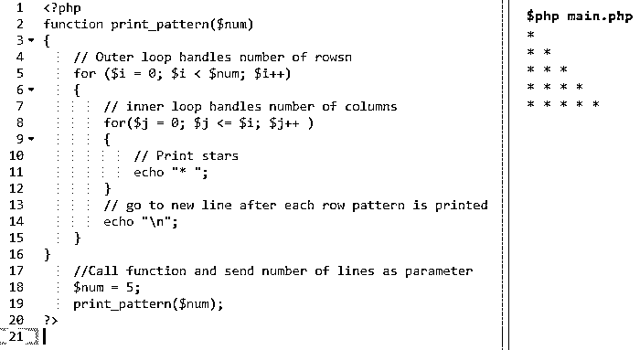


#### 2.星形半金字塔-镜像

这与星形半金字塔相似，只是星形是右对齐的。


为了实现正确的缩进，我们将使用空格，然后打印星号。因此，会有两个内部循环——一个控制空间的数量，另一个控制星星的数量。

**Note:** Keep one thing in mind that the number of spaces in the k-loop is double space. This is because we print a single-space along with the stars as well. This gives a finished look to our pattern rather than a congested print. We will use this to our leverage when we print full pyramids.

**代码:**

```
<?php
function print_pattern($num)
{
// Outer loop handles number of rows
for ($i = 0; $i < $num; $i++)
{
// inner loop handles indentation
for($k = $num; $k > $i+1; $k-- )
{
// Print stars
echo "  ";
}
// inner loop handles number of stars
for($j = 0; $j <= $i; $j++ )
{
// Print stars
echo "* ";
}
// go to new line after each row pattern is printed
echo "\n";
}
}
//Call function and send number of lines as parameter
$num = 5;
print_pattern($num);
?>
```

**输出:**

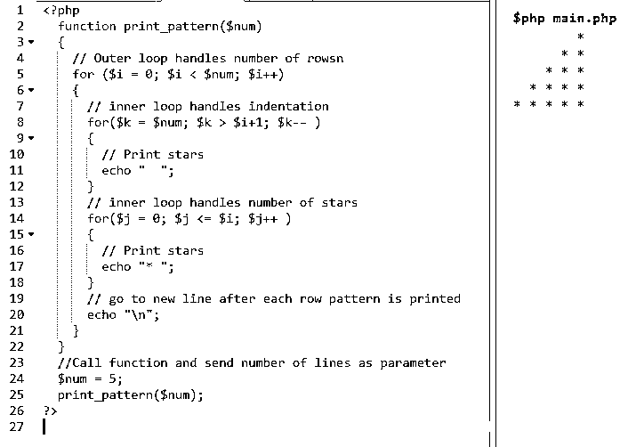


#### 3.星形半金字塔-倒置

对于这种金字塔模式，恒星的数量随着每一条新的线不断减少。第一行有 5 颗星，第二行有 4 颗星，以此类推。


记住这个逻辑，我们知道外循环总是要控制行数，而[内循环](https://www.educba.com/loops-in-c/)要控制星数。这个逻辑不能变。但是，可以改变的是我们如何开始循环，增加或减少顺序。这意味着我们可以从 0 到 5 循环，也可以从 5 到 0 递减循环。所以，对于像这样的倒置模式，我们知道第一行的星星数更多。因此，我们选择减少订单循环。

**代码:**

```
<?php
function print_pattern($num)
{
// Outer loop handles number of rows
for ($i = $num; $i > 0; $i--){
// inner loop handles number of stars
for($j = 0; $j < $i; $j++ )
{
// Print stars
echo "* ";
}
// go to new line after each row pattern is printed
echo "\n";
}
}
//Call function and send number of lines as parameter
$num = 5;
print_pattern($num);
?>
```

**输出:**

**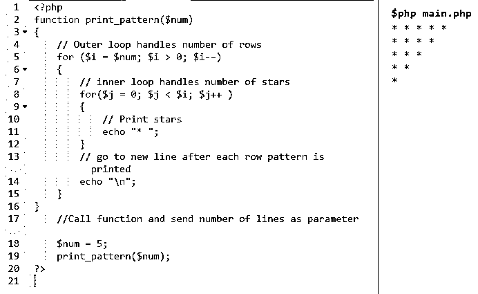

** 

#### 4.星形半金字塔-倒置镜像

这种模式是一个锯齿状的倒半金字塔。星的数量随着每一行而减少，并且星是右对齐的。


我相信到现在为止，你应该能够猜出这个问题的逻辑。

**代码:**

```
<?php
function print_pattern($num)
{
// Outer loop handles number of rows
for ($i = $num; $i > 0; $i--)
{
// inner loop handles indentation
for($k = $i; $k < $num; $k++ )
{
// Print stars
echo "  ";
}
// inner loop handles number of stars
for($j = 0; $j < $i; $j++ )
{
// Print stars
echo "* ";
}
// go to new line after each row pattern is printed
echo "\n";
}
}
//Call function and send number of lines as parameter
$num = 5;
print_pattern($num);
?>
```

**输出:**

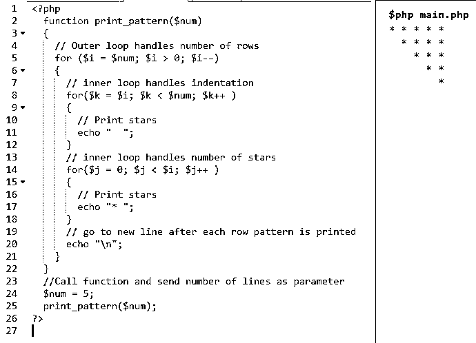


#### 5.星形全金字塔

这个图案印出了整个金字塔。或者换句话说，它在屏幕上打印出一个三角形的星星。


这个图案本质上是半金字塔和它的镜子的组合。虽然我们在编码的时候有一点小小的扭曲。重温镜像半金字塔中的音符。还记得我们如何使用双倍间距来给我们的图案一个完美的外观吗？在这里，我们将使用单间距，使恒星交替排列在奇数和偶数行，给我们一个真正的三角形图案。

**代码:**

```
<?php
function print_pattern($num)
{
// Outer loop handles number of rows
for ($i = 0; $i < $num; $i++)
{
// inner loop handles indentation
for($k = $num; $k > $i+1; $k-- )
{
// Print spaces
echo " ";
}
// inner loop handles number of stars
for($j = 0; $j <= $i; $j++ )
{
// Print stars
echo "* ";
}
// go to new line after each row pattern is printed
echo "\n";
}
}
//Call function and send number of lines as parameter
$num = 5;
print_pattern($num);
?>
```

**输出:**

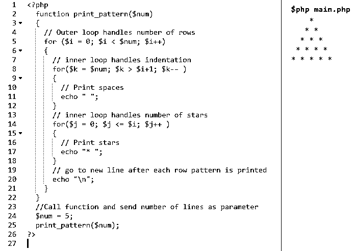


#### 6.星形钻石

这个图案在屏幕上打印出一个完整的菱形。星星的数量增加，直到最大值，然后减少到 1，给我们一个完整的钻石形状。

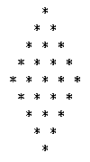


要打印这个图案，我们需要将图案分成两半。上半部分——印出越来越多的星星。下半部分——打印出数量减少的星星。为了打印这两半，我们将使用两个外部循环和相应的内部循环。

**代码:**

```
<?php
function print_pattern($num)
{
// The Upper Half Pattern
// Outer loop handles number of rows
for ($i = 0; $i < $num; $i++)
{
// inner loop handles indentation
for($k = $num; $k > $i+1; $k-- )
{
// Print spaces
echo " ";
}
// inner loop handles number of stars
for($j = 0; $j <= $i; $j++ )
{
// Print stars
echo "* ";
}
// go to new line after each row pattern is printed
echo "\n";
}
// The Lower Half Pattern
// Outer loop handles number of rows
for ($i = $num-1; $i > 0; $i--)
{
// inner loop handles indentation
for($k = $num-1; $k >= $i; $k-- )
{
// Print spaces
echo " ";
}
// inner loop handles number of stars
for($j = 0; $j < $i; $j++ )
{
// Print stars
echo "* ";
}
// go to new line after each row pattern is printed
echo "\n";
}
}
//Call function and send number of lines as parameter
$num = 5;
print_pattern($num);
?>
```

**输出:**

**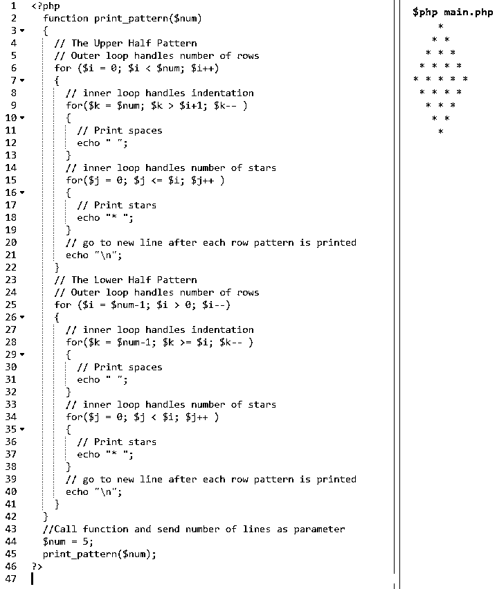

** 

#### 7.数字模式

对于这个数字模式，我们将打印与行号相关的数字。因此，数字 1 将打印一次，2 打印两次，3 打印三次，依此类推。

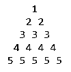


如果您已经一行一行地学习了本教程，那么现在您一定已经很好地理解了嵌套循环打印模式的工作原理。这种模式也遵循同样的逻辑。我们印的不是星星，而是数字。现在你会问我们如何得到这些数字？答案是——简单地通过我们的控制变量 *i* 和 j。

**代码:**

```
<?php
function print_pattern($num)
{
// Outer loop handles number of rows
for ($i = 1; $i <= $num; $i++)
{
// inner loop handles indentation
for($k = $num; $k > $i; $k-- )
{
// Print spaces
echo " ";
}
// inner loop handles number of stars
for($j = 1; $j <= $i; $j++ )
{
// Print numbers
echo $i." ";
}
// go to new line after each row pattern is printed
echo "\n";
}
}
//Call function and send number of lines as parameter
$num = 5;
print_pattern($num);
?>
```

**输出:**

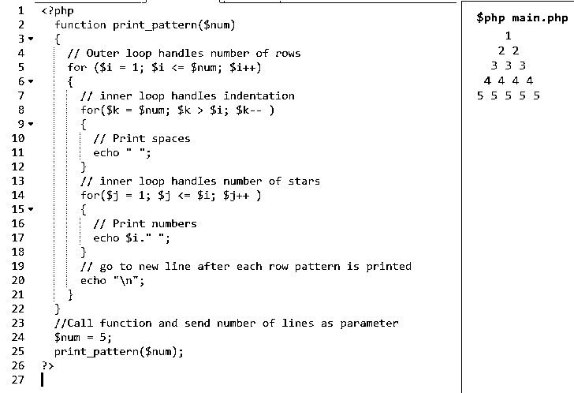


#### 8.字符模式

在这个图案中，我们将在图案中打印字母 ABCDE。从 A 开始，后面的行将在前面的字母之间插入一个新的字母。


这个模式中唯一的技巧是从我们的控制变量中获取字符。我们通过利用字符的 ASCII 值来做到这一点。 *A* 到 *Z* 的 ASCII 值为 *65* 到 *90* 。因此，我们在每次迭代中计算 ASCII 值并打印相应的字符。 [PHP 中的 chr()函数用于](https://www.educba.com/php-constants/)打印 ASCII 码中的一个字符。

**代码:**

```
<?php
function print_pattern($num)
{
// Outer loop handles number of rows
for ($i = 1; $i <= $num; $i++)
{
// inner loop handles indentation
for($k = $num; $k > $i; $k-- )
{
// Print spaces
echo "  ";
}
// inner loop handles number of stars
for($j = 1; $j <= $i; $j++ )
{
// Print characters
echo chr(64+$j)." ";
}
for($j = $i-1; $j >= 1; $j-- )
{
// Print characters
echo chr(64+$j)." ";
}
// go to new line after each row pattern is printed
echo "\n";
}
}
//Call function and send number of lines as parameter
$num = 5;
print_pattern($num);
?>
```

**输出:**

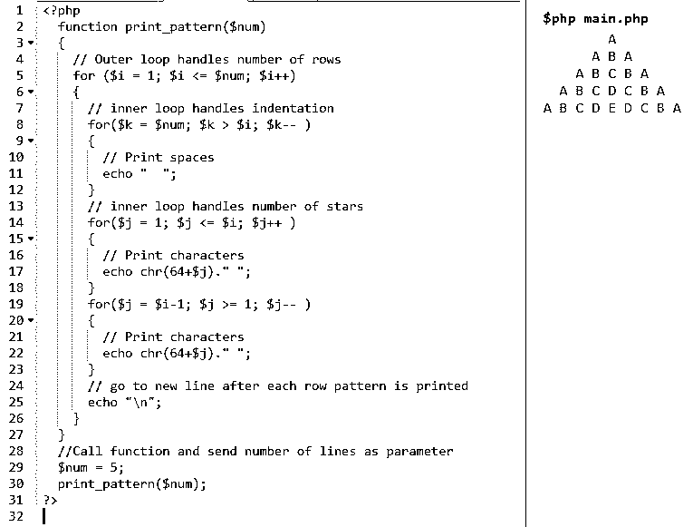


打印完整的字母，图案看起来很酷。

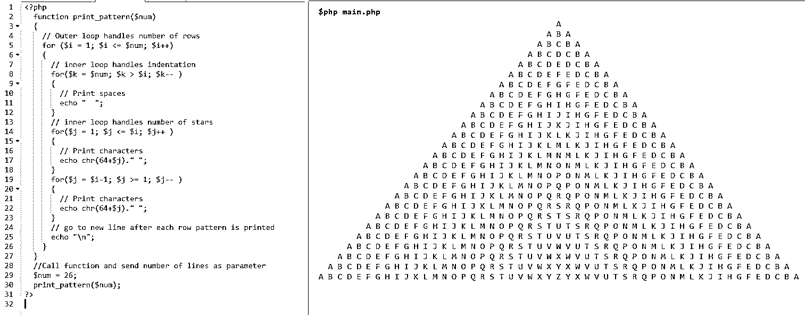


#### 9.二进制沙漏-奖金模式

这个模式是一个动态模式，它打印相对于时间流逝的沙漏，但不是一个实际的计算。例如，如果一个小时过去了，它将在上半部分打印一行 0，在下半部分打印一行 1。

**代码:**

```
<?php
function print_pattern($num, $hour)
{
// Outer loop handles number of rows
for ($i = $num; $i > 0; $i--)
{
// inner loop handles indentation
for($k = $num; $k > $i; $k-- )
{
// Print spaces
echo " ";
}
// inner loop handles number of stars
for($j = 0; $j < $i; $j++ )
{
// Print characters
if($num-$i < $hour)
echo "0 ";
else
echo "1 ";
}
// go to new line after each row pattern is printed
echo "\n";
}
for ($i = 1; $i < $num; $i++)
{
// inner loop handles indentation
for($k = $num-1; $k > $i; $k-- )
{
// Print spaces
echo " ";
}
// inner loop handles number of stars
for($j = 0; $j <= $i; $j++ )
{
// Print characters
if($num-$i <= $hour)
echo "1 ";else
echo "0 ";
}
// go to new line after each row pattern is printed
echo "\n";
}
}
//Call function and send number of lines as parameter
$num = 8;
$hour = 3;
print_pattern($num, $hour);
?>
```

**输出:** 1 小时过去了。

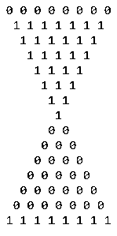


**输出:**已经过去了 2 个小时。

**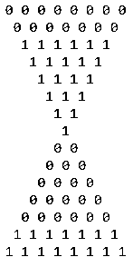

** 

**输出:**已经过去了 3 个小时。

**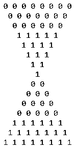

** 

诸如此类。

### 结论

模式有很多玩法[。这一切都是为了记住代码逻辑。一旦你完全理解了代码逻辑，就没有你打印不出来的图案了。](https://www.educba.com/patterns-in-c-sharp/)

### 推荐文章

这是 PHP 模式指南。这里我们讨论了 PHP 中模式的概述和例子，包括代码和输出。你也可以浏览我们的文章来了解更多-

1.  [PHP 中的变量](https://www.educba.com/variables-in-php/)
2.  [PHP 中的构造函数](https://www.educba.com/constructor-in-php/)
3.  [JavaScript 中的模式](https://www.educba.com/patterns-in-javascript/)
4.  [Java 中的数字模式](https://www.educba.com/software-development/courses/selenium-training-in-hyderabad/)


