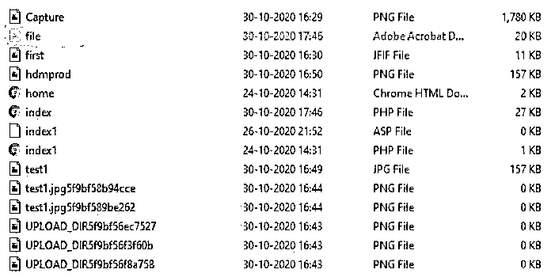

# PHP base64_decode

> 原文：<https://www.educba.com/php-base64_decode/>

## PHP base64_decode 简介

php base64_decode 是一个函数，它主要用于获取 base64 值，这是一个很难编码的字符串，也是一个布尔类型的参数值；此外，它不是必需的，它是一个可选参数。如果设置了严格参数类型，它将返回解码的数据。值的布尔类型具有参数，并且还基于函数类型参数返回值。如果布尔值为 false，它将返回值，并且如果用户输入包含 base64 类型值之外的值。

**语法:**

<small>网页开发、编程语言、软件测试&其他</small>

在 PHP 中，base64_decode 是从加密的二进制数据中解密数据所需要的方案之一，这些加密的二进制数据可以存储和传输带有某种扩展名的文件。php 拥有执行后端任务的默认方法、变量和关键字。

`<? php
function functionname($variablename)
{
----some php logic code based on the requirement---
return base64_decode($php variables, functions);
}
?>`

以上代码是借助 base64_decode()方法解密或解码二进制编码值的基本代码。该方法将使用默认函数传递 uri 变量。

### base64_decode 方法在 PHP 中是如何工作的？

*   php base64_decode 函数通过使用这些 base64_decode 函数来解码原始数据。解码数据通常是接收用户的输入请求。控制器将使用这种方法处理数据，将编码输入值转换回原始数据内容。而 base64_decode 方法用于同态概念，它在模块之间使用一些数据类型值。使用一些算法技术，如分而治之的方法，它会将编码值分成多种类型，解码子值，并将它们连接起来。
*   当我们对这个 php base64_decode 函数使用 uri 时，它还从 URI 或 url 方法参数中删除了“/”反斜杠字符，并返回这些字符。首先，像任何输入格式一样，编码数据被转换为文本，数据编码将始终用于捕获二进制数据，并用于传输二进制数据和其他信息数据，并且被设计为仅处理文本数据。布尔类型的参数将返回解码的数据值，并且可选地，如果在将数据类型值作为方法参数传递时用户输入值被验证，则严格参数被分配布尔格式值。如果输入字符集包含 base64 字母字符之外的字符，则可以从方法值中自动对其进行验证；如果字符不是有效的手段，它显示错误。
*   只要参数 strict 有一组布尔值，如 true means 和 base64_decode()函数，它就会从 base64 格式值之外的其他字符中返回一组错误的输入字符。每当我们使用其他脚本类型的值，如 javascript 等。，并且为了更安全地为 url 类型的参数及其文件名转换值，它依赖于不需要对[和](https://www.educba.com/encoding-vs-decoding/)值都进行编码和解码。基本上，字符串类型的值是编码的，它将传递的密钥来解密这些值。同样，加扰数据和用于加密数据脚本的其他技术将所有类型的数据组合在单个函数中。它有一些用于在线和离线值的解码工具，以及一些用于编码和解码值的默认方法。

### PHP base64_decode 示例

下面给出了 PHP base64_decode 的例子:

#### 示例#1

**代码:**

`<!DOCTYPE html>
<html>
<body>
<?php
function encodemethod($input, $p1 = null) {
$input = str_replace(array('-','+', '/'), array('-', '*', '/',  '-', '_'), base64_encode($input));
if (!$p1) {
$input = rtrim($input, '= -');
}
return $input;
}
function decodemethod($input) {
return base64_decode(str_replace(array('-', '*', '/',  '-', '_'), array('-','+', '/'), $input));
}
$s1 = 'J1dlbGNvbWUgVG8gTXkgRG9tYWluIGVoamRmYmhqaGFzZGpkaHNoYWRrZGpka2hkaGJqanNoNjQ4Mzc5ODc0OHNiZG5ianNkOHl3ZWloamRzc2JubW5rbm1uYnZjbmJjeGInCgo=';
echo base64_decode($s1). "\n";
$s1 = 'J2hnZGtqaHNiYWNoaUFBQUtKSERCSEphc2pza2pkYndxdWRzaHNic2pzc25iY3VranNic2NkaXNranNoYmNzaWpzbkFCWENIS0pOU0JBS0pBTlhCQVNKS05TQkFTSEtCWElLSkFCS0pTTkFCSyc=';
echo base64_decode($s1). "\n";
?>
</body>
</html>`

**输出:**

#### 实施例 2

**代码:**

`<!DOCTYPE html>
<html>
<body>
<?php
$s3 = 'J1RoaXMgZnVuY2dydGd0aW9uZGRmZGRhZmZjZmZjZWZmcHRzZmYgZmZ0d2ZvZnBhcmFmbWV0ZmVyZiB0YXM1bWFudGlvdGRuZWQgYWJvdmRzZG5kIGRlc2ZndGNyaWJlZCBlZnJnYmVsb2VycmV3NQokZGFmZXJndGE6ZXdyZmVncyB0cnJJdHNkYWFhZnIgaXN1IGRzZG1hbmRhdG9yeXl5IHBheXlycmFybWV0ZXR5ciB3aGljdmNydGVoZmdyIGNvZ3JlZ3J0bnRhaW5lcmdzIHRoZSBmc2ZmZW5jb2Rmc3NmZWQgc3RzZmdyaW5nZGcuCiRzdHJpY3Q6IEl0IGlkc2ZzIHNmc2RhbiBvcHRpb25hbCBwYXJhbXNkdmRldGVyLiBJc2RmZiB0aGRpcyBwYXJhbWRzZGV0ZXIgaXNkcyBzZHNldCBkc3RvIFRSZHZVRSB0aHNkZHNlbiB0aGUgYmFzZTY0X2RlY29kZSgpIGZ1bmN0ZHNpb24gd3NkdmRmaWxsIHJldHVzc3JuIEZBc2Rkc0xTc3NFIHNpc3NmIHRzaGUgaW5wc3Nzc3V0IGNvbnRhc2Fzc2lucyBjaGFzc2RmZnJhY3Rlc3NzciBmcm9yZW0gb2RnaHJ1dGRmc2lkZSB0ZmRmZmhlCiBiYXNlNjQgYWxwaGFiZXQuIEludmFkdmZkbGlkIGNoYXJkZmFjdGVycyB3ZGRpbGxkIGJkZmZlZiBzaWxkZmVuZnRseSBkaXNjZGFyZHZmZWQuCg==';
$s4='J0lmIHRoZSBzdHJrZGprbGljdCBwYXJhbWV0ZXIgaXMgc2tkamZqa25ldCB0byBUUmRqa2xqVUUgdGhpaWtqZG9pa2xrZW4gdGhlIGZ1bmNoa2pka3Rpb24gd2lsbCByZXR1aXdpb3JuIEZBOWVvZGlmb2pMU0UgaWYgdGtvZGtwbDtrcGhlIGlucGlva2p1dCBjb250YWphaGRzaXVrandlaGtqaW5zIGNoYXJhY2Nia21ueGpjYnRlciBjbm5mcm9tIG91dHNoaWtqa2xqaWpzZGtsam9zaWRlIHRoZSBCYXNlNjQgYWxwaGFiZXQuIE90aHNoa2Rqa2Vyd2lzZSwgaW52a2RqaWthbGlkIGNoYXJoZGlqa2phY3RlcnMgYXJlIHNpbHNkamlza2pqa2VudGx5IGRpc2Nqc2hka2pqaWthcmRlZC4gSHV3ZWpmaGRpdWpraGR1aiBkamZndnVpaGpkYmogaHFpZGhmdWhlYiBqaGR1ZmhqbiBocXdldWhlaWtzIGpoZGpiamhqaGtqaXFqa2lva2plYmllaW9sa2JrbBlvcGVramV3Zm5iamZramZwbGtxb2tqbiBmbGttbndld2ZqbGssbW53ZGVvbGttd2VkZG9qbGtuZWRra2RrZGRrbG9kamtqZmpla25mbG9sa2psa3Nsaw==';
$s5= 'V2hlbmV2ZXIgd2UgY2hhbmdlIHRoZSBjb2xvcnMgaW4gYW55IG9mIHRoZSBjb2xvciBhdHRyaWJ1dGVzIGluIHRoZSB0YWJsZSBpcyBjaGFuZ2VkLklmIHdlIHdhbnQgdG8gY2hhbmdlIHRoZSBwYXJ0aWN1bGFyIGNvbG9yIGF0dHJpYnV0ZSBtZWFucyBpcyBhbHNvIHBvc3NpYmxlIGZvciBjaGFuZ2UuU3RlcCAzOldlIHdpbGwgY2hhbmdlIGFueSBvZiB0aGUgY29sb3IgYXR0cmlidXRlcyBjb2xvcnMgaXQgbXVzdCBjaGFuZ2UgaW4gdGhlIHBhcnRpY3VsYXIgYXR0cmlidXRlIGNvbHVtbiAuUGxlYXNlIHNlZSB0aGUgYXR0YWNoZWQgc2NyZWVuc2hvdHMuSWYgd2Ugd2FudCB0byBjaGFuZ2UgdGhlIGNvbG9ycyBvciB0aGUgZGVmYXVsdCBjb21tb24gY29sb3JzIHdpbGwgYmUgbmVlZGVkIGZvciB0aGUgY29sb3IgYXR0cmlidXRlcyB3ZSB3aWxsIGNoYW5nZSB0aGUgY29sb3JzIGluIHRoZSBDb21tb24gQ29sb3IgYXR0cmlidXRlIGNoYW5nZXMgYXJlIHJlZmxlY3RlZCBpbiB0aGUgZW50aXJlIGNvbG9ycyBhdHRyaWJ1dGVzIGluIHRoZSB0YWJsZQoK';
echo base64_decode($s3);
echo base64_decode($s4);
echo base64_decode($s5);
?>
</body>
</html>`

**输出:**

#### 

#### 实施例 3

**代码:**

`<?php
$encodevalues ='Y29tLmNlbnRyaWNzb2Z0d2FyZS5zZXJ2ZXIuSWRlbnRpdHlQcm92aWRlci5DRU5UUklDSURFTlRJVFlQUk9WSURFUi5MREFQLjEuQmluZFVzZXIgPSBBZG1pbmlzdHJhdG9yQGxhYgpjb20uY2VudHJpY3NvZnR3YXJlLnNlcnZlci5JZGVudGl0eVByb3ZpZGVyLkNFTlRSSUNJREVOVElUWVBST1ZJREVSLkxEQVAuMS5CaW5kUGFzc3dvcmQgPSBQSyRAWlY+J1syQQpjb20uY2VudHJpY3NvZnR3YXJlLnNlcnZlci5JZGVudGl0eVByb3ZpZGVyLkNFTlRSSUNJREVOVElUWVBST1ZJREVSLkxEQVAuMS5Hcm91cFR5cGUgPSBHcm91cApjb20uY2VudHJpY3NvZnR3YXJlLnNlcnZlci5JZGVudGl0eVByb3ZpZGVyLkNFTlRSSUNJREVOVElUWVBST1ZJREVSLkxEQVAuMS5Vc2VyVHlwZSA9IFVzZXIKY29tLmNlbnRyaWNzb2Z0d2FyZS5zZXJ2ZXIuSWRlbnRpdHlQcm92aWRlci5DRU5UUklDSURFTlRJVFlQUk9WSURFUi5MREFQLjEuVHlwZSA9IEFjdGl2ZURpcmVjdG9yeQpjb20uY2VudHJpY3NvZnR3YXJlLnNlcnZlci5JZGVudGl0eVByb3ZpZGVyLkNFTlRSSUNJREVOVElUWVBST1ZJREVSLkxEQVAuMS5QYWdlU2l6ZSA9IDEwMDAKY29tLmNlbnRyaWNzb2Z0d2FyZS5zZXJ2ZXIuSWRlbnRpdHlQcm92aWRlci5DRU5UUklDSURFTlRJVFlQUk9WSURFUi5MREFQLjEuVW5pcXVlSWQgPSBzQU1BY2NvdW50TmFtZQ==';
$rf = base64_decode($encodevalues, true);
if (strpos($rf, '%PDF') !== 0) {
throw new Exception('The pdf file is not ceratedkindly check once in your encoding datas');
}
file_put_contents('C:\xampp\htdocs\test\file.pdf', $rf);
?>`

**输出:**

在上面的例子中，我们以不同的方式使用了 base64_decode 函数。在第一个示例中，我们对用户输入字符串使用了普通的函数，如 base64_encode 和 base64_decode 方法。因此，在传递运行时和编译时函数时，我们可以处理 n 个字符串。我们使用这些函数，如 base64_decode，支持所有类型的数据类型和值，如字符串、整数、浮点、短整型、长整型、双精度型等。这些是支持这些方法的一些数据类型。此外，它还可以处理一些基于网络的应用程序的高级功能，如图像、动画和一些效果；这些是由 php 默认函数处理的高级技术。

根据需求，默认功能和技术由 64 位方法处理；它们将被硬编码。我们可以借助一些在线和离线版本的工具来处理这些加密和解密技术。我们可以处理一些文件格式，如 rar，tar 和 pdf 等。，借助这个方法。在最后一个示例中，我们可以看到用户输入数据，这些数据是硬编码的，通过使用 base64_decode()方法，我们可以对其进行解码，并将它们存储到一个单独的变量中。之后，在默认文件方法的帮助下，我们可以将数据存储为 pdf 格式。

### 结论

php 是一种基于 web 的脚本语言，它是一种后端代码。它有 n 种方法，其中 base64_decode()是解密应用程序中数据的最佳方法之一。每当客户端和服务器进行交互时，编码和解码技术对于基于 web 的应用程序的安全性是必不可少的。

### 推荐文章

这是一个 PHP base64_decode 的指南。这里我们讨论一下入门，base64_decode 方法在 PHP 中是如何工作的？和示例。您也可以看看以下文章，了解更多信息–

1.  [PHP 全局变量](https://www.educba.com/php-global-variable/)
2.  [PHP 删除文件](https://www.educba.com/php-delete-file/)
3.  [PHP usort()](https://www.educba.com/php-usort/)
4.  [PHP 拆分字符串](https://www.educba.com/php-split-string/)

