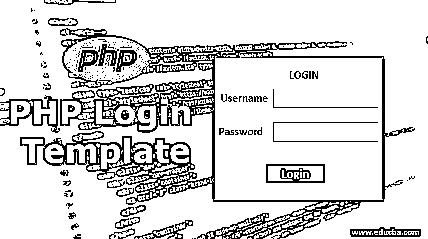
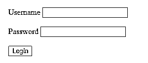
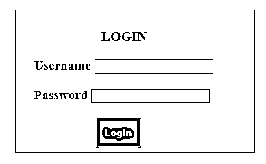
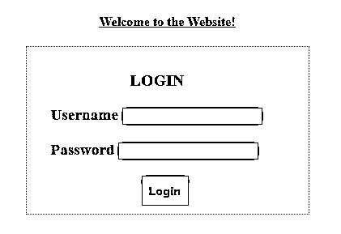
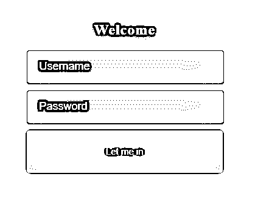

# PHP 登录模板

> 原文：<https://www.educba.com/php-login-template/>




## **PHP 登录模板**介绍

在这篇文章中，我们将学习 PHP 登录模板。当我们谈到 web 应用程序时，我们需要有一个登录页面来访问它。这是拥有登录页面的基本要求之一。登录页面是任何 [web 应用程序](https://www.educba.com/what-is-web-application/)中限制访问的必需页面之一。大多数登录页面都只有这两个字段。通常，用户名被认为是第一个字段，第二个将是密码字段。对于登录页面模板没有固定的看法。根据我们的业务需求，我们可以使用任何登录页面模板。

**语法:**

<small>网页开发、编程语言、软件测试&其他</small>

就登录页面的语法而言，在设计登录页面时没有经验法则可循。在本文中，我们将看到一些登录模板的例子。如果我们让 5 个人来设计一个登录页面模板，他们可能会有 5 个不同的答案，因为就外观和感觉而言，没有行业标准。因此，在接下来的部分中，我们将看到登录页面模板的渐进视图，以及我们如何创建这个页面。

### PHP 是如何工作的？

PHP 中的任何[登录页面都不可能只使用 PHP。PHP 登录模板结合了各种其他技术，如 JavaScript、HTML、CSS、MySql 数据库等。现在，让我们一个一个地看看每个实体的作用。](https://www.educba.com/login-page-in-php/)

**HTML:** HTML 是应用程序的任何网页的基本构建块之一。登录页面的要求将只在这个 HTML 中编写。

**代码:**

```
<!DOCTYPE html>
<html>
<head>
<title>Page Title</title>
</head>
<body style="margin-left: 20%; margin: 5%;">
<form method="post" action="" name="login_form">
<div class="form-element">
<label>Username</label>
<input type="text" name="username" id="username" required />
</div>
<br>
<div class="form-element">
<label>Password</label>
<input type="password" name="password" id="password" required />
</div>
<br>
<button type="submit" name="Login" value="Login">Login</button>
</form>
</body>
</html>
```

**输出:**




我们可以看到，这个页面的外观和用户界面不够专业，我们可以继续前进。

*   CSS : CSS 再次成为网络应用中最基本的需求。我们可以用这个 CSS 来美化我们的登录页面。我们在 CSS 中有各种可用的选项，我们可以用它来放置上述登录页面的专业外观。我们可以使用表单的背景色。我们可以使用表单的边框和其他各种相关的东西。
*   JavaScript/jQuery:JavaScript 是我们可以用于客户端验证的脚本之一。我们可以根据业务需要使用 JavaScript 显示错误消息。例如，如果任何字段(用户名和/或密码)没有填写，我们可以停止提交表单。如果我们在为登录页面编码时使用 JavaScript 或 jQuery，这又是一个增值。

上面提到的对于设计一个登录页面来说已经足够好了。但是，如果我们想处理完整的登录，那么我们需要有 PHP 和数据库(MYSQL 或任何其他)以及。

### 实现 PHP 登录模板的例子

现在，是时候看看各种登录页面示例了。我们继续使用上面提到的相同的 HTML 代码。我们会看到各种各样的模板使用上面的代码或者对上面的代码做一点修改。

#### 示例#1

**代码:**

```
<!DOCTYPE html>
<html>
<head>
<title>Page Title</title>
</head>
<body>
<form method="post" action="" name="login_form" id="login_form">
<div class="form-element">
<label class="head">Login </label>
</div>
<div class="form-element">
<label>Username</label>
<input type="text" name="username" id="username" required />
</div>
<div class="form-element">
<label>Password</label>
<input type="password" name="password" id="password" required />
</div>
<button type="submit" id="Login" name="Login" value="Login">Login</button>
</form>
</body>
<style>
body{margin-left: 30%; margin-top: 5%; max-width: 350px;}
.head {
margin-left: 98px;
font-size: 20px;
font-weight: 900;
text-transform: uppercase;
}
#login_form{
color: blue;
font-size: larger;
border: 1px solid red;
padding: 7px;
}
.form-element{margin: 20px;}
#Login{
font-weight: 900;
background: red;
margin-left: 110px;
padding: 11px;
color: #fff;
}
label{font-weight: 900;}
</style>
</html>
```

**输出:**




#### 实施例 2

在这个登录页面模板中，我们将看到与上一个相比更具交互性。我们将使用一些更高级的 CSS。

**代码:**

```
<!DOCTYPE html>
<html>
<head>
<title>Login Page</title>
</head>
<body>
<h4>Welcome to the Website!</h4>
<form method="post" action="" name="login_form" id="login_form">
<div class="form-element">
<label class="head">Login </label>
</div>
<div class="form-element">
<label>Username</label>
<input type="text" name="username" id="username" required />
</div>
<div class="form-element">
<label>Password</label>
<input type="password" name="password" id="password" required />
</div>
<button type="submit" id="Login" name="Login" value="Login">Login</button>
</form>
</body>
<style>
body{
margin-left: 30%;
margin-top: 5%;
max-width: 350px;
background: #c0c078;
}
.head {
margin-left: 98px;
font-size: 20px;
font-weight: 900;
text-transform: uppercase;
}
#login_form{
font-size: larger;
border: 1px dotted #3406ed;
padding: 10px;
}
.form-element{margin: 20px;}
#Login{
font-weight: 900;
margin-left: 132px;
padding: 7px;
color: red;
}
label{font-weight: 900;}
h4{text-align: center; text-decoration: underline;}
</style>
</html>
```

**输出:**




#### 实施例 3

在这个例子中，我们将看到不同于上面两个登录页面的布局。

**代码:**

```
<!DOCTYPE html>
<html>
<head>
<title>Login Page</title>
</head>
<body>
<form method="post" action="" name="login_form" id="login_form">
<div class="form-element">
<h2>Welcome </h2>
<input type="text" name="username" id="username" placeholder="Username" required />
<input type="password" name="password" id="password" placeholder="Password" required />
<input type="submit" id="submit" value="Let me in" />
</div>
</form>
</body>
<style>
html{
width: 100%;
height: 100%;
overflow: hidden;
}
body {
width: 100%;
height:100%;
background: #465151;
}
h2{
color: #fff;
text-shadow: 0 0 10px rgba(0,0,0,0.3);
letter-spacing: 1px;
text-align: center;
}
input {
width: 100%;
line-height: 4;
margin-bottom: 10px;
background: rgba(0,0,0,0.3);
border: none;
outline: none;
font-size: 13px;
color: #fff;
text-shadow: 1px 1px 1px rgba(0,0,0,0.3);
border: 1px solid rgba(0,0,0,0.3);
border-radius: 4px;
box-shadow: inset 0 -5px 45px rgba(100,100,100,0.2), 0 1px 1px rgba(255,255,255,0.2);
-webkit-transition: box-shadow .5s ease;
-moz-transition: box-shadow .5s ease;
-o-transition: box-shadow .5s ease;
-ms-transition: box-shadow .5s ease;
transition: box-shadow .5s ease;
}
#submit{
background-color: #4a77d4;
padding: 25px 14px;
font-size: 15px;
line-height: normal
}
form#login_form {
width: 30%;
margin-left: 30%;
margin-top:100px;
}
::placeholder {
color:#fff;
font-size: 18px;
padding-left: 20px;
}
</style>
</html>
```

**输出:**




### 结论

PHP 登录页面是这个数字革命时代必备的东西之一。由于没有任何制作登录页面模板的标准，所以我们可以根据我们的业务需求提前制作任何模板。在向服务器发送任何登录页面请求之前，最好使用客户端验证。

### 推荐文章

这是一个 PHP 登录模板指南。在这里，我们讨论了 php 登录模板是如何工作的，以及实现登录模板的例子。你也可以浏览我们的其他相关文章来了解更多信息

1.  [PHP 中的多维数组](https://www.educba.com/multidimensional-array-in-php/)
2.  [PHP 中的平方根](https://www.educba.com/square-root-in-php/)
3.  [PHP 中的析构函数](https://www.educba.com/destructor-in-php/)
4.  [PHP 版本](https://www.educba.com/php-versions/)


