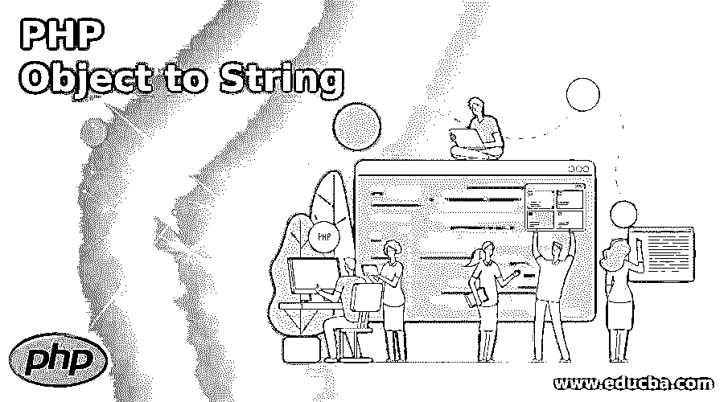

# PHP 对象到字符串

> 原文：<https://www.educba.com/php-object-to-string/>

## PHP 对象到字符串的定义

PHP 是一种经常处理对象和字符串的编程语言，因此，要将 PHP 对象转换为字符串，需要使用 _toString()函数和 serialize 函数将对象转换为字符串。PHP 中的 _toString()函数广泛用于将与之相关的对象转换为字符串，而 serialize()函数用于转换对象并返回包含整个字节流的字符串，该字符串在稍后的时间点用于表示存储在假设的 PHP 变量中的任何值。

**语法:**

<small>网页开发、编程语言、软件测试&其他</small>

没有确切的语法被广泛用于将 PHP 对象转换为字符串，但有其他方法来实现这些转换，语法是存在的，并通过将它们嵌入代码中来使用，如下所示:

`$ var = some_name
$var = obj_1;
{
Call function with $var;
Use _toString() method;
}`

在哪里，

var 是一些被考虑的随机变量，它将保存 PHP 对象的值。一旦该函数被相应地操作，该函数将被调用，其中将有 _toString()方法，它将有助于使对象转换成字符串的字节流。

同样的事情也可以使用 serialize()方法来实现，但是会有更多的变化。

### PHP 中如何将 Object 转换成 String？

*   有许多方法可以将对象转换成字符串，因为在 PHP 4.0 版本之前，很容易获得带有对象的变量，然后将对象转换成字符串。在将对象转换成字符串之后，非常有必要获得关于正在考虑进行操作的对象的详细信息。
*   在 PHP 第 5 版和更高版本中，没有一个过程可以把对象转换成字符串，但是仍然有一些方法可以间接地把对象转换成字符串。
*   有一些方法可以实现这一点，这些方法包括转换，如使用 _toString()函数(这被认为是一个神奇的函数)和 serialize 方法(另一种方法)来公开和获取字符串的字节流，以获取有关对象的必要信息。
*   _toString()函数被认为是神奇的函数之一，因为它有助于将整个对象转换为字符串。
*   Serialize()方法涉及与数组相关的对象，数组对象的解码类似于此方法，它将检查具有带幻名的函数的类。
*   使用 Serialize()方法的主要动机是表示需要转换为字符串的对象，以便从该方法中获取和检索值。存在的对象的元素可以对应于该对象的属性，但是这也不是必须使用的。
*   另一方面，需要使用 unserialized()方法，该方法与代表对象的 serialized()方法有一些不同，serialized()方法主要用于检查幻数的存在，该幻数将具有从函数传递的值，该函数将通过该对象传递恢复的数组。
*   serialize 和 unserialize 方法都与对象一起使用，然后它们只与 PHP 5.0 版和更高版本的 _toString()方法兼容。
*   此外，还有另一种与 json 编码相同的方法，它有助于在函数中对与该对象相关的信息进行编码，并且可以同时使用 json 解码来对整个字符串进行解码。
*   存在某些错误和异常，这些错误和异常也是 PHP 对象到字符串转换的一部分，并且很容易用于在对象和后续的一系列数组中进行某些暴露的和深刻的操作。
*   总的来说，其中一个神奇的方法 _toString()方法是用来转换对象到字符串的字节流很容易。

### PHP 对象到字符串的例子

下面是一些例子:

#### 示例#1

这个程序演示了 serialize()方法，该方法返回表示输出中所示值的字符串的字节流。

**代码:**

`<?php
class Nw_Ob {
public $nme = 'Henry_Joe';
public function __toString() {
return "person nme is: {$this->nme}\n";
}
}
$OBJ_1 = new Nw_Ob;
echo $OBJ_1;
echo serialize($OBJ_1);
?>`

**输出:**

#### 实施例 2

这个程序演示了对象到字符串的转换，使用值作为对象的整个数组的一部分，它将返回整个字符串集，如输出所示。该功能与 PHP 版本 5 及更高版本更加兼容。

**代码:**

`<?php
$vl_1 = (object) array('almond' => 2, 'nuts' => 3, 'peanut' => 4);
$re_2 = new ReflectionObject($vl_1);
echo $re_2->getName() .' {' . implode(', ', array_map(
function($p_0) use ($vl_1)
{
$p_0->setAccessible(true);
return $p_0->getName() .': '. $p_0->getValue($vl_1);
}, $re_2->getProperties())) .'}';`

**输出:**

#### 实施例 3

这个程序演示了异常和错误，一旦它被展示，对象就用字符串表示，如输出所示。

**代码:**

`<?php
class M_Clss
{
public $nm;
public function __construct($nm)
{
$this->_name_1 = $nm;
}
public function __toString()
{
try
{
return (string) $this->_name_1;
}
catch (Exception $exception)
{
return '';
}
}
}
$cls_Obj = new M_Clss('Jhon_ops');
echo $cls_Obj;
?>`

**输出:**

#### 实施例 4

这个程序演示了带有水果的数组的输入，这些水果将被用于通过使用 json 编码函数来公开，该函数将被用于获得要编码的对象，如输出中所示。

**代码:**

`<?php
$arr_01 = array('apple' => 2, 'kiwi' => 4, 'mango' => 6, 'banana' => 8, 'orange' => 9);
echo json_encode($arr_01);
?>`

**输出:**

### 结论

PHP 对象到字符串的转换起着至关重要的作用，因为它有助于程序员获得关于对象的真知灼见和大量细节，这些知识和细节将被用于转换为字符串的字节流，字符串的字节流将被用于制作整个结构，对象结果或返回的字符串将根据需要被进一步操作。

### 推荐文章

这是一个 PHP 对象到字符串的指南。这里我们也讨论一下 php 中的定义以及如何将 object 转换成 string？以及不同的示例及其代码实现。您也可以看看以下文章，了解更多信息–

1.  [PHP 输出缓冲](https://www.educba.com/php-output-buffering/)
2.  [PHP json_decode](https://www.educba.com/php-json_decode/)
3.  [PHP 表单验证](https://www.educba.com/php-form-validation/)
4.  [PHP 通过引用传递](https://www.educba.com/php-pass-by-reference/)

