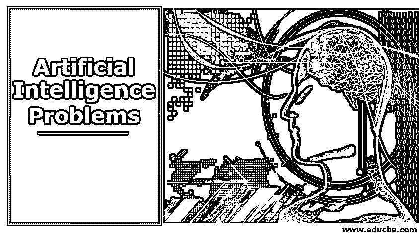
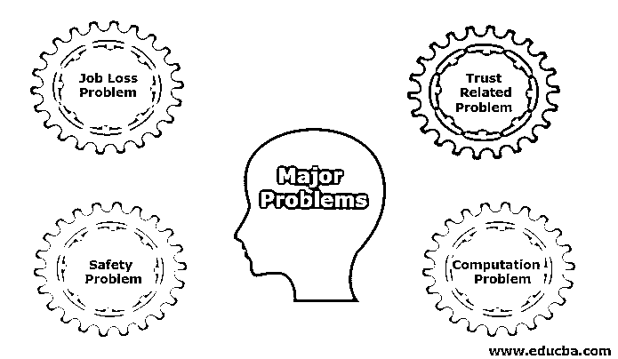

# 人工智能问题

> 原文：<https://www.educba.com/artificial-intelligence-problems/>

## 人工智能问题综述

[人工智能](https://www.educba.com/what-is-artificial-intelligence/)持续为人类生活带来增量利益。根据麦肯锡的报告，到 2030 年，人工智能将为全球经济增加 13 万亿美元，约占全球总份额的 16%。尽管有有形的和金钱上的好处，人工智能也有各种缺点和问题，这阻碍了它的大规模采用。这些问题包括安全、信任、计算能力、失业担忧等。

### 与人工智能相关的主要问题

以下是一些与人工智能相关的主要问题及其可能的解决方案。

<small>Hadoop、数据科学、统计学&其他</small>

#### 1.失业问题

与人工智能相关的失业问题已经成为众多商业案例和学术研究的主题。根据牛津大学的一项研究，到 21 世纪 30 年代中期，超过 47%的美国工作将受到自动化的威胁。根据世界经济论坛的说法，到 2022 年，人工智能自动化将取代超过 7500 万个工作岗位。一些数字甚至更令人望而生畏。根据麦肯锡的另一份报告，基于人工智能的机器人可能会取代当前全球劳动力的 30%。根据人工智能专家和风险投资家李开复的说法，在未来 10-15 年内，世界上 40%的工作将被基于人工智能的机器人取代。低收入和低技能工人将受到这一变化的最大冲击。随着人工智能变得日益智能，即使是高薪、高技能的工人也变得更容易失业，因为鉴于技术工人的高成本，公司通过自动化工作获得了更好的利润。然而，这些与失业和工资有关的问题可以通过关注以下措施来解决。

*   改革教育体系，更加关注批判性思维、创造力和创新等技能，因为这些技能很难复制。
*   增加对开发人力资本的公共和私人投资，使其更好地符合行业需求。
*   通过弥合[供需](https://www.educba.com/supply-vs-demand/)差距和推动零工经济来改善劳动力市场的状况。

#### 2.安全问题

与人工智能相关的安全问题总是引起很多骚动。当埃隆·马斯克、斯蒂芬·霍金、比尔·盖茨等专家表达对人工智能安全的担忧时，我们应该注意它的安全问题。有各种各样的例子表明，当 Twitter Chabot 开始散布辱骂和亲纳粹的情绪时，人工智能出现了问题；在其他例子中，脸书人工智能机器人开始用其他人听不懂的语言相互交流，最终导致项目被关闭。

人们非常担心人工智能会做出对人类有害的事情。一个恰当的例子是可以被编程用来杀死其他人的自主武器。还有一个迫在眉睫的担忧是人工智能会形成“自己的思想”，不重视人类的生命。如果部署了这种武器，将很难消除其影响。以下是可以采取的减轻这些担忧的措施。

*   我们需要强有力的法规，尤其是在自主武器的研发和实验方面
*   在有关此类武器的问题上需要全球合作，以确保没有人卷入激烈的竞争
*   这种技术的试验系统的完全透明对于确保其安全使用是至关重要的

#### 3.信任相关问题

随着人工智能算法变得日益强大，它也带来了几个与信任相关的问题，即它是否有能力做出公平和有利于人类的决定。随着人工智能慢慢达到人类水平的认知能力，信任问题变得更加重要。有几个应用程序中，人工智能作为一个黑匣子。例子——在高频交易中，即使是程序开发人员也没有很好地理解人工智能执行交易的基础。一些更引人注目的例子包括亚马逊基于人工智能的当天交付算法，该算法无意中对黑人社区产生了偏见，另一个例子是替代制裁的惩教罪犯管理分析(COMPAS)，其中[人工智能算法](https://www.educba.com/artificial-intelligence-algorithm/)在分析嫌疑人时对黑人社区产生了偏见。

以下是人工智能中可以用来解决信任相关问题的一些措施

*   所有主要的人工智能提供商都需要在人工智能实施中建立与信任和透明度相关的指导规则和原则。参与人工智能开发和使用的所有利益相关者都需要严格遵循这些原则
*   所有利益相关者都应该意识到人工智能算法固有的偏差，并应该有一个强大的偏差检测机制和处理它的方法
*   意识是另一个关键因素，在弥合信任差距方面发挥着重要作用。用户应该对人工智能的操作，它的能力，甚至与人工智能相关的不足保持敏感

#### 4.计算问题

人工智能算法涉及分析海量数据，这需要巨大的计算能力。到目前为止，这个问题是在云计算和并行处理的帮助下解决的。然而，随着数据量的增加和更复杂的深度学习算法成为主流，当今的计算能力将不足以满足复杂的要求。我们将需要更多的存储和计算能力，来处理千兆字节和千兆字节的数据。

量子计算可以解决中长期的处理速度问题

基于量子理论概念的量子计算可能是解决计算能力挑战的答案。量子计算比我们在家里使用的普通计算机快 1 亿倍。虽然目前还处于研究和实验阶段。根据不同专家的估计，我们可以在未来 10-15 年内看到它的主流实现。

上述问题当然不是不可能解决，但是，它确实需要技术的迅速发展以及人类的合作。虽然我们在技术进步的速度方面进展顺利，但我们仍然有很长的路要走，以制定原则，方法和框架，以确保像人工智能这样的强大技术不会被误用或误用，从而导致意想不到的后果。

### 推荐文章

这是一本人工智能问题指南。在这里，我们讨论与人工智能 AI 相关的主要问题及其可能的解决方案的基本含义。您也可以阅读以下文章，了解更多信息——

1.  [人工智能的好处](https://www.educba.com/benefits-of-artificial-intelligence/)
2.  [人工智能技术](https://www.educba.com/artificial-intelligence-technology/)
3.  [人工智能的种类](https://www.educba.com/types-of-artificial-intelligence/)
4.  [人工智能爬山指南](https://www.educba.com/hill-climbing-in-artificial-intelligence/)
5.  [人工智能公司](https://www.educba.com/artificial-intelligence-companies/)

