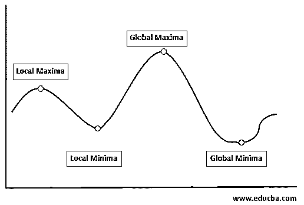
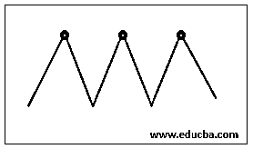
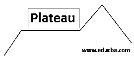

# 人工智能中的爬山

> 原文：<https://www.educba.com/hill-climbing-in-artificial-intelligence/>

## 人工智能中的爬山入门

爬山法是一种启发式搜索算法，用于解决人工智能领域中与优化相关的问题。该算法从非最佳状态开始，并迭代地改进其状态，直到满足某个预定义的条件。要满足的条件基于启发式函数。该算法的目标是达到比其当前状态更好的最优状态。非最优状态的起点称为山脚，它试图不断迭代(攀登)直到达到峰值，这就是为什么它被称为爬山算法。

爬山算法是解决大型计算问题的一种节省内存的方法。它考虑了当前状态和紧邻状态。当我们希望根据输入最大化或最小化任何特定函数时，爬山问题特别有用。最常用的爬山算法是“旅行推销员”问题，即我们必须最小化推销员旅行的距离。爬山算法可能找不到全局最优(最佳可能)解，但它有利于有效地找到局部最小值/最大值。

<small>Hadoop、数据科学、统计学&其他</small>

### 人工智能中爬山的关键特征

以下是爬山算法的几个关键特征

*   **贪婪方法:**算法朝着优化成本的方向移动，即寻找局部最大值/最小值
*   **无回溯:**它无法记住系统以前的状态，因此不可能回溯到以前的状态
*   **反馈机制:**上一次计算的反馈有助于决定下一步行动，即是否向上或向下移动

### 状态空间图-人工智能中的爬山

*   **局部极大值/极小值:**局部极小值是一种比其相邻状态更好的状态，然而，它不是最佳的可能状态，因为存在目标函数值更高的状态
*   **全局最大值/最小值:**是状态图中可能出现的最佳状态。这里目标函数的值最高
*   **当前状态:**当前状态是座席当前所在的状态
*   **平坦局部最大值:**该区域由一条直线描绘，其中所有相邻状态具有相同的值，因此每个节点是该区域的局部最大值

### 爬山算法中的问题

这里我们讨论爬山算法中的问题:

#### 1.局部极大

当当前节点是局部最大值时，该算法终止，因为它比它的邻居更好。然而，在目标函数值较高的地方存在一个全局最大值

**解决方案:**反向传播可以缓解局部最大值问题，因为当它遇到局部最大值时，它开始探索替代路径

#### 2.山脉

当有多个峰值并且都具有相同的值时，或者换句话说，当有多个与全局最大值相同的局部最大值时，出现脊

**解决方案:**可以通过同时向几个方向移动来解决山脊障碍

#### 3.高原

平台是所有相邻节点具有相同目标函数值的区域，因此算法发现很难选择合适的方向。

**解决方案:**高原障碍可以通过从当前状态进行一次大跳跃来解决，这将使你进入非高原区域

### 人工智能中爬山算法的类型

这里我们讨论人工智能中爬山算法的类型:

#### 1.简单的爬山

这是爬山算法的最简单形式。它的操作只考虑相邻节点。如果邻居节点比当前节点好，则它将邻居节点设置为当前节点。该算法一次只检查一个邻居。下面是简单爬山算法的几个关键特征

*   由于它需要较低的计算能力，它消耗较少的时间
*   该算法导致次优解，并且有时该解不被保证

**算法**

1.检查当前状态，如果是目标状态，则返回成功

2.继续循环，直到找到新的解决方案或没有操作符可应用

3.将运算符应用于当前状态的节点

4.检查新的状态

*   如果当前状态=目标状态，返回成功并退出
*   否则，如果新状态比当前状态好，则转到新状态
*   否则返回步骤 2

5.出口

#### 2.最陡爬坡

最陡爬坡是简单爬坡算法的高级形式。它遍历所有最近的邻居节点，选择最接近目标状态的节点。该算法比简单的爬山算法需要更多的计算能力，因为它一次搜索多个邻居。

**算法**

1.检查当前状态，如果是目标状态，则返回成功

2.继续循环，直到找到新的解决方案或没有操作符可应用

假设‘Temp’是这样一种状态，使得当前状态的任何后继者将具有更高的目标函数值。对于可以应用于当前状态的所有运算符

*   应用运算符创建新状态
*   检查新状态
*   如果当前状态=目标状态，返回成功并退出
*   否则，如果新状态比临时状态好，则将该状态设置为临时状态
*   如果温度高于当前状态，则将当前状态设置为目标

#### 3.随机爬山

随机爬山并不查看它的所有邻居节点来检查它是否比当前节点更好。相反，它随机选择一个邻居节点，并基于预定义的标准来决定是去邻居节点还是选择备用节点。

### 爬山算法在人工智能中的优势

爬山算法在人工智能中的优势如下:

*   爬山在与路线相关的问题中非常有用，例如旅行推销员问题、工作调度、芯片设计和投资组合管理
*   它很好地解决了优化问题，同时只使用有限的计算能力
*   它比其他[搜索算法](https://www.educba.com/search-algorithms-in-ai/)更高效

爬山算法是一种非常广泛用于优化相关问题的算法，因为它对计算上具有挑战性的问题给出了体面的解决方案。它有一些与之相关的缺点，如局部极小值、脊线和平台问题，这些问题可以通过使用一些高级算法来解决。

### 推荐文章

这是一本人工智能中的爬山指南。在这里，我们讨论了爬山算法的介绍和主要特点，以及它的优势和类型。您也可以浏览我们推荐的其他文章，了解更多信息——

1.  [机器学习与人工智能的区别](https://www.educba.com/machine-learning-vs-artificial-intelligence/)
2.  [人工智能的主要优势](https://www.educba.com/benefits-of-artificial-intelligence/)
3.  [不同类型的人工智能](https://www.educba.com/types-of-artificial-intelligence/)
4.  [人工智能如何应用？](https://www.educba.com/how-artificial-intelligence-works/)
5.  [PowerShell Where 对象|参数|示例](https://www.educba.com/powershell-where-object/)

