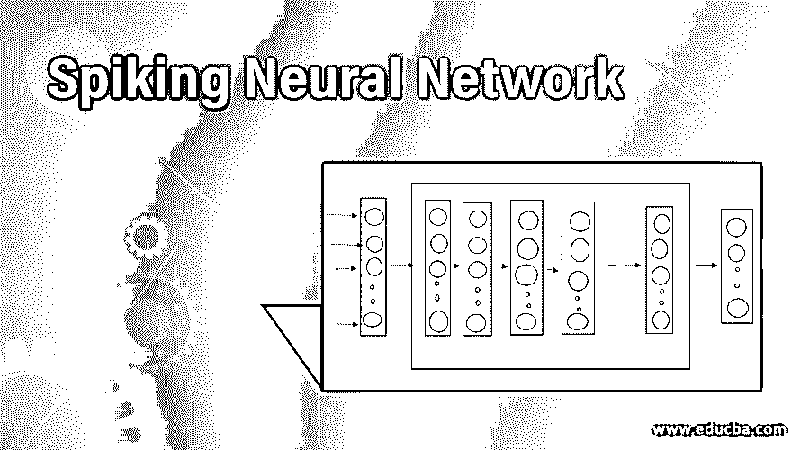
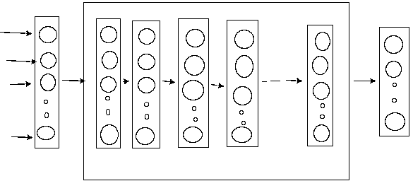

# 脉冲神经网络

> 原文：<https://www.educba.com/spiking-neural-network/>

## 脉冲神经网络简介

脉冲神经网络通常可以是第三代神经网络。它旨在弥合生物学和机器学习之间的差距。脉冲神经网络操作受害脉冲，其平方测量在时间点发生的单独事件，而不是连续值。写作的时间承诺表明，一个尖峰细胞可以取代结肠神经网络上的几个隐藏单元。尖峰神经网络考虑世俗的数据。在脉冲神经网络中，神经元的电流被认为是其激活水平。它使用二进制输出，而不是连续输出。

SNN 中的一个输入脉冲使该状态值上升一段时间，然后逐渐减小。秘密写入方案平方措施，旨在解释这些输出脉冲序列作为选择，考虑到每一个中心拍频和脉冲间隔。脉冲产生时间有助于准确建立神经网络。由于教练工作问题，这些 SNNs 平方度量比第二代神经网络更强大，此外，硬件希望这些平方度量使用得更少。

<small>Hadoop、数据科学、统计学&其他</small>

### 软件

多种应用计算机代码包可以复制 snn。该计算机代码包也根据其用途进行分类。

它们被称为:

*   SNN 模拟
*   数据方法
*   混合神经模拟

SNN 风格由尖峰神经元和互连突触组成，通过可调标量权重来平方测量雕塑感。我们倾向于首先实现 SNN，将模拟数据加密为尖峰脉冲串受害者，无论是时间提交写入还是群体提交写入。

通过共轭连接传播的脉冲神经元平方度量的超网络中的脉冲序列。共轭也可以是刺激的，它可以在接收输入时增加神经元膜电位，或者是限制性的，它降低神经元膜电位。

### SNN 建筑

下面是架构:

*   图中的质数表示脉冲神经网络的规划。这个正方形在 SNN 网络中间测量了三层。
*   输入层学习对输入执行预处理。该信息然后被发送到一系列隐藏层，其数量可以变化，作为数据通过隐藏层传播的结果，额外的高级选择平方度量被提取和学习。输出层通常通过计算机代码包执行分类并确定输入刺激的标签。

### 脉冲神经网络中的学习

任何网络，学习都是通过调整标量值共轭权重来完成的。尖峰信号允许一种生物似是而非的学习规则，这种学习规则不能在非尖峰信号网络中直接复制。神经人类已经知道这种学习规则的几种变体，它们属于术语“尖峰信号定时相关的物理属性”(STDP)。

下面的方块测量脉冲神经网络中的教育机制，每个都有监督和无监督。

### 经由 STDP 的无监督学习

SNNs 中的无监督学习通常将 STDP 作为教育算法的一个领域。最常见的一种生物 STDP 包含了一种非常直观的解释。在这种情况下，强化看起来是半永久性的协同作用，因此弱化被称为半永久性的抑制。半永久性这个术语是用来区分 square measure 在实验中发现的许多数值范围内的非常短暂的效应。利用这种方法，许多具有多输出神经元的复杂网络被开发出来。

### 无监督 STDP 的概率特征

根据研究人员的说法，这通常被认为是概率计算的可实现角色，作为大脑中 STDP 方面的主要 IP 步骤。一旦一种 STDP 与泊松尖峰输入神经元加上可接受的随机赢家通吃(WTA)电路一起使用，它就能够接受随机在线期望最大化算法规则来找出多项式混合分布的参数。这个模型本来应该具有某种生物学上的合理性。

#### 监督学习

*   监督学习总是使用某种标签。它通过价格的梯度下降来调整权重，执行对发现的和期望的网络输出的审查。监督学习试图减弱指定的和因此输出的尖峰序列之间的误差。
*   Spike Prop 是通过反向传播误差来训练 SNNs 的第一个算法规则。他们的价值表现考虑了尖峰时间排列，并且尖峰 prop 能够对采用 3 层设计的时间编码 XOR 缺陷的非线性可分离知识进行分类。
*   后来的高级版本的道钉道具，多道钉道具适用于多道钉秘密写作。最近最重要的 SNNs 监督训练方法包括远程监督学习 ReSuMe、Chronotron 和体细胞棘波模式关联 Span。

### SNN 的应用

SNN 一直是人工神经网络的应用对象。

*   SNN 将把中枢系统建模成一个神经过敏的生物有机体，就像联想昆虫在没有先前数据的情况下寻找食物一样。
*   SNN 已经尽力在神经生物学方面有所帮助；然而，它不能杀死工程。
*   制作 SNN 模型并观察其动力学是很简单的。

下面提到了 SNN 平方测量的一些应用:

*   视觉模式识别
*   听觉模式识别
*   奥迪-视觉模式识别
*   味觉识别
*   生态建模
*   手语识别
*   物体运动识别

### 结论

在这里，我们看到了尖峰神经网络。什么是尖峰神经网络，SNN 的软件架构，SNN 的学习，SNN 的应用

### 推荐文章

这是一个尖峰神经网络指南。在这里，我们讨论了脉冲神经网络的软件架构，SNN 学习和应用介绍。您也可以浏览我们的其他相关文章，了解更多信息——

1.  [神经网络机器学习](https://www.educba.com/neural-network-machine-learning/)
2.  [神经网络的类型](https://www.educba.com/types-of-neural-networks/)
3.  [神经网络的应用](https://www.educba.com/application-of-neural-network/)
4.  [神经网络算法](https://www.educba.com/neural-network-algorithms/)

