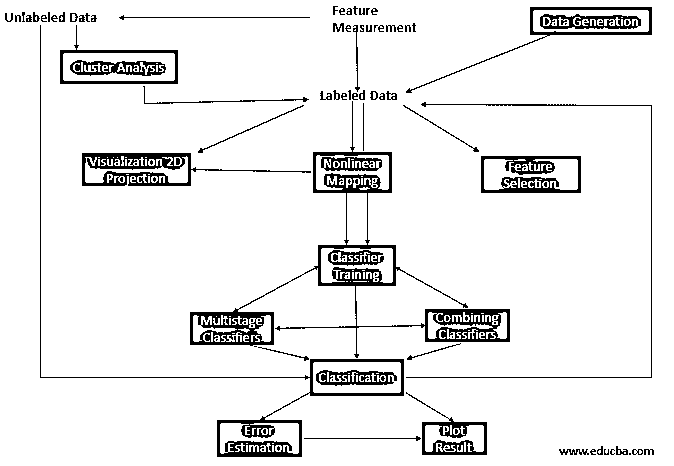
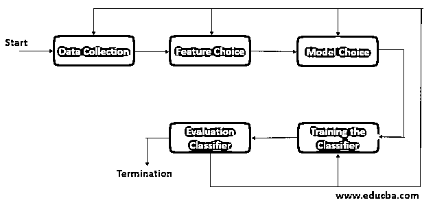

# PRTools

> 原文：<https://www.educba.com/prtools/>

## PRTools 简介

PRTools 是“模式识别”工具，用于从图像、文件、生物特征等输入中定义模式。这些工具根据其运行机制主要分为两类，它们是“受监督的”和“不受监督的”。所有的 PRTools 执行一系列的活动来识别系统中提供的输入背后的模式，例如收集所需的数据、选择其中的特征、选择模型定义、添加到模式分类器(用于将来的智能)以及评估从分类器创建的模式。

### PRTools 如何工作？

出于各种原因，公关工具非常有用，例如:

<small>Hadoop、数据科学、统计学&其他</small>

*   帮助设计公关系统的各种关键原型
*   它有助于设计和评估输入其中的新算法。
*   它集成了各种垂直应用程序，以便进行数据分析。
*   它们改善了计算机视觉、健康诊断、遥感、生物信息学等。

在 PR 技术中，模式识别相位方法解决了各种问题。它们讨论如下:

*   **感测:**感测数据，与噪声、带宽、分辨率等相关的问题。都解决了。
*   **分组和分段**:最难的部分是精确地适当分组和聚类。此问题在此阶段得到解决。
*   **特征提取**:该阶段负责使用任何手段创建输入中具有最接近聚类的实体的相似性指数。
*   **分类:**这利用了输入的提取器的特征向量。
*   **后处理:**这里做了误差修正，决策过程轻松了。

### 公关系统活动

该图展示了模式识别系统的[活动。该过程从数据收集开始，然后以数据作为输入进行特征提取。根据学习环境选择合适的模型。应用训练分类器，并基于该分类器进行评估。则该过程终止。](https://www.educba.com/pattern-recognition-applications/)

### PR-Tools Mat-Lab 工具箱概述

PR-Tools 为其用户配备了近 300 个甚至更多的程序，用于 PR 系统中的算法执行。这包括数据生成、用作训练器的分类器、特征选择和组合分类器、特征曲线和方程的线性和非线性提取、密度估计、组和簇的分析、它们的评估、分类、分割和可视化。

这里我们列出了 PR-Tools 及其相关元素之间的操作。这里的元素被描述为数据集、数组、文件、双精度数以及它们的映射。

#### 1.数据集和文件

数据集和文件是 PR-Tools 数据集类中使用的变量。它们有向量表示或标签。数据集可以定义为一组用矢量表示的实体。例如 A，B，…这里数据集大小为[a，b]，通过长度为 B 的向量映射到对象上，数据文件定义为以数组形式存储在磁盘或驱动器上的原始对象和实体的存储规则和方式，可以转换为数据集。

#### 2.映射

映射是映射类中的 PR-Tool 变量。它们指的是帮助将一个向量的数据集映射到另一个向量的函数集。变量用于存储与映射相关的参数。映射也用于存储目的。例如 W…大小是[x，y],其中映射在 x 和 y 维度之间。

**基本 PR-Tools 操作如下所示:B = A*W.**

这意味着数据集 A(大小为[a，b])和 W 的对象大小为[x，y]。它们属于两个不同的向量空间，我们试图将它们从 a 维向量空间映射到 y 维向量空间。得到的数据集 B 的大小为[a，y]。它复制所有合适的解释。PR-Tools 可以映射线性数据，但没有任何限制，也可以映射非线性数据。

#### 3.分类器

分类器是一种单独的映射类型。这里可以针对训练数据优化映射。未训练的映射由 U 表示。这可以由 A 进一步优化，A 是由相同的基本 PR-Tools 操作设置的训练集:W=A*U 在 PR-Tools 中有隐藏的能力。这些工具的设计基于设计良好的算法。上面分三类讨论了它们，数据集/数据文件、映射和分类器。

### 公关工具的各种任务

可以使用各种程序来符号化数据文件，将数据文件转换成数据集操作，并转换它们的基本表示，例如它们的维度和类型、维度缩减、评估和分类方法。

PR-Tools 的各种任务列举如下:

*   **预处理:**mat-lab 是数据的预处理中心。像图像处理工具的 DIP 包这样的工具箱和例程都可以完成这项工作。
*   **特征提取**
*   特征空间(Feature Spaces):它包括了一系列的特征算法，如 PCA，PDA 就属于这一类。
*   **密度估计**:Parzen 窗、最近邻等模型。形成这一步。
*   **分类器:** 1-NN，高斯模型，k-NN，Parzen 窗算法，最近均值，Fisher，SVM，
*   **评估**:包括验证包和交叉验证包；拒绝选项、ROC 曲线、混淆矩阵等。

作为这些优势的补充，我们有许多例程帮助生成数据，然后将数据输入聚类算法，并进一步用于回归。使用 AI 和 PR 算法对数据集进行了良好的[训练，以便非常仔细地设计 PR 工具。](https://www.educba.com/what-is-artificial-intelligence/)

### 结论–pr tools

PR-Tools 是 mat-lab 的程序和功能。它们作为一个框架，用户可以在其中执行识别、分类和评估算法、工具和其他分析过程的预处理的任务。这很重要。它简单、易用，便于用户表达和识别数据。

### 推荐文章

这是 PRTools 的指南。这里我们讨论一个简介，PRTools 如何与 Matlab 协同工作？以及活动、PR 系统和 PR-Tools Mat-Lab 工具箱概述。您也可以浏览我们的其他相关文章，了解更多信息——

1.  [Matlab 上的网格](https://www.educba.com/grid-on-matlab/)
2.  [Matlab 中的 3D 绘图](https://www.educba.com/3d-plots-in-matlab/)
3.  [Matlab 反函数](https://www.educba.com/matlab-inverse-function/)
4.  [转置矩阵 Matlab](https://www.educba.com/transpose-matrix-matlab/)

