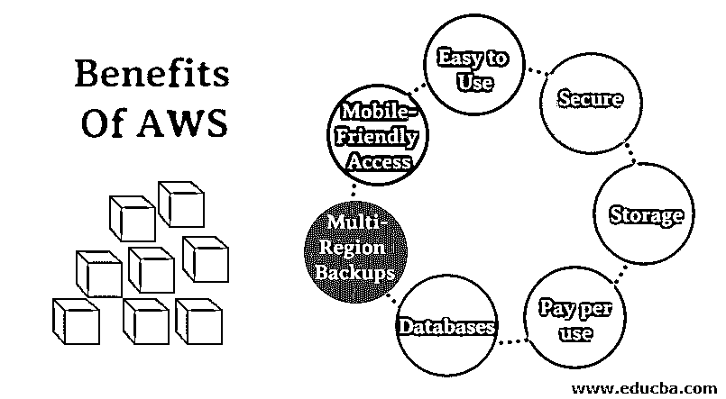

# AWS 的优势

> 原文：<https://www.educba.com/benefits-of-aws/>

## AWS 优势介绍

AWS 云平台为企业提供了多项优势。一些重要的优势是易于使用和维护 IT 基础架构，以及通过按使用付费模式优化运营成本。AWS 以非常高端的安全配置和网络来保证业务数据的安全性和可靠性。AWS 为资源备份和可伸缩性提供了现成的功能。它证明了用于资源和应用程序监控的基于云的工具 AWS CloudWatch。AWS 提供了 EC2 这样的计算实例，可以为 Windows 和 Linux 等多种操作系统提供。此外，AWS 通过其名为 [AWS Lambda](https://www.educba.com/what-is-aws-lambda/) 的服务提供无服务器计算优势。

### AWS 的优势

亚马逊网络服务提供了各种不同于其他公司的特性。它们是:

<small>Hadoop、数据科学、统计学&其他</small>

#### 1.移动友好访问

包括两种方式——AWS Mobile SDK 和 AWS Mobile Hub。

*   **AWS Mobile SDK**

AWS Mobile SDK 支持 Android、React Native、IOS、Unity、Web 等。借助该功能，可以访问不同的亚马逊网络服务，如 Lambda、DynamoDB 和 AWS S3(简单存储服务)。

*   **AWS 移动中枢**

此移动中枢支持您访问适合您的应用程序的兼容功能。可以使用其中的控制台来开发、测试和监控应用程序。AWS Mobile Hub 还提供其他一些功能，如消息推送通知和内容交付。

#### 2.使用方便

与其他平台相比，AWS 提供了一个用户友好的平台，初学者也可以使用它。这是可能的，因为 AWS 提供了清晰的文档和方便的控制台。

#### 3.安全的

Amazon Web Services 提供了一个标准且安全的基础设施，用户只需为他们使用的服务付费。它提供广泛的安全服务。身份访问和管理(IAM)就是这样一种服务，其中管理员管理用户对使用 [AWS 服务](https://www.educba.com/aws-services/)的访问。如今，Amazon Web Services 引入了自动评估安全风险的工具。它还提供加密工具([硬件和软件](https://www.educba.com/hardware-vs-software/))、传输层安全证书、针对分布式拒绝服务(DDoS)攻击的安全性，以及针对应用程序的有害流量过滤。一个被称为 Amazon Inspector 的工具用于自动评估用户的 Amazon Web Service 云部署，以识别安全威胁和缺陷。类似地，Amazon 的私有云帮助用户根据他们的需求将实例设为私有或公共。

#### 4.储存；储备

AWS 提供高存储，可独立使用或组合使用。如果用户使用任何高输入/输出应用程序，如 Hadoop、数据仓库等，高存储 EC2 实例可以帮助他们。

亚马逊提供不同的存储方式，例如:

*   **亚马逊弹性块存储(EBS):** [块级存储](https://www.educba.com/block-level-storage/)，可与弹性计算云(EC2)实例一起使用，有助于保持数据的持久性。
*   **亚马逊冰川:**主要用于长期存储，存储不常用的数据。换句话说，用于数据备份和归档的存储。
*   **亚马逊简单存储服务(S3):** 通过基于网络的界面帮助提供存储。
*   **亚马逊弹性文件系统:**该存储用于亚马逊 Web 服务的[公共云](https://www.educba.com/what-is-public-cloud/)中的工作负载和应用程序。
*   **存储运输设备:**出于商业目的，亚马逊提供一定的存储设备，如雪地车和雪球，可以从一个地方运输到另一个地方。雪地车通过卡车传输大量数据，卡车装有大量硬盘驱动器，以存储数十亿字节的数据。雪球帮助 AWS 传输数据，其成本比通过互联网传输的成本低 1/5T3。

#### 5.按使用付费

与其他平台不同，亚马逊网络服务不会让用户为平台上的所有服务付费。它只对用户使用的资源、存储和带宽收费。考虑到这一事实，与其他行业相比，这是商业行业吸引 AWS 的最重要特征。

#### 6.多区域备份

Amazon 提供了几个用户可以保存数据和实例的区域。这些区域包括不受任何其他区域故障影响的可用性区域。多区域备份的主要目的是在任何位置启动 EC2 实例，以保护用户的应用程序。如果这些区域位于同一区域，网络延迟和成本将会很低。地区可以是独立的地理区域、县等。用户可以根据自己的方便选择地区。此外，service Cloud Ranger(第三方服务)会自动备份不同区域的数据。

#### 7.可靠性和可扩展性

亚马逊提供了一个可以根据使用情况进行扩展的基础设施。因此，如果用户缩减正在使用的实例，使用成本会很低。在“按使用付费”功能下已经提到了。可扩展性功能已成为大型企业的最佳解决方案，因为他们在存储耗尽时不需要任何额外的资源。

#### 8.数据库

亚马逊提供了几个由他们自己管理的数据库。下表列出了其中一些。

| **数据库类型** | **应用程序** | **AWS 服务** |
| 文档 | 用户概况、内容管理 | Amazon DocumentDB |
| 键值 | 游戏应用、高流量的网络应用 | 亚马逊 DynamoDB |
| 有关系的 | 传统、ERP、电子商务 | 亚马逊红移、亚马逊 Aurura、亚马逊关系数据库服务(RDS) |
| 图表 | 推荐引擎，欺诈检测 | 亚马逊海王星 |
| 分类帐 | 银行交易、供应链 | 亚马逊量子分类账数据库(QLDB) |
| 内存中 | 地理空间应用、缓存、游戏排行榜 | Amazon 弹性缓存用于 Redis，Amazon 弹性缓存用于 Memcached |
| 时间序列 | 工业遥测、物联网、DevOps | 亚马逊时间流 |

#### 9.管理和监测

为了进行管理和监控，管理员可以执行以下任务

*   跟踪资源和应用运行状况、云资源配置
*   自动化基础架构配置
*   保留用户活动

所有这些都是借助某些工具完成的。

### 结论

Amazon Web Services 是一个基于云的平台，它提供了几个在许多领域都有用的特性。按使用付费、可扩展性、位置备份是它区别于其他公司的一些主要特征。AWS 的好处在上一节中有详细介绍。

### 推荐文章

这是 AWS 优势的指南。在这里，我们将详细讨论 AWS 的基本概念以及 9 大优势。您也可以浏览我们推荐的其他文章，了解更多信息——

1.  [什么是 AWS 红移？](https://www.educba.com/what-is-aws-redshift/)
2.  [什么是 AWS EC2？](https://www.educba.com/what-is-aws-ec2/)
3.  [AWS 架构](https://www.educba.com/aws-architecture/)
4.  [AWS 替代品](https://www.educba.com/aws-alternatives/)
5.  [AWS 存储服务](https://www.educba.com/aws-storage-services/)

