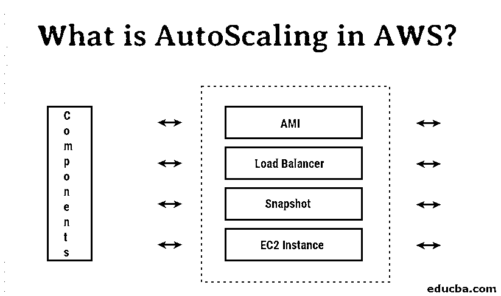

# AWS 中的自动缩放是什么？

> 原文：<https://www.educba.com/what-is-autoscaling-in-aws/>

## AWS 中的自动缩放概述

AWS 中的 AutoScaling 是先进的云计算特性，它根据服务器的负载提供自动资源管理。与服务器集群相关的资源通常通过负载平衡器、自动扩展组、Amazon 机器映像(AMI)、EC2 实例和快照等机制动态地扩展和缩减。AWS 自动缩放功能有助于管理业务中的提货时间负载。此外，它还根据按需需求优化了性能和成本。AWS 提供了配置 CPU 利用率阈值和任何资源利用率级别的灵活性；一旦服务器的负载达到该阈值，AWS 云计算引擎就会自动启用和配置资源。同样，如果负载低于阈值，它会自动缩减到默认配置级别。

### 自动缩放在 AWS 中是如何工作的？

在 AWS 中，自动伸缩的过程中涉及多个实体，即:-负载平衡器和 AMIs 是该过程中涉及的两个主要组件。首先，您需要创建当前服务器的 AMI 简单来说，我们可以说你当前配置的模板由所有系统设置和当前网站组成。这可以在 AWS 的 AMI 部分完成。如果我们按照上面的场景并配置了自动扩展，您的系统就为未来的流量做好了准备。

<small>Hadoop、数据科学、统计学&其他</small>

当流量开始增加时，AWS autoscaling 服务将在服务器 AMI 的帮助下，自动启动另一个实例，该实例具有与当前服务器相同的配置。

接下来是下一部分，我们需要在新启动的实例之间平均分配或路由我们的流量；AWS 中的负载平衡器会处理这个问题。负载平衡器根据特定系统上的负载划分流量；它们执行一些内部流程来决定将流量路由到哪里。

新实例的创建完全取决于配置自动缩放的用户定义的一组规则。规则可以像 CPU 利用率一样简单；例如，当您的 CPU 利用率达到 70 -80 %时，您可以配置自动伸缩，然后您希望启动一个新的实例来处理流量。当然，也可以有缩小比例的规则。

### AWS 中的自动缩放组件

在自动伸缩的过程中涉及到许多组件，其中一些我们之前已经提到过，比如 AMI、负载平衡器，还有其他一些组件。

自动缩放中涉及的组件:-

*   Amazon 机器映像
*   负载平衡
*   快照
*   EC2 实例
*   自动缩放组

可以有更多的组件，但是你可以说大多数可以缩放的组件都是自动缩放的一部分。

#### 1.高级材料情报(Advanced Material Information)

AMI 是 EC2 实例的可执行映像，您可以用它来创建新的实例。为了扩展您的资源，您需要您的新服务器拥有您网站的所有配置并准备好启动。在 AWS 中，您可以通过 AMI 来实现这一点，AMI 不过是系统的一个完全相同的可执行映像，您可以使用它来创建新的映像，AWS 也会在自动缩放的情况下使用相同的映像来启动新的实例。

#### 2.负载平衡器

创建实例只是自动缩放的一部分；您还需要在新的实例之间划分流量，负载平衡器会处理这项工作。负载平衡器可以自动识别它所连接的系统上的流量，并可以根据规则或以传统方式将请求重定向到负载较少的实例。在实例之间划分流量的过程，我们称之为负载平衡。负载平衡器用于提高应用程序的可靠性和处理并发用户的效率。

负载平衡器在自动伸缩中扮演着非常重要的角色。通常，负载平衡器有两种类型

*   经典负载平衡器
*   应用负载平衡器

##### 经典负载平衡器

经典负载平衡器遵循一种非常简单的方法；它会将流量平均分配给所有实例。这是非常基本的，现在，没有人使用经典的负载均衡器。对于一个简单的静态 html 页面网站来说，这可能是一个很好的选择，但在当前的场景中，有混合应用程序或多组件和高计算应用程序，其中有许多组件专用于特定的工作。

##### 应用负载平衡器

*   最广泛使用的负载平衡器类型，根据某些简单或复杂的规则重定向流量，这些规则可以基于“路径”或“主机”或用户定义。
*   如果我们拿一个文档处理应用程序的场景来说就更好了。
*   假设您有一个基于微服务架构或单片架构的应用程序，路径“/document”特定于一个文档处理服务，其他路径“/reports”仅显示已处理文档的报告和已处理数据的统计信息。我们可以为一个服务器设置一个自动缩放组，负责处理文档，另一个只显示报告。
*   在应用程序负载平衡器中，您可以根据路径配置和设置规则，如果路径与“/document”匹配，则重定向到服务器 1 的自动缩放组，或者如果路径与“/reports”匹配，则重定向到服务器 2 的自动缩放组。在内部，一个组可以有多个实例，负载将以传统的方式平均分布在这些实例中。

#### 3.快照

您硬盘上的数据副本通常是您的存储映像。快照和 AMI 之间的典型区别是可执行映像可以用来创建新的实例，但是快照只是实例中数据的副本。如果您有 EC2 实例的增量快照，那么快照将是自上一次快照以来被修改的那些块的副本。

#### 4.EC2(弹性计算云)实例

EC2 实例是亚马逊弹性计算云(EC2)中的虚拟服务器，用于在亚马逊 Web 服务(AWS)基础设施上部署应用程序。EC2 服务允许您通过 SSH 连接使用认证密钥连接到虚拟服务器，并允许您安装应用程序的不同组件。

#### 5.自动缩放组

它是一组 EC2 实例，也是 Amazon EC2 自动缩放的核心。当您创建自动扩展组时，您必须提供有关子网的信息以及您想要开始的实例的初始数量。

### 结论

从上面的内容中，我们很好地了解了什么是自动缩放，以及它在当今世界有多重要。

*   如果我们看到技术和用户需求与日俱增，以及他们对快速高效的应用程序的期望。
*   一个优秀的应用程序速度很快，给你一个好的用户体验，并做它所要做的事情，为了实现这一点，你需要一个非常强大的后端和技术栈。
*   等你入行，一炮而红之后，你的用户群极有可能增加，那时候会出现处理并发用户的情况；你需要自动缩放来根据情况放大和缩小，以给你的用户一个无缝的体验。

从我的角度来看，在当今世界和今天或明天，缩放是一个非常重要的方面；我们需要这样做，使用 AWS 自动扩展并扩大您的产品。

### 推荐文章

这是 AWS 中什么是自动缩放的指南？在这里，我们讨论了它的定义、工作和 AWS 中自动缩放的不同组件。您也可以阅读以下文章，了解更多信息——

1.  [什么是 AWS 红移？](https://www.educba.com/what-is-aws-redshift/)
2.  [什么是 C#中的 StringBuilder](https://www.educba.com/what-is-stringbuilder-in-c-sharp/)
3.  [功能测试完整指南](https://www.educba.com/what-is-functional-testing/)
4.  [什么是后端开发者？](https://www.educba.com/what-is-back-end-developer/)
5.  [AWS 存储服务](https://www.educba.com/aws-storage-services/)

